# K-近邻算法（KNN）

K nearest neighbour

## 导引

<!--more-->

### 如何进行电影分类

众所周知，电影可以按照题材分类，然而题材本身是如何定义的?由谁来判定某部电影属于哪
个题材?也就是说同一题材的电影具有哪些公共特征?这些都是在进行电影分类时必须要考虑的问
题。没有哪个电影人会说自己制作的电影和以前的某部电影类似，但我们确实知道每部电影在风格
上的确有可能会和同题材的电影相近。那么动作片具有哪些共有特征，使得动作片之间非常类似，
而与爱情片存在着明显的差别呢？动作片中也会存在接吻镜头，爱情片中也会存在打斗场景，我们
不能单纯依靠是否存在打斗或者亲吻来判断影片的类型。但是爱情片中的亲吻镜头更多，动作片中
的打斗场景也更频繁，基于此类场景在某部电影中出现的次数可以用来进行电影分类。

本章介绍第一个机器学习算法：K-近邻算法，它非常有效而且易于掌握。

## 1、k-近邻算法原理

简单地说，K-近邻算法采用测量不同特征值之间的距离方法进行分类。

- 优点：精度高、对异常值不敏感、无数据输入假定。
- 缺点：时间复杂度高、空间复杂度高。
- 适用数据范围：数值型和标称型。

### 工作原理

存在一个样本数据集合，也称作训练样本集，并且样本集中每个数据都存在标签，即我们知道样本集中每一数据
与所属分类的对应关系。输人没有标签的新数据后，将新数据的每个特征与样本集中数据对应的
特征进行比较，然后算法提取样本集中特征最相似数据（最近邻）的分类标签。一般来说，我们
只选择样本数据集中前K个最相似的数据，这就是K-近邻算法中K的出处,通常*K是不大于20的整数。
最后 ，选择K个最相似数据中出现次数最多的分类，作为新数据的分类*。

回到前面电影分类的例子，使用K-近邻算法分类爱情片和动作片。有人曾经统计过很多电影的打斗镜头和接吻镜头，下图显示了6部电影的打斗和接吻次数。假如有一部未看过的电影，如何确定它是爱情片还是动作片呢？我们可以使用K-近邻算法来解决这个问题。

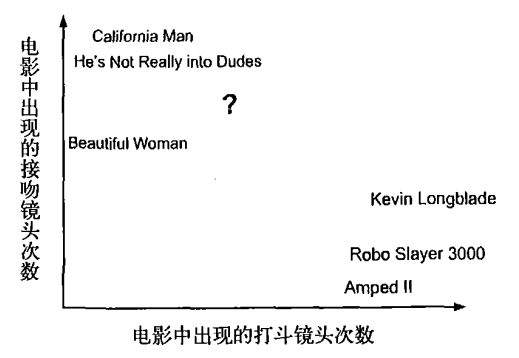

首先我们需要知道这个未知电影存在多少个打斗镜头和接吻镜头，上图中问号位置是该未知电影出现的镜头数图形化展示，具体数字参见下表。

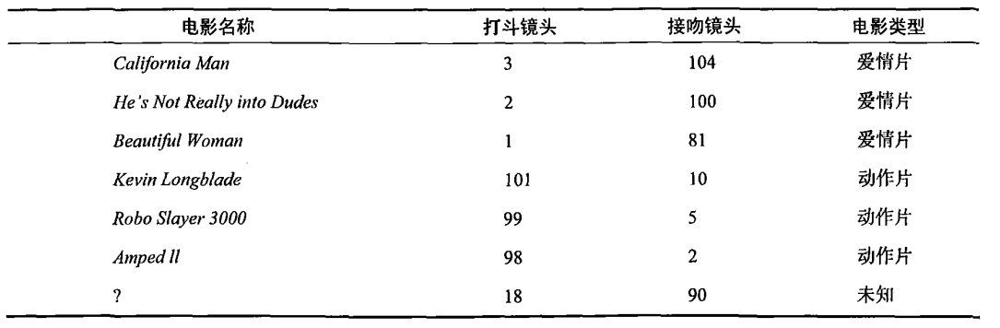

即使不知道未知电影属于哪种类型，我们也可以通过某种方法计算出来。首先计算未知电影与样本集中其他电影的距离，如图所示。

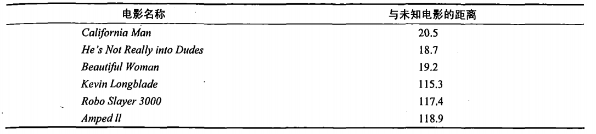

现在我们得到了样本集中所有电影与未知电影的距离，按照距离递增排序，可以找到K个距
离最近的电影。假定k=3，则三个最靠近的电影依次是California Man、He's Not Really into Dudes、Beautiful Woman。K-近邻算法按照距离最近的三部电影的类型，决定未知电影的类型，而这三部电影全是爱情片，因此我们判定未知电影是爱情片。

### 欧几里得距离(Euclidean Distance)

欧氏距离是最常见的距离度量，衡量的是多维空间中各个点之间的绝对距离。公式如下：

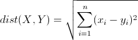

## 2、在scikit-learn库中使用k-近邻算法

- 分类问题：from sklearn.neighbors import KNeighborsClassifier
- 回归问题：from sklearn.neighbors import KNeighborsRegressor

```python
import numpy as np
import pandas as pd
from pandas import Series,DataFrame
import matplotlib.pyplot as plt
%matplotlib inline
```

### 0）一个最简单的例子

身高、体重、鞋子尺码数据对应性别

```python
# 身高、体重、鞋的尺寸
X = np.array([[181,80,44],
              [177,70,43],
              [160,60,38],
              [154,54,37],
              [166,65,40],
              [190,90,47],
              [175,64,39],
              [177,70,40],
              [159,55,37],
              [171,75,42],
              [181,85,43],
              [175,64,42],
              [162,50,37],
              [176,80,42]])

y = ['male',
     'male',
     'female',
     'female',
     'male',
     'male',
     'female',
     'female',
     'female',
     'male',
     'male',
     'male',
     'female',
     'male']
```

构建KNN分类器对象

knnclf = KNeighborsClassifier(n_neighbors=3)

n_neighbors应设置为一个奇数，表示距离预测样本最近的n个样本点

```python
from sklearn.neighbors import KNeighborsClassifier
```

```python
knn = KNeighborsClassifier(n_neighbors=3) # 指定邻居的数量, 必须是奇数
```

```python
knn.fit(X, y) # 训练模型
```


```
KNeighborsClassifier(algorithm='auto', leaf_size=30, metric='minkowski',
           metric_params=None, n_jobs=1, n_neighbors=3, p=2,
           weights='uniform')
```


```python
# 训练数据集的特征数和预测数据集的特征数必须保持一致
test_X = [
    [186, 110, 45],
    [170, 75,  42],
    [182, 80,  42],
    [165, 50,  37],
    [170, 55,  38]
]
```

```python
knn.predict(test_X)
```


```
array(['male', 'male', 'male', 'female', 'female'], dtype='<U6')
```


### 2）电影分类： 动作片、爱情片

```python
data = {
    '动作次数': [ 18, 20, 3,  5, 16, 22],
    '接吻次数': [ 2,  1,  18, 12, 2,  1],
    '电影类型': ['动作片', '动作片', '爱情片', '爱情片', '动作片', '动作片']
}
```

创建DataFrame

```python
movies = DataFrame(data)
movies
```


<div>
<style scoped>
    .dataframe tbody tr th:only-of-type {
        vertical-align: middle;
    }
    .dataframe tbody tr th {
    vertical-align: top;
}
.dataframe thead th {
    text-align: right;
}
</style>
<table border="1" class="dataframe">
  <thead>
    <tr style="text-align: right;">
      <th></th>
      <th>动作次数</th>
      <th>接吻次数</th>
      <th>电影类型</th>
    </tr>
  </thead>
  <tbody>
    <tr>
      <th>0</th>
      <td>18</td>
      <td>2</td>
      <td>动作片</td>
    </tr>
    <tr>
      <th>1</th>
      <td>20</td>
      <td>1</td>
      <td>动作片</td>
    </tr>
    <tr>
      <th>2</th>
      <td>3</td>
      <td>18</td>
      <td>爱情片</td>
    </tr>
    <tr>
      <th>3</th>
      <td>5</td>
      <td>12</td>
      <td>爱情片</td>
    </tr>
    <tr>
      <th>4</th>
      <td>16</td>
      <td>2</td>
      <td>动作片</td>
    </tr>
    <tr>
      <th>5</th>
      <td>22</td>
      <td>1</td>
      <td>动作片</td>
    </tr>
  </tbody>
</table>
</div>


提取训练数据的样式

创建和训练KNN分类模型

```python
knn_movie = KNeighborsClassifier(n_neighbors=3)
knn_movie.fit(movies.iloc[:, :2].values,
              movies.iloc[:, -1])
```


```
KNeighborsClassifier(algorithm='auto', leaf_size=30, metric='minkowski',
           metric_params=None, n_jobs=1, n_neighbors=3, p=2,
           weights='uniform')
```


预测数据

```python
knn_movie.predict([[20,1], [5, 12], [10, 10]])
```


```
array(['动作片', '爱情片', '爱情片'], dtype=object)
```


### 3） 数据鸢尾花 分类

导包，机器学习的算法KNN、数据鸢尾花


```python
from sklearn.datasets import load_iris
```

```python
iris = load_iris()  # 返回一个字典对象
iris.keys()
```


```
dict_keys(['data', 'target', 'target_names', 'DESCR', 'feature_names'])
```


获取训练样本

sklearn.datasets.load_iris是机器学习库提供给我们研究算法的数据方法， 返回的对象的属性有：

- data 数据
- target 目标
- target_names 目标名
- feature_names 特征名

```python
iris.target_names
```


```
array(['setosa', 'versicolor', 'virginica'], dtype='<U10')
```


```python
iris_df = DataFrame(iris.data, columns=iris.feature_names)
iris_df['target'] = Series(iris.target)
iris_df.head()
```


<div>
<style scoped>
    .dataframe tbody tr th:only-of-type {
        vertical-align: middle;
    }
    .dataframe tbody tr th {
    vertical-align: top;
}
.dataframe thead th {
    text-align: right;
}
</style>
<table border="1" class="dataframe">
  <thead>
    <tr style="text-align: right;">
      <th></th>
      <th>sepal length (cm)</th>
      <th>sepal width (cm)</th>
      <th>petal length (cm)</th>
      <th>petal width (cm)</th>
      <th>target</th>
    </tr>
  </thead>
  <tbody>
    <tr>
      <th>0</th>
      <td>5.1</td>
      <td>3.5</td>
      <td>1.4</td>
      <td>0.2</td>
      <td>0</td>
    </tr>
    <tr>
      <th>1</th>
      <td>4.9</td>
      <td>3.0</td>
      <td>1.4</td>
      <td>0.2</td>
      <td>0</td>
    </tr>
    <tr>
      <th>2</th>
      <td>4.7</td>
      <td>3.2</td>
      <td>1.3</td>
      <td>0.2</td>
      <td>0</td>
    </tr>
    <tr>
      <th>3</th>
      <td>4.6</td>
      <td>3.1</td>
      <td>1.5</td>
      <td>0.2</td>
      <td>0</td>
    </tr>
    <tr>
      <th>4</th>
      <td>5.0</td>
      <td>3.6</td>
      <td>1.4</td>
      <td>0.2</td>
      <td>0</td>
    </tr>
  </tbody>
</table>
</div>


通过标准差，选择合适的特征数据集

df.std(axis=0)

```python
iris_df.std(axis=0)
```


```
sepal length (cm)    0.828066
sepal width (cm)     0.433594
petal length (cm)    1.764420
petal width (cm)     0.763161
target               0.819232
dtype: float64
```


查看分类的数量 （种类）

```python
iris_df['target'].unique()
```


```
array([0, 1, 2])
```


查看特征名 feature_names

选择前80%的行数据作为训练集, 后20%的数据作为测试集 

```python
samples = iris.data[:, :2] # 前两列数据
samples.shape
```


```
(150, 2)
```


```python
from sklearn.model_selection import train_test_split
```

```python
# 随机拆分的样本数据和目标数据， 默认测试数据集的大小是25%，test_size=0.25
train_x, test_x, train_y, test_y = train_test_split(samples, iris.target,test_size=0.2)
```

注意：（离散性的、标称型的）目标值是不参与运算的，所以不是必须要转换成数字的格式

绘制图形

- plt.scatter()
- matplotlib.colors.ListedColormap([]) 颜色映射列表

```python
from matplotlib.colors import ListedColormap
```

```python
cm = ListedColormap(['red', 'green', 'blue'])
```

```python
plt.scatter(samples[:, 0], samples[:, 1], c=iris.target, cmap=cm)
plt.show()
```

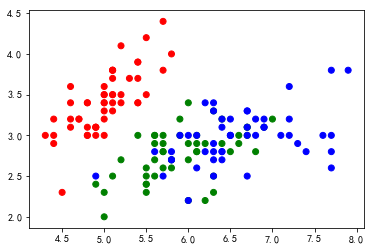

对样本数据进行训练

```python
knn_iris = KNeighborsClassifier(n_neighbors=3)
knn_iris.fit(train_x, train_y)
```


```
KNeighborsClassifier(algorithm='auto', leaf_size=30, metric='minkowski',
           metric_params=None, n_jobs=1, n_neighbors=3, p=2,
           weights='uniform')
```


对数据进行预测

```python
y_ = knn_iris.predict(test_x)
```

```python
plt.scatter(test_x[:, 0], test_x[:, 1], c=test_y)
plt.scatter(test_x[:, 0], test_x[:, 1], c=y_, cmap=cm)
plt.show()
```

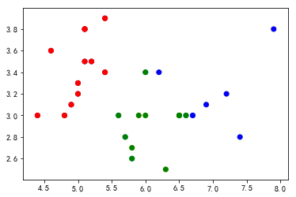

生成满屏预测数据

- min, max
- np.linspace(min, max, size=1000)
- np.meshgrid(x, y) 表格的格点处理
  - x确定列数
  - y确定行数
- xx.ravel() 扁平化
- np.c_[xx, yy]  组合两个数组

```python
f1 = np.linspace(samples[:, 0].min(), samples[:, 0].max(), num=200)
f2 = np.linspace(samples[:, 1].min(), samples[:, 1].max(), num=200)

f1, f2 = np.meshgrid(f1, f2)
test_x = np.c_[f1.ravel(), f2.ravel()]
```

```python
knn_iris.fit(samples, iris.target)
y_=knn_iris.predict(test_x)
```

绘制满屏的scatter图

```python
plt.scatter(test_x[:, 0], test_x[:, 1], c=y_, cmap=cm)
plt.scatter(samples[:, 0], samples[:, 1], c=iris.target)
plt.show()
```

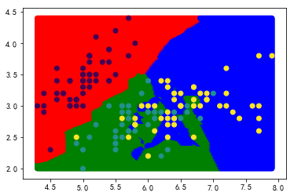

matplotlib.colors.ListedColormap 多颜色映射列表

cmap = ListedColormap(['#aa00ff','#00aaff','#ffaa00'])

- 展示预测数据的分类情况

plt.scatter(X_test[:,0],X_test[:,1],c=y_,cmap=cmap)

- 展示真实数据的分类情况

plt.scatter(samples.iloc[:,0],samples.iloc[:,1],c=target)

#### 4）用于回归  

回归用于对趋势的预测

导包

```python
from sklearn.neighbors import KNeighborsRegressor
```

生成样本数据

- 符合正弦分布的数据 
- 生成噪音数据 
  - noise = np.random.random(size=20) - 0.5
  - y[::2] += noise

```python
x = np.linspace(0, 2*np.pi, num=50)
y = np.sin(x)
```

```python
plt.scatter(x, y)
plt.show()
```

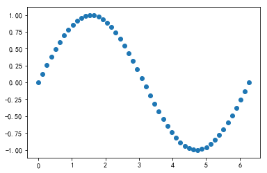


```python
noise = np.random.random(size=25) - 0.5
y[::2] += noise
```

```python
plt.scatter(x, y)
plt.show()
```

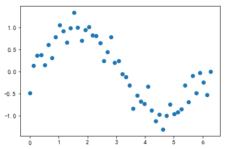

第一步：生成模型，并训练数据

- 可能会出现过拟合和欠拟合情况

```python
knn_regressor = KNeighborsRegressor(n_neighbors=5)
```

```python
knn_regressor.fit(x.reshape(-1, 1), y)
```


```
KNeighborsRegressor(algorithm='auto', leaf_size=30, metric='minkowski',
          metric_params=None, n_jobs=1, n_neighbors=5, p=2,
          weights='uniform')
```


第二步：使用模型，预测数据

```python
test_x = np.linspace(0, 2*np.pi, num=200)
y_ = knn_regressor.predict(test_x.reshape(-1, 1))
```

绘图显示数据

```python
plt.scatter(x, y, c='r')
plt.plot(test_x, y_, c='b')
plt.show()
```

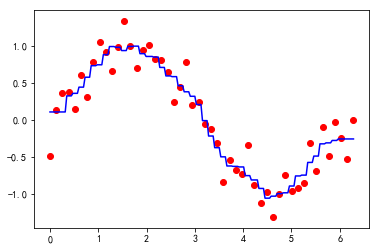

### 练习

人类动作识别  
步行，上楼，下楼，坐着，站立和躺着  
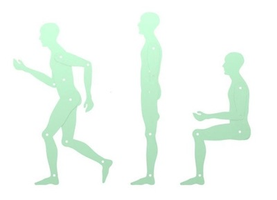  
数据采集每个人在腰部穿着智能手机，进行了六个活动（步行，上楼，下楼，坐着，站立和躺着）。采用嵌入式加速度计和陀螺仪，以50Hz的恒定速度捕获3轴线性加速度和3轴角速度，来获取数据

导入数据

- np.load('xx.npy')
- x_train.npy 训练数据 X
- y_train.npy 训练数据目标
- x_test.npy  预测数据 
- y_test.npy

```python
train_X = np.load('npy/x_train.npy')
```

```python
train_X.shape
```


```
(7352, 561)
```


```python
train_y = np.load('npy/y_train.npy')  # np.save(filepath, arr)
test_X = np.load('npy/x_test.npy')
test_y = np.load('npy/y_test.npy')
```

```python
# 不同动作
label = {1:'WALKING', 
         2:'WALKING UPSTAIRS', 
         3:'WALKING DOWNSTAIRS',
         4:'SITTING', 
         5:'STANDING', 
         6:'LAYING'}
```

训练、预测

```python
n = 3
while True:
    walk_knn = KNeighborsClassifier(n_neighbors=n)
    walk_knn.fit(train_X, train_y)  # 训练
    y_ = walk_knn.predict(test_X)   # 预测
    score = test_y[test_y==y_].size/test_y.size
    if score >=0.95:
        break
    n += 2
print('本次得分:', score, 'n=', n)
```

```python
n = 9

walk_knn = KNeighborsClassifier(n_neighbors=n)
walk_knn.fit(train_X, train_y)  # 训练
y_ = walk_knn.predict(test_X)   # 预测
score = test_y[test_y==y_].size/test_y.size
print('本次得分:', score, 'n=', n)
```

```
本次得分: 0.9053274516457415 n= 9
```

查看得分

```python
walk_knn.score(test_X, test_y)
```


```
0.9046487953851374
```


```python
test_y[test_y==y_].size/test_y.size
```


```
0.9046487953851374
```


画出不同动作的线性图

```python
Series(train_y).unique()  # 目标， 六个动作
```


```
array([5, 4, 6, 1, 3, 2])
```


```python
# 查出走的动作的数据
x = train_X[train_y==1][:500, 0]
```

```python
plt.plot(x, color='#c40488')
plt.show()
```

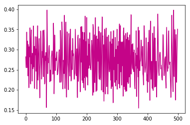


```python
# 画六个子画布
plt.figure(figsize=(10, 12))
index = 1
colors = ('#c40488', '#cd2408', '#f404d8', '#34d488', '#84f4c8', '#04d500')
for k, name in label.items():
    x = train_X[train_y==k][:500, 0]
    ax = plt.subplot(3,2, index)
    ax.set_title(name)
    ax.plot(x, c=colors[index-1])
    index += 1
    
plt.show()
```

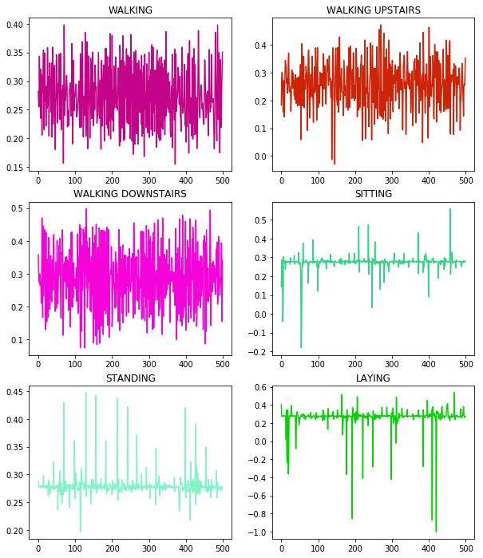
