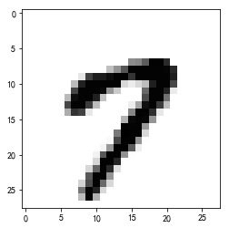
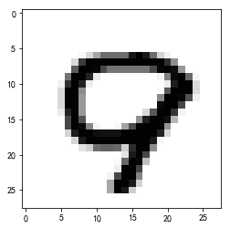
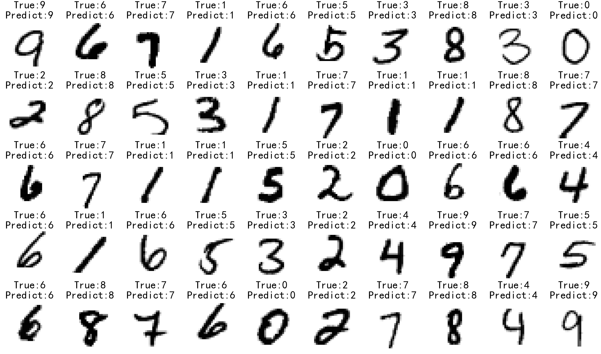
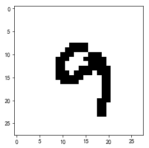

## 手写数字识别

- 加载数据文件， 分了10个目录，每个目录中有500张图片
- 使用KNN分类模型

<!--more-->

## 手写数字识别

- 加载数据文件， 分了10个目录，每个目录中有500张图片
- 使用KNN分类模型

```python
import numpy as np
import pandas as pd
from pandas import Series, DataFrame

import matplotlib.pyplot as plt
%matplotlib inline
```

### 加载数据

```python
# 加载7数字的第一张图片
i7_1 = plt.imread('digits/7/7_1.bmp')
plt.imshow(i7_1, cmap='gray')
```


```
<matplotlib.image.AxesImage at 0x7f215184b860>
```





```python
i7_1.shape
```


```
(28, 28)
```


```python
samples = []  # 样本数据
target = [] # 目标
for digit in range(0, 10):  # 0-9范围的数字
    for index in range(1,501): # 每一个数字目录下都有500张图片
        img = plt.imread('digits/%d/%d_%d.bmp'%(digit, digit, index))
        samples.append(img.reshape(-1)) # 将二维图片转成一维数组，再添加到samples中
        target.append(digit)
```

```python
samples = np.array(samples)
target = np.array(target)
display(samples.shape, target.shape)
```

```
(5000, 784)
```


```
(5000,)
```


```python
plt.imshow(samples[4999].reshape(28,28),cmap='gray')
```


```
<matplotlib.image.AxesImage at 0x7f2151767358>

```




### 拆分训练数据和预测数据

```python
from sklearn.model_selection import train_test_split as sp

```

```python
# 随机抽样，测试数据集占比20%
train_X, test_X, train_y, test_y = sp(samples, target, test_size=0.2)

```

### 创建模型、训练和预测和模型得分

```python
from sklearn.neighbors import KNeighborsClassifier

```

```python
for k in np.arange(3,17,step = 2):
    knn = KNeighborsClassifier(n_neighbors=k)
    score = knn.fit(train_X, train_y).score(test_X,test_y)
    print('k=',k, 'score=', score)

```

```
k= 3 score= 0.947
k= 5 score= 0.944
k= 7 score= 0.939
k= 9 score= 0.929
k= 11 score= 0.93
k= 13 score= 0.925
k= 15 score= 0.924
```


```python
knn = KNeighborsClassifier(n_neighbors=3)
knn.fit(train_X, train_y) # 最优的模型训练
y_ = knn.predict(test_X) # 预测

```

### 画出预测结果中前50个图片和数字

- 5 行 10 列
- 显示标题: True(真实结果)和Predict(识别结果)
- 去除坐标轴

```python
plt.figure(figsize=(60,35))
for index in range(50):  # 测试数据中的前50张图片
    ax = plt.subplot(5,10,index+1)
    img = test_X[index].reshape(28,28)  # 读取第index行的图片数据并变形
    plt.axis('off')
    plt.imshow(img, cmap='gray')
    ax.set_title('True:%s\nPredict:%s'%(test_y[index], y_[index]), fontsize=60)
plt.show()

```



### 自己手写的数字， 通过模型来识别

```python
# 读取文件
test7 = plt.imread('digits/test/9.bmp')
test7.shape
```


```
(28, 28, 3)
```


```python
# 降维
test = test7.max(axis=-1)
test.shape
```


```
(28, 28)
```


```python
plt.imshow(test,cmap='gray')
```


```
<matplotlib.image.AxesImage at 0x7f214c6f5b00>
```





```python
knn.predict(test.reshape(1,-1))
```

预测正确

```
array([9])
```