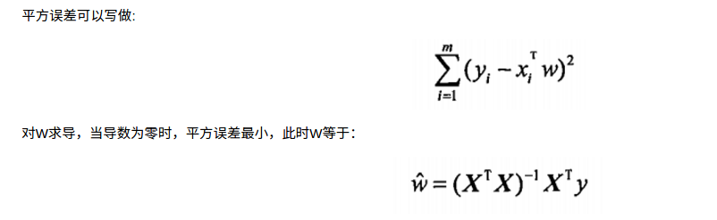
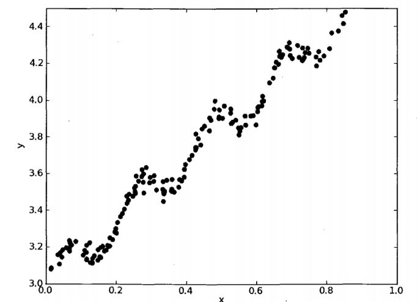
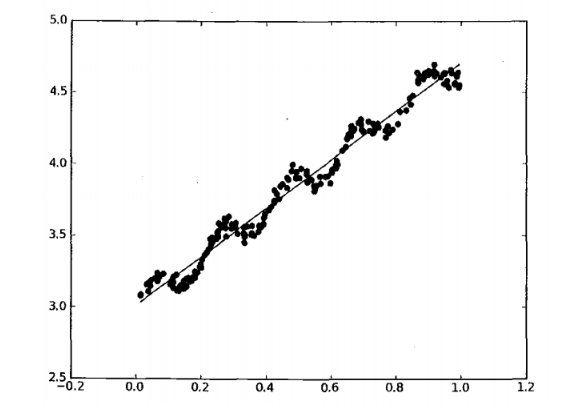
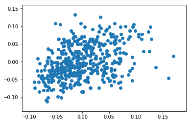
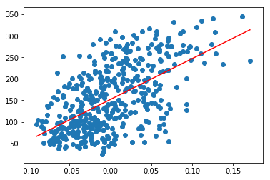
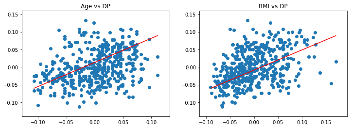
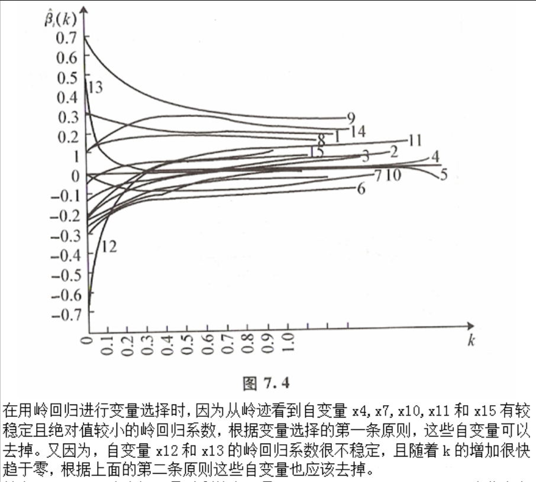
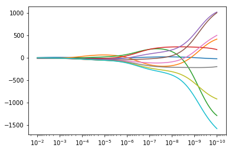
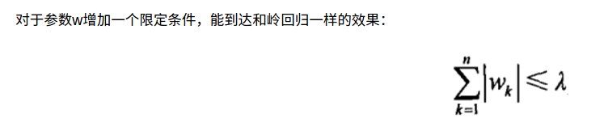

# 线性回归

## 【关键词】最小二乘法，线性

<!--more-->

## 一、普通线性回归

### 1、原理

分类的目标变量是标称型数据，而回归将会对连续型的数据做出预测。

应当怎样从一大堆数据里求出回归方程呢？

假定输人数据存放在矩阵X中，而回归系数存放在向量W中。那么对于给定的数据X1, 预测结果将会通过

Y=X*W

给出。现在的问题是，手里有一些X和对应的Y,怎样才能找到W呢？

一个常用的方法就是找出使误差最小的W。这里的误差是指预测Y值和真实Y值之间的差值，使用该误差的简单累加将使得正差值和负差值相互抵消，所以我
们采用平方误差。

最小二乘法


平方误差可以写做
对W求导，当导数为零时，平方误差最小，此时W等于：


例如有下面一张图片：



求回归曲线，得到：



### 2、实例 - 糖尿病数据分析

导包

```python
import numpy as np
import pandas as pd
from pandas import Series, DataFrame
import matplotlib.pyplot as plt
%matplotlib inline
```

获取糖尿病数据

- sklearn.datasets中load_diabetes()函数
  - data 是特征数据
  - feature_names 特征名称
  - target 是目标
- 生成DataFrame查看数据

```python
from sklearn.datasets import load_diabetes
```

```python
diabetes = load_diabetes()
```

```python
diabetes_df = DataFrame(diabetes.data, columns=diabetes.feature_names)
diabetes_df['target'] = Series(diabetes.target)
diabetes_df.head()
```


<div>
<style scoped>
    .dataframe tbody tr th:only-of-type {
        vertical-align: middle;
    }
    .dataframe tbody tr th {
    vertical-align: top;
}
.dataframe thead th {
    text-align: right;
}
</style>
<table border="1" class="dataframe">
  <thead>
    <tr style="text-align: right;">
      <th></th>
      <th>age</th>
      <th>sex</th>
      <th>bmi</th>
      <th>bp</th>
      <th>s1</th>
      <th>s2</th>
      <th>s3</th>
      <th>s4</th>
      <th>s5</th>
      <th>s6</th>
      <th>target</th>
    </tr>
  </thead>
  <tbody>
    <tr>
      <th>0</th>
      <td>0.038076</td>
      <td>0.050680</td>
      <td>0.061696</td>
      <td>0.021872</td>
      <td>-0.044223</td>
      <td>-0.034821</td>
      <td>-0.043401</td>
      <td>-0.002592</td>
      <td>0.019908</td>
      <td>-0.017646</td>
      <td>151.0</td>
    </tr>
    <tr>
      <th>1</th>
      <td>-0.001882</td>
      <td>-0.044642</td>
      <td>-0.051474</td>
      <td>-0.026328</td>
      <td>-0.008449</td>
      <td>-0.019163</td>
      <td>0.074412</td>
      <td>-0.039493</td>
      <td>-0.068330</td>
      <td>-0.092204</td>
      <td>75.0</td>
    </tr>
    <tr>
      <th>2</th>
      <td>0.085299</td>
      <td>0.050680</td>
      <td>0.044451</td>
      <td>-0.005671</td>
      <td>-0.045599</td>
      <td>-0.034194</td>
      <td>-0.032356</td>
      <td>-0.002592</td>
      <td>0.002864</td>
      <td>-0.025930</td>
      <td>141.0</td>
    </tr>
    <tr>
      <th>3</th>
      <td>-0.089063</td>
      <td>-0.044642</td>
      <td>-0.011595</td>
      <td>-0.036656</td>
      <td>0.012191</td>
      <td>0.024991</td>
      <td>-0.036038</td>
      <td>0.034309</td>
      <td>0.022692</td>
      <td>-0.009362</td>
      <td>206.0</td>
    </tr>
    <tr>
      <th>4</th>
      <td>0.005383</td>
      <td>-0.044642</td>
      <td>-0.036385</td>
      <td>0.021872</td>
      <td>0.003935</td>
      <td>0.015596</td>
      <td>0.008142</td>
      <td>-0.002592</td>
      <td>-0.031991</td>
      <td>-0.046641</td>
      <td>135.0</td>
    </tr>
  </tbody>
</table>
</div>


```python
diabetes.DESCR
```


```
'.. _diabetes_dataset:\n\nDiabetes dataset\n----------------\n\nTen baseline variables, age, sex, body mass index, average blood\npressure, and six blood serum measurements were obtained for each of n =\n442 diabetes patients, as well as the response of interest, a\nquantitative measure of disease progression one year after baseline.\n\n**Data Set Characteristics:**\n\n  :Number of Instances: 442\n\n  :Number of Attributes: First 10 columns are numeric predictive values\n\n  :Target: Column 11 is a quantitative measure of disease progression one year after baseline\n\n  :Attribute Information:\n      - Age\n      - Sex\n      - Body mass index\n      - Average blood pressure\n      - S1\n      - S2\n      - S3\n      - S4\n      - S5\n      - S6\n\nNote: Each of these 10 feature variables have been mean centered and scaled by the standard deviation times `n_samples` (i.e. the sum of squares of each column totals 1).\n\nSource URL:\nhttp://www4.stat.ncsu.edu/~boos/var.select/diabetes.html\n\nFor more information see:\nBradley Efron, Trevor Hastie, Iain Johnstone and Robert Tibshirani (2004) "Least Angle Regression," Annals of Statistics (with discussion), 407-499.\n(http://web.stanford.edu/~hastie/Papers/LARS/LeastAngle_2002.pdf)'
```


抽取训练数据和预测数据

- 研究bmi指标对血糖的影响趋势, bp字段

```python
bmi = diabetes_df['bmi'].values
bp = diabetes_df['bp'].values
```

```python
plt.scatter(bmi, bp)
plt.show()
```



创建数学模型-普通线性回归

```python
from sklearn.linear_model import LinearRegression
```

```python
linear = LinearRegression()
```

第一步：训练和预测的得分

- sklearn.metrics.r2_score(y_true, y_pred)

```python
from sklearn.model_selection import train_test_split as split

```

```python
train_X, test_X, train_y, test_y = split(bmi.reshape(-1, 1),
                                         diabetes.target)
```

```python
linear.fit(train_X, train_y).score(test_X, test_y)
```


```
0.36813167310279926
```


```python
linear.fit(train_X, train_y)
y_ = linear.predict(test_X)
```

```python
from sklearn.metrics import r2_score
```

```python
r2_score(test_y, y_)  # 回归性数据，计算真实的数据和预测的数据的比较得分
```


```
0.36813167310279926
```


### 使用全部的样本数据进行模型训练

生成新的预测数据

- 获取bmi的最小和最大值，生成这个区间的100个等差数例
  - linspace()

```python
bmi.min()
```


```
-0.0902752958985185
```


```python
bmi.max()
```


```
0.17055522598066
```


```python
test_X = np.linspace(bmi.min(), bmi.max(), num=100)
```

```python
linear.fit(bmi.reshape(-1, 1), diabetes.target)
```


```
LinearRegression(copy_X=True, fit_intercept=True, n_jobs=None,
         normalize=False)
```


预测

```python
y_ = linear.predict(test_X.reshape(-1, 1))
```

绘制图形

- 将 测试数据和结果，画出线型图
- 将 训练数据和目标， 画出散点图

```python
plt.plot(test_X, y_, color='red')
plt.scatter(bmi, diabetes.target)
plt.show()
```



扩展

- 获取训练模型后的系数
  - linear.coef_
- 计算得分： r2_score(test_true, test_predict)
  - 是sklearn.metrics 模块的函数

```python
linear.coef_  # 线性函数的 w 系数
```


```
array([949.43526038])
```


```python
linear.intercept_  # 线性函数的截距 b
```


```
152.1334841628967
```


练习： age和bmi对bp的影响

- 获取age，bmi的实际数据进行模型的训练
- 生成age,bmi的测试数据， 每个特征的(min, max)生成等差数列
- 使用测试数据，进行测试
- 画出实现数据的散点图和线型图（两个）

```python
samples = diabetes_df[['age', 'bmi']].values
target = diabetes_df['bp'].values
```

```python
samples[:, 0].min()
```


```
-0.107225631607358
```


```python
f1 = np.linspace(samples[:, 0].min(),
                 samples[:, 0].max(), num=100)
f2 = np.linspace(samples[:, 1].min(),
                 samples[:, 1].max(), num=100)
test_X = np.c_[f1, f2]  # 将两个一维数组合成一个两列多行的二维数组
test_X.shape
```


```
(100, 2)
```


```python
linear.fit(samples, target)
y_ = linear.predict(test_X)
```

```python
plt.figure(figsize=(12, 4))

ax1 = plt.subplot(121)
ax1.set_title('Age vs DP')
plt.scatter(samples[:, 0], target)
plt.plot(test_X[:, 0], y_, color='red')


ax2 = plt.subplot(122)
ax2.set_title('BMI vs DP')
plt.scatter(samples[:, 1], target)
plt.plot(test_X[:, 1], y_, color='red')

plt.show()
```



## 二、岭回归

f(x) = w1*x1 + w2*x2 + w3*x3
f(x) = a*x1 + b*x2 + c*x3

1   2  4  7
2   5  3  2
3   6  1  9


# 有解方程  

1 = a*2 + b*4 + c*7
2 = a*5 + b*3 + c*2
3 = a*6 + b*1 + c*9

1   2  4  7
2   5  3  2

# 无解方程

1 = a*2 + b*4 + c*7
2 = a*5 + b*3 + c*2

# 不满秩矩阵 不能求逆

# 数据样本的个数 < 数据特征的个数 需要使用岭回归

# 多重共性

2  4  7        1 0 0      3  4  7
5  3  2   + λ* 0 1 0  =   5  4  2  -> 可以求逆 -> 线性回归模型就可用了
               0 0 1      0  0  1   

### 1、原理

缩减系数来“理解”数据

如果数据的特征比样本点还多应该怎么办？是否还可以使用线性回归和之前的方法来做预测？

答案是否定的，即不能再使用前面介绍的方法。这是因为输入数据的矩阵X不是满秩矩阵。非满秩矩阵在求逆时会出现问题。

为了解决这个问题，统计学家引入了岭回归（ridge regression)的概念



缩减方法可以去掉不重要的参数，因此能更好地理解数据。此外，与简单的线性回归相比，缩减法能取得更好的预测效果。

岭回归是加了二阶正则项的最小二乘，主要适用于过拟合严重或各变量之间存在多重共线性的时候，岭回归是有bias的，这里的bias是为了让variance更小。

#### 归纳总结

1.岭回归可以解决特征数量比样本量多的问题

2.岭回归作为一种缩减算法可以判断哪些特征重要或者不重要，有点类似于降维的效果

3.缩减算法可以看作是对一个模型增加偏差的同时减少方差

岭回归用于处理下面两类问题：

1.数据点少于变量个数

2.变量间存在共线性（最小二乘回归得到的系数不稳定，方差很大）

### 2、实例

岭回归一般用于样本值不足的时候

- sklearn.linear_model模块中 Ridge

```python
from sklearn.linear_model import Ridge
```

不满轶矩阵数据样本数据

- X_train = [[2,1,1],[1,2,3]]
- y_train = [3, 1]

```python
# 电影分类： 动作片-1， 枪战片-3， 爱情片-2
#           打斗，    开枪，    接吻
train_X = [[10, 15, 8],
           [11, 1, 5]]
train_y = [3, 1]
```

使用普通线性回归

- LinearRegression

```python
linear2 = LinearRegression()
linear2.fit(train_X, train_y)
```


```
LinearRegression(copy_X=True, fit_intercept=True, n_jobs=None,
         normalize=False)
```


```python
linear2.predict([[15, 1, 5]])
```


```
array([0.96116505])
```


使用岭回归

- Ridge(alpha=1) alpha指定偏差系数λ
- 经实例证明， alpha=0,Ridge就是普通的线性回归

```python
ridge = Ridge(alpha=0.5)
ridge.fit(train_X, train_y)
```


```
Ridge(alpha=0.5, copy_X=True, fit_intercept=True, max_iter=None,
   normalize=False, random_state=None, solver='auto', tol=0.001)
```


比较它们之间的系数

- coef_ 所有的特征系数
- Ridge()的alpha 无限接近0时，同线性回归几乎相同
  - 其实alpha 为0就是线性回归，不过系统会提示一些警告而已

```python
linear2.coef_
```


```
array([-0.00970874,  0.13592233,  0.02912621])
```


```python
ridge = Ridge(alpha=0)  # alpha 缩减系数为0时，就是一个普通的线性回归
ridge.fit(train_X, train_y)
ridge.coef_
```

```
/Users/apple/anaconda3/lib/python3.7/site-packages/sklearn/linear_model/ridge.py:165: LinAlgWarning: scipy.linalg.solve
Ill-conditioned matrix detected. Result is not guaranteed to be accurate.
Reciprocal condition number1.537199e-17
  overwrite_a=False)
```


```
array([-0.00970874,  0.13592233,  0.02912621])
```


### 【扩展】深入研究岭回归

- 理解岭回归缩减系数

【备注】coef_函数可以获取机器学习模型中各个特征值的系数

#### 创建一个假象数据样本集

- 生成一个10×10的二维数组 和 10个目标值
  - X = 1 / (np.arange(1, 11) + np.arange(0, 10).reshape(-1, 1))
  - y = np.linspace(0, 10, num=10)
- 创建 100个 alpha系数， 范围在 [e^-10, e^-2]
  - np.logspace(-10, -2, 100)  生成e指数的等差数列

```python
X = 1/(np.arange(1, 11) + np.arange(10).reshape(-1, 1))
y = np.linspace(0, 10, num=10, endpoint=False)
```

```python
X.shape
```


```
(10, 10)
```


```python
y.shape
```


```
(10,)
```


```python
alphas = np.logspace(-10, -2, num=100)
```

#### 根据不同的alpha ，训练X和y, 并收集coef_系统数

- 设置 Rigde的alpha参数： ridge.set_params(alpha=alpha) 
- coefs.append(ridge.coef_) 

```python
ridge = Ridge()
coefs = []
for alpha in alphas:
    ridge.set_params(alpha=alpha)
    ridge.fit(X, y)
    coefs.append(ridge.coef_) # 收集每次模型训练后的 w 系数
```

```python
coefs = np.array(coefs)
coefs.shape
```


```
(100, 10)
```


#### 绘制线型图，查看alpha与coefs的关系

- plt.plot(alphas, coefs)
- plt.xscale('log') 坐标刻度的缩放比例为 指数形式
- ax.set_xlim(ax.get_xlim()[::-1]) # 将x的刻度反转过来

```python
plt.plot(alphas, coefs)
plt.xscale('log')
ax = plt.gca()  # 获取当前的Axes画布的实例对象
ax.set_xlim(ax.get_xlim()[::-1])  # 将x坐标刻度反转过来
plt.show()
```



## 三、lasso回归

### 1、原理

【拉格朗日乘数法】

对于参数w增加一个限定条件，能到达和岭回归一样的效果：



在 λ (lambda) 足够小的时候，一些系数会因此被迫缩减到0

### 2、实例－波士顿房价数据分析

加载数据

- sklearn.datasets 模块的 load_boston()
- sklearn.model_selection 模块的 train_test_split() 分出训练数与测试数据

```python
from sklearn.datasets import load_boston
```

```python
bostan = load_boston()
```

```python
bostan.data.shape
```


```
(506, 13)
```


```python
bostan.feature_names
```


```
array(['CRIM', 'ZN', 'INDUS', 'CHAS', 'NOX', 'RM', 'AGE', 'DIS', 'RAD',
       'TAX', 'PTRATIO', 'B', 'LSTAT'], dtype='<U7')
```


```python
train_X, test_X, train_y, test_y = split(bostan.data, bostan.target)
```

比较得分 和 系数

- Ridge(alpha=0.8)
- Lasso(alpha=0.0006)
- sklearn.metrics.r2_score()

```python
from sklearn.linear_model import Lasso
```

```python
lasso = Lasso(alpha=0.0006)
ridge = Ridge(alpha=0.7)
linear3 = LinearRegression()

for model in [lasso, ridge, linear3]:
    name = model.__class__.__name__
    model.fit(train_X, train_y)
    y_ = model.predict(test_X)
    score = r2_score(test_y, y_)
    print(name, '得分', score)
    # print(name, '系数', model.coef_)
```

```
Lasso 得分 0.7165217873439823
Ridge 得分 0.7226997084819513
LinearRegression 得分 0.7161985279583359
```

## 四、普通线性回归、岭回归与lasso回归比较

随机生成训练数据和测试数据

- np.random.seed(42) 指定种子
- 生成 50 行、200个特征的正态分布的样本数
- 生成系数（与特征量相同）的正态分布数 * 3， 即为 coefs
- 系数归零化
  - 获取系数索引, inds = np.arange(n_features)
  - 打乱顺序, np.random.shuffle(inds)
  - 对系数进行归零化处理, coefs[inds[10:]] = 0
- 生成目标值 y 
  - 样本数据与系数进行矩阵积的结果， y = np.dot(x, coef)
  - 对目标值加噪音， y += 0.01*np.random.normal(n_samples)

```python
np.random.seed(10)
x = np.random.randn(50, 200)  # 生成样本数据
coefs = np.random.randn(200)*3  # 生成系数

coefs_index = np.arange(200) # 生成系数的索引位置 0~199
np.random.shuffle(coefs_index)  # 打乱的索引的顺序
```

```python
coefs_index[:10]
```


```
array([ 53, 115,  40, 108, 103,  47, 186,  10, 129, 116])
```


```python
coefs[coefs_index[:10]]
```


```
array([ 1.95578865,  2.46486138, -1.41746653, -2.42466241,  2.61244235,
       -4.0891305 , -2.81876429, -1.1879966 , -3.0227635 ,  0.3799766 ])
```


```python
coefs[coefs_index[10:]] = 0 # 随机保留10个有效的w系数值，即其它的都是0
```

```python
y = np.dot(x, coefs)  # 将x 和 w系数进行矩阵积，结果变成50个目标值
y += np.random.randn(50) * 0.01
```

分别使用线性回归，岭回归，Lasso回归进行数据预测

```python
trainX, testX, trainy,testy = split(x, y, test_size=.2)
```

```python
linear = LinearRegression()
ridge = Ridge(alpha=0.8)
lasso = Lasso(alpha=0.00001)

for model in [linear, ridge, lasso]:
    score = model.fit(trainX, trainy).score(testX, testy)
    print(model.__class__.__name__, '得分:', score)
```

```
LinearRegression 得分: 0.09403629166096383
Ridge 得分: 0.09405238738460531
Lasso 得分: 0.04997143478385713
```

数据视图，此处获取各个算法的训练数据的coef_:系数

```python
linear.coef_[:10]
```


```
array([-0.09223179, -0.5798521 , -1.10985274,  0.00800645, -0.19329456,
        0.43135926, -1.39670663, -0.26308844, -0.23870551,  0.54891173])
```


```python
coefs[:10]
```


```
array([0., 0., 0., 0., 0., 0., 0., 0., 0., 0.])
```


```python
ridge.coef_[:10]
```


```
array([-0.06252339, -0.56804829, -1.12697814,  0.03698796, -0.23258024,
        0.45327138, -1.40633002, -0.24052112, -0.24432255,  0.52978321])
```


```python
lasso.coef_[:10]
```


```
array([  2.59385858,  -4.61989168,  -3.51590501,   1.83343066,
         3.94410478,   0.46006678, -10.32702338,  -6.17487522,
        -3.61182527,   3.27608103])
```
