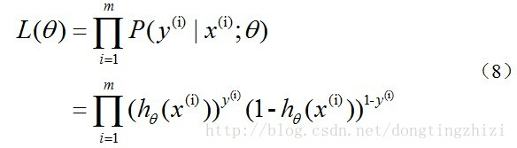
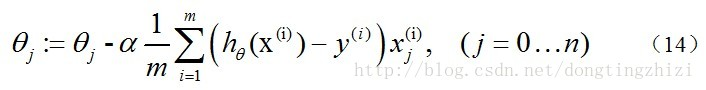
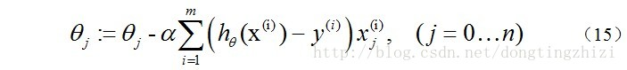

# 逻辑斯蒂回归

## 【关键词】Logistics函数，最大似然估计，梯度下降法

<!--more-->

## 1、Logistics回归的原理

利用Logistics回归进行分类的主要思想是：根据现有数据对分类边界线建立回归公式，以此进行分类。这里的“回归” 一词源于最佳拟合，表示要找到最佳拟合参数集。

训练分类器时的做法就是寻找最佳拟合参数，使用的是最优化算法。接下来介绍这个二值型输出分类器的数学原理

Logistic Regression和Linear Regression的原理是相似的，可以简单的描述为这样的过程：

（1）找一个合适的预测函数，一般表示为h函数，该函数就是我们需要找的分类函数，它用来预测输入数据的判断结果。这个过程是非常关键的，需要对数据有一定的了解或分析，知道或者猜测预测函数的“大概”形式，比如是线性函数还是非线性函数。

（2）构造一个Cost函数（损失函数），该函数表示预测的输出（h）与训练数据类别（y）之间的偏差，可以是二者之间的差（h-y）或者是其他的形式。综合考虑所有训练数据的“损失”，将Cost求和或者求平均，记为J(θ)函数，表示所有训练数据预测值与实际类别的偏差。

（3）显然，J(θ)函数的值越小表示预测函数越准确（即h函数越准确），所以这一步需要做的是找到J(θ)函数的最小值。找函数的最小值有不同的方法，Logistic Regression实现时有梯度下降法（Gradient Descent）。

### 1)  构造预测函数

Logistic Regression虽然名字里带“回归”，但是它实际上是一种分类方法，用于两分类问题（即输出只有两种）。首先需要先找到一个预测函数（h），显然，该函数的输出必须是两类值（分别代表两个类别），所以利用了*Logistic函数（或称为Sigmoid函数）*，函数形式为：


该函数形状为：


预测函数可以写为：


### 2）构造损失函数

Cost函数和J(θ)函数是基于*最大似然估计*推导得到的。

每个样本属于其真实标记的概率，即似然函数，可以写成：


所有样本都属于其真实标记的概率为



对数似然函数为


最大似然估计就是要求得使l(θ)取最大值时的θ，其实这里可以使用梯度上升法求解，求得的θ就是要求的最佳参数

### 3) 梯度下降法求J(θ)的最小值

求J(θ)的最小值可以使用*梯度下降法*，根据梯度下降法可得θ的更新过程:


式中为α学习步长，下面来求偏导：


上式求解过程中用到如下的公式：


因此，θ的更新过程可以写成:



因为式中α本来为一常量，所以1/m一般将省略，所以最终的θ更新过程为：




## 2、实战

`
sklearn.linear_model.LogisticRegression(penalty='l2', dual=False, tol=0.0001, C=1.0, fit_intercept=True, intercept_scaling=1, class_weight=None, random_state=None, solver='liblinear', max_iter=100, multi_class='ovr', verbose=0, warm_start=False, n_jobs=1)
`

solver参数的选择：

- “liblinear”：小数量级的数据集
- “lbfgs” or “newton-cg”：大数量级的数据集以及多分类问题
- “sag”：极大的数据集

### 逻辑斯提 Logistic 总结

- 是一个线性回归模型，处理二分类问题
- 概率论
- 对分类边界建立回归公式
- 不能处理回归问题

### 1) 手写数字数据集的分类

使用KNN与Logistic回归两种方法

- 数据 load_digits() 函数

```python
import numpy as np
import pandas as pd
from pandas import Series, DataFrame
import matplotlib.pyplot as plt
%matplotlib inline
```

```python
from sklearn.datasets import load_digits
```

```python
digits = load_digits()
```

切分训练与预测数据： train_test_split()

```python
from sklearn.model_selection import train_test_split as split
```

```python
trainX,testX,trainy,testy = split(digits.data, digits.target)
```

```python
trainX.shape
```


```
(1347, 64)
```


```python
display(trainy[15])
plt.imshow(trainX[15].reshape(8, 8), cmap='gray')
```

```
8
```


```
<matplotlib.image.AxesImage at 0x7f9161730978>
```


创建模型，训练和预测

- LogisticRegression(C=0.1)
  - C惩罚系数 允许误差的阈值
  - C越大，允许的误差越大

```python
from sklearn.linear_model import LogisticRegression
```

```python
logistic = LogisticRegression(C=0.1)
```

```python
logistic.fit(trainX, trainy).score(testX, testy)
```


```
0.9733333333333334
```


```python
y_ = logistic.predict(testX)
```

```python
testX.shape
```


```
(450, 64)
```


展示结果:前100个样本数据

- plt.imshow(arr, cmap='gray')
- axes.axis('off')

```python
plt.figure(figsize=(30, 40))
for index in range(100):  # 前100预测的图片
    ax = plt.subplot(10, 10, index+1)
    ax.axis('off')
    ax.set_title('True:%s\nPredict:%s' %(testy[index], y_[index]),
                fontsize=30)
    plt.imshow(testX[index].reshape(8, 8), cmap='gray')

plt.show()
```


### 2) 使用make_blobs产生数据集进行分类

导包使用datasets.make_blobs创建一系列点

- n_samples=100 样本点数
- n_features=2  样本特征
- centers=[[1,4],[3,2],[5,6]]  三个中心数据

```python
from sklearn.datasets import make_blobs
```

设置三个中心点，随机创建100个点

- samples,target = make_blobs(n_samples, n_features,centers)

```python
samples, target = make_blobs(100, 2, [[1,5], [4,2], [5,6]])
```

```python
samples.shape
```


```
(100, 2)
```


```python
Series(target).unique()
```


```
array([1, 2, 0])
```


创建机器学习模型，训练数据

- knn分类 训练
- logistic训练

```python
from sklearn.neighbors import KNeighborsClassifier
```

```python
knn_c = KNeighborsClassifier(n_neighbors=5)
logistic = LogisticRegression(C=0.1,
                              solver='liblinear', multi_class='ovr')

for model in [knn_c, logistic]:
    model.fit(samples, target)
```

显示两个特征的散点图

- plt.scatter(train[:,0],train[:,1],c=target)

```python
plt.scatter(samples[:, 0], samples[:, 1], c= target)
plt.show
```


```
<function matplotlib.pyplot.show(*args, **kw)>
```


提取坐标点，对坐标点进行处理

- 获取边界
  - f1_min, f1_max = train[:,0].min()-0.5, train[:,1].max()+0.5
  - f2_min, f2_max = train[:,1].min()-0.5, train[:,1].max()+0.5
- 等差数列
  - f1 = np.linspace(f1_min, f1_max,200)
  - f2 = np.linspace(f2_min, f2_max, 200)
- f1和f2交叉、合并成X_test测试数据
  - f1_m,f2_m = np.meshgrid(f1, f2)
  - X_test = np.c_[f1_m.ravel(),f2_m.ravel()]

```python
f1 = np.linspace(samples[:, 0].min()-0.5,
                samples[:, 0].max()+0.5, num=200)
f2 = np.linspace(samples[:, 1].min()-0.5,
                samples[:, 1].max()+0.5, num=200)
f1, f2 = np.meshgrid(f1, f2) # 将f1，f2转成200*200的二维数组
testX = np.c_[f1.ravel(), f2.ravel()] # 转成2列40000行的预测数据
```

预测坐标点数据, 同时查看执行的时间 %time指令

- knn分类 预测
- logistic 预测

```python
%time y_knn = knn_c.predict(testX)
```

```
CPU times: user 231 ms, sys: 24.4 ms, total: 255 ms
Wall time: 65 ms
```


```python
%time y_logistic = logistic.predict(testX)
```

```
CPU times: user 7.69 ms, sys: 0 ns, total: 7.69 ms
Wall time: 2.14 ms
```

绘制图形

- matplotlib.colors.ListedColormap

```python
from matplotlib.colors import ListedColormap
```

```python
cmaps = ListedColormap(['red', 'green', 'blue'])
```

画出两种模型的真实数据与预测数据的散点图

```python
plt.figure(figsize=(12, 5))

ax1 = plt.subplot(121)
# y_knn 模型预测的数据，满屏的点
plt.scatter(testX[:, 0], testX[:, 1], c=y_knn, cmap=cmaps)
plt.scatter(samples[:, 0], samples[:, 1], c=target)
ax1.set_title('KNN分类与预测', fontproperties='SimHei', fontsize=20)


ax2 = plt.subplot(122)
# y_logistic 模型预测的数据，满屏的点
plt.scatter(testX[:, 0], testX[:, 1], c=y_logistic, cmap=cmaps)
plt.scatter(samples[:, 0], samples[:, 1], c=target)
ax2.set_title('Logistic预测数据', fontproperties='SimHei', fontsize=20)

plt.show()
```


## 3、预测年收入是否大于50K美元

读取adults.txt文件，并使用逻辑斯底回归算法训练模型，根据种族race、职业occupation、工作时长hours_per_week来预测一个人的收入

```python
adults = pd.read_csv('data/adults.txt')
adults.head()
```


<div>
<style scoped>
    .dataframe tbody tr th:only-of-type {
        vertical-align: middle;
    }
    .dataframe tbody tr th {
    vertical-align: top;
}
.dataframe thead th {
    text-align: right;
}
</style>
<table border="1" class="dataframe">
  <thead>
    <tr style="text-align: right;">
      <th></th>
      <th>age</th>
      <th>workclass</th>
      <th>final_weight</th>
      <th>education</th>
      <th>education_num</th>
      <th>marital_status</th>
      <th>occupation</th>
      <th>relationship</th>
      <th>race</th>
      <th>sex</th>
      <th>capital_gain</th>
      <th>capital_loss</th>
      <th>hours_per_week</th>
      <th>native_country</th>
      <th>salary</th>
    </tr>
  </thead>
  <tbody>
    <tr>
      <th>0</th>
      <td>39</td>
      <td>State-gov</td>
      <td>77516</td>
      <td>Bachelors</td>
      <td>13</td>
      <td>Never-married</td>
      <td>Adm-clerical</td>
      <td>Not-in-family</td>
      <td>White</td>
      <td>Male</td>
      <td>2174</td>
      <td>0</td>
      <td>40</td>
      <td>United-States</td>
      <td>&lt;=50K</td>
    </tr>
    <tr>
      <th>1</th>
      <td>50</td>
      <td>Self-emp-not-inc</td>
      <td>83311</td>
      <td>Bachelors</td>
      <td>13</td>
      <td>Married-civ-spouse</td>
      <td>Exec-managerial</td>
      <td>Husband</td>
      <td>White</td>
      <td>Male</td>
      <td>0</td>
      <td>0</td>
      <td>13</td>
      <td>United-States</td>
      <td>&lt;=50K</td>
    </tr>
    <tr>
      <th>2</th>
      <td>38</td>
      <td>Private</td>
      <td>215646</td>
      <td>HS-grad</td>
      <td>9</td>
      <td>Divorced</td>
      <td>Handlers-cleaners</td>
      <td>Not-in-family</td>
      <td>White</td>
      <td>Male</td>
      <td>0</td>
      <td>0</td>
      <td>40</td>
      <td>United-States</td>
      <td>&lt;=50K</td>
    </tr>
    <tr>
      <th>3</th>
      <td>53</td>
      <td>Private</td>
      <td>234721</td>
      <td>11th</td>
      <td>7</td>
      <td>Married-civ-spouse</td>
      <td>Handlers-cleaners</td>
      <td>Husband</td>
      <td>Black</td>
      <td>Male</td>
      <td>0</td>
      <td>0</td>
      <td>40</td>
      <td>United-States</td>
      <td>&lt;=50K</td>
    </tr>
    <tr>
      <th>4</th>
      <td>28</td>
      <td>Private</td>
      <td>338409</td>
      <td>Bachelors</td>
      <td>13</td>
      <td>Married-civ-spouse</td>
      <td>Prof-specialty</td>
      <td>Wife</td>
      <td>Black</td>
      <td>Female</td>
      <td>0</td>
      <td>0</td>
      <td>40</td>
      <td>Cuba</td>
      <td>&lt;=50K</td>
    </tr>
  </tbody>
</table>
</div>


```python
# 种族 ，职业， 工作时间做训练数据，薪资为目标数据
samples = adults[['race', 'occupation', 'hours_per_week']]
target = adults['salary'].values 
```

找出需要进行数值化处理的列， 并进行数值化处理

df.columns[df.dtypes == object]

```python
samples.dtypes == object  # 查看是object类型的列，需进行数值化处理
```


```
race               True
occupation         True
hours_per_week    False
dtype: bool
```


```python
samples.columns[samples.dtypes == object]
```


```
Index(['race', 'occupation'], dtype='object')
```


```python
items = samples['race'].unique() # 根据类型是object的列，查出他的分类
items
```


```
array(['White', 'Black', 'Asian-Pac-Islander', 'Amer-Indian-Eskimo',
       'Other'], dtype=object)
```


```python
np.argwhere(items=='White')[0, 0]  # 查看行数据中某一值在items中的位置
```


```
0
```


```python
# 基于函数的封装
# 对数据中的所有object列的值进行数值化
def to_numeric(df, inplace=False):
    df2 = df if inplace else df.copy()
    cols = df2.columns[df2.dtypes==object]
    for col_name in cols:
        # 获取col_name列所有item名称
        items = df2[col_name].unique()
        df2[col_name] = df[col_name].map(lambda item: np.argwhere(items==item)[0,0])
        
    if not inplace:
        return df2
```

```python
# 原来的数据
samples.head()
```


<div>
<style scoped>
    .dataframe tbody tr th:only-of-type {
        vertical-align: middle;
    }
    .dataframe tbody tr th {
    vertical-align: top;
}
.dataframe thead th {
    text-align: right;
}
</style>
<table border="1" class="dataframe">
  <thead>
    <tr style="text-align: right;">
      <th></th>
      <th>race</th>
      <th>occupation</th>
      <th>hours_per_week</th>
    </tr>
  </thead>
  <tbody>
    <tr>
      <th>0</th>
      <td>White</td>
      <td>Adm-clerical</td>
      <td>40</td>
    </tr>
    <tr>
      <th>1</th>
      <td>White</td>
      <td>Exec-managerial</td>
      <td>13</td>
    </tr>
    <tr>
      <th>2</th>
      <td>White</td>
      <td>Handlers-cleaners</td>
      <td>40</td>
    </tr>
    <tr>
      <th>3</th>
      <td>Black</td>
      <td>Handlers-cleaners</td>
      <td>40</td>
    </tr>
    <tr>
      <th>4</th>
      <td>Black</td>
      <td>Prof-specialty</td>
      <td>40</td>
    </tr>
  </tbody>
</table>
</div>


```python
# 使用自定义函数数值化之后的数据
df2 = to_numeric(samples)
df2.head()
```


<div>
<style scoped>
    .dataframe tbody tr th:only-of-type {
        vertical-align: middle;
    }
    .dataframe tbody tr th {
    vertical-align: top;
}
.dataframe thead th {
    text-align: right;
}
</style>
<table border="1" class="dataframe">
  <thead>
    <tr style="text-align: right;">
      <th></th>
      <th>race</th>
      <th>occupation</th>
      <th>hours_per_week</th>
    </tr>
  </thead>
  <tbody>
    <tr>
      <th>0</th>
      <td>0</td>
      <td>0</td>
      <td>40</td>
    </tr>
    <tr>
      <th>1</th>
      <td>0</td>
      <td>1</td>
      <td>13</td>
    </tr>
    <tr>
      <th>2</th>
      <td>0</td>
      <td>2</td>
      <td>40</td>
    </tr>
    <tr>
      <th>3</th>
      <td>1</td>
      <td>2</td>
      <td>40</td>
    </tr>
    <tr>
      <th>4</th>
      <td>1</td>
      <td>3</td>
      <td>40</td>
    </tr>
  </tbody>
</table>
</div>


