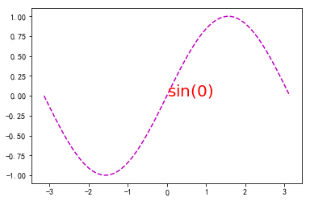
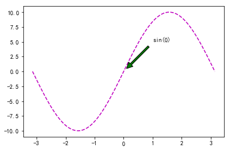
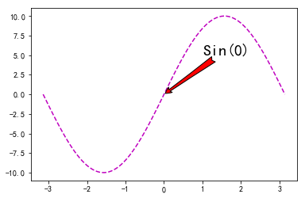
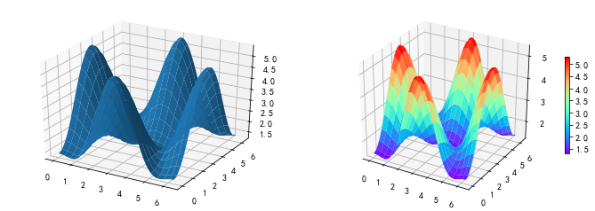

```python
import matplotlib.pyplot as plt
import numpy as np
%matplotlib inline
```

<!--more-->

### 画文本

- plt.text(x,y,s)

```python
x = np.linspace(-np.pi, np.pi, num=100)
y = np.sin(x)

plt.plot(x, y, 'm--')
# 画文本是，可以使用Text对象的相关属性，如字体大小、颜色
plt.text(0,0,s=r'$\sin(0)$', color='red', fontsize=20)  # x和y是坐标
plt.show()
```



### 注释

- plt.annotate(text, xy, xytext, arrowprops={})

- arrowprops包含的属性

  - width  箭头中正方形的宽度
  - headlength 箭头的长度
  - headwidth 箭头的宽度
  - shrink 箭头和文本的距离的比例
  - facecolor 填充颜色
  - arrowstyle 指定箭头的风格

  <font color=red>注意：arrowstyle不能和arrowprops中其它的属性同时使用</font>

```python
plt.plot(x, y*10, 'm--')
plt.annotate('sin(0)',xy=(0, 0), xytext=(1,5), arrowprops={
    'width': 3,          # 箭头线的宽度
    'headlength': 10,    # 箭头的长度
    'headwidth': 10,     # 箭头的宽度
    'shrink': 0.1,       # 箭头距指向坐标，距文本的比例值
    'facecolor': 'green' # 箭头颜色
})
plt.show()
```



### arrowstyle的values

```
============   =============================================
Name           Attrs
============   =============================================
``'-'``        None
``'->'``       head_length=0.4,head_width=0.2
``'-['``       widthB=1.0,lengthB=0.2,angleB=None
``'|-|'``      widthA=1.0,widthB=1.0
``'-|>'``      head_length=0.4,head_width=0.2
``'<-'``       head_length=0.4,head_width=0.2
``'<->'``      head_length=0.4,head_width=0.2
``'<|-'``      head_length=0.4,head_width=0.2
``'<|-|>'``    head_length=0.4,head_width=0.2
``'fancy'``    head_length=0.4,head_width=0.4,tail_width=0.4
``'simple'``   head_length=0.5,head_width=0.5,tail_width=0.2
``'wedge'``    tail_width=0.3,shrink_factor=0.5
============   =============================================
```

```python
plt.plot(x, y*10, 'm--')

plt.annotate('Sin(0)', xy=(0, 0), xytext=(1, 5), arrowprops={
    'arrowstyle': 'fancy',
    'facecolor': 'red'
}, fontsize=20)

plt.show()
```



### 3D图形

- mpl_toolkits.mpl3d.axes3d.Axes3D 类导入
- flg.add_subplot(,projection='3d') 设置子画布为3d坐标系
- axes.plot_surface(x, y, z, rstride, cstride)

```python
from mpl_toolkits.mplot3d.axes3d import Axes3D
```

```python
a = [1, 2, 3] # 确定列数，表示是一行
b = [4, 6] # 确定行数，表示一列

a, b = np.meshgrid(a, b) # a, b 的shape都是(2, 3)
display(a.shape, b.shape)
```

```
(2, 3)
(2, 3)
```


```python
x = y = np.linspace(0, 2*np.pi, 100)
# 将x, y转成二维的数组-> 表格化处理np.meshgrid(x, y)
X, Y = np.meshgrid(x,y)

a = 0.7
b = np.pi

compZ = lambda X, Y: 2+a-2*np.cos(X)*np.cos(Y) - a*np.cos(b-2*X)
Z = compZ(X, Y)

display(X.shape, Y.shape, Z.shape)
```

```

(100, 100)
(100, 100)
(100, 100)
```


```python
fig = plt.figure(figsize=(12, 4)) # 获取画布对象，并设置画布的大小
# 创建两个3d的子画布
ax1 = fig.add_subplot(121, projection='3d')
ax2 = fig.add_subplot(122, projection='3d')

ax1.plot_surface(X,Y,Z,cstride=5, rstride=5)
ps = ax2.plot_surface(X,Y,Z,cstride=5, rstride=5, cmap='rainbow')

# 显示颜色栏
plt.colorbar(ps, shrink=0.5)
plt.show()
```



