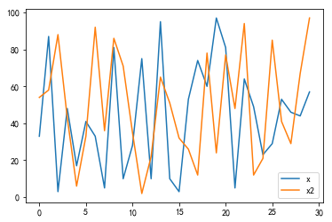

```python
import matplotlib.pyplot as plt
from matplotlib.font_manager import FontProperties

%matplotlib inline
```

<!--more-->

```python
# 加载一个字体库文件， 生成一个FontProperties对象
font_wwt = FontProperties(fname='ttc/hkwwt.ttc', size=16)
```

```python
plt.title('这是第一个空白的画布', fontproperties=font_wwt)
plt.xlabel('X轴', fontproperties='SimHei')
plt.ylabel('Y轴', fontproperties='SimSun')
plt.plot()
```


### 画图的基础知识

#### 画布的组成部分

- 标题 title (text)
- 坐标轴 x, y -> axis(line)
- 轴标签 xlabel, ylabel 
- 轴的刻度 tick (line)
- 刻度的标签 tick label(text)
- 数据 data (line)
- 图例 legend
- 绘图区域 figure

```python
import numpy as np
```

```python
x = np.linspace(-np.pi*2, np.pi*2, num=20)
y = np.sin(x)

plt.plot(x, y, 'r--+')
# 修改坐标轴的刻度范围
# [xmin, xmax, ymin, ymax]
plt.axis([-10, 10, -2, 2])
plt.title('sin(x)', fontdict={
    'fontsize': 20
})

plt.show()
```


```python
from pandas import Series, DataFrame
```

```python
# Sereis画线
x = np.random.randint(1, 100, size=30)
Series(x).plot()

x2 = np.random.randint(1, 100, size=30)
Series(x2).plot()

plt.show()
```


```python
df = DataFrame({
    'x': x,
    'x2': x2
})
df.plot()
```


```
<matplotlib.axes._subplots.AxesSubplot at 0x7fcd1b8bd668>
```




#### 网格的使用

- plt.grid(True) 开启网格
- plt.grid(ls, lw, color, axis='both')
  - ls -> linestyle
  - lw -> linewidth
  - axis -> {'both', 'x', 'y'}

```python
Series(x.cumsum()).plot()
```


```
<matplotlib.axes._subplots.AxesSubplot at 0x7fcd1b83a3c8>
```


```python
plt.grid(True, ls='dotted', color='red', alpha=0.25, lw=1, axis='y')
plt.plot(np.arange(30),  # x坐标-> 数量
         x.cumsum(), 'cyan')  # y坐标 -> 累计的数值
```


```
[<matplotlib.lines.Line2D at 0x7fcd26aeada0>]
```


#### 坐标轴刻度操作

- plt.axis('off') 关闭坐标轴
- plt.axis([xmin, xmax, ymin, ymax]) 设置坐标轴的两条线的刻度
- plt.axis(xmin=, ymin=)  # 设置某一轴的最大或最小的刻度
- plt.ylim([ymin, ymax])  # 设置 y坐标轴的刻度
- plt.xlim([xmin, xmax])  # 设置 x坐标轴的刻度

```python
# plt.axis(ymax=2000, xmax=35)
# plt.xlim([-1, 40])
plt.ylim([-100, 1500])
plt.plot(np.arange(30),  # x坐标-> 数量
         x.cumsum(), 'cyan')  # y坐标 -> 累计的数值
```


```
[<matplotlib.lines.Line2D at 0x7fcd2735bb38>]
```


#### 标题的位置与方向

- plt.title('', loc='left|center|right', rotation=45)
- plt.title('', color='red', fontsize=14)

```python
plt.title('This is a Title', color='red', fontsize=30,
          loc='right',rotation=45)
plt.plot(np.arange(30),  # x坐标-> 数量
         x.cumsum(), 'cyan')  # y坐标 -> 累计的数值
```


```
[<matplotlib.lines.Line2D at 0x7fcd26aae6d8>]
```


```python
plt.title('This is a Title', color='red', fontsize=30,
          loc='left',rotation=-2)
plt.plot(np.arange(30),  # x坐标-> 数量
         x.cumsum(), 'cyan')  # y坐标 -> 累计的数值
```


```
[<matplotlib.lines.Line2D at 0x7fcd1b7ad5f8>]
```


### legend 图例

- plt.plot(x, y, label='线的图例名称')
- plt.legend() 显示图例
- plt.legend(loc=(0, 0)) 设置图例显示位置 

 loc属性值
        ===============   =============
        Location String   Location Code
        ===============   =============
        'best'            0
        'upper right'     1
        'upper left'      2
        'lower left'      3
        'lower right'     4
        'right'           5
        'center left'     6
        'center right'    7
        'lower center'    8
        'upper center'    9
        'center'          10
        ===============   =============

```python
x = np.linspace(1, 30, num=30)
plt.plot(x, x**2, label='x^2')
plt.plot(x, x**3, label='x^3')
plt.plot(x, 2*x+5, label='2*x+5*x')
plt.legend(loc='upper right') # (0, 0) 在左下角， （1,1）右上角
plt.show()
```


### 扩展 cumsum() 累加和

```python
arr = np.array([
    [
        [1, 2, 3, 4],
        [2, 3, 4, 5],
        [5, 6, 7, 8]
    ],
    [
        [10, 20, 30, 40],
        [20, 30, 40, 50],
        [50, 60, 70, 80]
    ]
])
```

```python
arr.cumsum(axis=2)
```


```
array([[[  1,   3,   6,  10],
        [  2,   5,   9,  14],
        [  5,  11,  18,  26]],

       [[ 10,  30,  60, 100],
        [ 20,  50,  90, 140],
        [ 50, 110, 180, 260]]])
```


```python
# 画出不同的三条线，并保存的画布为png图片
plt.title('三条不同的线', fontproperties='SimHei', fontsize=16)

"""
>>> plot(x, y, 'go--', linewidth=2, markersize=12)
>>> plot(x, y, color='green', marker='o', linestyle='dashed',
...      linewidth=2, markersize=12)


  marker: unknown
  markeredgecolor: color
  markeredgewidth: float
  markerfacecolor: color
  markerfacecoloralt: color
  markersize: float
"""

x = np.arange(50)
y1 = np.random.randn(50).cumsum() 
y2 = np.random.randn(50).cumsum() 
y3 = np.random.randn(50).cumsum() 

plt.plot(x, y1, ls='--', marker='o', markersize=5)
plt.plot(x, y2, color='red', marker='x')
plt.plot(x, y3, color='green', marker='h',
         markersize=10, markerfacecolor='red')

"""
savefig(fname, dpi=None, facecolor='w', edgecolor='w',
          orientation='portrait', papertype=None, format=None,
          transparent=False, bbox_inches=None, pad_inches=0.1,
          frameon=None, metadata=None)
"""
plt.savefig('lines.png', dpi=160, facecolor='g') # 保存画布为png图片

```


```python
# 设置画布的背景颜色
plt.subplot(fc='c')  # facecolor = fc 
# plt.plot(x, y1, ls='--', marker='o', markersize=5)
plt.plot(x, y1, ls='steps', c='r')  # 画出阶梯线，每个角都是直角
```


```
[<matplotlib.lines.Line2D at 0x7fcd1b78d828>]

```


```python
"""
**Markers**

=============    ===============================
character        description
=============    ===============================
``'.'``          point marker
``','``          pixel marker
``'o'``          circle marker
``'v'``          triangle_down marker
``'^'``          triangle_up marker
``'<'``          triangle_left marker
``'>'``          triangle_right marker
``'1'``          tri_down marker
``'2'``          tri_up marker
``'3'``          tri_left marker
``'4'``          tri_right marker
``'s'``          square marker
``'p'``          pentagon marker
``'*'``          star marker
``'h'``          hexagon1 marker
``'H'``          hexagon2 marker
``'+'``          plus marker
``'x'``          x marker
``'D'``          diamond marker
``'d'``          thin_diamond marker
``'|'``          vline marker
``'_'``          hline marker
=============    ===============================
"""

plt.plot(x, y1, marker='1', ls='None', markersize=10) 
plt.plot(x, y2, marker='3', ls='None', markersize=10) 
```


```
[<matplotlib.lines.Line2D at 0x7fcd1b6870b8>]
```


```python
from matplotlib.lines import Line2D

```

```python
# 可以线的对象来设置线的属性
lines = plt.plot(x, y1)  # [<matplotlib.lines.Line2D at 0x1162ec978>]
line = lines[0]
line.set_ls('--')  # set_linestyle('--')
line.set_marker('h')
line.set_markersize(10)
line.set_markerfacecolor('red')
plt.show()

```


### 修改画布的刻度

- plt.xticks([位置], [标签])
- plt.yticks([], [])

```python
x = [10, 15, 20, 8, 9, 13]
plt.plot(x, marker='h', markersize=10)
plt.xticks([0, 2, 4], ['a', 'b', 'c']) # x轴上的刻度只标上三个
yticks, yticklabels = plt.yticks([0, 15, 30])

# 修改刻度标签的文本颜色和字体大小
for ticklabel in yticklabels:
    ticklabel.set_color('red')
    ticklabel.set_size(20)
    
plt.show()

```


### LaTex语法

- 格式： r'$\name$'

```python
x = np.linspace(-np.pi, np.pi)
y = np.sin(x)
plt.title(r'$\sin(x)$', fontsize=20)
plt.xticks([-np.pi, -np.pi*0.5, 0, np.pi*0.5, np.pi],
           [r'$-\pi$', r'$-\frac{\pi}{2}$',
            '0', r'$\frac{\pi}{2}$', r'$\pi$'],
           fontsize=20, color='red')
plt.plot(x, y)
```


```
[<matplotlib.lines.Line2D at 0x7fcd1b400cf8>]
```


### 2D图形

- 直方图 hist(arr, bins=50)

```python
n = [10, 20, 11, 13, 12, 10, 90, 70, 12, 60]
# 直方图查看数据的分布情况，统计数据密度
plt.hist(n, bins=3, cumulative=False,
         rwidth=0.8, color='red') # cumulative=True累计直方图
plt.show()

```


```python
n = np.random.randn(10000)

# 创建两个画布对象
fig, axes = plt.subplots(1,2, figsize=(10, 5))
axes[0].hist(n, bins=10)
axes[0].set_title('普通的直方图', fontproperties='SimHei')

axes[1].hist(n, bins=10, cumulative=True)
axes[1].set_title('累计的直方图', fontproperties='SimHei')

plt.show()
```


```python
# 密度的直方图
# 水平方向和垂直方向
n = np.random.normal(10, 2, size=1000)

# density归一化处理，密度的直方图
plt.hist(n, bins=20,
         density=True,
         orientation='vertical',
         color='red')
plt.show()
```


```python
# 水平方向的密度直方图
plt.hist(n, bins=20,
         density=True,
         orientation='horizontal',
         color='red')
plt.show()
```


#### 条形图

- plt.bar(x, y, width,  bottom, color)
- plt.barh(x, y, height, left, color) 水平条形图

```python
x = np.arange(1, 6)
y1 = 10*np.abs(np.random.randn(5))
y2 = 10*np.abs(np.random.randn(5))
y3 = 10*np.abs(np.random.randn(5))

width = 0.3
plt.bar(x, y1, width=width, color='r', bottom=1)
plt.bar(x+width, y2, width=width, color='b', bottom=1)
plt.bar(x+2*width, y3, width=width, color='g', bottom=1)

# 将x轴的刻度放在第二条形的下方
plt.xticks(x+width, x)
plt.ylim([0, 30])

plt.show()
```


```python
# 重叠
plt.bar(x, y1, width=width, color='r')
plt.bar(x, y2, width=width, color='b')
plt.bar(x, y3, width=width, color='g')
```


```
<BarContainer object of 5 artists>
```


```python
#  水平方向的条形图
plt.barh(x, y1, height=0.4, color='r', left=0.1)
plt.xlim([0, 25])
```


```
(0, 25)
```


```python
plt.barh(x, y1, height=width, color='r')
plt.barh(x+width, y2, height=width, color='b')
plt.barh(x+2*width, y3, height=width, color='g')
plt.show()
```


#### 饼图

- plt.pie(x, labels, color, explode, autopct, pctdistance, labeldistance)

```python
x = [10, 50, 30, 10]
labels = ['Spring', 'Summer', 'Autumn', 'Winter']

"""
plt.pie(
    ['x', 'explode=None', 'labels=None',
    'colors=None', 'autopct=None', 'pctdistance=0.6', 
    'shadow=False', 'labeldistance=1.1', 
    'startangle=None', 'radius=None',
    'counterclock=True', 'wedgeprops=None', 
    'textprops=None', 'center=(0, 0)',
    'frame=False', 'rotatelabels=False', '*', 'data=None'],
"""
plt.pie(x,[0.2, 0, 0, 0],
        labels=labels,
        shadow=True, startangle=90,
        autopct='%.1f%%',
        rotatelabels=True,
        labeldistance=1, textprops={'fontsize':18,
                                      'color':'k'})
plt.axis('equal')
plt.show()
```


#### 散点图

- plt.scatter(x, y, color, label, edgecolor)

```python
x = [1, 2, 3, 4]
y = [2, 3, 4, 6]

plt.scatter(x, y, marker='d', c=['#0f0408', 
                                '#990021',
                                '#876199',
                                '#d4c001'
                                ])
plt.show()
```


```python
x = np.random.randn(1000)
y = np.random.randn(1000)

colors_arr = np.random.randint(16777215, size=1000)
colors = []
for color in colors_arr:
    color_txt = hex(color) # 0x12dd1f
    color_txt = color_txt[2:] #  12dd1f
    colors.append('#'+color_txt.rjust(6, '0'))
    
plt.scatter(x, y, c=colors, marker='d')
plt.show()
```


