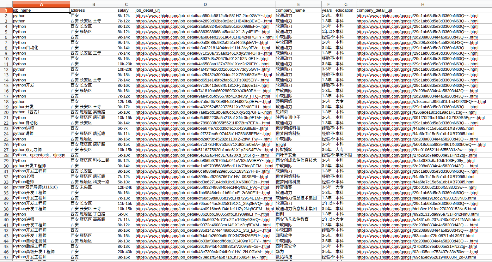

本文将介绍如何使用bs4包中的方法爬取网页。

安装：

```bash
pip install bs4
```

#### 使用bs4爬取智联招聘（基于类的封装）

目标网址：https://www.zhipin.com/job_detail/

相关职业：python

城市代码：101110100(西安)

<!--more-->

```python
#! /usr/bin/env python
# -*-coding:UTF-8-*-
# __author__ : pighui
# __time__ : 2019-4-22 下午4:20

import os
import re
import csv
import time
from threading import Thread

from bs4 import BeautifulSoup
import requests


class BossSpider(Thread):
    start_url = 'https://www.zhipin.com/job_detail/'
    params = {
        'query': 'python',
        'city': '101110100',
        'page' : '1',
        'ka' : 'page-next'
    }

    headers =  {
        'User-Agent': 'Mozilla/5.0 (Macintosh; Intel Mac OS X 10.14; rv:66.0) Gecko/20100101 Firefox/66.0'
    }

    download_per_delay = 3  # 每隔d多少秒发起一次下载请求

    csv_filepath = "boss.csv"  # 数据存储的位置

    def run(self):
        self.download()

    def download(self):
        resp = requests.get(self.start_url, self.params, headers=self.headers)
        if resp.ok:
            print(resp.url, '下载成功')
            html = resp.text
            self.parse(html)

    def parse(self, html):
        root = BeautifulSoup(html, 'lxml')  # 根节点
        # 查找所有的 class=job-primary的div
        job_nodes = root.select('.job-primary')

        items = []  # 批量写入

        for job_tag in job_nodes:
            info_a_tag = job_tag.select_one("div[class='info-primary'] a")
            # 提取详情连接，工作名称，工作薪资
            info_href = 'https://www.zhipin.com' + info_a_tag.attrs.get('href')  # 获取详情的url
            job_name = info_a_tag.select_one('.job-title').text
            job_salary_range = info_a_tag.select_one('.red').text
            # 提取公司的名称，城市为止，经验年限，学历要求
            p_tag = job_tag.select_one("div[class='info-primary'] p")
            address, years, education = tuple([item for item in p_tag.contents if isinstance(item, str)])
            company_a = job_tag.select_one('.info-company a')
            company_url = 'https://www.zhipin.com' + company_a.attrs.get('href')
            company_name = company_a.text

            items.append({
                'job_name': job_name.strip(), #工作名称
                'address': address.strip(), #工作地点
                'salary': job_salary_range.strip(), #薪资待遇
                'job_detail_url': info_href, #工作详情链接
                'company_name': company_name.strip(),  #公司名称
                'years': years.strip(), #经验要求
                'education': education.strip(), #学历要求
                'company_detail_url': company_url, #公司详情连接
            })
        print('本页数据爬取完成，共%s条数据' % len(items))

        self.csv_pipeline(items)

        # 提取下一页
        next_a = root.select_one('.page .next')
        if 'disabled' in next_a.attrs.get('class'):
            print('--%s 城市中的所有%s岗位爬取完成' % (self.params.get('city'), self.params.get('query')))
        else:
            next_href = next_a.attrs.get('href')
            page = re.findall(r'page=(\w+)', next_href)[0]
            ka = next_a.attrs.get('ka', 'page-next')
            self.params['page'] = page
            self.params['ka'] = ka
            time.sleep(self.download_per_delay)
            self.download()

    def csv_pipeline(self, items: list):
        existed_header = os.path.exists(self.csv_filepath)
        with open(self.csv_filepath, 'a', encoding='utf-8') as f:
            writer = csv.DictWriter(f, fieldnames=items[0].keys())
            if not existed_header:
                # 如果文件不存在，则表示第一次写入
                writer.writeheader()
            for item in items:
                writer.writerow(item)
            f.close()


if __name__ == '__main__':
    print('--spider start--')
    spider = BossSpider()
    spider.start()
    spider.join()
    print('--spider over--')
```

最后滴数据是这样子滴



