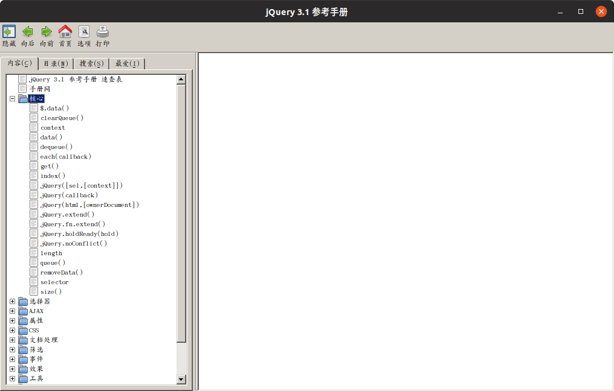

本人偏爱使用Ubuntu系统，然而某天老师发了一个——jQuery 3.1 参考手册.CHM

安装了Linux下几乎各种CHM阅读器，然而无外乎白屏、乱码、打不开。

于是决定自己调用windows自带的hh.exe实现对系统中的chm文件类型自动关联并打开阅读。

本文将介绍具体步骤。

<!--more-->

#### 1.安装wine环境

```bash
sudo apt-get install wine
```

#### 2.添加桌面图标

```bash
sudo gedit /usr/share/applications/hh.desktop
```

将以下代码复制粘贴写入

```
[Desktop Entry]
Encoding=UTF-8
Name=CHM Viewer
Name[cs]=Prohlížeč CHM souborů
Name[de]=CHM Betrachter
Name[it]=Visualizzatore CHM
Name[ja]=CHM ビュアー
Name[pl]=Przeglądarka plików CHM
Name[pt_BR]=Visualizador CHM
Name[ru]=Просмотрщик CHM
Name[tr]=CHM Görüntüleyici
Name[zh_CN]=CHM 阅读器
Name[zh_TW]=CHM 檢視器
Comment=A viewer for HTML Help files
Comment[cs]=Prohlížeč souborů HTML nápovědy
Comment[de]=Ein Betrachter für HTML Hilfe Dateien
Comment[it]=Un visualizzatore per file di aiuto HTML
Comment[ja]=HTML ヘルプファイルのビュアーです
Comment[pl]=Przeglądarka plików CHM
Comment[pt_BR]=Um visualizador para aquivos CHM
Comment[ru]=Программа для просмотра файлов HTML Help
Comment[tr]=HTML yardım dosyası görüntuleyici
Comment[zh_CN]=HTML 帮助文件阅读程序
Comment[zh_TW]=HTML 輔助檔案檢視程式
Exec=env WINEPREFIX=/home/yourusername/.wine wine hh.exe %F
Icon=yourdownload png path
Terminal=false
Type=Application
MimeType=application/x-chm;
StartupNotify=true
X-GNOME-DocPath=gnochm/gnochm.xml
Categories=Application;Utility;X-Red-Hat-Extra;
X-Ubuntu-Gettext-Domain=gnochm
```

保存退出。

需要注意的是,其中的这两行

```
Exec=env WINEPREFIX=/home/yourusername/.wine wine hh.exe %F
Icon=yourdownload png path
```

需要自行设置 hh.exe和图标的路径

我将它们都放在~/.wine目录下

#### 3.添加文件类型关联

```bash
sudo gedit /usr/share/applications/defaults.list
```

在新的一行添加以下代码

```
application/x-chm=hh.desktop
```

#### 4.用一个chm文档进行测试



PS：需要的附件点击[这里](https://www.xuhuiblog.cn/projects/附件.zip)可以下载。