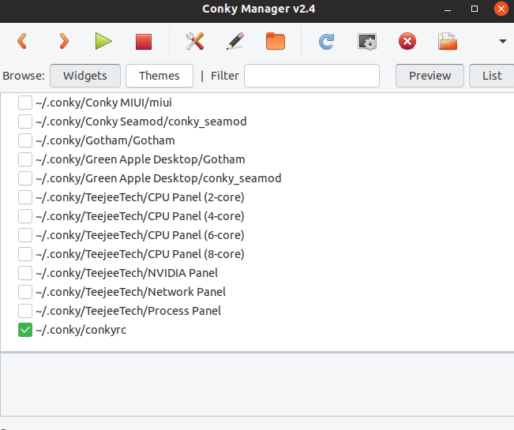
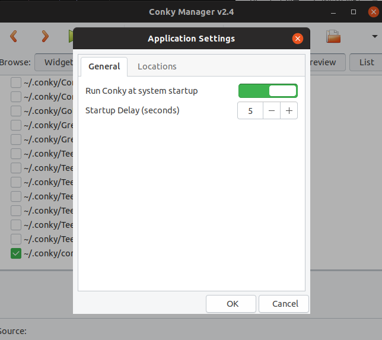

Conky是一款图形界面的美化工具。通过它我们可以实时的监测到系统的GPU温度，占用，CPU温度，占用，磁盘使用量等系统信息。它也内置了时钟，天气，RSS订阅和邮件监测等控件哦。感兴趣的小伙伴可以深入研究一下。

本文将介绍如何在Ubuntu上安装conky、conky-manager。

并且给出了我的比较简单的一个配置文件

<!--more-->

我实现的效果如下：


下面将介绍如何安装和配置

## 一.下载 conky-manager

点击[下载](https://www.xuhuiblog.cn/projects/)conky-manager

## 二.安装conky-manager

```bash
chmod +x conky-manager-v2.4-amd64.run
sudo ./conky-manager-v2.4-amd64.run
sudo apt-get install if
```

## 三.安装conky

```bash
sudo apt-get install conky-all
```

## 四.写入配置文件

```bashi
vim ~/.conky/conkyrc
```

将以下内容写入

**PS**部分配置需安装Nvidia显卡

```
use_spacer right
use_xft yes
font Microsoft YaHei:size=8
xftfont Microsoft YaHei:size=8
override_utf8_locale yes
update_interval 1.0
own_window yes
own_window_type desktop
own_window_transparent no
#own_window_hints undecorated,below,sticky,skip_taskbar,skip_pager
own_window_argb_visual yes
own_window_argb_value 94
double_buffer yes
minimum_size 206 5
maximum_width 400
draw_shades yes
draw_outline no
draw_borders no
draw_graph_borders no
default_color ffffff
default_shade_color 000000
default_outline_color 000000
alignment top_right
gap_x 6
gap_y 33
cpu_avg_samples 2
uppercase no # set to yes if you want all text to be in uppercase

own_window_colour 000000
TEXT
${font Microsoft YaHei:style=Bold:pixelsize=22}${alignc}${time %H:%M:%S}
${font Microsoft YaHei:pixelsize=16}${alignc}${time %b%d日星期%a}${alignc}
${color #ffa200}${hr 2}
${font Microsoft YaHei:pixelsize=12}
${color #00ffcf}主机名:${color #00ffcf}$alignr$nodename
${color #00ffcf}用户名:${color #00ffcf}$alignr${exec whoami}
${color #00ffcf}内核版本:${color #00ffcf}$alignr$kernel
${color #00ffcf}显卡版本:${color #00ffcf}$alignr${exec nvidia-smi -q|grep "Product Name"|cut -d ":" -f2}
${color #00ffcf}驱动版本:${color #00ffcf}$alignr${exec nvidia-smi -q|grep "Driver Version"|cut -d ":"  -f2}
${color #00ffcf}已运行时间:${color #00ffcf}$alignr$uptime
${color #ffd700}${stippled_hr 1}
${font Microsoft YaHei:pixelsize=12}
${color #00ff1e}GPU温度:${color #00ff1e}$alignr ${exec nvidia-smi -q|grep "GPU Current Temp"|cut -d ":" -f2|cut -d " " -f2}°C
${color #00ff1e}GPU使用:${color #00ff1e}$alignr ${exec nvidia-smi -q|grep "Used  "|head -n 1|cut -d ":" -f2|cut -d " " -f2}/${exec exec nvidia-smi -q|grep "Total  "|head -n 1|cut -d ":" -f2}
${color #00ff1e}CPU温度:$alignr$acpitemp°C
${color #00ff1e}CPU使用:$alignr${cpu}%
${color #dcff82}${cpubar}
${color #00ff1e}进程名$alignr占用比
${color #ddaa00} ${top name 1}$alignr${top cpu 1}%
${color lightgrey} ${top name 2}$alignr${top cpu 2}%
${color lightgrey} ${top name 3}$alignr${top cpu 3}%
${color lightgrey} ${top name 4}$alignr${top cpu 4}%
${color lightgrey} ${top name 5}$alignr${top cpu 5}%
${color #ffd700}${stippled_hr 1}$color
${font Microsoft YaHei:pixelsize=12}
${color #00ff1e}内存使用: $alignr $mem/${color #db7093}$memperc%
${color #78af78}${membar 8}
${color #00ff1e}交换空间: $alignr $swap/${color #db7093}$swapperc%
${color #78af78}${swapbar 8}
${color #00ff1e}进程名: $alignr 占用比
${color #ddaa00} ${top_mem name 1}$alignr ${top_mem mem 1}%
${color lightgrey} ${top_mem name 2}$alignr ${top_mem mem 2}%
${color lightgrey} ${top_mem name 3}$alignr ${top_mem mem 3}%
${color lightgrey} ${top_mem name 4}$alignr ${top_mem mem 4}%
${color lightgrey} ${top_mem name 5}$alignr ${top_mem mem 5}%
${color #ffd700}${stippled_hr 1}$color
${font Microsoft YaHei:pixelsize=12}
${color #00ff1e}硬盘读取速度:${alignr}${diskio_read}/s
${color #00ff1e}硬盘写入速度:${alignr}${diskio_write}/s
${color #00ff1e}/ 分区: ${color}${alignr}${fs_used /}/ ${fs_size /}
${color #78af78}${fs_bar 8 /}
${color #00ff1e}/boot 分区: ${color}${alignr}${fs_used /boot}/ ${fs_size /boot}
${color #78af78}${fs_bar 8 /boot}
${color #00ff1e}/home 分区: ${color}${alignr}${fs_used /home}/ ${fs_size /home}
${color #78af78}${fs_bar 8 /home}
${color #ffd700}${stippled_hr 1}$color
${font Microsoft YaHei:pixelsize=12}
${color #00ff1e}有线网络 $alignr ${color #00ff1e}IP地址: ${color DDAA00}${addr enp4s0}
${voffset 1}${color #98c2c7} 上传: ${color #db7093}${upspeed enp4s0}/s ${alignr}${color #98c2c7}总共: ${color #db7093}${totalup enp4s0}
${voffset 1}${color #98c2c7} 下载: ${color #ddaa00}${downspeed enp4s0}/s ${alignr}${color #98c2c7}总共: ${color #ddaa00}${totaldown enp4s0}
${color #ffd700}${stippled_hr 1}$color
${color #00ff1e}无线网络 $alignr ${color #00ff1e}IP地址: ${color DDAA00}${addr wlp5s0}
${voffset 1}${color #98c2c7} 上传: ${color #db7093}${upspeed wlp5s0}/s ${alignr}${color #98c2c7}总共: ${color #db7093}${totalup wlp5s0}
${voffset 1}${color #98c2c7} 下载: ${color #ddaa00}${downspeed wlp5s0}/s ${alignr}${color #98c2c7}总共: ${color #ddaa00}${totaldown wlp5s0}
${color #ffa200}${hr 2}

```

wq保存退出

## 五.创建软连接

```bash
sudo ln -s .conkyrc ~/.aria2/conkyrc
```

## 六.打开conky-manager软件

勾选刚刚写好的配置文件并点击绿三角加载



如果大小不合适，请修改部分参数。

## 七.设置开机延迟启动

在右边小三角的settings里



# 附：

### conky配置说明书

```
名称
conky - 最初基于躯干代码的X系统监视器，但更多的kickass。它只是继续给予它。是啊。

概要
conky [ options ]

描述
Conky是最初基于torsmo的X系统监视器。自成立以来，Conky已经与其前身发生了显着变化，同时保持了简洁性和可配置性。Conky可以在您的根桌面或自己的窗口中显示任何内容。Conky不仅有许多内置对象，它还可以通过脚本和其他外部程序显示任何信息。

Conky拥有超过250个内置对象，包括支持过多的操作系统统计数据（uname，正常运行时间，CPU使用率，内存使用情况，磁盘使用率，“顶级”，如进程统计数据和网络监控，仅举几例），内置在IMAP和POP3的支持下，内置支持许多流行音乐播放器（MPD，XMMS2，BMPx，Audacious）等等。Conky可以将这些信息显示为文本，或使用简单的进度条和图形小部件，以及不同的字体和颜色。

我们一直在寻求帮助，无论是报告错误，编写补丁还是编写文档。如果您有任何疑问或想要贡献，请使用SourceForge上的工具来制作错误报告，功能请求和提交补丁，或者通过irc.freenode.net上的#conky停止。

感谢您对Conky的兴趣。

编译
对于从二进制发行版上的源代码编译的用户，请确保安装了X开发库（除非您使用“--disable-x11”提供configure）。对于X11库，这应该是“libx11-dev”或“xorg-x11-dev”的包，对于其他所需的库，它应该是类似的“-dev”格式（取决于你的配置选项）。您应该能够通过阅读从“./configure”获得的错误来查看需要安装的额外软件包。您可以通过提供配置选项来启用/禁用内容，但要小心禁用。例如：使用--disable-math，您将不会出现错误，但对数图将是正常的图形，并且仪表将错过它们的线。

Conky已经（在一段时间内）可以在最流行的发行版的存储库中使用。以下是一些安装说明：

Gentoo用户 - Conky在Gentoo的Portage中......只需使用“emerge app-admin / conky”进行安装。

Debian等用户 - Conky应该在您的存储库中，并且可以通过“aptitude install conky”来安装。

使用所有可选组件编译和运行Conky的示例（请注意，某些配置选项可能因系统而异）：

sh autogen.sh # Only required if building from the git repo
./configure --prefix=/usr --mandir=/usr/share/man --infodir=/usr/share/info --datadir=/usr/share --sysconfdir=/etc --localstatedir=/var/lib --disable-own-window --enable-audacious[=yes|no|legacy] --enable-bmpx --disable-hddtemp --disable-mpd --enable-xmms2 --disable-portmon --disable-network --enable-debug --disable-x11 --disable-double-buffer --disable-xdamage --disable-xft
make
make install # Optional
src/conky
Conky已经过测试，可以与C99 C兼容，但是它没有经过gcc以外的任何测试，并且不能保证与其他编译器一起使用。

 

你应该知道
Conky通常对资源非常好。也就是说，你尝试使Conky做的越多，它将消耗的资源就越多。

迫使Conky重新加载〜/ .conkyrc的简单方法：“killall -SIGUSR1 conky”。为您省去必须杀死然后重新启动的麻烦。您现在也可以使用SIGHUP执行相同的操作。

选项
命令行选项会覆盖配置文件中定义的配置。

-v | -V | --version
打印版本和退出
 

-q | --quiet
以“安静模式”运行Conky（即无输出）
 

-D | --debug
增加调试输出，即。-DD用于更多调试
 

-a | --alignment= ALIGNMENT
屏幕上的文字对齐方式，{top，bottom，middle} _ {left，right，middle}或none。也可以缩写为第一个位置字符，即。tr for top_right。
 

-b | --double-buffer
使用双缓冲（消除“闪烁”）
 

-c | --config= FILE
要加载的配置文件而不是$ HOME / .conkyrc
 

-C | --print-config
将内置的默认配置打印到stdout。有关更多信息，另请参见示例部分。
 

-d | --daemonize
Daemonize Conky，又名叉到背景
 

-f | --font= FONT
要使用的字体
 

-h | --help
打印命令行帮助和退出
 

-o | --own-window
创建自己的绘图窗口
 

-t | --text= TEXT
要渲染的文字，请记住单引号，例如-t'$ uptime'
 

-p | --pause= SECONDS
在实际开始Conky之前暂停的时间
 

-u | --interval= SECONDS
更新间隔
 

-w | --window-id= WIN_ID
要绘制的窗口ID
 

-X | --display= DISPLAY
X11显示使用
 

-x X_COORDINATE
X位置
 

-y Y_COORDINATE
Y位置
 

-i COUNT
更新Conky（和退出）的次数
 

配置设置
默认配置文件位置是$ HOME / .conkyrc或$ {sysconfdir} /conky/conky.conf。在大多数系统上，sysconfdir是/ etc，你可以在那里找到示例配置文件（/etc/conky/conky.conf）。

您可能希望将其复制到$ HOME / .conkyrc，然后开始修改它。其他配置可以在http://conky.sf.net/找到

TEXT
在此之后开始在屏幕上格式化文本。反斜杠（\）转义文本部分中的换行符。这对于清理配置文件很有用，其中conky用于管道输入到dzen2。
 

alignment
屏幕上的对齐位置，可以是top_left，top_right，top_middle，bottom_left，bottom_right，bottom_middle，middle_left，middle_middle，middle_right或none（也可以缩写为tl，tr，tm，bl，br，bm，ml，mm，mr ）。另请参见gap_x和gap_y。
 

append_file
附加作为参数给出的文件。
 

background
布尔值，如果为true，Conky将在启动时分叉到后台。
 

border_inner_margin
内边框边距（以像素为单位）（边框与文本之间的边距）。
 

border_outer_margin
外边框边距（以像素为单位）（边框与窗口边缘之间的边距）。
 

border_width
边框宽度（像素）。
 

colorN
预定义在TEXT段内使用的颜色。用0到9之间的数字代替N，包括在内。以十六进制指定颜色值时，请省略前导散列（＃）。
 

cpu_avg_samples
CPU监视的平均样本数。
 

default_bar_size
指定条形的默认宽度和高度。示例：'default_bar_size 0 6'。这对execbar和execibar特别有用，因为它们不接受大小参数。
 

default_color
默认颜色和边框颜色
 

default_gauge_size
指定仪表的默认宽度和高度。示例：'default_gauge_size 25 25'。这对execgauge和execigauge特别有用，因为它们不接受大小参数
 

default_graph_size
指定图形的默认宽度和高度。示例：'default_graph_size 0 25'。这对于execgraph和execigraph特别有用，因为它们不接受大小参数
 

default_outline_color
默认轮廓颜色
 

default_shade_color
默认着色颜色和边框的着色颜色
 

disable_auto_reload
启用以禁用基于inotify的自动配置重新加载功能。
 

diskio_avg_samples
磁盘I / O监视的平均样本数。
 

display
指定要连接的X显示。
 

double_buffer
使用Xdbe扩展？（消除闪烁）强烈建议使用自己的窗口，因此双缓冲区不会那么大。
 

draw_borders
在文字周围画边框？
 

draw_graph_borders
在图表周围绘制边框？
 

draw_outline
画出轮廓？
 

draw_shades
画出阴影？
 

extra_newline
在写入stdout时最后添加一个换行符，这对写入awesome的wiboxes非常有用。
 

font
X中的字体名称，xfontsel可用于获得漂亮的字体
 

format_human_readable
如果启用，将以人类可读格式（即KiB，MiB等）打印以字节为单位的值。如果禁用，则打印字节数。
 

gap_x
屏幕右边界或左边界之间的间距（以像素为单位），与在命令行中传递-x相同，例如gap_x 10.对于其他与位置相关的内容，请参阅“对齐”。
 

gap_y
屏幕顶部或底部边框之间的间隙（以像素为单位），与在命令行传递-y相同，例如gap_y 10.对于其他与位置相关的内容，请参阅“对齐”。
 

hddtemp_host
要连接到hddtemp对象的主机名。默认为“127.0.0.1”。
 

hddtemp_port
用于hddtemp连接的端口。默认为7634。
 

if_up_strictness
在测试接口启动时if_up应该有多严格？该值是up，link或address之一，用于检查接口是否单独启动，正在启动并具有链接或正在启动，具有链接和分配的IP地址。
 

imap
默认的全局IMAP服务器。参数是：“主机用户传递[-i interval（以秒为单位）] [ - f'文件夹'] [-p port] [-e'命令'] [-r retries]”。默认端口为143，默认文件夹为“INBOX”，默认间隔为5分钟，放弃前默认重试次数为5.如果密码以“*”提供，则Conky启动时将提示您输入密码。
 

imlib_cache_flush_interval
刷新Imlib2缓存的间隔（以秒为单位）。
 

imlib_cache_size
Imlib2图像缓存大小，以字节为单位。默认为4MiB。如果使用$ image批次，请增加此值。设置为0以禁用图像缓存。
 

lua_draw_hook_post function_name [function arguments]
如果定义了此函数，Conky将在绘制到窗口后通过每次迭代调用。需要X支持。采用任意数量的可选参数。使用这个钩子来绘制Conky绘制的东西。Conky将'conky_'放在function_name前面以防止意外调用错误的函数，除非你自己在它前面放置'conky_'。
 

lua_draw_hook_pre function_name [function arguments]
如果定义了此函数，Conky将在绘制到窗口之前通过每次迭代调用。需要X支持。采用任意数量的可选参数。使用这个钩子来绘制Conky绘制的东西。Conky将'conky_'放在function_name前面以防止意外调用错误的函数，除非你自己在它前面放置'conky_'。
 

lua_load
加载由空格分隔的Lua脚本。
 

lua_shutdown_hook function_name [function arguments]
如果定义了此函数，Conky将在关闭时或重新加载配置时调用此函数。使用此挂钩自行清理，例如释放由外部库通过Lua分配的内存。Conky将'conky_'放在function_name前面以防止意外调用错误的函数，除非你自己在它前面放置'conky_'。
 

lua_startup_hook function_name [function arguments]
如果定义了此函数，Conky将在启动时或重新加载配置时调用此函数。使用此挂钩初始化值或任何一次性运行应用程序。Conky将'conky_'放在function_name前面以防止意外调用错误的函数，除非你自己在它前面放置'conky_'。
 

mail_spool
邮件检查的邮件短管轴
 

max_port_monitor_connections
允许每个端口监视器最多跟踪这么多连接（如果为0或未设置，则默认为256）
 

max_specials
特殊事物的最大数量，例如字体，偏移，对齐等（默认为512）
 

max_text_width width
当输出中的一行包含'width'字符并且未到达结尾时，下一个字符将从新行开始。如果要确保线条不被破坏，请将“width”设置为0
 

max_user_text bytes
用户文本缓冲区的最大大小，即配置文件中TEXT行下面的布局（默认为16384字节）
 

maximum_width pixels
最大窗口宽度
 

minimum_size width (height)
最小窗口大小
 

mpd_host
MPD服务器的主机
 

mpd_password
MPD服务器密码
 

mpd_port
MPD服务器端口
 

music_player_interval
音乐播放器线程更新间隔（默认为Conky的更新间隔）
 

net_avg_samples
净数据的平均样本数
 

no_buffers
从已用内存中减去（文件系统）缓冲区？
 

nvidia_display
nvidia变量将使用的显示（默认为显示变量的值）
 

out_to_console
将文本打印到标准输出。
 

out_to_ncurses
在控制台中打印文本，但使用ncurses，以便conky可以在旧文本上打印新更新的文本。（将来这将提供更多有用的东西）
 

out_to_stderr
将文本打印到stderr。
 

out_to_x
设置为no时，X中将没有输出（当您还使用out_to_console之类的东西时很有用）。如果将其设置为no，请确保将其置于所有其他与X相关的设置之前（确保配置文件的第一行）。默认值为是
 

override_utf8_locale
强制UTF8？需要XFT
 

overwrite_file
覆盖作为参数给出的文件。
 

own_window
布尔值，创建自己绘制的窗口？
 

own_window_class
手动设置WM_CLASS名称。默认为“Conky”。
 

own_window_colour colour
如果own_window_transparent为no，则设置指定的背景颜色（默认为黑色）。采用十六进制值（例如ffffff，注意缺少'＃'）或有效的RGB名称（请参阅/usr/lib/X11/rgb.txt）
 

own_window_hints undecorated,below,above,sticky,skip_taskbar,skip_pager
如果own_window为yes，您可以使用这些窗口管理器提示来影响Conky显示的方式。注意：使用own_window_type桌面作为隐式实现许多这些提示的另一种方式。如果使用own_window_type覆盖，则窗口管理器提示没有意义并被忽略。
 

own_window_title
手动设置窗口名称。默认为“<hostname> - conky”。
 

own_window_argb_visual
布尔值，使用ARGB visual？ARGB可用于实现真正的透明度，请注意，复合管理器是真正透明度所必需的。此选项与“own_window_type override”结合使用时（在大多数情况下）不起作用。
 

own_window_argb_value
启用ARGB视觉效果时，使用此选项可修改使用的Alpha值。有效范围是0-255，其中0是0％不透明度，255是100％不透明度。
 

own_window_transparent
布尔值，设置透明度？如果启用了ARGB visual，则将背景不透明度设置为0％。
 

own_window_type
如果own_window为yes，则可以指定type normal，desktop，dock，panel或override（默认值：normal）。桌面窗户是没有窗户装饰的特殊窗户; 始终可以在桌面上看到; 不会出现在您的寻呼机或任务栏中; 并且在所有工作区都很粘。面板窗口沿桌面边缘保留空间，就像面板和任务栏一样，防止最大化的窗口重叠它们。根据对齐选项选择边缘。覆盖窗口不受窗口管理器的控制。提示被忽略。这种类型的窗口对某些情况很有用。
 

pad_percents
将百分比填充到这么多小数（0 =无填充）
 

pop3
默认全局POP3服务器。参数是：“主机用户传递[-i interval（以秒为单位）] [ - p port] [-e'命令'] [-r retries]”。默认端口为110，默认间隔为5分钟，放弃前的默认重试次数为5.如果密码以“*”提供，则在Conky启动时将提示您输入密码。
 

short_units
将单位缩短为单个字符（kiB-> k，GiB-> G等）。默认为关闭。
 

show_graph_range
显示图表所涵盖的时间范围。
 

show_graph_scale
显示缩放图形中的最大值。
 

stippled_borders
边框点画（划线），以像素为单位
 

temperature_unit
显示温度的所有对象的所需输出单位。参数是“华氏度”或“摄氏度”。默认单位是摄氏度。
 

templateN
定义模板以供以后在TEXT段内使用。用0到9之间的数字代替N，包括在内。变量的值被插入到相应位置的TEXT下面的东西中，但是在应用某些替换之前：
'\ n' - >换行符
'\\' - >反斜杠
'\' - >空间
'\ N' - >模板参数N.
 

text_buffer_size bytes
标准文本缓冲区的大小（默认为256字节）。此缓冲区用于中间文本，例如单个行，$ exec变量的输出以及各种其他变量。增加此缓冲区的大小可以大大降低Conky的性能，但允许每个变量显示更多文本。此缓冲区的大小不能小于256字节的默认值。
 

times_in_seconds
如果为true，则输出时间的变量输出表示秒的数字。这不会影响$ time，$ tztime和$ utime
 

top_cpu_separate
如果为true，则top中的cpu将显示一个处理器的功率使用情况。如果为false，则top中的cpu将显示所有处理器功率组合的使用情况。
 

top_name_width
$ top name值的宽度（默认为15个字符）。
 

total_run_times
Conky在退出前更新的总次数。Zero让Conky永远奔跑
 

update_interval seconds
更新间隔
 

update_interval_on_battery seconds
在batterypower上运行时更新间隔
 

uppercase
布尔值，如果为true，则以大写形式呈现文本
 

use_spacer
在某些对象周围添加空格以阻止它们移动其他东西。参数是left，right和none（默认）。旧的true / false值已弃用，默认分别为right / none。请注意，这只有在使用单字体时才有用，例如Bitstream Vera Sans Mono。
 

use_xft
使用Xft（抗锯齿字体和东西）
 

xftalpha
Xft字体的Alpha。必须是1到0之间的值。
 

xftfont
要使用的Xft字体。
 

对象/变量
使用XParsecolor（）解析颜色，可能有一个列表：/usr/share/X11/rgb.txt。颜色也可以是#rrggbb格式（十六进制）。

有些对象可能会创建线程，有时这些线程在Conky终止之前不会被销毁。在Conky运行时无法销毁或清理线程。例如，如果使用MPD变量，MPD线程将继续运行，直到Conky死亡。一些线程对象将使用其中一个参数作为“键”，因此您只有一个相关的线程在运行（例如，$ curl，$ rss和$ weather对象为每个URI启动一个线程）。

acpiacadapter (adapter)
ACPI交流适配器状态。在linux上，适配器选项指定包含状态信息的/ sys / class / power_supply的子文件夹（如果没有给出参数，则尝试“AC”和“ADP1”）。非Linux系统忽略它。
 

acpifan
ACPI风扇状态
 

acpitemp
ACPI温度用C表示。
 

addr (interface)
接口的IP地址，如果未分配地址，则为“无地址”。
 

addrs (interface)
接口的IP地址（如果有的话 - 就像addr一样工作）。仅限Linux。
 

adt746xcpu
CPU温度来自therm_adt746x
 

adt746xfan
风扇速度来自therm_adt746x
 

alignc (num)
将文本与中心对齐
 

alignr (num)
右对齐文本，空格为N.
 

apcupsd host port
设置与apcupsd守护程序的连接。什么都不打印，默认为localhost：3551
 

apcupsd_cable
打印UPS连接类型。
 

apcupsd_charge
目前的电池容量百分比。
 

apcupsd_lastxfer
最后一次从线路转移到电池的原因。
 

apcupsd_linev
标称输入电压。
 

apcupsd_load
当前负载百分比。
 

apcupsd_loadbar
栏显示当前负载。
 

apcupsd_loadgauge (height),(width)
显示当前负载的仪表。
 

apcupsd_loadgraph (height),(width) (gradient colour 1) (gradient colour 2) (scale) (-t) (-l)
当前负载的历史图表。
 

apcupsd_model
打印UPS的型号。
 

apcupsd_name
打印UPS用户定义的名称。
 

apcupsd_status
打印当前状态（在线，电池供电）。
 

apcupsd_temp
目前的内部温度。
 

apcupsd_timeleft
剩下的时间用电池运行了。
 

apcupsd_upsmode
打印UPS模式（例如，独立）。
 

apm_adapter
显示APM AC适配器状态（仅限FreeBSD）
 

apm_battery_life
以百分比显示APM电池寿命（仅限FreeBSD）
 

apm_battery_time
如果AC适配器状态在线或正在充电，则显示剩余的APM电池寿命，单位为hh：mm：ss或“unknown”（仅限FreeBSD）
 

audacious_bar (height),(width)
进度条
 

audacious_bitrate
比特率的当前曲调
 

audacious_channels
当前音调的音频通道数
 

audacious_filename
当前曲调的完整路径和文件名
 

audacious_frequency
当前音调的采样频率
 

audacious_length
当前曲调的总长度为MM：SS
 

audacious_length_seconds
当前曲调的总长度，以秒为单位
 

audacious_main_volume
目前的音量来自Audacious
 

audacious_playlist_length
播放列表中的曲调数量
 

audacious_playlist_position
当前曲调的播放列表位置
 

audacious_position
电流调谐的位置（MM：SS）
 

audacious_position_seconds
当前曲调的位置以秒为单位
 

audacious_status
播放器状态（播放/暂停/停止/未运行）
 

audacious_title (max length)
具有可选最大长度说明符的当前曲调的标题
 

battery (num)
ACPI或APM电池的电池状态和剩余百分比容量。ACPI电池编号可以作为参数给出（默认为BAT0）。
 

battery_bar (height),(width) (num)
条形图中ACPI电池的剩余电量百分比。ACPI电池编号可以作为参数给出（默认为BAT0）。
 

battery_percent (num)
ACPI电池的剩余电量百分比。ACPI电池编号可以作为参数给出（默认为BAT0）。
 

battery_short (num)
ACPI或APM电池的电池状态和剩余百分比容量。ACPI电池编号可以作为参数给出（默认为BAT0）。此模式显示短暂状态，表示显示C而不是充电，D表示放电，F表示已满，N表示不存在，E表示空，U表示未知。
 

battery_time (num)
ACPI电池剩余电池充电/放电时间。ACPI电池编号可以作为参数给出（默认为BAT0）。
 

blink text_and_other_conky_vars
让'text_and_other_conky_vars'闪烁。
 

bmpx_album
当前BMPx曲目中的专辑
 

bmpx_artist
当前BMPx曲目中的艺术家
 

bmpx_bitrate
当前BMPx轨道的比特率
 

bmpx_title
当前BMPx曲目的标题
 

bmpx_track
跟踪当前BMPx轨道的编号
 

bmpx_uri
当前BMPx轨道的URI
 

buffers
缓冲的内存量
 

cached
缓存的内存量
 

cmdline_to_pid string
在其命令行中包含字符串的第一个进程的PID
 

color (color)
将绘图颜色更改为“颜色”，这是一个颜色的名称或以＃开头的十六进制代码（例如＃0A1B2C）。如果使用ncurses，则仅支持以下颜色：红色，绿色，黄色，蓝色，品红色，青色，黑色，白色。
 

colorN
将绘图颜色更改为colorN配置选项，其中N是介于0和9之间的数字，包括在内。
 

combine var1 var2
将var2的行放在var1行的右侧，由var1和var2之间的字符分隔。例如：$ {combine $ {head / proc / cpuinfo 2} - $ {head / proc / meminfo 1}}在第1行输出“cpuinfo_line1 - meminfo_line1”，在第2行输出“cpuinfo_line2 - ”。$ combine vars can也可以嵌套以将更多的变量放在彼此旁边。
 

conky_build_arch
CPU架构Conky是为其而构建的
 

conky_build_date
日期Conky建成
 

conky_version
Conky版
 

cpu (cpuN)
CPU使用率百分比。对于SMP机器，可以提供CPU编号作为参数。$ {cpu cpu0}是总使用量，$ {cpu cpuX}（X> = 1）是单独的CPU。
 

cpubar (cpuN) (height),(width)
显示CPU使用率的栏，高度是栏的高度（以像素为单位）。有关SMP的更多信息，请参阅$ cpu。
 

cpugauge (cpuN) (height),(width)
显示CPU使用率，高度和宽度的椭圆仪表分别是仪表的垂直和水平轴。有关SMP的更多信息，请参阅$ cpu。
 

cpugraph (cpuN) (height),(width) (gradient colour 1) (gradient colour 2) (scale) (-t) (-l)
CPU使用率图，可选颜色以十六进制表示，减去＃。有关SMP的更多信息，请参阅$ cpu。使用-l开关时，使用对数刻度（查看小数字）。采用开关'-t'来使用温度梯度，这使得梯度值根据特定图值的幅度而变化（试一试）。
 

curl url (interval_in_minutes)
使用Curl以指定的时间间隔从URI下载数据。间隔可以是大于0的浮点值，否则默认为15分钟。与Lua和Lua API一起使用时最有用。该对象是线程化的，一旦创建了一个线程，就无法显式地销毁它。将为指定的每个URI运行一个线程。您可以使用Curl支持的任何协议。

desktop
如果是这种情况，运行conky的桌面的编号或消息“未在X中运行”。
 

desktop_name
如果是这种情况，运行conky的桌面的名称或消息“未在X中运行”。
 

desktop_number
如果是这种情况，桌面数量或消息“未在X中运行”。
 

disk_protect device
磁盘保护状态，如果支持（需要内核补丁）。打印“冻结”或“自由”（注意填充）。
 

diskio (device)
显示当前磁盘IO。设备是可选的，采用/ dev / sda的sda形式。允许个别分区。
 

diskio_read (device)
显示读取的当前磁盘IO。设备与磁盘一样。
 

diskio_write (device)
显示写入的当前磁盘IO。设备与磁盘一样。
 

diskiograph (device) (height),(width) (gradient colour 1) (gradient colour 2) (scale) (-t) (-l)
磁盘IO图，以十六进制定义的颜色减去＃。如果比例不为零，则它将成为图表的比例。使用-l开关时使用对数刻度（查看小数字）。采用开关'-t'来使用温度梯度，这使得梯度值根据特定图值的幅度而变化（试一试）。
 

diskiograph_read (device) (height),(width) (gradient colour 1) (gradient colour 2) (scale) (-t) (-l)
读取的磁盘IO图，以十六进制定义的颜色，减去＃。如果比例不为零，则它将成为图表的比例。设备与磁盘一样。使用-l开关时使用对数刻度（查看小数字）。采用开关'-t'来使用温度梯度，这使得梯度值根据特定图值的幅度而变化（试一试）。
 

diskiograph_write (device) (height),(width) (gradient colour 1) (gradient colour 2) (scale) (-t) (-l)
写入的磁盘IO图，以十六进制定义的颜色减去＃。如果比例不为零，则它将成为图表的比例。设备与磁盘一样。使用-l开关时使用对数刻度（查看小数字）。采用开关'-t'来使用温度梯度，这使得梯度值根据特定图值的幅度而变化（试一试）。
 

downspeed (net)
以合适的IEC单位下载速度
 

downspeedf (net)
下载速度为KiB，小数点后一位
 

downspeedgraph (netdev) (height),(width) (gradient colour 1) (gradient colour 2) (scale) (-t) (-l)
下载速度图，以十六进制定义的颜色减去＃。如果比例不为零，则它将成为图表的比例。使用-l开关时使用对数刻度（查看小数字）。采用开关'-t'来使用温度梯度，这使得梯度值根据特定图值的幅度而变化（试一试）。
 

draft_mails (maildir) (interval)
如果没有，则在指定邮箱或邮件假脱机中标记为草稿的邮件数。仅支持maildir类型的邮箱，mbox类型将返回-1。
 

else
如果上述任何一个不正确，则显示文本
 

endif
结束$ if块。
 

entropy_avail
当前熵可用于加密怪胎
 

entropy_bar (height),(width)
加密怪胎的可用熵的标准化条
 

entropy_perc
与池化相比可用的熵百分比
 

entropy_poolsize
加密怪胎系统熵池的总大小
 

eval string
根据TEXT解释的规则评估给定的字符串，即将任何包含的文本对象规范解析为其输出，将任何出现的“$$”解析为单个“$”等等。然后再次解析输出。
 

eve api_userid api_key character_id
从Eve Online API服务器（http://www.eve-online.com/）获取您当前的培训技能，并显示技能以及剩余的培训时间。
 

exec command
执行shell命令并以conky显示输出。警告：这比其他变量需要更多的资源。我建议在C中编写想要的行为并发布补丁。
 

execbar command
与exec相同，除非第一个值返回值介于0-100之间，否则它将使用该数字作为条形。条形图的大小可以通过default_bar_size配置设置进行控制。
 

execgauge command
与exec相同，除非返回的第一个值是介于0-100之间的值，否则它将使用该数字作为量表。可以通过default_gauge_size配置设置控制仪表的大小。
 

execgraph (-t) (-l) command
与execbar相同，但是图表值。给出日志选项（-l开关）时使用logaritmic scale（查看小数字）。值仍然必须介于0和100之间。图形的大小可以通过default_graph_size配置设置进行控制。采用开关'-t'来使用温度梯度，这使得梯度值根据特定图值的幅度而变化（试一试）。如果-t或-l是您的第一个参数，则可能需要在其前面加一个空格（''）。
 

execi interval command
与exec相同但具有特定间隔。Interval不能小于配置中的update_interval。另见$ texeci
 

execibar interval command
与execbar相同，除了间隔
 

execigauge interval command
与execgauge相同，但采用间隔arg和gauges值。
 

execigraph interval (-t) (-l) command
与execgraph相同，但采用间隔arg和图形值。如果-t或-l是您的第一个参数，则可能需要在其前面加一个空格（''）。
 

execp command
执行shell命令并以conky显示输出。警告：这比其他变量需要更多的资源。我建议在C中编写想要的行为并发布补丁。这与$ exec的不同之处在于它解析命令的输出，因此您可以在脚本中插入诸如$ {color red} hi！$ {color}之类的内容并让它由Conky正确解析。注意事项：每次Conky循环时，Conky会解析并评估$ execp的输出，然后销毁所有对象。如果你尝试在$ execp语句中使用$ execi之类的东西，它将在$ execp语句运行的相同间隔运行，因为它是在每个时间间隔创建和销毁的。
 

execpi interval command
与execp相同但具有特定间隔。Interval不能小于配置中的update_interval。请注意，$ execpi命令的输出仍然会在每个时间间隔进行解析和评估。
 

flagged_mails (maildir) (interval)
如果没有，则在指定邮箱或邮件假脱机中标记为标记的邮件数。仅支持maildir类型的邮箱，mbox类型将返回-1。
 

font (font)
指定其他字体。此新字体将应用于当前行和后续所有内容。您可以使用不带参数的$ font更改回默认字体（非常类似于$ color）
 

format_time seconds format
格式化时间以秒为单位。此var仅在times_in_seconds配置设置打开时有效。Format是一个字符串，应该以“-char开头和结尾。”-chars不是输出的一部分，\ w，\ d，\ h，\ m，\ s，\（，\）和\\是取而代之的是周，天，小时，分钟，秒，（，）和\。如果你遗漏一个单位，它的价值将表示为最高的单位低于剩下的单位。如果此文本中的替换单位为0，则（）-chars之间的文本将不可见。如果秒是十进制数，则可以通过使用\ S后跟一个指定后面数字位数的数字来查看该点后面的数字你想看到的点（最多9个）。您还可以在\ S后面放置一个'x'，这样您就可以在点后面找到所有数字，而不会有尾随零。（最多9个）
 

forwarded_mails (maildir) (interval)
标记为在指定邮箱或邮件假脱机中转发的邮件数。仅支持maildir类型的邮箱，mbox类型将返回-1。
 

freq (n)
以MHz为单位返回CPU＃n的频率。CPU从1开始计数。如果省略，则参数默认为1。
 

freq_g (n)
以GHz为单位返回CPU＃n的频率。CPU从1开始计数。如果省略，则参数默认为1。
 

fs_bar (height),(width) fs
显示文件系统上使用了多少空间的栏。height是以像素为单位的高度。fs是该文件系统上的任何文件。
 

fs_bar_free (height),(width) fs
显示文件系统上有多少空间的栏。height是以像素为单位的高度。fs是该文件系统上的任何文件。
 

fs_free (fs)
文件系统上的可用空间可供用户使用。
 

fs_free_perc (fs)
可供用户使用的文件系统上的空闲空间百分比。
 

fs_size (fs)
文件系统大小。
 

fs_type (fs)
文件系统类型。
 

fs_used (fs)
文件系统使用空间。
 

fs_used_perc (fs)
文件系统使用空间的百分比。
 

goto x
下一个元素将打印在位置'x'。
 

gw_iface
显示默认路由的接口或相应的“多个”/“无”。
 

gw_ip
相应地显示默认网关的IP或“多个”/“无”。
 

hddtemp (dev)
显示hddtemp守护程序报告的所选硬盘驱动器的温度。使用hddtemp_host和hddtemp_port为所有hddtemp对象指定主机和端口。如果未给出dev参数，则使用hddtemp守护程序返回的第一个磁盘。
 

head logfile lines (next_check)
显示前N行提供的文本文件。每次'next_check'更新都会检查该文件。如果未提供next_check，则Conky默认为2.可以显示最多30行，或者直到填充文本缓冲区。
 

hr (height)
水平线，高度是以像素为单位的高度
 

hwmon (dev) type n (factor offset)
来自sysfs的Hwmon传感器（Linux 2.6）。如果您只有一个hwmon设备，则可以省略参数dev。参数类型为'in'或'vol'表示电压; '粉丝'意思是粉丝; 'temp'意思是温度。参数n是传感器的编号。请参阅本地计算机上的/ sys / class / hwmon /。可选参数'factor'和'offset'允许预先计算原始输入，该输入被修改如下：'input = input * factor + offset'。请注意，它们必须以十进制值的形式给出（即包含至少一个小数位）。
 

i2c (dev) type n (factor offset)
来自sysfs的I2C传感器（Linux 2.6）。如果只有一个I2C设备，则可以省略参数dev。参数类型为'in'或'vol'表示电压; '粉丝'意思是粉丝; 'temp'意思是温度。参数n是传感器的编号。请参阅本地计算机上的/ sys / bus / i2c / devices /。可选参数'factor'和'offset'允许预先计算原始输入，该输入被修改如下：'input = input * factor + offset'。请注意，它们必须以十进制值的形式给出（即包含至少一个小数位）。
 

i8k_ac_status
如果为Inspiron笔记本电脑运行i8k内核驱动程序，则显示交流电源是否打开，如/ proc / i8k中所列（转换为人类可读）。请注意，默认情况下，这不是由i8k本身启用的。
 

i8k_bios
如果为Inspiron笔记本电脑运行i8k内核驱动程序，则显示/ proc / i8k中列出的BIOS版本。
 

i8k_buttons_status
如果为Inspiron笔记本电脑运行i8k内核驱动程序，则显示/ proc / i8k中列出的音量按钮状态。
 

i8k_cpu_temp
如果运行Inspiron笔记本电脑的i8k内核驱动程序，则显示cpuius的cpu温度，如/ proc / i8k所报告。
 

i8k_left_fan_rpm
如果为Inspiron笔记本电脑运行i8k内核驱动程序，则以/ proc / i8k中列出的每分钟转数显示左侧风扇的旋转速率。请注意，一些笔记本电脑i8k以相反的顺序报告这些风扇。
 

i8k_left_fan_status
如果为Inspiron笔记本电脑运行i8k内核驱动程序，则显示/ proc / i8k中列出的左侧风扇状态（翻译为人类可读）。请注意，一些笔记本电脑i8k以相反的顺序报告这些风扇。
 

i8k_right_fan_rpm
如果为Inspiron笔记本电脑运行i8k内核驱动程序，则显示正确的风扇转速，单位为/ proc / i8k中列出的每分钟转数。请注意，一些笔记本电脑i8k以相反的顺序报告这些风扇。
 

i8k_right_fan_status
如果为Inspiron笔记本电脑运行i8k内核驱动程序，则显示/ proc / i8k中列出的正确风扇状态（翻译为人类可读）。请注意，一些笔记本电脑i8k以相反的顺序报告这些风扇。
 

i8k_serial
如果为Inspiron笔记本电脑运行i8k内核驱动程序，则显示/ proc / i8k中列出的笔记本电脑序列号。
 

i8k_version
如果为Inspiron笔记本电脑运行i8k内核驱动程序，则显示/ proc / i8k的版本格式。
 

ibm_brightness
如果运行IBM ACPI，则显示笔记本电脑LCD的亮度（0-7）。
 

ibm_fan
如果运行IBM ACPI，则显示风扇速度。
 

ibm_temps N
如果运行IBM ACPI，则显示IBM温度传感器的温度（N = 0..7）传感器0在CPU上，3在GPU上。
 

ibm_volume
如果运行IBM ACPI，则显示由卷键（0-14）控制的“主”卷。
 

iconv_start codeset_from codeset_to
使用GNU iconv将文本从一个代码集转换为另一个代码集。需要使用iconv_stop停止。
 

iconv_stop
停止iconv代码集转换。
 

if_empty (var)
如果conky变量VAR为空，则显示$ if_empty和匹配的$ endif之间的所有内容
 

if_existing file (string)
如果存在FILE，则显示if_existing和匹配的$ endif之间的所有内容。可选的第二个参数检查包含指定字符串的FILE，并打印$ if_existing和匹配的$ endif之间的所有内容。
 

if_gw
如果至少有一个默认网关，则显示$ if_gw和匹配的$ endif之间的所有内容
 

if_match expression
计算给定的布尔表达式，打印$ if_match和匹配的$ endif之间的所有内容，具体取决于评估是否返回true。有效表达式由左侧，操作员和右侧组成。在评估之前，正在为包含的文本对象解析左侧和右侧。公认的左侧和右侧类型是：
double参数仅由数字和单个点组成。
long Argument只包含数字。
string参数用引号括起来（“）有效的操作数是：'>'，'<'，'> ='，'<='，'=='，'！='。
 

if_mixer_mute (mixer)
如果存在调音台，则显示$ if_mixer_mute和匹配的$ endif之间的所有内容。如果未指定混合器，则使用“Vol”。
 

if_mounted (mountpoint)
如果安装了MOUNTPOINT，则显示$ if_mounted和匹配的$ endif之间的所有内容
 

if_mpd_playing
如果mpd正在播放或暂停，则显示$ if_mpd_playing和匹配的$ endif之间的所有内容
 

if_running (process)
如果PROCESS正在运行，则显示所有$ if_running和匹配的$ endif。这使用``pidof''命令，因此也支持-x开关。
 

if_smapi_bat_installed (INDEX)
当使用smapi时，如果安装了索引为INDEX的电池，则显示$ if_smapi_bat_installed和匹配的$ endif之间的所有内容
 

if_up (interface)
如果INTERFACE存在且已启动，则显示$ if_up和匹配的$ endif之间的所有内容
 

if_updatenr (updatenr)
如果它是UPDATENR-conky更新的时间，则显示$ if_updatenr和匹配的$ endif之间的所有内容。达到最高UPDATENR时，计数器将复位。示例：“{$ if_updatenr 1} foo $ endif {$ if_updatenr 2} bar $ endif {$ if_updatenr 4} $ endif”显示foo 25％的时间后，条形码25％的时间后没有任何其他的一半时间。
 

if_xmms2_connected
如果xmms2正在运行，则显示$ if_xmms2_connected和匹配的$ endif之间的所有内容。
 

image <path to image> (-p x,y) (-s WxH) (-n) (-f interval)
从使用Imlib2指定的路径渲染图像。采用4个可选参数：位置，大小，无缓存切换和缓存刷新间隔。更改x，y位置将移动图像的位置，更改WxH将缩放图像。如果指定no-cache标志（-n），则不会缓存图像。或者，您可以指定-f int开关以指定特定图像的缓存时间间隔。示例：$ {image /home/brenden/cheeseburger.jpg -p 20,20 -s 200x200}将'（20,20）的'cheeseburger.jpg'渲染为200x200像素。Conky不会尝试调整图像的位置（或任何其他格式），它们只是根据传递的参数进行渲染。
 

imap_messages (args)
默认情况下显示全局IMAP收件箱中的邮件数。您可以通过将参数传递给此对象来单独定义单个IMAP收件箱。参数是：“主机用户传递[-i interval（以秒为单位）] [ - f'文件夹'] [-p port] [-e'命令'] [-r retries]”。默认端口为143，默认文件夹为“INBOX”，默认间隔为5分钟，放弃前默认重试次数为5.如果密码以“*”提供，则Conky启动时将提示您输入密码。
 

imap_unseen (args)
默认情况下显示全局IMAP收件箱中未见消息的数量。您可以通过将参数传递给此对象来单独定义单个IMAP收件箱。参数是：“主机用户传递[-i interval（以秒为单位）] [ - f'文件夹'] [-p port] [-e'命令'] [-r retries]”。默认端口为143，默认文件夹为“INBOX”，默认间隔为5分钟，放弃前默认重试次数为5.如果密码以“*”提供，则Conky启动时将提示您输入密码。
 

include path
在路径中加载配置文件，将配置设置置于原始配置中的配置设置后面，并将变量置于包含变量所在的位置。

ioscheduler disk
打印用于给定磁盘名称的当前ioscheduler（ieeg“hda”或“sdb”）
 

kernel
内核版本
 

laptop_mode
/ proc / sys / vm / laptop_mode的值
 

lines textfile
显示给定文件中的行数
 

loadavg (1|2|3)
系统负载平均值，1表示过去1分钟，2表示过去5分钟，3表示过去15分钟。如果没有参数，则打印由空格分隔的所有三个值。
 

loadgraph (height),(width) (gradient colour 1) (gradient colour 2) (scale) (-t) (-l)
Load1平均图，类似于xload，可选颜色为十六进制，减去＃。使用-l开关时，使用对数刻度（查看小数字）。采用开关'-t'来使用温度梯度，这使得梯度值根据特定图值的幅度而变化（试一试）。
 

lua function_name (function parameters)
使用给定参数执行Lua函数，然后打印返回的字符串。有关如何加载脚本，另请参阅“lua_load”。Conky将'conky_'放在function_name前面以防止意外调用错误的函数，除非你自己把'conky_'放在它前面。
 

lua_bar (height, width) function_name (function parameters)
使用给定参数执行Lua函数并绘制条形图。预期结果值为0到100之间的整数。有关如何加载脚本，请参阅“lua_load”。Conky将'conky_'放在function_name前面以防止意外调用错误的函数，除非你自己把'conky_'放在它前面。
 

lua_gauge (height, width) function_name (function parameters)
执行具有给定参数的Lua函数并绘制仪表。预期结果值为0到100之间的整数。有关如何加载脚本，请参阅“lua_load”。Conky将'conky_'放在function_name前面以防止意外调用错误的函数，除非你自己把'conky_'放在它前面。
 

lua_graph function_name (height),(width) (gradient colour 1) (gradient colour 2) (scale) (-t) (-l)
执行Lua函数并绘制图形。预期结果值为任意数字，默认情况下将缩放以显示整个范围。有关如何加载脚本，另请参阅“lua_load”。采用开关'-t'来使用温度梯度，这使得梯度值根据特定图值的幅度而变化（试一试）。Conky将'conky_'放在function_name前面以防止意外调用错误的函数，除非你自己把'conky_'放在它前面。
 

lua_parse function_name (function parameters)
根据$ lua执行具有给定参数的Lua函数，然后根据Conky的TEXT部分的语法解析并打印结果值。有关如何加载脚本，另请参阅“lua_load”。Conky将'conky_'放在function_name前面以防止意外调用错误的函数，除非你自己把'conky_'放在它前面。
 

machine
机器，例如i686
 

mails (mailbox) (interval)
指定邮箱或邮件假脱机中的邮件计数。支持mbox和maildir类型的邮箱。您可以使用fetchmail等程序使用您喜欢的协议从某个服务器获取邮件。另见new_mails。
 

mboxscan (-n number of messages to print) (-fw from width) (-sw subject width) mbox
以mbox格式邮箱打印最近邮件的摘要。mbox参数是邮箱的文件名（可以使用'“'封装，即。$ {mboxscan -n 10”/ home / brenden / some box“}
 

mem
正在使用的内存量
 

membar (height),(width)
显示正在使用的内存量的栏
 

memeasyfree
可用内存量，包括非常容易释放的内存（缓冲区/缓存）
 

memfree
可用内存量
 

memgauge (height),(width)
显示正在使用的内存量的量表（请参阅cpugauge）
 

memgraph (height),(width) (gradient colour 1) (gradient colour 2) (scale) (-t) (-l)
内存使用情况图。使用-l开关时，使用对数刻度（查看小数字）。采用开关'-t'来使用温度梯度，这使得梯度值根据特定图值的幅度而变化（试一试）。
 

memmax
内存总量
 

memperc
正在使用的内存百分比
 

mixer (device)
打印OS报告的混频器值。在Linux上，此变量使用OSS仿真，因此您需要加载适当的内核模块。默认混音器是“Vol”，但您可以指定一个可用的OSS控件：“Vol”，“Bass”，“Trebl”，“Synth”，“Pcm”，“Spkr”，“Line”，“Mic”， “CD”，“Mix”，“Pcm2”，“Rec”，“IGain”，“OGain”，“Line1”，“Line2”，“Line3”，“Digital1”，“Digital2”，“Digital3”，“PhoneIn” “，”PhoneOut“，”视频“，”广播“和”监视器“。
 

mixerbar (device)
显示操作系统报告的条形图中的混音器值。有关参数的详细信息，请参阅$ mixer的文档。
 

mixerl (device)
打印OS报告的左声道混音器值。有关参数的详细信息，请参阅$ mixer的文档。
 

mixerlbar (device)
按操作系统报告的条形显示左通道混音器值。有关参数的详细信息，请参阅$ mixer的文档。
 

mixerr (device)
打印OS报告的右通道混音器值。有关参数的详细信息，请参阅$ mixer的文档。
 

mixerrbar (device)
根据操作系统报告，在条形图中显示正确的通道混合器值。有关参数的详细信息，请参阅$ mixer的文档。
 

moc_album
当前MOC歌曲的专辑
 

moc_artist
当前MOC歌曲的艺术家
 

moc_bitrate
在当前的MOC歌曲中比特率
 

moc_curtime
当前MOC歌曲的当前时间
 

moc_file
当前MOC歌曲的文件名
 

moc_rate
当前MOC歌曲的速率
 

moc_song
当前歌曲名称在MOC中播放。
 

moc_state
MOC的现状; 比赛，停止等
 

moc_timeleft
当前MOC歌曲剩余的时间
 

moc_title
当前MOC歌曲的标题
 

moc_totaltime
当前MOC歌曲的总长度
 

monitor
如果是这种情况，运行conky的监视器的编号或消息“未在X中运行”。
 

monitor_number
如果是这种情况，监视器数量或消息“未在X中运行”。
 

mpd_album
当前MPD歌曲中的专辑
 

mpd_artist
必须在编译时启用当前MPD歌曲中的艺术家
 

mpd_bar (height),(width)
mpd的进展吧
 

mpd_bitrate
当前歌曲的比特率
 

mpd_date
当前歌曲的日期
 

mpd_elapsed
宋的经历时间
 

mpd_file
打印当前MPD歌曲的文件名
 

mpd_length
宋的长度
 

mpd_name
打印MPD名称字段
 

mpd_percent
歌曲进度的百分比
 

mpd_random
随机状态（开/关）
 

mpd_repeat
重复状态（开/关）
 

mpd_smart (max length)
根据可用的内容，以“艺术家 - 标题”或文件名的形式打印歌曲名称
 

mpd_status
播放，停止等等。
 

mpd_title (max length)
当前MPD歌曲的标题
 

mpd_track
打印MPD轨道字段
 

mpd_vol
MPD的数量
 

nameserver (index)
从/etc/resolv.conf打印名称服务器。索引从，默认为0。
 

new_mails (mailbox) (interval)
如果没有，则指定邮箱或邮件假脱机中的未读邮件计数。支持mbox和maildir类型的邮箱。
 

nodename
主机名
 

nodename_short
短主机名（与'hostname -s'hell命令相同）。
 

nvidia threshold temp ambient gpufreq memfreq imagequality
Nvidia graficcard支持XNVCtrl库。每个选项都可以缩短为最不重要的部分。温度打印为float，所有其他值均为整数。
阈 The thresholdtemperature at which the gpu slows down
温度 Gives the gpu current temperature
周围 Gives current air temperature near GPU case
gpufreq Gives the current gpu frequency
memfreq Gives the current mem frequency
画面质量 Which imagequality should be chosen by OpenGL applications
 

offset (pixels)
将文字移动N个像素。另请参见$ voffset。
 

outlinecolor (color)
改变轮廓颜色
 

pb_battery item
如果在Apple powerbook / ibook上运行，则显示有关电池状态的信息。item参数指定要显示的信息。必须指定一个项目。有效的项目是：
状态 Display if battery is fully charged, charging, discharging or absent (running on AC)
百分 Display charge of battery in percent, if charging or discharging. Nothing will be displayed, if battery is fully charged or absent.
时间 Display the time remaining until the battery will be fully charged or discharged at current rate. Nothing is displayed, if battery is absent or if it's present but fully charged and not discharging.
 

pid_chroot pid
由进程用作root目录的目录（除非进程执行chroot系统调用，否则将为“/”）
 

pid_cmdline pid
命令行调用此进程
 

pid_cwd pid
该进程的当前工作目录
 

pid_environ pid varname
进程的环境变量的内容
 

pid_environ_list pid
该进程可以看到的环境变量列表
 

pid_exe pid
启动该进程的已执行命令的路径
 

pid_nice pid
这个过程的好价值
 

pid_openfiles pid
进程已打开的文件列表
 

pid_parent pid
进程父进程的pid
 

pid_priority pid
过程的优先级（参见“man 5 proc”中的'priority'）
 

pid_read pid
进程读取的总字节数
 

pid_state pid
进程状况
 

pid_state_short pid
“RSDZTW”中的一个字符表示R正在运行的进程的状态，S在可中断的等待中休眠，D在不间断的磁盘休眠中等待，Z是僵尸，T被跟踪或停止（在信号上），和W是分页
 

pid_stderr pid
Filedescriptor绑定到进程的STDERR
 

pid_stdin pid
Filedescriptor绑定到进程的STDIN
 

pid_stdout pid
Filedescriptor绑定到进程的STDOUT
 

pid_threads pid
包含此线程的进程中的线程数
 

pid_thread_list pid
列出来自此进程的线程的pid
 

pid_time_kernelmode pid
以秒为单位在内核模式下调度进程的时间
 

pid_time_usermode pid
以秒为单位在用户模式下安排进程的时间
 

pid_time pid
$ pid_time_kernelmode和$ pid_time_usermode的总和
 

pid_uid pid
这个过程的真正的uid
 

pid_euid pid
该过程的有效uid
 

pid_suid pid
已保存的进程集
 

pid_fsuid pid
进程的文件系统uid
 

pid_gid pid
这个过程真正的gid
 

pid_egid pid
这个过程的有效gid
 

pid_sgid pid
保存的进程集gid
 

pid_fsgid pid
进程的文件系统gid
 

pid_vmpeak pid
进程的峰值虚拟内存大小
 

pid_vmsize pid
进程的虚拟内存大小
 

pid_vmlck pid
锁定进程的内存大小
 

pid_vmhwm pid
该过程的峰值驻留集大小（“高水位线”）
 

pid_vmrss pid
居民设定过程的大小
 

pid_vmdata pid
进程的数据段大小
 

pid_vmstk pid
堆栈段的进程大小
 

pid_vmexe pid
进程的文本段大小
 

pid_vmlib pid
共享库的进程代码大小
 

pid_vmpte pid
页表条目进程的大小
 

pid_write pid
进程写入的总字节数
 

platform (dev) type n (factor offset)
sysfs的平台传感器（Linux 2.6）。如果您只有一个平台设备，则可以省略参数dev。平台类型为'in'或'vol'表示电压; '粉丝'意思是粉丝; 'temp'意思是温度。参数n是传感器的编号。请参阅本地计算机上的/ sys / bus / platform / devices /。可选参数'factor'和'offset'允许预先计算原始输入，该输入被修改如下：'input = input * factor + offset'。请注意，它们必须以十进制值的形式给出（即包含至少一个小数位）。
 

pop3_unseen (args)
默认情况下显示全局POP3收件箱中未见的邮件数。您可以通过将参数传递给此对象来单独定义各个POP3收件箱。参数是：“主机用户传递[-i interval（以秒为单位）] [ - p port] [-e'命令'] [-r retries]”。默认端口为110，默认间隔为5分钟，放弃前的默认重试次数为5.如果密码以“*”提供，则在Conky启动时将提示您输入密码。
 

pop3_used (args)
显示默认情况下在全局POP3收件箱中使用的空间量（以MiB为单位，2 ^ 20）。您可以通过将参数传递给此对象来单独定义各个POP3收件箱。参数是：“主机用户传递[-i interval（以秒为单位）] [ - p port] [-e'命令'] [-r retries]”。默认端口为110，默认间隔为5分钟，放弃前的默认重试次数为5.如果密码以“*”提供，则在Conky启动时将提示您输入密码。
 

pre_exec shell command
在conky显示任何内容之前执行一次shell命令并将输出作为文本输出。
 

processes
整个过程（睡眠和跑步）
 

read_tcp (host) port
连接到主机上的tcp端口（默认为localhost），读取此刻可用的每个字符并显示它们。
 

replied_mails (maildir) (interval)
如果没有，则在指定邮箱或邮件假脱机中标记为已回复的邮件数。仅支持maildir类型的邮箱，mbox类型将返回-1。
 

rss uri interval_in_minutes action (num_par (spaces_in_front))
下载并解析RSS源。间隔可以是大于0的浮点值，否则默认为15分钟。动作可以是以下之一：feed_title，item_title（具有num par），item_desc（具有num par）和item_titles（当使用此动作时，spaces_in_front被赋予了每个项目前面的许多空格的可靠位置）。该对象是线程化的，一旦创建了一个线程，就无法显式地销毁它。将为指定的每个URI运行一个线程。您可以使用Curl支持的任何协议。

running_processes
运行进程（不休眠）需要Linux 2.6
 

running_threads
运行（可运行）线程数。仅限Linux。
 

scroll length (step) text
通过“步骤”字符滚动“文本”，同时显示“长度”字符数。文本也可能包含变量。'step'是可选的，如果没有设置则默认为1。如果var在多行上创建输出，则将这些行放在彼此后面，用“|” - 符号分隔。如果你改变$ scroll里面的textcolor，它会在$ scroll结束时自动返回它的旧值。文本的结尾和开头将以“长度”空格数分隔。
 

seen_mails (maildir) (interval)
标记为在指定邮箱或邮件假脱机中看到的邮件数。仅支持maildir类型的邮箱，mbox类型将返回-1。
 

shadecolor (color)
更改着色颜色
 

smapi (ARGS)
使用smapi时，显示/ sys / devices / platform / smapi目录的内容。ARGS是'（FILENAME）'或'bat（INDEX）（FILENAME）'来显示相应文件的内容。这是访问smapi值的一种非常原始的方法。如果可用，请更好地使用其中一个smapi_ *变量。
 

smapi_bat_bar (INDEX),(height),(width)
使用smapi时，以INDEX指数显示电池剩余容量。
 

smapi_bat_perc (INDEX)
使用smapi时，以索引INDEX显示电池剩余容量的百分比。这是一个单独的变量，因为它支持'use_spacer'配置选项。
 

smapi_bat_power INDEX
使用smapi时，以指数INDEX（瓦特）显示电池的当前功率。这是一个单独的变量，因为原始读出值是从mW转换而来的。输出的符号反映了充电（正）或放电（负）状态。
 

smapi_bat_temp INDEX
使用smapi时，以摄氏度指数INDEX显示电池的当前温度。这是一个单独的变量，因为原始读出值是从毫摄氏度转换而来的。
 

sony_fanspeed
如果启用了sony-laptop内核支持，则显示Sony VAIO fanspeed信息。仅限Linux。
 

stippled_hr (space)
斑点（虚线）水平线
 

swap
交换使用量
 

swapbar (height),(width)
显示正在使用的交换量的栏
 

swapfree
免费互换金额
 

swapmax
交换总额
 

swapperc
交换使用的百分比
 

sysname
系统名称，例如Linux
 

tab (width, (start))
从“start”列开始放置指定宽度的选项卡。单位是两个参数的像素。
 

tail logfile lines (next_check)
显示提供的文本文件的最后N行。每次'next_check'更新都会检查该文件。如果未提供next_check，则Conky默认为2.可以显示最多30行，或者直到填充文本缓冲区。
 

tcp_portmon port_begin port_end item (index)
TCP端口（IPv6和IPv4）监视指定的本地端口。端口号必须在1到65535之间。有效的项目是：

计数 Total number of connections in the range
RIP Remote ip address
rhost的 Remote host name
RPORT Remote port number
rservice Remote service name from /etc/services
唇 Local ip address
lhost Local host name
学习端口 Local port number
lservice Local service name from /etc/services
连接索引使您可以访问端口监视器中的每个连接。监视器将返回从0到n-1个连接的索引值的信息。高于n-1的值将被忽略。对于“count”项，必须省略连接索引。所有其他物品都需要它。

例子：

$ {tcp_portmon 6881 6999 count} Displays the number of connections in the bittorrent port range
$ {tcp_portmon 22 22 rip 0} Displays the remote host ip of the first sshd connection
$ {tcp_portmon 22 22 rip 9} Displays the remote host ip of the tenth sshd connection
$ {tcp_portmon 1 1024 rhost 0} Displays the remote host name of the first connection on a privileged port
$ {tcp_portmon 1 1024 rport 4} Displays the remote host port of the fifth connection on a privileged port
$ {tcp_portmon 1 65535 lservice 14} Displays the local service name of the fifteenth connection in the range of all ports
请注意，共享相同端口范围的端口监视器变量实际上是指同一个监视器，因此对不同项目和不同索引的单个端口范围的许多引用都在内部使用相同的监视器。换句话说，该程序避免创建冗余监视器。

templateN (arg1) (arg2) (arg3 ...)
评估templateN配置变量的内容（其中N是介于0和9之间的值，包括），应用相应配置变量文档中描述的替换。参数的数量是可选的，但必须与模板中最高的引用索引匹配。您可以在每个参数中使用与模板定义相同的特殊序列，例如，允许参数包含空格。这种方式也可以简单地嵌套模板。

以下是模板定义的一些示例：

template0 $ \ 1 \ 2
template1 \ 1：$ {fs_used \ 2} / $ {fs_size \ 2}
template2 \ 1 \ 2
以下列表显示了上面定义的模板的示例用法，以及完全不使用任何模板时的等效语法：

表格1。 

使用模板	同样没有模板
$ {template0节点名称}	$节点名称
$ {template1 root /}	root：$ {fs_free /} / $ {fs_size /}
$ {template1 $ {template2 \ disk \ root} /}	磁盘根：$ {fs_free /} / $ {fs_size /}
texeci interval command
在线程内部以一定间隔运行命令并显示输出。与$ execi相同，但命令在线程内运行。如果你有一个缓慢的脚本来保持Conky更新，请使用此选项。您应该使间隔稍长于脚本执行所需的时间。例如，如果您的脚本需要5秒钟才能执行，那么您应该将间隔设置为至少6秒。另见$ execi。该对象将在销毁时清理线程，因此可以安全地以嵌套方式使用，但如果以这种方式使用它可能不会产生所需的行为。
 

threads
总线程数
 

time (format)
当地时间，请参阅man strftime以获取有关格式的更多信息
 

to_bytes size
如果'size'是一个数字，后跟一个size-unit（千字节，mb，GiB，...），那么它会将大小转换为字节并显示它而不显示单位，否则它只显示'size'。
 

top type num
这采用以下形式的参数：top（name）（number）基本上，进程在cpu使用方面从最高到最低排序，这是（num）所代表的。类型是：“name”，“pid”，“cpu”，“mem”，“mem_res”，“mem_vsize”，“time”，“uid”，“user”，“io_perc”，“io_read”和“io_write” ”。最多可列出10个进程。
 

top_io type num
与top相同，除了按更新间隔期间进程执行的I / O数量排序
 

top_mem type num
与top相同，除了按mem使用而不是cpu排序
 

top_time type num
与top相同，除了按总CPU时间而不是当前CPU使用率排序
 

totaldown (net)
在Linux上使用32位arch进行总下载，溢出为4 GB，并且似乎没有办法知道在conky启动之前已经完成了多少次。
 

totalup (net)
总上传，这也可能会溢出
 

trashed_mails (maildir) (interval)
如果没有，则在指定邮箱或邮件假脱机中标记为已删除的邮件数。仅支持maildir类型的邮箱，mbox类型将返回-1。
 

tztime (timezone (format))
指定时区的本地时间，请参阅man strftime以获取有关格式的更多信息。timezone参数以与TZ环境变量类似的方式指定。有关提示，请查看/ usr / share / zoneinfo。例如美国/太平洋，欧洲/苏黎世等
 

gid_name gid
具有此gid的组的名称
 

uid_name uid
具有此uid的用户的用户名
 

unflagged_mails (maildir) (interval)
未在指定邮箱中标记为标记的邮件数，如果没有，则标记为邮件假脱机。仅支持maildir类型的邮箱，mbox类型将返回-1。
 

unforwarded_mails (maildir) (interval)
未在指定邮箱中标记为转发的邮件数，如果没有，则标记为邮件假脱机。仅支持maildir类型的邮箱，mbox类型将返回-1。
 

unreplied_mails (maildir) (interval)
未在指定邮箱或邮件后台邮箱中标记为已回复的邮件数。仅支持maildir类型的邮箱，mbox类型将返回-1。
 

unseen_mails (maildir) (interval)
指定邮箱或邮件假脱机中新邮件或未查看邮件的数量（如果不是）。仅支持maildir类型的邮箱，mbox类型将返回-1。
 

updates Number of updates
用于调试
 

upspeed (net)
以适当的IEC单位上传速度
 

upspeedf (net)
上传速度为KiB，小数点后一位
 

upspeedgraph (netdev) (height),(width) (gradient colour 1) (gradient colour 2) (scale) (-t) (-l)
上传速度图，以十六进制定义的颜色减去＃。如果比例不为零，则它将成为图表的比例。使用-l开关时，使用对数刻度（查看小数字）。采用开关'-t'来使用温度梯度，这使得梯度值根据特定图值的幅度而变化（试一试）。
 

uptime
正常运行时间
 

uptime_short
正常运行时间更短
 

user_names
列出登录用户的名称
 

user_number
登录的用户数
 

user_terms
列出正在使用的控制台
 

user_times
列出用户登录的时间
 

user_time console
列出给定控制台的用户登录的时间
 

utime (format)
以UTC（通用坐标时间）显示时间。
 

voffset (pixels)
将垂直偏移量改变N个像素。负值将导致文本重叠。另见$ offset。
 

voltage_mv (n)
以mV为单位返回CPU＃n的电压。CPU从1开始计数。如果省略，则参数默认为1。
 

voltage_v (n)
以V为单位返回CPU＃n的电压.CPU从1开始计数。如果省略，则参数默认为1。
 

weather URI locID data_type (interval_in_minutes)
下载，解析和显示METAR数据。

对于'URI'，有两种可能性：

http://weather.noaa.gov/pub/data/observations/metar/stations/
http://xoap.weather.com/weather/local/
第一个是免费使用，但第二个需要您注册并获取您的合作伙伴ID和许可证密钥。必须将这两个空格分隔成一个名为.xoaprc的文件，该文件需要放在您的主目录中。

'locID'必须是所需uri的有效位置标识符。对于NOAA网站，这必须是有效的ICAO（例如参见https://pilotweb.nas.faa.gov/qryhtml/icao/）。对于weather.com网站，这必须是有效的位置ID（例如参见http://aspnetresources.com/tools/locid.aspx）。

'data_type'必须是以下之一：

最后更新
数据的日期和时间戳。结果取决于使用的URI。对于NOAA站点，它是日期（yyyy / mm / dd）和UTC时间。对于weather.com，它是日期（[m] m / [d] d / yy）和电台的本地时间。

温度
空气温度（您可以使用'temperature_unit'配置设置更改单位）

cloud_cover
最高云覆盖状态

压力
毫巴的气压

风速
风速以km / h为单位

wind_dir
风向

wind_dir_DEG
指南针风向

湿度
相对湿度％

天气
任何相关的天气事件（下雨，下雪等）。如果您要查询weather.com网站，则不会使用此方法，因为此数据已汇总到cloud_cover网站中

图标
天气图标（仅适用于www.weather.com）。可以与注册到他们服务时提供的图标工具包一起使用。

'delay_in_minutes'（可选，默认为30）不能少于30分钟。

该对象是线程化的，一旦创建了一个线程，就无法显式地销毁它。将为指定的每个URI运行一个线程。

请注意，这些变量仍然是实验性的，可能会受到许多未来的变化。

weather_forecast URI locID day data_type (interval_in_minutes)
下载，解析和显示特定日期的天气预报数据（仅限白天）。

对于'URI'，暂时只支持http://xoap.weather.com/weather/local/。有关使用详情，请参阅上面的“天气”

'locID'，见上面的'天气'。

'day'是从0（今天）到4（3天后）的数字。

'data_type'必须是以下之一：

天 Day of the week
日期 Date, in the form MMM DD (ie. Jul 14)
低 Minimun temperature (you can use the 'temperature_unit' config setting to change units)
嗨 Maximum temperature (you can use the 'temperature_unit' config setting to change units)
图标 Weather icon. Can be used together with the icon kit provided upon registering to the weather.com service
预测 Weather forecast (sunny, rainy, etc.)
风速 Wind speed in km/h
wind_dir Wind direction
wind_dir_DEG Compass wind direction
湿度 Relative humidity in %
沉淀 Probability of having a precipitation (in %)
'delay_in_minutes'（可选，默认为210）不能低于210分钟。

该对象是线程化的，一旦创建了一个线程，就无法显式地销毁它。将为指定的每个URI运行一个线程。您可以使用Curl支持的任何协议。

请注意，这些变量仍然是实验性的，可能会受到许多未来的变化。

wireless_ap (net)
无线接入点MAC地址（仅限Linux）
 

wireless_bitrate (net)
无线比特率（即11 Mb / s）（仅限Linux）
 

wireless_essid (net)
无线接入点ESSID（仅限Linux）
 

wireless_link_bar (height),(width) (net)
无线链接质量条（仅限Linux）
 

wireless_link_qual (net)
无线链路质量（仅限Linux）
 

wireless_link_qual_max (net)
无线链路质量最大值（仅限Linux）
 

wireless_link_qual_perc (net)
无线链路质量百分比（仅限Linux）
 

wireless_mode (net)
无线模式（Managed / Ad-Hoc / Master）（仅限Linux）
 

words textfile
显示给定文件中的单词数
 

xmms2_album
当前XMMS2歌曲中的专辑
 

xmms2_artist
当前XMMS2歌曲中的艺术家
 

xmms2_bar (height),(width)
XMMS2的进展吧
 

xmms2_bitrate
当前歌曲的比特率
 

xmms2_comment
评论当前的XMMS2歌曲
 

xmms2_date
返回歌曲的日期。
 

xmms2_duration
当前歌曲的持续时间
 

xmms2_elapsed
宋的经历时间
 

xmms2_genre
当前XMMS2歌曲中的流派
 

xmms2_id
当前歌曲的XMMS2 id
 

xmms2_percent
歌曲进度的百分比
 

xmms2_playlist
返回XMMS2播放列表。
 

xmms2_size
当前歌曲的大小
 

xmms2_smart
根据可用的内容，以“艺术家 - 标题”或文件名的形式打印歌曲名称
 

xmms2_status
XMMS2状态（播放，暂停，停止或断开）
 

xmms2_timesplayed
播放歌曲的次数（大概）。
 

xmms2_title
当前XMMS2歌曲中的标题
 

xmms2_tracknr
当前XMMS2歌曲中的曲目编号
 

xmms2_url
当前歌曲的完整路径
 

Lua API
Conky具有Lua编程API，并且还为一些有用的库提供了Lua绑定。Conky定义了可以从Conky中运行的Lua代码访问的某些全局函数和变量。

要使用Lua Conky，首先需要确保你有一个启用了Lua支持的Conky版本（``conky -v''会报告这个）。必须首先使用lua_load配置选项加载脚本。然后你通过Conky的$ lua，$ lua_read和Lua钩子调用Lua中的函数。

通过Lua API创建线程对象时要小心。如果每次迭代都创建一个线程，那么最终可以运行一大堆线程。

此时，Lua API不应该被认为是稳定的，并且随着它的成熟，可能会从一个版本急剧变化到另一个版本。

注意：为了适应cairo库的API中的某些功能，Conky将导出一些额外的功能来创建某些结构。这些记录如下。

conky_parse(string) function
此函数接受一个按照Conky的TEXT部分计算的字符串，然后返回一个包含结果的字符串。

conky_set_update_interval(number) function
将Conky的更新间隔（以秒为单位）设置为“数字”。

conky_window table
此表包含有关Conky窗口的一些信息。下表描述了包含的值：

绘制 Window's drawable (Xlib Drawable), requires Lua extras enabled at compile time.
视觉 Window's visual (Xlib Visual), requires Lua extras enabled at compile time.
显示 Window's display (Xlib Display), requires Lua extras enabled at compile time.
宽度 Window width (in pixels).
高度 Window height (in pixels).
border_inner_margin Window's inner border margin (in pixels).
border_outer_margin Window's outer border margin (in pixels).
BORDER_WIDTH Window's border width (in pixels).
text_start_x The x component of the starting coordinate of text drawing.
text_start_y The y component of the starting coordinate of text drawing.
text_width The width of the text drawing region.
text_height The height of the text drawing region.
注意：此表仅在启用X支持时定义。

conky_info table
该表包含有关Conky内部数据的一些信息。下表描述了包含的值：

更新周期 Conky's update interval (in seconds).
运行时间 System uptime, in seconds.
conky_build_info string
包含此特定Conky实例的构建信息的字符串，包括版本，构建日期和体系结构。

conky_build_date string
包含此特定Conky实例的构建日期的字符串。

conky_build_arch string
包含此特定Conky实例的构建体系结构的字符串。

conky_version string
包含Conky当前实例版本的字符串。

conky_config string
包含当前Conky配置文件路径的字符串。

cairo_text_extents_t:create() function
调用此函数以返回新的cairo_text_extents_t结构。cairo API不提供此结构的创建函数。调用此函数后，您应该对返回值使用tolua.takeownership（）以确保正确传递所有权。

cairo_font_extents_t:create() function
调用此函数以返回新的cairo_font_extents_t结构。cairo API不提供此结构的创建函数。调用此函数后，您应该对返回值使用tolua.takeownership（）以确保正确传递所有权。

cairo_matrix_t:create() function
调用此函数可返回新的cairo_matrix_t结构。cairo API不提供此结构的创建函数。调用此函数后，您应该对返回值使用tolua.takeownership（）以确保正确传递所有权。

例子
conky -t '${time %D %H:%M}' -o -u 30
在自己的窗口中启动Conky，日期和时钟为文本，30秒更新间隔。
conky -a top_left -x 5 -y 500 -d
在坐标（5,500）处开始Conky到背景。
conky -C > ~/.conkyrc
不要启动Conky，但要将内置的默认配置文件输出到〜/ .conkyrc以便以后自定义。
档
${sysconfdir}/conky/conky.conf
默认的系统范围配置文件。$ {sysconfdir}的值取决于编译时选项（很可能是/ etc）。
~/.conkyrc
默认的个人配置文件。
错误
直接绘制到root或其他桌面窗口不适用于所有窗口管理器。特别是与Gnome不兼容，据报道它也不适用于KDE。可以使用程序gconf-editor禁用Nautilus从绘图到桌面。取消选中/ apps / nautilus / preferences /中的show_desktop。在Conky中有-w开关来设置一些特定的窗口ID。您可能会发现xwininfo -tree对于查找要绘制的窗口很有用。您还可以使用-o参数使Conky创建自己的窗口。如果您尝试在自己的窗口中运行Conky，请务必阅读own_window_type设置并进行实验。

也可以看看
http://conky.sourceforge.net/

http://www.sourceforge.net/projects/conky

http://wiki.conky.be

irc.freenode.net上的#conky

仿形
版权所有（c）2005-2010 Brenden Matthews，Philip Kovacs等。人。任何原始的躯干代码都是根据BSD许可证授权的（请参阅LICENSE.BSD以获取副本）。自twmo fork以来编写的所有代码都是根据GPL许可的（参见LICENSE.GPL副本），除非另有说明（例如在portmon代码中，定时线程代码和大胆代码是LGPL，而prss是一个MIT式许可证）。

作者
Conky开发团队（请参阅AUTHORS了解完整的贡献者列表）。
```

### 链接

conky的[主题网站](<https://www.deviantart.com/customization/skins/linuxutil/applications/conky/newest/>)，里面有很多的好看的配置，支持预览。