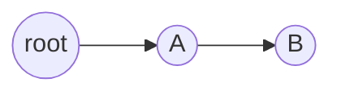
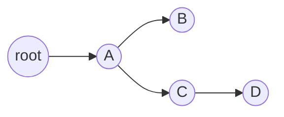

### logging日志

日志信息是软件开发过程中进行调试的一种非常有用的方式，特别是在大型软件开发过程需要很多相关人员进行协作的情况下。开发人员通过在代码中加入一些特定的能够记录软件运行过程中的各种事件信息能够有利于甄别代码中存在的问题。这些信息可能包括时间，描述信息以及错误或者异常发生时候的特定上下文信息。

<!--more-->

  最原始的 debug 方法是通过在代码中嵌入 print  语句，通过输出一些相关的信息来定位程序的问题。但这种方法有一定的缺陷，正常的程序输出和 debug  信息混合在一起，给分析带来一定困难，当程序调试结束不再需要 debug 输出的时候，通常没有很简单的方法将 print  的信息屏蔽掉或者定位到文件。python 中自带的 logging 模块可以比较方便的解决这些问题，它提供日志功能，将 logger 的  level 分为六个级别，可以通过 Logger.setLevel(lvl) 来设置。默认的级别为 warning。

#### 日志的级别

| Level    | 值   | 使用情形                                                     |
| -------- | ---- | ------------------------------------------------------------ |
| NOTSET   | 0    | 日志记录,一般仅仅用来记录运行状况                            |
| DEBUG    | 10   | 详细的信息，在追踪问题的时候使用                             |
| INFO     | 20   | 正常的信息                                                   |
| WARNING  | 30   | 一些不可预见的问题发生，或者将要发生，如磁盘空间低等，但不影响程序的运行 |
| ERROR    | 40   | 由于某些严重的问题，程序中的一些功能受到影响                 |
| CRITICAL | 50   | 严重的错误，或者程序本身不能够继续运行                       |

#### logging lib 包含的 4 个主要对象

- logger:logger 是程序信息输出的接口。它分散在不同的代码中使得程序可以在运行的时候记录相应的信息，并根据设置的日志级别或  filter 来决定哪些信息需要输出并将这些信息分发到其关联的 handler。常用的方法有  Logger.setLevel()，Logger.addHandler() ，Logger.removeHandler()  ，Logger.addFilter() ，Logger.debug(), Logger.info(), Logger.warning(),  Logger.error()，getLogger() 等。logger 支持层次继承关系，子 logger 的名称通常是父  logger.name 的方式。如果不创建 logger 的实例，则使用默认的 root logger，通过  logging.getLogger() 或者 logging.getLogger("") 得到 root logger 实例。
- Handler:Handler 用来处理信息的输出，可以将信息输出到控制台，文件或者网络。可以通过  Logger.addHandler() 来给 logger 对象添加 handler，常用的 handler 有 StreamHandler 和  FileHandler 类。StreamHandler 发送错误信息到流，而 FileHandler 类用于向文件输出日志信息，这两个  handler 定义在 logging 的核心模块中。其他的 hander 定义在 logging.handles 模块中，如：HTTPHandler,SocketHandler。
- Formatter:Formatter 则决定了 log 信息的格式 , 格式使用类似于 %(< dictionary key  >)s 的形式来定义，如'%(asctime)s - %(levelname)s - %(message)s'，支持的 key 可以在  python 自带的文档 LogRecord attributes 中查看。
- Filter:Filter 用来决定哪些信息需要输出。可以被 handler 和 logger 使用，支持层次关系，比如如果设置了  filter 为名称为 A.B 的 logger，则该 logger 和其子 logger 的信息会被输出，如 A.B,A.B.C.

#### logger

logger是一个树结构，默认有个根root，其他logger都是其上的枝桠，比如创建一个name=’A.B’的logger，其实际结构就是 :



再创建一个name=’A.C.D’的logger，结构变为：



下面的代码片段简要说明了logger、Handler、Formatter、Filter之间的关系及使用：

```python
LOG1=logging.getLogger('b.c') 
filehandler = logging.FileHandler('test.log','a') 
formatter = logging.Formatter('%(name)s %(asctime)s %(levelname)s %(message)s') 
filehandler.setFormatter(formatter) 
filter=logging.Filter('b') 
filehandler.addFilter(filter) 
LOG1.addHandler(filehandler) 
```

#### 日志简单配置示例

```python
import logging
logger = logging.getLogger('test')
logging.basicConfig()  # basicConfig是logging提供的简单的配置方法，不用basicConfig则需要手动添加handler

logger.setLevel(logging.INFO)  # 输出所有大于等于INFO级别的log
logger.info('I am <info> message.')
logger.debug('I am <debug> message.')  # 不输出
```

输出：

```
INFO:test:I am <info> message.
```

要注意的是： root 的默认级别是 WARNING！， 而且logger实际输出时的level是取决于EffectiveLevel，即从该级往上走，遇到的第一个level不为0的logger的level，也就是说如果你创建了logger，而没有为其设置level，那它默认是NOTSET，程序会往上层找，直到root，而root级别是WARNING，所以可能会导致没有输出日志。

#### handler日志输出目的地

我们写日志一个很重要的问题就是把日志输出到什么地方去，我们可能希望某些日志在console打印出来，可能希望有更详细的日志输出到log文件里去。怎么控制这些输出就需要用handler了。

```python
import logging
logger = logging.getLogger('test')
logger.addHandler(logging.StreamHandler())  # 添加StreamHandler
logger.setLevel(logging.INFO)  # 输出所有大于INFO级别的log
logger.info('I am <info> message.')
logger.debug('I am <debug> message.')  # 不输出
```

我们把上面的例子稍微改动了一下，可以看到输出如下，输出到了console里。在pycharm中都是显示在输出窗口中。只不过缺少了INFO:的级别类型

```
I am <info> message.
```

这就是logging提供的最基本的一个handler，其他各种handler都是从这个handler继承发展来的。理论上可以把日志输出到各种流中，stderr、文件、socket等都可以。当然logging已经将各种流handler封装好了。

```python
import logging
logger = logging.getLogger('test')
logger.addHandler(logging.StreamHandler())
logger.addHandler(logging.FileHandler('test.log'))  # 再添一个FileHandler
logger.setLevel(logging.INFO)  # 输出所有大于INFO级别的log
logger.info('I am <info> message.')
logger.debug('I am <debug> message.')  # 不输出
```

可以看到，info不仅仅输出到了console中，还在当前文件夹下创建了一个test.log文件并输出到了该文件中。在logging.handlers中还封装了一堆更高级的handlers，可以了解下，尤其是RotatingFileHandler和TimedRotatingFileHandler，可以把你的日志按一定规则分割成多份。你也可以自己封装handler哦，网上有人这么干的。

上面我们看到了logger的级别，可以控制这个logger要输出什么级别的log。但这里我们发现可以在logger里添加handler，控制输出log到哪里，明显发现，其实我们想要在不同的handler里输出不同级别的日志。

比如我们想要在console里输出warning以上的日志，在log文件里输出debug以上的日志，该怎么办呢？

handler也是有级别的。

```python
import logging
logger = logging.getLogger('test')
logger.setLevel(logging.INFO)  # 输出所有大于INFO级别的log

# 添加StreamHandler，并设置级别为WARNING
stream_hdl = logging.StreamHandler()
stream_hdl.setLevel(logging.WARNING)
logger.addHandler(stream_hdl)
# 添加FileHandler，并设置级别为DEBUG
file_hdl = logging.FileHandler('test.log')
file_hdl.setLevel(logging.DEBUG)
logger.addHandler(file_hdl)

logger.info('I am <info> message.')
logger.debug('I am <debug> message.')  # 不输出
```

logger实例的log()函数，例如info()和debug()函数先针对logger实例的级别进行过滤，不超过logger实例级别的log()函数，不会被加载到logger实例中。

在这段代码中logger实例的等级为INFO，所以info()和debug()函数只有info函数会被记录到logger实例中。

logger实例中记录的log()函数再被StreamHandler和FileHandler根据各自的级别进行筛选。

这段代码中StreamHandler级别为WARNING，而FileHandler的级别为DEBUG，所以记录在logger实例中的info()函数只在FileHandler中输出，也就是只有在test.log函数中输出。

```
I am <info> message.
```

#### formatter : 输出日志的格式

细心的话可以发现，我们后来自己添加的handler输出的log是没有格式的，就仅仅是输出而已。但basicConfig()输出的log是有格式的（虽然很丑）。

不同在于basicConfig()中的handler是带有formatter的。我们要添加formatter就需要用到logging中的另一个类Formatter

```python
import logging
logger = logging.getLogger('test')
logger.setLevel(logging.DEBUG)  # 输出所有大于INFO级别的log
fmt = logging.Formatter('%(name)s - %(levelname)s - %(asctime)s - %(message)s')
# 添加StreamHandler，并设置级别为WARNING
stream_hdl = logging.StreamHandler()
stream_hdl.setLevel(logging.DEBUG)
stream_hdl.setFormatter(fmt)
logger.addHandler(stream_hdl)
# 添加FileHandler，并设置级别为DEBUG
file_hdl = logging.FileHandler('test.log')
file_hdl.setLevel(logging.DEBUG)
file_hdl.setFormatter(fmt)
logger.addHandler(file_hdl)

logger.info('I am <info> message.')
logger.debug('I am <debug> message.')  # 不输出
```

是不是漂亮多了，logging的formatter可以输出的不止这几个信息，还有很多：

%(name)s ——logger实例的名称
%(levelno)s ——等级编号，为(DEBUG, INFO, WARNING, ERROR, CRITICAL)对应的编号
%(levelname)s ——等级名称，为 (“DEBUG”, “INFO”, “WARNING”, “ERROR”, “CRITICAL”)中的一个
%(pathname)s ——触发log的文件的全路径
%(filename)s ——触发log的文件的文件名
%(module)s ——触发log的模块名
%(lineno)d ——触发log的代码行数
%(funcName)s ——函数名
%(created)f ——log记录的创建时间
%(asctime)s ——log记录的文本时间
%(msecs)d ——创建时间对应的毫秒级时间戳
%(relativeCreated)d ——应用启动到当前记录被加载之间的时间差
%(thread)d ——线程id
%(threadName)s ——线程名称
%(process)d ——进程id
%(message)s ——日志记录的消息显示

### 日志调试示例

logging.conf 日志配置文件，可以使用上面手动配置的方式实现等效效果。

```
[loggers] 
keys=root,simpleExample 

[handlers] 
keys=consoleHandler 

[formatters] 
keys=simpleFormatter 

[logger_root] 
level=DEBUG 
handlers=consoleHandler 

[logger_simpleExample] 
level=DEBUG 
handlers=consoleHandler 
qualname=simpleExample 
propagate=0 

[handler_consoleHandler] 
class="StreamHandler" 
level=DEBUG 
formatter=simpleFormatter 
args=(sys.stdout,) 

[formatter_simpleFormatter] 
format=%(asctime)s - %(name)s - %(levelname) - %(message)s 
datefmt= 
```

#### 配置文件简要说明

1）配置文件中一定要包含loggers、handlers、formatters这些section，它们通过keys这个option来指定该配置文件中已经定义好的loggers、handlers和formatters，多个值之间用逗号分隔；另外loggers这个section中的keys一定要包含root这个值；

2）loggers、handlers、formatters中所指定的日志器、处理器和格式器都需要在下面以单独的section进行定义。seciton的命名规则为[logger_loggerName]、[formatter_formatterName]、[handler_handlerName]

3）定义logger的section必须指定level和handlers这两个option，level的可取值为DEBUG、INFO、WARNING、ERROR、CRITICAL、NOTSET，其中NOTSET表示所有级别的日志消息都要记录，包括用户定义级别；handlers的值是以逗号分隔的handler名字列表，这里出现的handler必须出现在[handlers]这个section中，并且相应的handler必须在配置文件中有对应的section定义；

4）对于非root  logger来说，除了level和handlers这两个option之外，还需要一些额外的option，其中qualname是必须提供的option，它表示在logger层级中的名字，在应用代码中通过这个名字得到logger；propagate是可选项，其默认是为1，表示消息将会传递给高层次logger的handler，通常我们需要指定其值为0，这个可以看下下面的例子；另外，对于非root  logger的level如果设置为NOTSET，系统将会查找高层次的logger来决定此logger的有效level。

5）定义handler的section中必须指定class和args这两个option，level和formatter为可选option；class表示用于创建handler的类名，args表示传递给class所指定的handler类初始化方法参数，它必须是一个元组（tuple）的形式，即便只有一个参数值也需要是一个元组的形式；level与logger中的level一样，而formatter指定的是该处理器所使用的格式器，这里指定的格式器名称必须出现在formatters这个section中，且在配置文件中必须要有这个formatter的section定义；如果不指定formatter则该handler将会以消息本身作为日志消息进行记录，而不添加额外的时间、日志器名称等信息；

6）定义formatter的sectioin中的option都是可选的，其中包括format用于指定格式字符串，默认为消息字符串本身；datefmt用于指定asctime的时间格式，默认为'%Y-%m-%d  %H:%M:%S'；class用于指定格式器类名，默认为logging.Formatter；

#### 代码示例

```python
#!/usr/bin/python 
import thread 
import time 
import logging 
import logging.config 
logging.config.fileConfig('logging.conf') #载入配置文件
# create logger 
logger = logging.getLogger('simpleExample') 
# Define a function for the thread 
def print_time( threadName, delay): 
    logger.debug('thread 1 call print_time function body') 
    count = 0 
    logger.debug('count:%s',count)
```