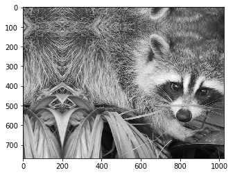
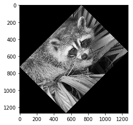
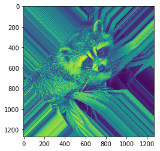
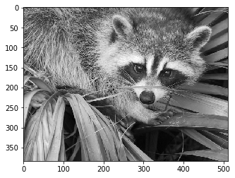
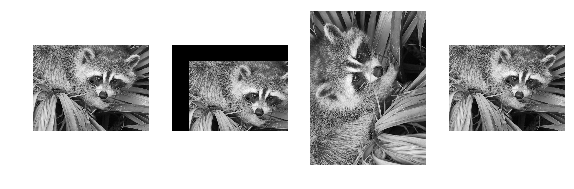

### 图片的移动，缩放，和旋转

- ndimage.shift() 移动
- ndimage.zoom() 缩放
- ndimage.rotate() 旋转

<!--more-->

```python
import numpy as np
from scipy.misc import face
from scipy.ndimage import shift, zoom, rotate
import matplotlib.pyplot as plt
%matplotlib inline
```

```python
face_img = face(gray=True)
plt.imshow(face_img, cmap='gray')
```


```
<matplotlib.image.AxesImage at 0x7f0d326213c8>
```


```python
# mode = {'reflect', 'constant', 'nearest', 'mirror', 'wrap'}
# 向下移动100像素，向右移动200像素
plt.imshow(shift(face_img, shift=(100, 200), mode='mirror'), cmap='gray')
```


```
<matplotlib.image.AxesImage at 0x7f0d32372470>
```





```python
plt.imshow(rotate(face_img, angle=45), cmap='gray') # 逆时针旋转45°
```


```
<matplotlib.image.AxesImage at 0x7f0d32446748>
```





```python
face_r = rotate(face_img, angle=45, mode='nearest')
plt.imshow(face_r) # 显示
# plt.imsave('face_rotate.png', face_r) # 保存到本地
```




```python
face_2 = zoom(face_img, zoom=0.5)
plt.imshow(face_2, cmap='gray')
```


```
<matplotlib.image.AxesImage at 0x7f0d32423470>
```





```python
face_2.shape
```


```
(384, 512)
```


```python
plt.figure(figsize = (12,12))  # 设置画布的大小

faces = [
    face_img,
    shift(face_img, shift=(150, 150)),
    rotate(face_img, angle=90),
    zoom(face_img, zoom=0.5)
]

for i,face in enumerate(faces):
    plt.subplot(1, 5,  i+1) # 创建子画布
    plt.imshow(face,cmap = plt.cm.gray ) # 在子画布中显示 图片
    plt.axis('off')  # 将坐标轴关闭
    
plt.show()
```



