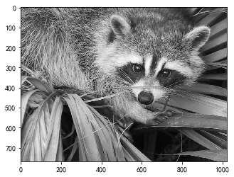
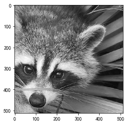
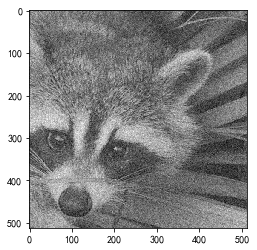

```python
import numpy as np
import matplotlib.pyplot as plt

from scipy.misc import face

from scipy.ndimage import gaussian_filter, median_filter

from scipy.signal import wiener

%matplotlib inline
```

<!--more-->

### ndimage中的图片过滤方法

- gaussian_filter(arr, sigmal=1)  高斯滤波
- median_filter(arr, size=5)  中值滤波

```python
face_img = face(gray=True)
plt.imshow(face_img, cmap='gray')
```


```
<matplotlib.image.AxesImage at 0x7f564a20a208>
```





```python
face1 = face_img[:512, -512:]  # 图片切片，取前512行，后512列
plt.imshow(face1, cmap='gray')
```


```
<matplotlib.image.AxesImage at 0x7f564a1b44e0>
```





```python
# 给face1 图片加上噪点
face2 = np.copy(face1).astype(np.float)  # 复制face1并且修改类型为float
face2 += face1.std()*0.5*np.random.standard_normal(face1.shape)
```

```python
plt.imshow(face2, cmap='gray')
```


```
<matplotlib.image.AxesImage at 0x7f564a112cf8>

```





```python
face_gaussian=gaussian_filter(face2, sigma=1)
plt.imshow(face_gaussian,cmap='gray')
```


```
<matplotlib.image.AxesImage at 0x7f564a0e9eb8>

```


```python
face_media = median_filter(face2, size=5)
plt.imshow(face_media, cmap='gray')
```


```
<matplotlib.image.AxesImage at 0x7f56485d2eb8>

```


### 维纳滤波

- signal.wiener(arr, mysize=(5,5))

```python
face_wiener = wiener(face2, mysize=[5,5])
plt.imshow(face_wiener, cmap='gray')
```


```
<matplotlib.image.AxesImage at 0x7f5648141668>

```


```python
# 设置画布大小
plt.figure(figsize=(20, 4))  # 单位 英寸/2.54cm
titles=[
    '原图',
    '加噪',
    '高斯滤波',
    '中值滤波',
    '维纳滤波'
]
# matplotlib.rcParams['font.sans-serif'] = ['Droid Sans Fallback']
# matplotlib.rcParams['axes.unicode_minus']=False
faces = [
    face1,
    face2,
    face_gaussian,
    face_media,
    face_wiener
]
for i,face in enumerate(faces):
    plt.subplot(1, 5,  i+1) # 创建子画布
    plt.imshow(face,cmap='gray' ) # 在子画布中显示 图片
    plt.axis('off')  # 将坐标轴关闭
    plt.title(titles[i])
plt.show()  # 显示整个画布

```


