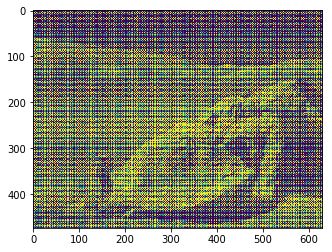
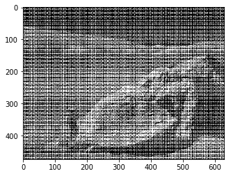
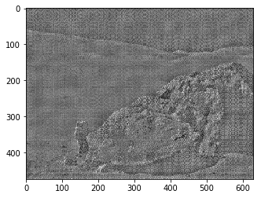
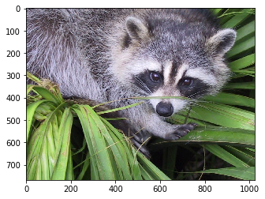
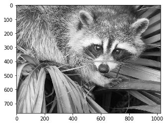
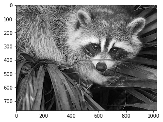
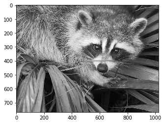

```python
import matplotlib.pyplot as plt
%matplotlib
```

<!--more-->

```python
moon = plt.imread('moonlanding.png')  # 返回ndarray
plt.imshow(moon)
```


```
<matplotlib.image.AxesImage at 0x7fe28d47d128>
```





```python
moon.shape
```


```
(474, 630)
```


```python
plt.imshow(moon, cmap='gray')  # 灰度显示
```


```
<matplotlib.image.AxesImage at 0x7fe28d23db00>
```





```python
moon[:2, :2] # png格式的图片内容，数值是小数位的
```


```
array([[0.04705882, 0.        ],
       [0.        , 0.        ]], dtype=float32)
```


```python
# 图片的消噪，使用傅里叶变换实现
from scipy.fftpack import fft2, ifft2
import numpy as np
```

```python
# 将时域的数据转成频域的数据
fft_moon = fft2(moon)

# 找出高频次的数据，并且置为0 -> 消噪
fft_moon = np.where(np.abs(fft_moon) > 8e2, 0, fft_moon)

# 将频域的数据转成时域的数据，并提取复数中的实数部分
ifft_moon = np.real(ifft2(fft_moon))

# 灰度显示
plt.imshow(ifft_moon, cmap='gray') 
```


```
<matplotlib.image.AxesImage at 0x7fe28c293208>
```





```python
from scipy.misc import face
```

```python
face_img = face()  # gray=True 表示返回灰度处理的的图片
```

```python
plt.imshow(face_img)
```


```
<matplotlib.image.AxesImage at 0x7fe27d46abe0>
```





```python
face_img.shape
```


```
(768, 1024, 3)
```


```python
face_img[:5, :5] # 每行的三个数据表示RGB的 0-255 的颜色值， 图片的格式是 .jpg
```


```
array([[[121, 112, 131],
        [138, 129, 148],
        [153, 144, 165],
        [155, 146, 167],
        [155, 146, 167]],

       [[ 89,  82, 100],
        [110, 103, 121],
        [130, 122, 143],
        [137, 129, 150],
        [141, 133, 154]],

       [[ 73,  66,  84],
        [ 94,  87, 105],
        [115, 108, 126],
        [123, 115, 136],
        [127, 119, 140]],

       [[ 81,  77,  94],
        [ 97,  93, 110],
        [113, 109, 126],
        [120, 115, 135],
        [125, 120, 140]],

       [[103,  99, 114],
        [113, 109, 126],
        [123, 119, 136],
        [132, 127, 147],
        [142, 137, 157]]], dtype=uint8)
```


```python
# 最大化或最小化或平均值等方式灰度处理
plt.imshow(face_img.max(axis=-1), cmap='gray')  # 最大
```


```
<matplotlib.image.AxesImage at 0x7fe27d488710>
```





```python
plt.imshow(face_img.min(axis=-1), cmap='gray') # 最小
```


```
<matplotlib.image.AxesImage at 0x7fe27d3e1ac8>
```





```python
plt.imshow(face_img.mean(axis=-1), cmap='gray') # 平均
```


```
<matplotlib.image.AxesImage at 0x7fe27cd41438>
```





```python
face_img.mean(axis=-1).shape   # 降维
```


```
(768, 1024)
```


```python
weight = [0.3, 0.4, 0.3]  # 加权平均方式实现降维
face_img.dot(weight).shape
```


```
(768, 1024)
```
