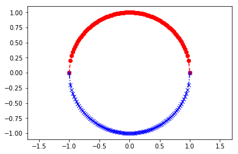

```python
import numpy as np
import matplotlib.pyplot as plt
%matplotlib inline
```

<!--more-->

### 通过定积分画一个圆

- f(x)=(1-x^2)^0.5

```python
y = lambda x: (1-x**2)**0.5
x = np.linspace(-1, 1, num=100)
plt.axis('equal') # 设置坐标轴的长宽同比
plt.plot(x, y(x), 'r--o', x, -y(x), 'b-.x') # 画圆
# 由两个半圆组成，每一条线都有线的颜色color，连接线的样式linestyle和连接点的形状marker
```


```
[<matplotlib.lines.Line2D at 0x7f442bf15ba8>,
 <matplotlib.lines.Line2D at 0x7f442bf15da0>]
```





```python
from scipy.integrate import quad
```

```python
s2, error = quad(y, -1, 1)   # error 为偏差
```

```python
s2
```


```
1.5707963267948983
```


```python
np.pi/2
```


```
1.5707963267948966
```

