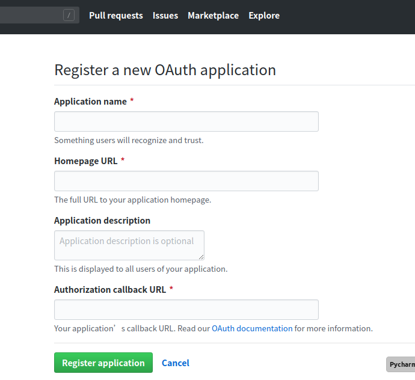
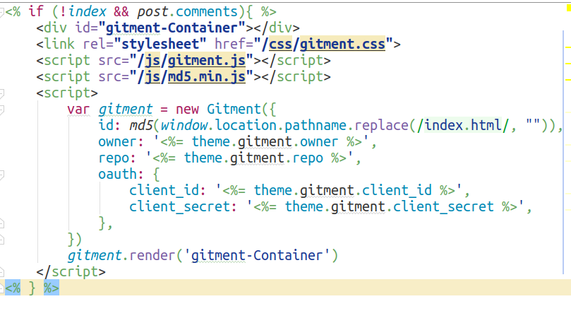
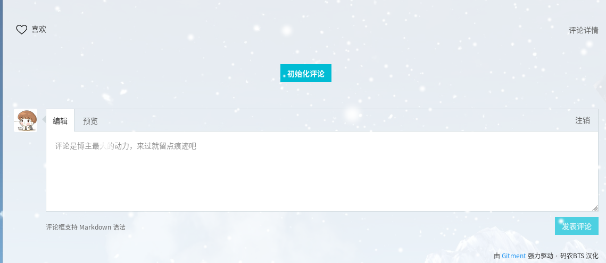
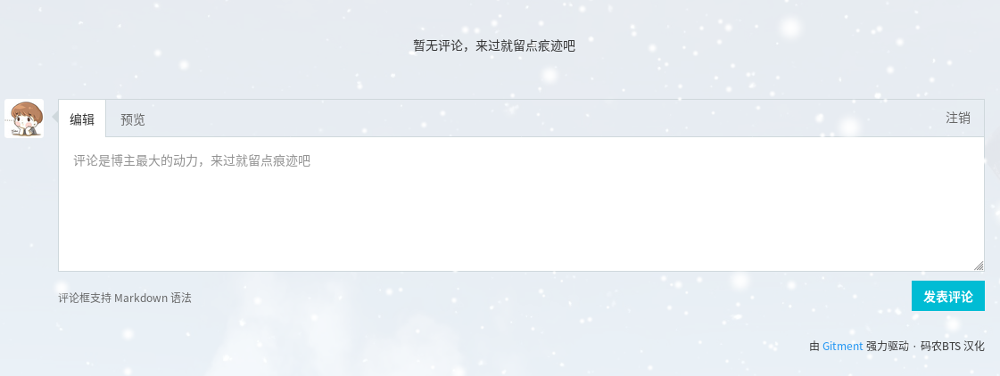
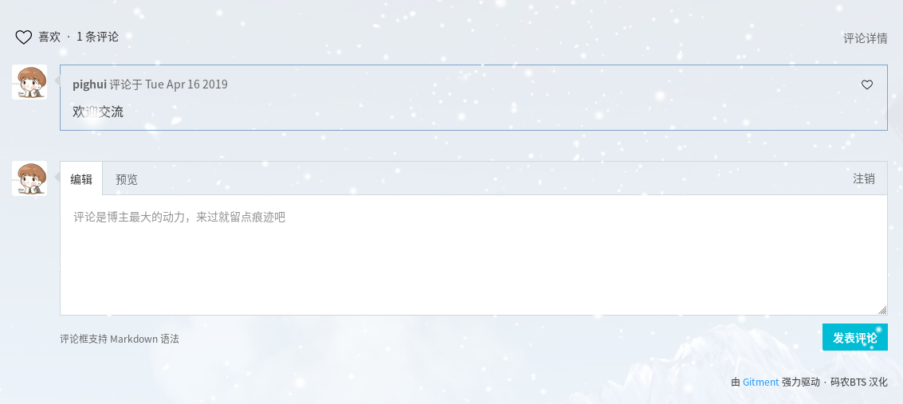

# [**gitment**](https://github.com/imsun/gitment)评论系统接入`hexo`

`Gitment` 是一款基于`GitHub Issues` 的评论系统,只能使用 GitHub 账号进行评论。虽然它功能单一，但是对于技术人员之间的讨论，使用个人的github账号登录来交流是最好不过了。

本篇文章将手把手教你为hexo博客添加gitment评论。

<!--more-->

## 1.安装gitment

```bash
$cd 博客目录
$npm install gitment --save  #安装gitment
```

## 2.获取Client ID和Client Secret

点击[这里](https://github.com/settings/applications/new)注册一个OAuth application，获取Client ID和Client Secret。



Application name和Application description随便填，Homepage URL和Authorization callback URL一般是博客首页地址。需要注意的是，这里需要填写完整，需带上协议名如：http://

注册完成如下：


## 3.修改主题配置

在主题下的_config.yml文件中最后添加

```
# Gitment
# Introduction: https://imsun.net/posts/gitment-introduction/
gitment:
  owner: github名
  repo: 评论存储仓库名
  client_id: 获取的client_id
  client_secret: 获取的client_secret
```

## 4.添加代码

在themes/xxxxx/layout/gitment.ejs中添加

```
<link rel="stylesheet" href="https://www.xuhuiblog.cn/css/gitment.css">
<script type="text/javascript" src="https://www.xuhuiblog.cn/js/gitment.js"></script>
<script type="text/javascript" src="https://www.xuhuiblog.cn/js/md5.min.js"></script>
```

ps：原作者的链接已废弃。此处引用的连接为我本人服务器上的汉化版本。其他版本请自行百度。

并将id改为

```
id: md5(window.location.pathname.replace(/index.html/, "")),
```

ps：这行代码是为了解决github提交问题页时label长度不能大于50，所以使用md5加密。



**PS**：图片仅作示例，代码请手动复制。

## 5.测试评论系统

需要推送到服务器在外网进行测试

```
hexo g -d
```




​										**点击初始化评论**



​											**初始化成功**



​										**测试完成**

教程到此结束，enjoy it！