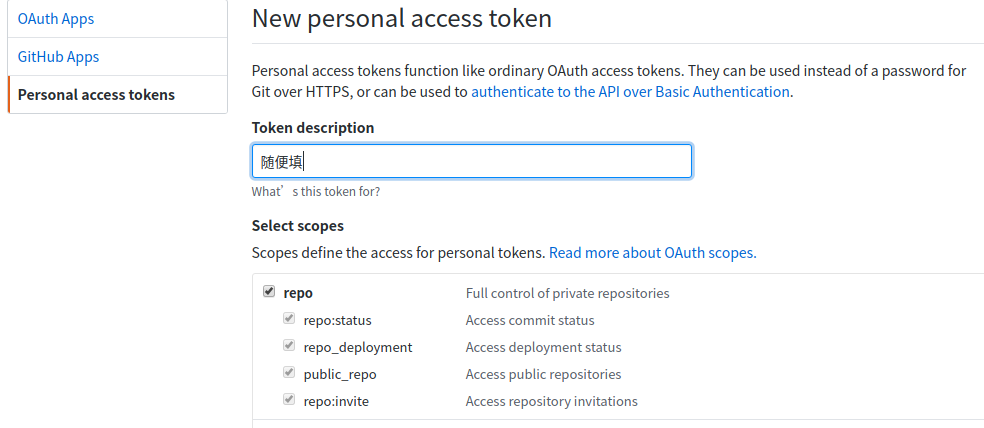
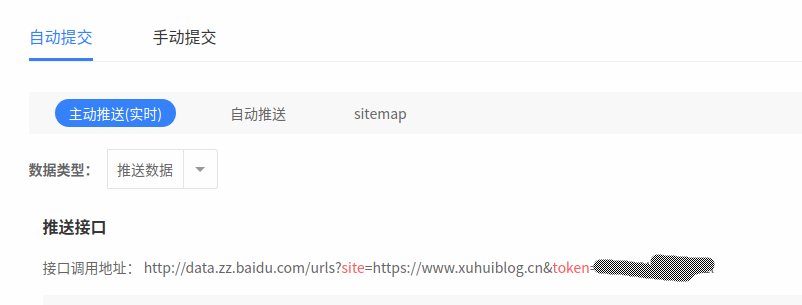

这篇文章将要给大家介绍的是三个自动化脚本。(放于hexo博客根目录)

１．comment.js	自动初始化gitment评论，向谷歌提交sitemap.xml。

​	需要md5的js加密脚本。[点击](https://www.xuhuiblog.cn/js/md5.min.js)下载

​	运行命令	

```bash
node comment.js
```

<!--more-->

２．auto-push-sitemap.py	自动向百度提交baidu-sitemap.xml

​	需要python3环境，请自行安装。

​	运行命令	

```bash
python auto-push-sitemap.py
```

３．auto.sh	全自动脚本，调用其他两个脚本＋自动备份到github仓库。

​	需要bash环境。

​	运行命令

```bash
cd blog
./auto.sh
```

ＰＳ：非本人所写，均来自于互联网。侵删。

# 1.comment.js

## ①在github中[添加](<https://github.com/settings/tokens>)一个token



## ②安装依赖包

```bash
npm install request --save
npm install xml-parser --save
npm install yamljs --save
npm install cheerio --save
```


##  ③生成comment.js并配置

```js
const md5 = require("./md5.min.js")
const request = require("request");
const fs = require("fs");
const path = require("path");
const url = require("url");
const xmlParser = require("xml-parser");
const YAML = require("yamljs");
const cheerio = require("cheerio");
// 根据自己的情况进行配置
const config = {
    username: "pighui", // GitHub 用户名
    token: "78997d4283fe45ba9028e20d5b7a807d4c223356",  // GitHub Token
    repo: "myblogdes",  // 存放 issues的git仓库
    // sitemap.xml的路径，commit.js放置在根目录下，无需修改，其他情况自行处理
    sitemapUrl: path.resolve(__dirname, "./public/sitemap.xml"),
    kind: "Gitment",  // "Gitalk" or "Gitment"
};
let issuesUrl = `https://api.github.com/repos/${config.username}/${config.repo}/issues?access_token=${config.token}`;

let requestGetOpt = {
    url: `${issuesUrl}&page=1&per_page=1000`,
    json: true,
    headers: {
        "User-Agent": "github-user"
    }
};
let requestPostOpt = {
    ...requestGetOpt,
    url:issuesUrl,
    method: "POST",
    form: ""
};

console.log("开始初始化评论...");

(async function() {
    console.log("开始检索链接，请稍等...");

    try {
        let websiteConfig = YAML.parse(fs.readFileSync(path.resolve(__dirname, "./_config.yml"), "utf8"));

        let urls = sitemapXmlReader(config.sitemapUrl);
        console.log(`共检索到${urls.length}个链接`);

        console.log("开始获取已经初始化的issues:");
        let issues = await send(requestGetOpt);
        console.log(`已经存在${issues.length}个issues`);

        let notInitIssueLinks = urls.filter((link) => {
            return !issues.find((item) => {
                link = removeProtocol(link);
                return item.body.includes(link);
            });
        });
        if (notInitIssueLinks.length > 0) {
            console.log(`本次有${notInitIssueLinks.length}个链接需要初始化issue：`);
            console.log(notInitIssueLinks);
            console.log("开始提交初始化请求, 大约需要40秒...");
            /**
             * 部署好网站后，直接执行start，新增文章并不会生成评论
             * 经测试，最少需要等待40秒，才可以正确生成， 怀疑跟github的api有关系，没有找到实锤
             */
            setTimeout(async ()=>{
                let initRet = await notInitIssueLinks.map(async (item) => {
                    let html = await send({ ...requestGetOpt, url: item });
                    let title = cheerio.load(html)("title").text();
                    let pathLabel = md5(url.parse(item).path.replace(/index.html/, ""));
                    let body = `${item}<br><br>${websiteConfig.description}`;
                    let form = JSON.stringify({ body, labels: [config.kind, pathLabel], title });
                    return send({ ...requestPostOpt, form });
                });
                console.log(`已完成${initRet.length}个！`);
                console.log("可以愉快的发表评论了！");
            },40000);
        } else {
            console.log("本次发布无新增页面，无需初始化issue!!");
        }
    } catch (e) {
        console.log(`初始化issue出错，错误如下：`);
        console.log(e);
    } finally {

    }
})();

function sitemapXmlReader(file) {
    let data = fs.readFileSync(file, "utf8");
    let sitemap = xmlParser(data);
    return sitemap.root.children.map(function (url) {
        let loc = url.children.filter(function (item) {
            return item.name === "loc";
        })[0];
        return loc.content;
    });
}

function removeProtocol(url) {
    return url.substr(url.indexOf(":"));
}

function send(options) {
    return new Promise(function (resolve, reject) {
        request(options, function (error, response, body) {
            if (!error) {
                resolve(body);
            } else {
                reject(error);
            }
        });
    });
}
```

# 2.auto-push-sitemap.py

## ①在百度站长平台拿到推送接口地址



## ②安装Python包

```bash
pip install beautifulsoup4
pip install requests	
pip install lxml 
```

## ③生成auto-push-sitemap.py并配置

```python
#!/usr/bin/env python3.6
# -*- coding: utf-8 -*-

import os
import sys
import json
from bs4 import BeautifulSoup as BS
import requests

# import msvcrt

"""
hexo 博客专用，向百度站长平台提交所有网址

本脚本必须放在hexo博客的根目录下执行！需要已安装生成百度站点地图的插件。
百度站长平台提交链接：http://zhanzhang.baidu.com/linksubmit/index
主动推送：最为快速的提交方式，推荐您将站点当天新产出链接立即通过此方式推送给百度，以保证新链接可以及时被百度收录。
从中找到自己的接口调用地址

python环境：
pip install beautifulsoup4
pip install requests	
pip install lxml 

"""

# ❌❌❌ 抄的需要更改这个URL！！这是我的！！❌❌❌
url = 'http://data.zz.baidu.com/urls?site=https://www.xuhuiblog.cn&token=JrNrZrHdsf33BV2l'
baidu_sitemap = os.path.join(sys.path[0], 'public', 'baidusitemap.xml')
google_sitemap = os.path.join(sys.path[0], 'public', 'sitemap.xml')
sitemap = [baidu_sitemap, google_sitemap]

assert (os.path.exists(baidu_sitemap) or os.path.exists(
    google_sitemap)), "没找到任何网站地图，请检查！"


# 从站点地图中读取网址列表
def getUrls():
    urls = []
    for _ in sitemap:
        if os.path.exists(_):
            with open(_, "r") as f:
                xml = f.read()
        soup = BS(xml, "xml")
        tags = soup.find_all("loc")
        urls += [x.string for x in tags]
        if _ == baidu_sitemap:
            tags = soup.find_all("breadCrumb", url=True)
            urls += [x["url"] for x in tags]
    return urls


# POST提交网址列表
def postUrls(urls):
    urls = set(urls)  # 先去重
    print("一共提取出 %s 个网址" % len(urls))
    print(urls)
    data = "\n".join(urls)
    return requests.post(url, data=data).text


if __name__ == '__main__':
    urls = getUrls()
    result = postUrls(urls)
    print("\n提交结果：")
    print(result)
#    msvcrt.getch()
```

# 3.auto.sh

## ①生成脚本

```bash
#!/bin/bash

# ----------- OPT ------------
opt='p'
# s: 本地server
# p: 部署远端server
# b: 备份
# ----------------------------

# 设置VPN
function setproxy(){
    # export {HTTP,HTTPS,FTP}_PROXY="http://127.0.0.1:3128" 也可以设置http代理
    export ALL_PROXY=socks5://127.0.0.1:1080
    echo "当前IP：`curl -s ip.sb`"
}

# 取消VPN
function unsetproxy(){
    # unset {HTTP,HTTPS,FTP}_PROXY
    unset ALL_PROXY
    echo "当前IP：`curl -s ip.sb`"
}

# 确认文章URL没有重复
function checkout_URLs(){
    rm -rf .tmp-*
    find `(pwd)`/source/_posts/* -name "*.md" > .tmp-md_paths
    cat .tmp-md_paths | while read line; do
        sed -n '/url: /p' ${line} | awk 'NR==1{print $2}' >> .tmp-urls
    done
    sort .tmp-urls | uniq > .tmp-uniq_urls
    mv .tmp-uniq_urls .tmp-urls
    if [ `cat .tmp-md_paths|wc -l` -eq `cat .tmp-urls|wc -l` ]; then
        echo "url可能有重复，请核对"
        cat .tmp-urls
        exit 1
    fi
    rm -rf .tmp-*
    echo -e ' --> 文章URL已校验.\n'    
}

# 备份
function backup(){
    echo "最后更新于:" `date` > README.md
    git add *
    git commit -m "backup"
    git push
    echo -e ' --> 已备份.\n'
}


# 操作序列
cd ~/myblog
checkout_URLs
if [ $opt = 's' ]; then
    hexo g && hexo s
elif [ $opt = 'b' ]; then
    backup
elif [ $opt = 'p' ]; then
    setproxy
    hexo g -d
    echo -e ' --> 已成功部署.\n'
    sleep 1
#   unsetproxy
    python3 auto-push-sitemap.py
    echo -e ' --> 已上传站图.\n'
#   setproxy
    backup
    node ./comment.js
#   ruby comment.rb
    echo -e ' --> 评论已自动创建.\n'
fi

echo -e ' -->  所有操作已完成.'
```

## ②添加运行权限

```bash
chmod +x auto.sh
```

分享结束，欢迎交流。