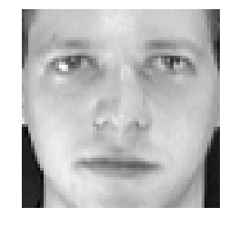
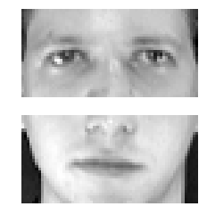
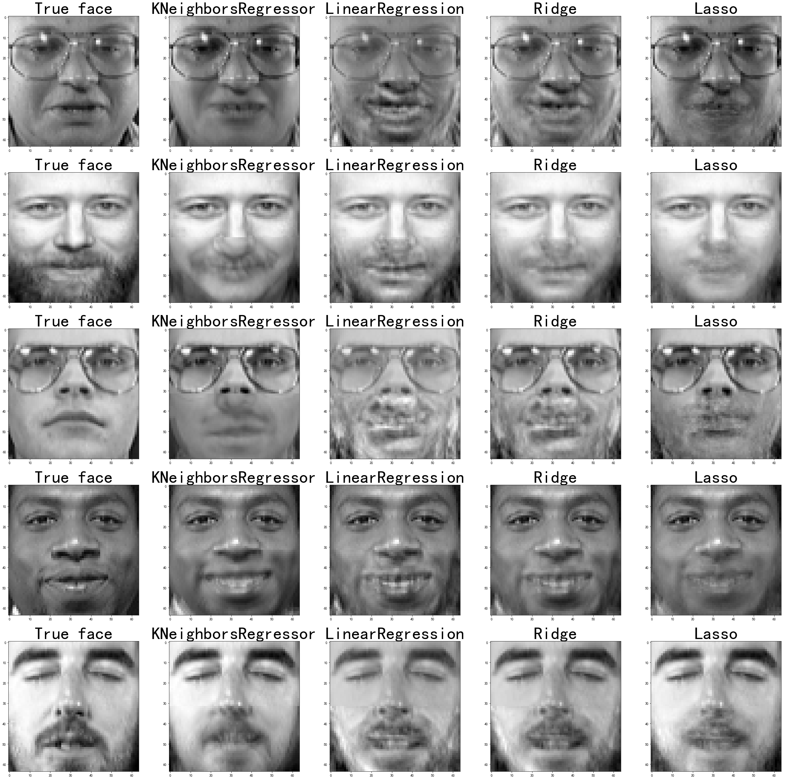

导包

```python
import numpy as np
import pandas as pd
import matplotlib.pyplot as plt
%matplotlib inline
```

<!--more-->

加载数据

- sklearn.datasets.fetch_olivetti_faces()  获得（意大利电信）公司的面部数据
  - data样本数据  (400, 4096)
  - target 目标数据 (400,)  共40人，每人10张图片
  - images 图片数据 (400, 64, 64)

​	注：第一次使用时会自动从网络下载到本地，4M左右大小，  网址：https://ndownloader.figshare.com/files/5976027 ，默认下载到用户的{home}路径下的scikit_learn_data目录中。

```python
from sklearn.datasets import fetch_olivetti_faces
```

```python
faces = fetch_olivetti_faces()  # 第一次从网上下载，以后从本地下载
```

```python
from pandas import Series, DataFrame
```

```python
plt.imshow(faces.data[0].reshape(64, 64),cmap='gray')
plt.axis('off')
```


```
(-0.5, 63.5, 63.5, -0.5)
```




拆分数据

- 拆分每个人前8张照片的上半边脸和下半边脸 为训练数据
- 拆分每个人后2张照片的上半边脸和下半边脸 为 预测 数据
- i 人的索引（0-39）， j（0-9）每人的照片数 , 如第1人的第7张照片, index为 7
  - index = 10*i + j 
- 脸的照片是4096,即为(64, 64)
  - 上半边脸  up_face = face[:2048]
  - 下半边脸  bottom_face = face[2048:]

```python
trainX, trainy, testX, testy = [],[],[],[]
for i in range(40): #人数
    for j in range(10): # 每人十张照片
        # 确定某一人在样本数据中的索引位置
        index = i*10 + j
        face = faces.data[index]  # 获取某一人员的面部数据
        up_face = face[:2048]  # 上半部分脸
        down_face = face[2048:]  # 下半部分脸
        # 前八张作为训练数据集
        if j < 8:
            trainX.append(up_face)
            trainy.append(down_face)
        # 后两张做测试数据
        else:
            testX.append(up_face)
            testy.append(down_face)
# 将列表转换成数组
trainX, trainy, testX, testy = (np.array(trainX),
                               np.array(trainy),
                               np.array(testX),
                               np.array(testy))
```

```python
trainX.shape
```


```
(320, 2048)
```


```python
testX.shape
```


```
(80, 2048)
```


```python
plt.subplot(211)
plt.axis('off')
plt.imshow(trainX[0].reshape(32,64), cmap='gray')

plt.subplot(212)
plt.axis('off')
plt.imshow(trainy[0].reshape(32,64), cmap='gray')

```


```
<matplotlib.image.AxesImage at 0x7f99afbf1b70>
```




Knn Vs 线性 回归模型 训练与预测

- 从训练时间上看，knn最快，岭回归其次，最慢的就是Lasso
- 从预测时间上看，岭回归和Lasso差不多，最慢的就是knn
- 准确率最高的是knn  缩减系数Lasso要高于岭回归
  - r2_score()查看评分

```python
from sklearn.neighbors import KNeighborsRegressor
from sklearn.linear_model import LinearRegression
from sklearn.linear_model import Ridge
from sklearn.linear_model import Lasso
```

```python
from sklearn.metrics import r2_score
```

```python
# knn近邻算法
knn = KNeighborsRegressor(n_neighbors=5)
# 线性回归
linear = LinearRegression()
# 岭回归
ridge = Ridge(alpha=0.7)
# 劳斯回归
lasso = Lasso(alpha=0.0005)
```

```python
print("四种模型训练时间对比：")
for model in [knn, linear, ridge, lasso]:
    name = model.__class__.__name__
    print("%s 模型训练时间" % name)
    %time model.fit(trainX, trainy)
```

```
四种模型训练时间对比：
KNeighborsRegressor 模型训练时间
CPU times: user 19.1 ms, sys: 4.22 ms, total: 23.3 ms
Wall time: 22.3 ms
LinearRegression 模型训练时间
CPU times: user 1.77 s, sys: 116 ms, total: 1.89 s
Wall time: 473 ms
Ridge 模型训练时间
CPU times: user 145 ms, sys: 16.4 ms, total: 161 ms
Wall time: 40.6 ms
Lasso 模型训练时间
CPU times: user 2min 19s, sys: 4.43 s, total: 2min 23s
Wall time: 1min 11s
```


```python
y_dict = {}
print("四种模型预测时间对比：")
for model in [knn, linear, ridge, lasso]:
    name = model.__class__.__name__
    print("%s 模型预测时间" % name)
    %time y_ = model.predict(testX)
    y_dict[name] = y_  # 手机预测结果
```

```
四种模型预测时间对比：
KNeighborsRegressor 模型预测时间
CPU times: user 96.5 ms, sys: 0 ns, total: 96.5 ms
Wall time: 95.7 ms
LinearRegression 模型预测时间
CPU times: user 16.9 ms, sys: 19 µs, total: 16.9 ms
Wall time: 4.2 ms
Ridge 模型预测时间
CPU times: user 16.1 ms, sys: 3 µs, total: 16.1 ms
Wall time: 3.89 ms
Lasso 模型预测时间
CPU times: user 16.1 ms, sys: 0 ns, total: 16.1 ms
Wall time: 3.89 ms
```


```python
print("四种模型得分对比：")
for model in [knn, linear, ridge, lasso]:
    name = model.__class__.__name__
    y_ = y_dict[name]
    print("%s 模型得分：%.4f" % (name,r2_score(testy,y_)))
```

```
四种模型得分对比：
KNeighborsRegressor 模型得分：0.5391
LinearRegression 模型得分：0.2070
Ridge 模型得分：0.4668
Lasso 模型得分：0.5428
```

以图形的方式来查看各种模型的效果

- 随机抽出5张人脸（从测试数据里抽取），绘制5列
  - np.random.permutation(indices)  随机排列
- 第一列为真实人脸数据， 后四列为预测人脸数据
  - 真实的人脸 真实的上半边+真实的下半边
  - 预测的人脸 真实的上半边+预测的下半边

```python
indices = np.arange(testX.shape[0])  # 获取预测数据的索引列表
indices = np.random.permutation(indices)
indices
```


```
array([61, 50, 70, 42, 20, 56, 13, 63, 25, 23, 26, 29, 27, 49, 51, 67, 59,
       54, 62, 66, 65, 72, 39, 21, 53, 71, 58, 18, 43, 36,  3, 75, 44, 15,
       68, 76, 32, 30, 60, 33,  7, 10, 52,  4,  8,  1, 73, 38, 46, 77, 34,
       14, 17, 79, 69, 31, 45,  9,  2, 24, 16, 40, 64, 74, 28,  5, 22, 78,
       48, 11, 35,  6, 47, 19, 12, 57,  0, 55, 41, 37])
```


```python
plt.figure(figsize=(40,40))
pos = 1 # 子画布的序号
for index in indices[:5]:  # 随机抽取前五人的预测数据
    # 画出真实的面部
    ax1 = plt.subplot(5,5,pos)
    ax1.set_title('True face', fontsize=50)
    up = testX[index]
    down = testy[index]
    face = np.concatenate((up,down))  # 将上下两部分脸放在一起
    plt.imshow(face.reshape(64,64), cmap='gray')
    pos += 1
    for model_name in y_dict:
        pre_down_face = y_dict[model_name]
        pre_face = np.concatenate((up,pre_down_face[index]))
        ax2 = plt.subplot(5,5,pos)
        ax2.set_title(model_name,fontsize=50)
        plt.imshow(pre_face.reshape(64,64),cmap='gray')
        pos+=1
plt.show()
```

