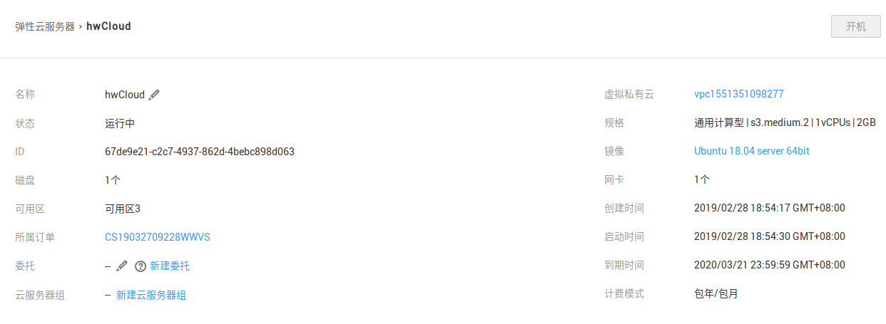
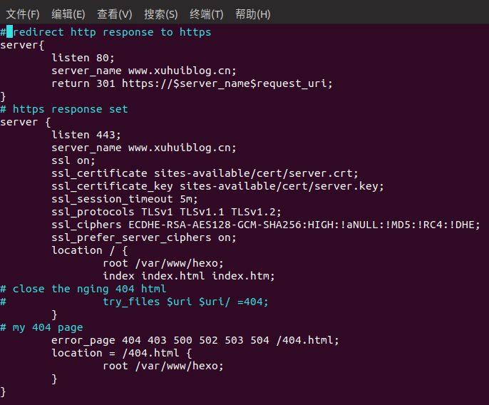
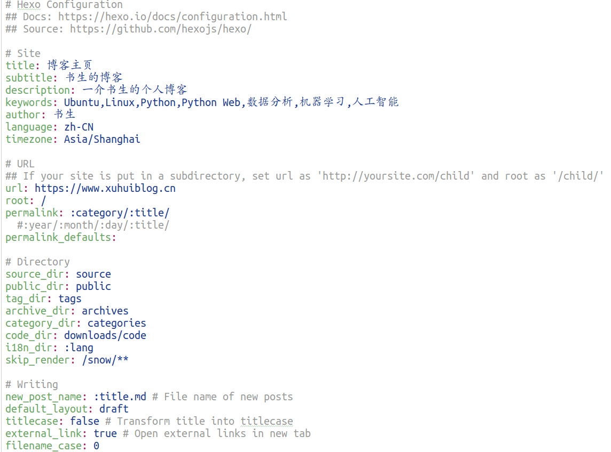
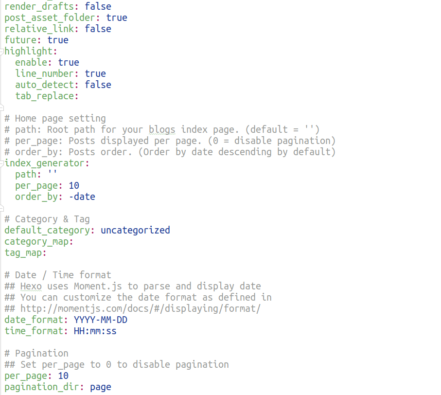
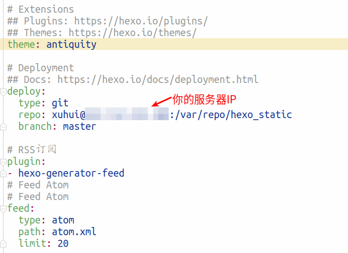

# 在华为云上部署Hexo博客

## **推荐理由**

本文将介绍如何在 Ubuntu 18.04 ECS云服务器上部署 Hexo 博客。

Hexo 是用 [Node.js](<https://nodejs.org/en/>) 开发的一个静态站点生成器（Static Site Generator），支持 Markdown 语法写作，有着强大的插件系统，而且性能优异。阅读不少技术社区分享的文章时，看到国内不少同学都有在用这个引擎，看来「市场占有率」不低。

本文将介绍如何在一台 Ubuntu 18.04 的 ECS 云服务器上快速部署 Hexo 博客站点，如何快速发布一篇博文并通过云服务器上的私有 [Git](https://git-scm.com/downloads) 仓库部署到 Web 服务器目录下。
<!--more-->
## **前提条件**

如果想跟着本教程顺利完成 Hexo 博客的搭建，需要具备以下条件：

1、一台安装了 Ubuntu 18.04 的 ECS 云服务器。一般个人博客的流量都比较低。一核1G1M足矣。

这是我的服务器配置。


2、在本地电脑上安装 Node.js 和 git。

```bash
sudo apt-get update
sudo apt-get install git 
wget -qO- https://raw.github.com/creationix/nvm/v0.33.11/install.sh | sh
nvm install stable
```

此外，还要在云服务器上安装 Git 和 Nginx 两个必备的软件包。Git 用于版本管理和部署，Nginx 用于静态博客托管。

```bash
sudo apt-get update
sudo apt-get install git nginx
```

## **1. 本地 Hexo 安装及初始化**

NPM 上还有许多 Hexo 相关的包，但是只要安装好了 hexo-cli 和 hexo-server 这两个核心组件之后，就可以让博客跑起来了。

我们使用 Node.js 的包管理器 npm 安装 hexo。

```bash
 npm install -g hexo-cli
```

hexo-cli 是 Hexo 的命令行工具，可用于快速新建、发布、部署博客；-g 选项，表示全局安装。

接下来，为 Hexo 博客做一些基础配置，包括创建基础文件。这步操作很简单，Hexo 提供了一个快捷命令，只需要提供一个存放文件的目录地址即可。

```bash
hexo init ~/myblog
```

在国内环境下执行该命令，速度会有些慢。因为需要从 Hexo 在 Github 上的仓库克隆；仓库克隆成功后，会自动执行一系列 npm 命令，自安装依赖模块。

这时，我们就已经有了一个写作、管理博客的环境。

## **2. 云端服务器配置**

完成本地端的操作之后，暂时回到服务器的配置。在下面的操作之前，请确保已经购买了一台云服务器，并且能够以普通用户身份正常登陆。

在这部分，要完成以下件事情：

1.为本地的 hexo_blog 配置一个部署静态文件的远程仓库。 许多教程均以 Github 作为中转的平台，但是会让整个流程 变得更为复杂，而且会受服务器与 Github 之间网络情况的 影响。假如 Github 宕机或者被封，你将无法更新博客。 
2.配置 Nginx 托管博客文件目录。 
3.配置远程仓库自动更新到博客文件目录的钩子。

## **2.1 创建私有 Git 仓库**

在 /var/repo/ 下，创建一个名为 hexo_static 的裸仓库（bare repo）。

如果没有 /var/repo 目录，需要先创建；然后修改目录的所有权和用户权限，之后登录用户都具备 /var/repo 目录下所有新生成的目录和文件的权限。

```bash
sudo mkdir /var/repo/
sudo chown -R $USER:$USER /var/repo/
sudo chmod -R 755 /var/repo/
```

然后，执行如下命令：

```bash
cd /var/repo/
git init --bare hexo_static.git
```

## **2.2 配置 Nginx 托管文件目录**

接下来，创建 /var/www/hexo 目录，用于 Nginx 托管。

```bash
sudo mkdir -p /var/www/hexo
```

和上一步类似，这里也需要修改目录的所有权和权限。

```text
sudo chown -R $USER:$USER /var/www/hexo
sudo chmod -R 755 /var/www/hexo
```

然后，修改 Nginx 的 default 设置：

```bash
sudo vim /etc/nginx/sites-available/default
```

将其中的 root 指令指向 /var/www/hexo 目录。

```text
...

server {
    listen 80 default_server;
    listen [::]:80 default_server;

    root /var/www/hexo; # 需要修改的部分
    index index.html index.htm;
...
```

保存并退出文件。如果以后购买并备案域名之后，可以再将配置中的 default_server 修改为你的域名。

最后，重启 Nginx 服务，使得改动生效。

```bash
sudo service nginx restart
```

做完这一步之后，你去访问服务器的 IP 时，应该还是会报错的，因为 /var/www/hexo 目录是空的。

给出我的服务器端nginx配置。



## **2.3 创建 Git 钩子**

接下来，在服务器上的裸仓库 hexo_static 创建一个钩子，在满足特定条件时将静态 HTML 文件传送到 Web 服务器的目录下，即 /var/www/hexo。

在自动生成的 hooks 目录下创建一个新的钩子文件：

```text
vim /var/repo/hexo_static.git/hooks/post-receive
```

在该文件中添加两行代码，指定 Git 的工作树（源代码）和 Git 目录（配置文件等）。

```text
#!/bin/bash
git --work-tree=/var/www/hexo --git-dir=/var/repo/hexo_static.git checkout -f
```

保存并退出文件，并让该文件变为可执行文件。

```text
chmod +x /var/repo/hexo_static.git/hooks/post-receive
```

至此，服务端的配置基本结束。

## **3. 完成本地 Hexo 配置**

在第三部分的操作中，我们将完成以下任务：

1. 修改 Hexo 配置中的 URL 和默认文章版式；
2. 新建博客草稿并发布
3. 配置自动部署到服务器端的 hexo_static 裸仓库；

## **3.1 修改 Hexo 部分默认配置**

进入 myblog 目录后，主要有以下文件。

```bash
cd  ~/myblog
gedit _config.yml
```

其中，_config.yml 为 Hexo 的主配置文件。我们首先修改博客的 URL 地址。

```text
# URL
## If your site is put in a subdirectory, set url as 'http://yoursite.com/child' and root as '/child/'

url: http://server-ip # 没有绑定域名时填写服务器的实际 IP 地址。
root: /
permalink: :year/:month/:day/:title/
permalink_defaults:
```

接下来，修改 default_layout，该字段位于在 Writing 部分。将其从 post 修改为 draft ，表示每篇博文默认都是草稿，必须经过发布之后才能在博客站点上访问。

```text
# Writing
new_post_name: :title.md # File name of new posts
default_layout: draft # 原来的值是 post
titlecase: false # Transform title into titlecase
```

暂时保存并退出文件。在 3.3 部分继续进行配置。

## **3.2. 新建博客草稿并发布**

这里简单演示通过 Hexo 新建博文草稿，并发布的过程。

执行如下命令，创建第一篇博文。

```bash
hexo new first-post
```

你会看到类似如下输出：

```text
INFO  Created: ~\Workspace\Git\hexo_blog\source\_drafts\first-post.md
```

在本地通过自己熟悉的编辑器，编辑博文。这里，我们把本文的内容写入第一篇博客中。

```text
title: 在 Ubuntu 18.04 服务器上部署 Hexo 博客
tags:
  - Ubuntu
  - Hexo
categories:
  - Hexo
comments: true
date: 2019-04-2 10:30:00
---

## 以下为 Markdown 文章正文。
```

然后，通过如下命令发布博客：

```bash
hexo publish first-post
```

输出类似下面这样：

```text
INFO  Published: ~\Workspace\Git\hexo_blog\source\_posts\first-post.md
```

博客推送到服务器之后，就可以在网站上访问了。

## **3.3 通过 Git 部署**

到了这一步，可以说万事俱备，只欠东风了。这个东风，就是通过 Git 将 Hexo 生成的静态内容推送到服务器。

继续编辑 _config.yml 文件，找到 Deployment 部分，按照如下情况修改：

```text
deploy:
    type: git
    repo: 你的服务器用户名@ECS云服务器的IP地址:/var/repo/hexo_static
    branch: master
```

保存并退出文件。

之后，需要安装一个 Hexo 包，负责将博客所需的静态内容发送到设置好的 Git 仓库。

```text
npm install hexo-deployer-git --save
```

安装好后可以测试部署：

```text
hexo g -d
```

期间可能会提示输入 服务器用户的登录密码（如果没有设置 SSH 登录）。成功之后的输出大致如下：

```text
...
 create mode 100644 tags/Node-js/index.html
 create mode 100644 tags/Ubuntu/index.html
Branch master set up to track remote branch master from user@ip:/var/repo/hexo_static.
To ip:/var/repo/hexo_static
 * [new branch]      HEAD -> master
INFO  Deploy done: git
```

现在，我们就可以在浏览器中输入服务器IP地址，即可看到自己的博客网站了。

给出我的博客配置。







## **总结**

本文较为完整地介绍了 Hexo 博客的安装及初始化，服务端如何配置通过 Git 部署等。与其他教程不同，我们没有使用公开的 Github 等第三方服务，而是直接在服务器上创建了私有仓库。然后，通过 Git 钩子，将 Hexo 生成的博客静态文件，快速地推送到 Web 服务的托管目录。

参考文章:[知乎某大佬](<https://zhuanlan.zhihu.com/p/25767532>)