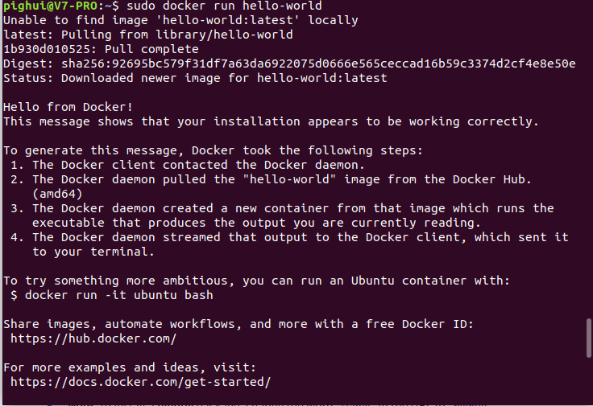
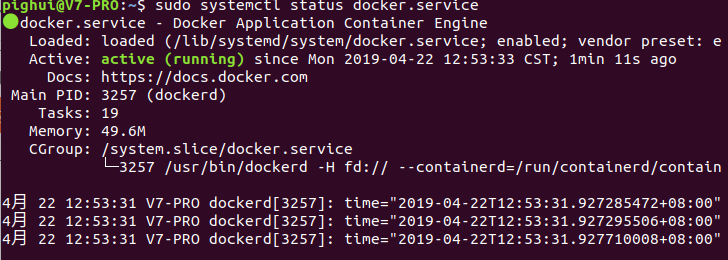

[Docker](https://baike.baidu.com/item/Docker/13344470?fr=aladdin) 是一个开源的应用容器引擎，让开发者可以打包他们的应用以及依赖包到一个可移植的容器中，然后发布到任何流行的Linux机器上，也可以实现虚拟化，容器是完全使用沙箱机制，相互之间不会有任何接口。
一个完整的Docker有以下几个部分组成：
	1.DockerClient客户端
	2.Docker Daemon守护进程
	3.Docker Image镜像
	4.DockerContainer容器 

本文将介绍如何在Ubuntu18.10安装Docker容器。

参考：官方文档<https://docs.docker.com/install/linux/docker-ce/ubuntu/>

<!--more-->

# 1.卸载旧版本

旧版本的Docker被称为 docker，docker.io或者docker-engine。如果你安装了它们，请卸载。

```bash
 sudo apt-get remove docker docker-engine docker.io containerd runc
```

如果你的 apt-get 告知你它们都没有被安装是OK的。

# 2.安装Dcoker CE

新版本的Docker被称为，docker-ce，安装在 /var/lib/docker/,包括images, containers, volumes和 networks.

## ①升级apt包的索引

```bash
sudo apt-get update
```

## ②安装下面的包来允许apt使用基于HTTPS的仓库

```bash
 sudo apt-get install \
    apt-transport-https \
    ca-certificates \
    curl \
    gnupg-agent \
    software-properties-common
```

## ③添加Docker的官方GPG key

```bash
curl -fsSL https://download.docker.com/linux/ubuntu/gpg | sudo apt-key add -
```

你可以使用下面的命令来验证是否添加上了

```bash
sudo apt-key fingerprint 0EBFCD88
```

如果返回下面的结果则是正确的

```bash
pub   rsa4096 2017-02-22 [SCEA]
      9DC8 5822 9FC7 DD38 854A  E2D8 8D81 803C 0EBF CD88
uid           [ unknown] Docker Release (CE deb) <docker@docker.com>
sub   rsa4096 2017-02-22 [S]
```

## ④添加apt仓库源

```bash
sudo add-apt-repository \
   "deb [arch=amd64] https://download.docker.com/linux/ubuntu \
   $(lsb_release -cs) \
   stable"
```

## ⑤安装Docker CE

### a.升级apt包的索引

```bash
sudo apt-get update
```

### b.安装最新的Docker CE和containerd

```bash
sudo apt-get install docker-ce docker-ce-cli containerd.io
```

### c.使用以下命令来验证是否正确安装

```bash
sudo docker run hello-world
```

如果返回下面的结果，则说明安装成功



你也可以使用以下命令看看docker服务是否启动

```bash
sudo systemctl status docker.service
```

如过是下面这样的，则说明运行正常。



到此教程结束。enjoy it！

如果你需要在docker中安装elasticsearch，请参考我的另一篇[文章](https://www.xuhuiblog.cn/Docker/%E5%9C%A8docker%E4%B8%AD%E5%AE%89%E8%A3%85elasticsearch%E4%BB%A5%E5%8F%8A%E7%94%A8%E6%B3%95%E7%9A%84%E4%BB%8B%E7%BB%8D/)。

