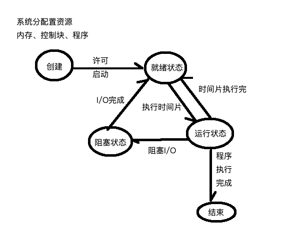

# Python中的多进程

## 一、概念

​	进程是OS（操作系统）中的概念，在某一程序（任务组）启动时，由OS分配的内存、进程控制状态快等相关资源，之后在进程中创建线程，来执行程序code。
​	 一般情况下，进程由三部分组成：内存、程序code、进程控制块（进程ID，进程的状态等描述）。如在Linux操作系统下，执行ps命令，查看所有的进程运行状态。在Windows下，可以通过任务管理器来查看当前系统下的所有进程。
<!--more-->
​	 在Python中创建进程的方式有三种：

- os.fork()只针对linux系统的，Windows/Linux下可以使用multiprocessing模块
- os.system()执行OS的命令，如pwd，ps，top，free，awk
- os.popen()执行OS的命令，但是以字节流的方式读取执行的结果。os.system()只执行命令，没办法读取执行结果。

## 二、进程的生命周期

​	整个进程的生命周期有五个状态（过程），分别是创建、就绪、运行、阻塞和结束。


## 三、Python程序的应用

### 3.1 multiprocessing模块

#### 3.1.1 创建和运行进程

进程对象是由multiprocessing.Process类创建

```python
import multiprocessing

process = multiprocessing.Process(target=new_keys)
```

target参数，表示进程执行的任务对象。此时new_keys是任务函数对象，此函数的定义如下：

```python
import multiprocessing
import os
import random
import time

'''
每隔一秒钟生成一个6位由数字、大小字母组成的key
并写入到keystore.keys文件中
'''

def generate_key():
    #ord(str) 返回一个ASCII字符的ASCII值(10进制值)
    characters = list(range(ord('0'),ord('9')+1)) + \
        list(range(ord('a'),ord('z')+1)) + \
        list(range(ord('A'),ord('Z')+1))
    #chr(code) 返回ASCII值对应的ASCII字符
    characters = [chr(code) for code in characters]
    cs = ''.join([random.choice(characters) for _ in range(6)])
    return cs

def new_keys():
    while True:
        key = generate_key()
        #获取当前函数执行时，它所在的进程信息
        current_process = multiprocessing.current_process()
        #进程的信息（进程ID，父进程，进程状态）
        pid = current_process.pid  #os.getpid()
        ppid = os.getppid()
        print('%s in %s'%(pid,ppid),time.strftime('%d %H:%M:%S',time.localtime()),key)
        with open('keystore.keys','a') as file:
            file.write(key+'\n')
        time.sleep(1)
```

创建之后，调用进程对象的start()函数可以启动进程。

```
process.start()
```

<b><font color=red>注意:</font></b> **调用进程对象的run()函数，直接执行此函数，并不是启动进程。**

另外， 进程启动后，由系统进行调度，当前行不会阻塞一下。简单地说，当启动进程后，进程中指定的target则会在进程进入运行状态时，会自动执行。而process.start()执行后，当前进程会继续向下执行，不会被阻塞。

#### 3.1.2 启动时的传参

​	在创建进程类Process对象时，通过__init__()初始化参数中target来指定进程执行的程序(函数对象)，再通过args或kwargs来指定程序(函数)需要的数据(参数)。

案例1： 启动一个进程的传参

```python
#! /usr/bin/env python
# coding=utf-8

'''
在创建Process时为target目标函数提供参数
任务：由子进程完成keystore.keys文件的读取，每隔一秒读取一次
'''

from multiprocessing import Process
import os
import time


def read_key(filepath: str,timedelta: int) -> None:
    with open(filepath,'r') as file:
        for line in file:
            print(os.getpid(),line,end ='')
            time.sleep(timedelta)
        file.close()
    print('%s 读取完成！' % filepath)

if __name__ == '__main__':
    #read_key('keystore.keys',1)
    #process = Process(target=read_key,args=('keystore.keys',0.5))
    #process.start()
    #process.join() #等待子进程执行完，可能阻塞，直到子进程执行完
    files = (('keystore.keys',0.1),
             ('Day71.md',0.2))
    #批量创建进程
    process_list = [ Process(target=read_key,
                             kwargs=dict(filepath=filepath,
                                         timedelta=timedelta))
                     for filepath, timedelta in files]
    for process in process_list:
        process.start()
    for process in process_list:
        process.join()
    print('--over--')
```


#### 3.1.3 多进程的通信[重点]

##### 3.1.3.1 场景

​	在高并发情况下，一个任务可能需要多个进程进行协作，如下载进程专门负责下载资源的功能，解析进程专门负责解析或提取网页中的数据，数据处理的进程负责接戏之后的数据存储、图片下载、数据预处理等工作。

##### 3.1.3.2 前提

​	由于**进程和进程之间是相互独立的**，当某一个进程因为程序的原因导致进程崩溃，不会影响其他的进程 。

##### 3.1.3.2 四种进程间通信的方式

- Pipe管道

  管道的方式又分为半双工和全双工管道，半双工即是一端只能收，另一端只能发。全双工是两端都可以发和收。

###### 2-1）半双工

```python
#! /usr/bin/env python
# -*-coding:UTF-8-*-
#__author__ :'pighui'
#__time__ :19-4-15 下午3:53


'''
基于Pipe的进程通信
1）半双工
2）全双工
'''

import time
from multiprocessing import Process,Pipe
import os

def download(conn):
    #从conn中读取下载的任务
    while True:
        url = conn.recv()
        if url == "over":
            break
        print(os.getpid(),url)


def start_requests(conn):
    #通过conn发布下载的任务
    for url in ("http://www.baidu.com",
                "http://www.sohu.com",
                "http://www.360.com"):
        conn.send(url)
        print(os.getpid(),'发布', url)
        time.sleep(1)
    conn.send("over")

if __name__ == '__main__':
    #duplex表示是否为全双工，False表示半双工
    #conn1 只收
    #conn2 只发
    conn1, conn2 = Pipe(duplex=False)
    #创建发布下载任务的进程
    publisher = Process(target=start_requests, args=(conn2,))
    #创建接收下载任务的进程
    downloader = Process(target=download, args=(conn1,))

    publisher.start()
    downloader.start()

    publisher.join()
    downloader.join()

    print('--over--')
```

   

###### 2-2)全双工

```python
#! /usr/bin/env python
# -*-coding:UTF-8-*-
#__author__ :pighui
#__time__ :19-4-15 下午4:15


#! /usr/bin/env python
# -*-coding:UTF-8-*-
#__author__ :'pighui'
#__time__ :19-4-15 下午3:53


'''
基于Pipe的进程通信
1）半双工
2）全双工
'''

import time
from multiprocessing import Process,Pipe
import os

def download(conn):
    #从conn中读取下载的任务
    #当下载完成后，将数据返回给conn连接的管道
    while True:
        #从管道接受数据
        url = conn.recv()#从管道接收
        if url == "over":
            break
        print(os.getpid(),'接受下载任务',url)
        time.sleep(3)#模拟下载时间
        print(os.getpid(),'下载完成',url)
        conn.send('%s->%s:%s' % (os.getpid(),'下载完成',url))

def start_requests(conn):
    #通过conn发布下载的任务
    for url in ("http://www.baidu.com",
                "http://www.sohu.com",
                "http://www.360.com"):
        conn.send(url)#从管道发送
        print(os.getpid(),'发布', url)
        data = conn.recv() #接收下载完成后的数据
        print(os.getpid(), data)
    conn.send("over")


if __name__ == '__main__':
    #duplex表示是否为全双工，False表示半双工
    #conn1 只收
    #conn2 只发
    conn1, conn2 = Pipe(duplex=True)
    #创建发布下载任务的进程
    publisher = Process(target=start_requests, args=(conn2,))
    #创建接收下载任务的进程
    downloader = Process(target=download, args=(conn1,))

    publisher.start()
    downloader.start()

    publisher.join()
    downloader.join()

    print('--over--')
```


- Queue队列
  队列本身是阻塞的，可以发布和读取可能会出现的阻塞

  ```python
  #! /usr/bin/env python
  # -*-coding:UTF-8-*-
  #__author__ :pighui
  #__time__ :19-4-15 下午4:29
  
  
  '''
  基于Queue队列实现进程间通信
  Queue对象常用的方法：
  put(value) 存放数据
  value = get() 读取数据
  empty() 是否为空
  qsize 当前队列的大小
  '''
  
  
  import os
  import time
  import random
  from multiprocessing import Process
  from multiprocessing import Queue
  
  def start_request(queue: Queue):
      #模拟某一网页的入口url，下载数据
      urls = ['http://www.baidu.com/s=%s&t=%s' % (os.getpid(),time.strftime('%H:%M:%S',time.localtime()))
                  for _ in range(100000) if _ % 1000 == 0]
  
      for url in urls:
          data = random.choice(['a','b','c','d','e','f'])
          #queue中存放数据
          queue.put((url, data))
          time.sleep(0.3)
  
  
  def parse(queue: Queue):
      #从queue中读取响应的数据，并进行解析
      try:
          while True:
              url, data = queue.get(timeout=5) #读取数据超时，抛出异常
              print(os.getpid(),'开始解析', (url, data))
              time.sleep(0.4)
      except:
          print(os.getpid(),"任务完成")
  
  if __name__ == '__main__':
      #创建Queue对象
      queue = Queue(maxsize=100)
  
      #创建两个进程（下载任务）
      downloads  = [Process(target=start_request, args=(queue,))
                    for _ in range(2)]
  
      #创建三个解析进程
      parses = [Process(target=parse, args=(queue,))
                   for _ in range(3)]
  
      for process in downloads+parses:
          process.start()
  
      for process in downloads+parses:
          process.join()
  
      print('--over--')
  ```

<b><font color=red>**注意:**</font></b>在windows操作中，queue可能存在put()失败的问题，可以将queue改成Manager对象中的Queue对象。部分代码如下：

```python
from multiprocessing import Manager

queue = Manager().Queue()
```


- 共享内存Manager
  由C语言实现的功能，系统本身会在内存区域中分出一个共享区域，实现多进程之间通信

- 信号或Socket
  如果是在Linux中，使用socket模块中socket.AF_UNIX方式绑定或连接一个.socket文件实现进程间的通信。

  ```python
  #! /usr/bin/env python
  # -*-coding:UTF-8-*-
  #__author__ :pighui
  #__time__ :19-4-15 下午5:37
  
  
  '''
  基于socket实现进程间通信
  要求：通过.socket文件实现的
  '''
  
  
  from multiprocessing import Process
  import socket
  import os
  import time
  
  
  def download(url, socket_filepath):
      print(os.getpid(), 'start request', url)
      time.sleep(2)
      data = '%s:%s' % (url, '<html><h1>hi<h1></html>')
      #将data数据写入socket中，传递给parser进程
      s = socket.socket(socket.AF_UNIX)
      #直到socket_filepath文件存在
      while not os.path.exists(socket_filepath):
          pass
      s.connect(socket_filepath)
      s.send(data.encode())
      print(os.getpid(), '--发送数据成功--')
  
  
  def parse(socket_filepath):
      s  = socket.socket(socket.AF_UNIX)
      #如果socket文件存在，则删除旧的socket文件
      if os.path.exists(socket_filepath):
          os.remove(socket_filepath)
      s.bind(socket_filepath)
      s.listen()
      c, addr = s.accept() #等待连接
      data = c.recv(1024*8) #接受连接进程的数据
      print(os.getpid(), data)
  
  if __name__ == '__main__':
      #指定两个进程间通信的socket文件
      socket_file = 'process5.socket'
      downloader = Process(target=download,
                           args=('http://www.baidu.com', socket_file))
  
      parser = Process(target=parse,
                       args=(socket_file, ))
  
      downloader.start()
      parser.start()
  
      downloader.join()
      parser.join()
  
      print(os.getpid(), '--over--')
  ```

  如果在Window中， 可以使用AF_INET通信方式，只需要将上述代码中bind()绑定和connect()连接中的参数改成(ip, port)即可，详细代码如下：

  ```python
  #! /usr/bin/env python
  # -*-coding:UTF-8-*-
  #__author__ : pighui
  #__time__ : 2019-4-15 下午6:21
  
  
  """
  基于socket实现进程间通信
  # 要求： 通过(ip, port) 网络通信
  """
  
  from multiprocessing import Process
  import socket
  import os
  import time
  
  def download(url, port):
      print(os.getpid(), 'start request ', url)
      time.sleep(2)
      data = '%s:%s' % (url, '<html><h1>hi</h1></html>')
  
      # 将data数据写入scoket中，传递给parser进程
      s = socket.socket()
  
      s.connect(('localhost', port))
      # 将数据写入socket
      s.send(data.encode())
      print(os.getpid(), '---发送数据成功--')
  
  
  def parse(port):
      s = socket.socket(socket.AF_INET)
      s.bind(('', port)) # 绑定socket文件
      s.listen()
      c, address = s.accept() # 等待连接
      data = c.recv(1024*8)  # 接收连接进程的数据
      print(os.getpid(), data)
  
  
  if __name__ == '__main__':
  
      downloader = Process(target=download,
                           args=('http://www.baidu.com', 8999))
  
      parser = Process(target=parse,
                       args=(8999, ))
      downloader.start()
      parser.start()
  
      downloader.join()
      parser.join()
  
      print(os.getpid(), '----over----')
  ```

总结一下socket的用法如下：

1.用于进程间通信(Process-Process)

使用.socket文件

2.用于网络间通信(client-server)

使用(ip,port)

socket的使用步骤，分客户端和服务端，详情如下：

1.Server端

- 创建socket-socket(socket.AF_INET/AF_UNIX)

- 绑定(ip,port)或.socket文件-bind()

- 监听-listen()

- 等待客户端的连接-accept()阻塞方法

- 通过连接的客户端对象进行通信

  - client.recv(8192)接收数据
  - client.send(b'hi')发送数据

- 关闭连接

  client.close()

2.Client端

- 创建socket

- 连接服务器(ip,port)或.socket文件-connect()

  - s.send(b'')发送数据
  - s.recv(8192)接收数据

- 关闭连接

  s.close()

### 3.2 os.system()函数

主要用于Python的程序执行操作系统命令的，如开启视频转换功能、开启定时爬虫任务等。和os.popen()函数不同之处在于，只执行操作系统的命令，而不获取命令执行的结果。

```python
"""
使用os.system来执行操作系统的命令
- 创建子进程来执行OS的命令
- 通过 sys.argv 接收命令行中的参数
"""
import os
import sys

if __name__ == '__main__':
    # 读取命令行的参数
    """
    命令行格式： 
    > python os_system.py filepath
    """
    # print(sys.argv)
    # if len(sys.argv) <= 1:
    #     raise Exception('必须指定读取的文件名参数')
    #
    # filepath = sys.argv[1]
    # Linux命令统计文件的行数
    # cat ../day71/keystore.keys |wc -l
    # os.system('cat %s |wc -l' % filepath)
    # os.system('notepad %s ' % filepath)  # window
    os.system('ls -la ..')

```

### 3.3 os.popen()函数

```python
"""
通过os.popen()实现与操作系统进行交互
使用场景如下：
-  远程启动或关闭服务
-  远程获取服务的资源
"""
import csv
import os

if __name__ == '__main__':
    # 1. 执行OS命令
    cmd = os.popen('dir -la')

    # 2. 读取命令执行的结果
    result = cmd.read()

    # 3. 分析和处理数据
    print(result)
```

案例需求：读取服务器下可用的docker images，并将读取的结果写入到csv文件中。
实现步骤:
    1.os.popen('docker images') 执行命令
    2.result = cmd.read() 读取结果
    3.将读取的结果的标题(第一行)作为csv文件的标题
    4.将剩余的数据写入到csv文件中。
详细代码：
    

```python
"""
通过os.popen()实现与操作系统进行交互
使用场景如下：
-  远程启动或关闭服务
-  远程获取服务的资源
"""
import csv
import os

if __name__ == '__main__':
    # 1. 执行OS命令
    cmd = os.popen('docker images')

    file = open('images.csv', 'w')

    # 2. 读取命令执行的结果
    result = cmd.read()
    result = result.split('\n')
    titles = result[0].split()

    writer = csv.DictWriter(file, fieldnames=titles)
    writer.writeheader()  # 写入标题（第一次）

    for line in result[1:]:
        row = line.split()
        if len(row) < 6:
            continue
        writer.writerow({
            'REPOSITORY': row[0],
            'TAG': row[1],
            'IMAGE': row[2],
            'ID': row[3],
            'CREATED': row[4]+' '+row[5],
            'SIZE': row[6]
        })

    file.close()
    print('--写入成功--')
```

