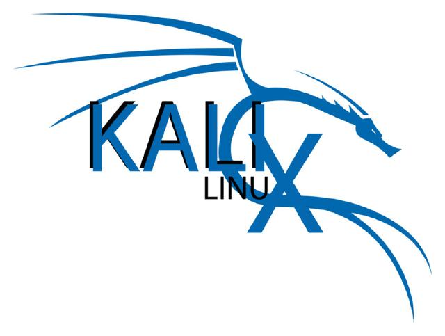
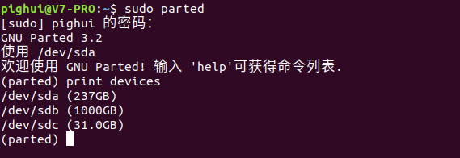

如果你听到一个 13 岁的黑客吹嘘他是多么的牛逼，是有可能的，因为有 Kali Linux 的存在。尽管有可能会被称为“脚本小子”，但是事实上，Kali 仍旧是安全专家手头的重要工具（或工具集）。

Kali 是一个基于 Debian 的 Linux 发行版。它的目标就是为了简单：在一个实用的工具包里尽可能多的包含渗透和审计工具。Kali 实现了这个目标。大多数做安全测试的开源工具都被囊括在内。

Kali Linux系统在2018年公布的最受黑客欢迎的操作系统榜单中排名第一。

本文将介绍如何将kali安装到U盘并加密。

<!--more-->

# 准备工作

- USB3.0优盘一个，容量16G以上
- Ubuntu系统或者windows系统

windows系统需要使用[Win32DiskImager](https://www.xuhuiblog.cn/projects/Win32DiskImager-0.9.5-binary.zip)工具。

- Kali的镜像。请[下载](<https://www.kali.org/downloads/>)桌面版

## 1.将镜像写入U盘

- Ubuntu系统

```bash
sudo parted
print devices
```

①查看你的U盘挂载后的设备目录



②写入镜像到U盘

```bash
dd of=/dev/sdc if=/home/pighui/kali-linux-2019-1a-amd64-iso/kali-linux-2019.1a-amd64.iso bs=1M
```

③分区

```bash
sudo parted
print devices
select /dev/sdc
mkpart primary 起始位置 -1s
```

- Windows系统使用Win32DiskImager工具将镜像写入U盘

## 2.加密

- 仅适用于Linux系统

```bash
cryptsetup --verbose --verify-passphrase luksFormat /dev/sdc4
```

输入大写YES回车

## 3 . 打开分区

```bash
cryptsetup luksOpen /dev/sdc4 usb
```

## 4.格式化分区为ext4

```
mkfs.ext4 /dev/mapper/usb
```

## 5.重命名分区

PS：分区名必须是persistence

```bash
e2label /dev/mapper/usb persistence
```

## 6.挂载分区

```bash
midir -p /mnt/usb
mount /dev/mapper/usb /mnt/usb/
```

## 7.写入配置文件

```
echo "/ union" > /mnt/usb/persistence.conf
```

## 8.卸载分区

```bash
umount /dev/mapper/usb
```

## 9.关闭分区

```bash
cryptsetup luksClose /dev/mapper/usb
```


**写在最后**

经过上面这几步的操作，我们就制作好了一个移动加密版的Kali系统。

在开机的时候从U盘启动，并选择Live USB Encrypted Persistence启动项

输入密码后就可以进入了。

大家可以放心，U盘是可以保存数据的，而且Luks加密级别很高哦。

怎么样？是不是很酷炫，快去做一个吧！

