# 城市气候与海洋的关系研究

导入包

```python
import numpy as np
import pandas as pd
from pandas import Series,DataFrame
import matplotlib.pyplot as plt
%matplotlib inline

plt.rcParams['font.sans-serif'] = ['SimHei']
plt.rcParams['axes.unicode_minus'] = False
```

<!--more-->

导入数据各个海滨城市数据

- os.listdir('data')
- filter() 过滤出所有.csv文件, 返回一个可迭代的Filter对象
- df.append() 以行的方式追加, <font color=red>返回一个新的DataFrame</font>

```python
import os
```

```python
files = os.listdir('data')
all_ = None
for filename in filter(lambda item: item.endswith('.csv'), files):
    df = pd.read_csv('data/%s' % filename)
    if all_ is None:
        all_ = df
    else:
        all_ = all_.append(df)
all_.shape
```


```
(675, 11)
```


查看列数

```python
all_.head()
```


<div>
<style scoped>
    .dataframe tbody tr th:only-of-type {
        vertical-align: middle;
    }
    .dataframe tbody tr th {
    vertical-align: top;
}
.dataframe thead th {
    text-align: right;
}
</style>
<table border="1" class="dataframe">
  <thead>
    <tr style="text-align: right;">
      <th></th>
      <th>Unnamed: 0</th>
      <th>temp</th>
      <th>humidity</th>
      <th>pressure</th>
      <th>description</th>
      <th>dt</th>
      <th>wind_speed</th>
      <th>wind_deg</th>
      <th>city</th>
      <th>day</th>
      <th>dist</th>
    </tr>
  </thead>
  <tbody>
    <tr>
      <th>0</th>
      <td>0</td>
      <td>28.34</td>
      <td>65</td>
      <td>1017.0</td>
      <td>Sky is Clear</td>
      <td>1436863109</td>
      <td>3.1</td>
      <td>20.0</td>
      <td>Torino</td>
      <td>2015-07-14 10:38:29</td>
      <td>357</td>
    </tr>
    <tr>
      <th>1</th>
      <td>1</td>
      <td>29.25</td>
      <td>65</td>
      <td>1017.0</td>
      <td>Sky is Clear</td>
      <td>1436866696</td>
      <td>3.1</td>
      <td>80.0</td>
      <td>Torino</td>
      <td>2015-07-14 11:38:16</td>
      <td>357</td>
    </tr>
    <tr>
      <th>2</th>
      <td>2</td>
      <td>30.40</td>
      <td>58</td>
      <td>1017.0</td>
      <td>Sky is Clear</td>
      <td>1436870399</td>
      <td>2.6</td>
      <td>100.0</td>
      <td>Torino</td>
      <td>2015-07-14 12:39:59</td>
      <td>357</td>
    </tr>
    <tr>
      <th>3</th>
      <td>3</td>
      <td>31.37</td>
      <td>54</td>
      <td>1017.0</td>
      <td>Sky is Clear</td>
      <td>1436874005</td>
      <td>2.1</td>
      <td>90.0</td>
      <td>Torino</td>
      <td>2015-07-14 13:40:05</td>
      <td>357</td>
    </tr>
    <tr>
      <th>4</th>
      <td>4</td>
      <td>32.59</td>
      <td>45</td>
      <td>1016.0</td>
      <td>few clouds</td>
      <td>1436877558</td>
      <td>2.1</td>
      <td>120.0</td>
      <td>Torino</td>
      <td>2015-07-14 14:39:18</td>
      <td>357</td>
    </tr>
  </tbody>
</table>
</div>


去除没用的列 Unnamed: 0

```python
all_.drop(columns='Unnamed: 0', inplace=True)
```

```python
all_.index
```


```
Int64Index([ 0,  1,  2,  3,  4,  5,  6,  7,  8,  9,
            ...
            14, 15, 16, 17, 18, 19, 20, 21, 22, 23],
           dtype='int64', length=675)
```


```python
# 重新生成索引
all_.reset_index(drop=True, inplace=True)
all_.index
```


```
RangeIndex(start=0, stop=675, step=1)
```


显示最高温度与离海远近的关系

- 按city分组， 计算temp和dist的最大值
- 按dist排序， df.sort_values()

```python
dist_temp = all_.groupby('city')['temp', 'dist'].max().sort_values('dist')
dist_temp
```


<div>
<style scoped>
    .dataframe tbody tr th:only-of-type {
        vertical-align: middle;
    }
    .dataframe tbody tr th {
    vertical-align: top;
}
.dataframe thead th {
    text-align: right;
}
</style>
<table border="1" class="dataframe">
  <thead>
    <tr style="text-align: right;">
      <th></th>
      <th>temp</th>
      <th>dist</th>
    </tr>
    <tr>
      <th>city</th>
      <th></th>
      <th></th>
    </tr>
  </thead>
  <tbody>
    <tr>
      <th>Ravenna</th>
      <td>32.79</td>
      <td>8</td>
    </tr>
    <tr>
      <th>Cesena</th>
      <td>32.81</td>
      <td>14</td>
    </tr>
    <tr>
      <th>Faenza</th>
      <td>32.74</td>
      <td>37</td>
    </tr>
    <tr>
      <th>Ferrara</th>
      <td>33.43</td>
      <td>47</td>
    </tr>
    <tr>
      <th>Bologna</th>
      <td>33.85</td>
      <td>71</td>
    </tr>
    <tr>
      <th>Mantova</th>
      <td>34.18</td>
      <td>121</td>
    </tr>
    <tr>
      <th>Piacenza</th>
      <td>33.92</td>
      <td>200</td>
    </tr>
    <tr>
      <th>Milano</th>
      <td>34.81</td>
      <td>250</td>
    </tr>
    <tr>
      <th>Asti</th>
      <td>34.31</td>
      <td>315</td>
    </tr>
    <tr>
      <th>Torino</th>
      <td>34.69</td>
      <td>357</td>
    </tr>
  </tbody>
</table>
</div>


画图显示关系 

- scatter() 显示距离与温度的散布图
- plot() 显示距离与温度的线形图

```python
plt.scatter(dist_temp['dist'], dist_temp['temp'])
plt.plot(dist_temp['dist'], dist_temp['temp'])
plt.show()
```

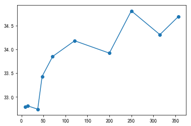

读取Asti城市某一天的温度变化数据， 并画出线型图和散点图，如2015-7-14这一天的天气变化

- 处理 day 时间格式
  - 转成年、月、日的date日期
  - 或转成时、分、秒的字符串
- 将绘制的画布保存成一张png图片

```python
asti = all_[all_['city']=='Asti']
asti_temp = asti[['day', 'temp']]
asti_temp.shape
```


```
(68, 2)
```


```python
asti_temp.head()
```


<div>
<style scoped>
    .dataframe tbody tr th:only-of-type {
        vertical-align: middle;
    }
    .dataframe tbody tr th {
    vertical-align: top;
}
.dataframe thead th {
    text-align: right;
}
</style>
<table border="1" class="dataframe">
  <thead>
    <tr style="text-align: right;">
      <th></th>
      <th>day</th>
      <th>temp</th>
    </tr>
  </thead>
  <tbody>
    <tr>
      <th>180</th>
      <td>2015-06-27 09:42:05</td>
      <td>22.68</td>
    </tr>
    <tr>
      <th>181</th>
      <td>2015-06-27 10:37:23</td>
      <td>24.05</td>
    </tr>
    <tr>
      <th>182</th>
      <td>2015-06-27 11:56:57</td>
      <td>26.56</td>
    </tr>
    <tr>
      <th>183</th>
      <td>2015-06-27 12:53:40</td>
      <td>27.20</td>
    </tr>
    <tr>
      <th>184</th>
      <td>2015-06-27 13:54:16</td>
      <td>28.56</td>
    </tr>
  </tbody>
</table>
</div>


```python
asti_temp.dtypes
```


```
day      object
temp    float64
dtype: object
```


```python
from datetime import datetime, date
def to_datetime(item):
    return datetime.strptime(item, '%Y-%m-%d %H:%M:%S')

def to_time_str(item):
    return item.strftime('%H:%M:%S')

def to_date_str(item):
    return item.strftime('%Y-%m-%d')
```

```python
asti_temp['day'] = asti_temp['day'].map(to_datetime)
asti_temp['time'] = asti_temp['day'].map(to_time_str)
asti_temp['date'] = asti_temp['day'].map(to_date_str)
```


```python
asti_temp.head()
```


<div>
<style scoped>
    .dataframe tbody tr th:only-of-type {
        vertical-align: middle;
    }
    .dataframe tbody tr th {
    vertical-align: top;
}
.dataframe thead th {
    text-align: right;
}
</style>
<table border="1" class="dataframe">
  <thead>
    <tr style="text-align: right;">
      <th></th>
      <th>day</th>
      <th>temp</th>
      <th>time</th>
      <th>date</th>
    </tr>
  </thead>
  <tbody>
    <tr>
      <th>180</th>
      <td>2015-06-27 09:42:05</td>
      <td>22.68</td>
      <td>09:42:05</td>
      <td>2015-06-27</td>
    </tr>
    <tr>
      <th>181</th>
      <td>2015-06-27 10:37:23</td>
      <td>24.05</td>
      <td>10:37:23</td>
      <td>2015-06-27</td>
    </tr>
    <tr>
      <th>182</th>
      <td>2015-06-27 11:56:57</td>
      <td>26.56</td>
      <td>11:56:57</td>
      <td>2015-06-27</td>
    </tr>
    <tr>
      <th>183</th>
      <td>2015-06-27 12:53:40</td>
      <td>27.20</td>
      <td>12:53:40</td>
      <td>2015-06-27</td>
    </tr>
    <tr>
      <th>184</th>
      <td>2015-06-27 13:54:16</td>
      <td>28.56</td>
      <td>13:54:16</td>
      <td>2015-06-27</td>
    </tr>
  </tbody>
</table>
</div>


```python
asti_temp_14 = asti_temp[asti_temp['date'] == '2015-07-14']
asti_temp_14.head()
```


<div>
<style scoped>
    .dataframe tbody tr th:only-of-type {
        vertical-align: middle;
    }
    .dataframe tbody tr th {
    vertical-align: top;
}
.dataframe thead th {
    text-align: right;
}
</style>
<table border="1" class="dataframe">
  <thead>
    <tr style="text-align: right;">
      <th></th>
      <th>day</th>
      <th>temp</th>
      <th>time</th>
      <th>date</th>
    </tr>
  </thead>
  <tbody>
    <tr>
      <th>477</th>
      <td>2015-07-14 10:39:36</td>
      <td>28.05</td>
      <td>10:39:36</td>
      <td>2015-07-14</td>
    </tr>
    <tr>
      <th>478</th>
      <td>2015-07-14 11:39:19</td>
      <td>29.51</td>
      <td>11:39:19</td>
      <td>2015-07-14</td>
    </tr>
    <tr>
      <th>479</th>
      <td>2015-07-14 12:41:50</td>
      <td>30.39</td>
      <td>12:41:50</td>
      <td>2015-07-14</td>
    </tr>
    <tr>
      <th>480</th>
      <td>2015-07-14 13:41:38</td>
      <td>31.10</td>
      <td>13:41:38</td>
      <td>2015-07-14</td>
    </tr>
    <tr>
      <th>481</th>
      <td>2015-07-14 14:40:45</td>
      <td>33.23</td>
      <td>14:40:45</td>
      <td>2015-07-14</td>
    </tr>
  </tbody>
</table>
</div>


```python
plt.figure(figsize=(12, 6))
plt.title('Asti 2015-07-14的温度变化', fontsize=20)
plt.scatter(asti_temp_14['time'], asti_temp_14['temp'], c='red')
plt.plot(asti_temp_14['time'], asti_temp_14['temp'])
plt.savefig('2015-07-14.png', dpi=120)
```

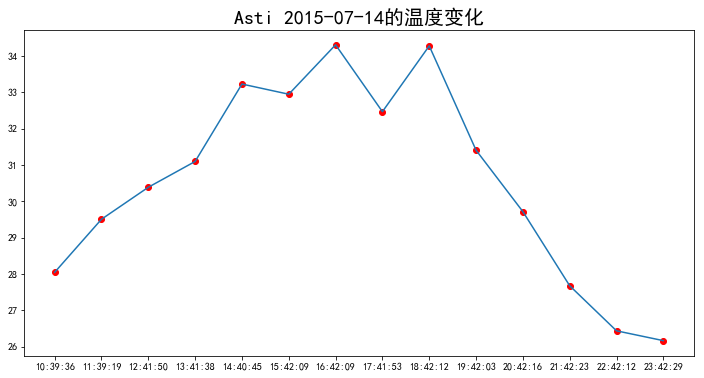

查看asti的一周的湿度变化的数据，并画出散点与线型图

- 按天进行分组
- 将分组后的data设置为列

```python
asti_temp_week = DataFrame(asti_temp.groupby('date')['temp'].mean()).reset_index()
asti_temp_week
```


<div>
<style scoped>
    .dataframe tbody tr th:only-of-type {
        vertical-align: middle;
    }
    .dataframe tbody tr th {
    vertical-align: top;
}
.dataframe thead th {
    text-align: right;
}
</style>
<table border="1" class="dataframe">
  <thead>
    <tr style="text-align: right;">
      <th></th>
      <th>date</th>
      <th>temp</th>
    </tr>
  </thead>
  <tbody>
    <tr>
      <th>0</th>
      <td>2015-06-27</td>
      <td>27.040833</td>
    </tr>
    <tr>
      <th>1</th>
      <td>2015-06-28</td>
      <td>19.702500</td>
    </tr>
    <tr>
      <th>2</th>
      <td>2015-07-14</td>
      <td>30.550714</td>
    </tr>
    <tr>
      <th>3</th>
      <td>2015-07-15</td>
      <td>24.722000</td>
    </tr>
    <tr>
      <th>4</th>
      <td>2015-07-24</td>
      <td>28.627692</td>
    </tr>
    <tr>
      <th>5</th>
      <td>2015-07-25</td>
      <td>23.045455</td>
    </tr>
  </tbody>
</table>
</div>


```python
plt.figure(figsize=(12, 6))
plt.title('Asti 一周的温度变化', fontsize=20)
plt.scatter(asti_temp_week['date'], asti_temp_week['temp'], c='red')
plt.plot(asti_temp_week['date'], asti_temp_week['temp'])
# 修改坐标轴的刻度标签的文本样式
plt.tick_params(axis='both', labelcolor='black', labelsize=15)
plt.show()
```

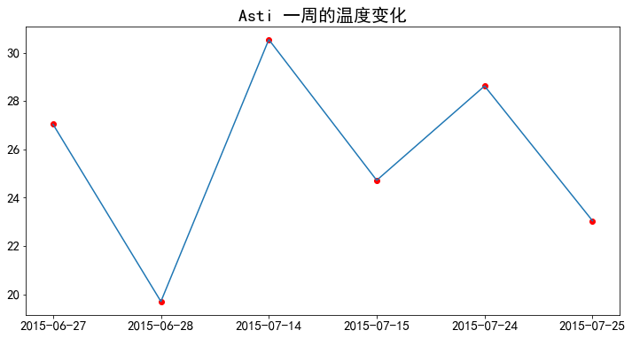

观察发现，离海近的可以形成一条直线，离海远的也能形成一条直线。

分别以100公里和50公里为分界点，划分为离海近和离海远的两组数据

- city_temp['dist'] > 50  # 远距离
- city_temp['dist'] < 100 # 近距离

```python
dist_temp_gt50 = dist_temp[dist_temp['dist'] > 50 ]
dist_temp_lt100 = dist_temp[dist_temp['dist'] < 100]
```

画出远、近的距离与温度的散布图

```python
plt.scatter(dist_temp_gt50['dist'],
            dist_temp_gt50['temp'], c='blue', label='远距离的温度')
plt.scatter(dist_temp_lt100['dist'], 
            dist_temp_lt100['temp'], c='red', label='近距离的温度')
plt.legend()
plt.show()
```

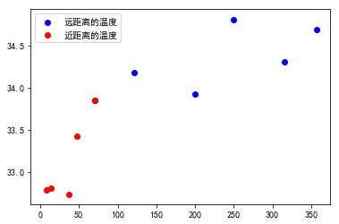

使用线性回归预测给定距离的温度

- 机器学习的线性回归模型 LinearRegression
- scikit-learn 模块中线性模型
  - sklearn.linear_model
- 创建回归模型对象
  - linear = LinearRegression()
- 训练模型
  - fit(x, y) 
    - x 是实际数据的自变量, 必须是 二维数组
    - y 实际数据的因变量
- 预测模型
  - predict(x) 根据预测函数，计算x的结果
    - x 也是一个二维数组

```python
from sklearn.linear_model import LinearRegression
```

创建线性回归模型对象

```python
linear = LinearRegression()
```

训练模型

- 一个被训练过的模型，就是一个预测函数表达式f(x) = wx+b

```python
# 训练数据的X是二维数组， 如 [[1], [2], ...]
train_X = dist_temp_lt100['dist'].values.reshape(-1, 1)
train_y = dist_temp_lt100['temp'].values

linear.fit(train_X, train_y)
```


```
LinearRegression(copy_X=True, fit_intercept=True, n_jobs=1, normalize=False)
```


 预测模型  

```python
dist_temp_lt100
```


<div>
<style scoped>
    .dataframe tbody tr th:only-of-type {
        vertical-align: middle;
    }
    .dataframe tbody tr th {
    vertical-align: top;
}
.dataframe thead th {
    text-align: right;
}
</style>
<table border="1" class="dataframe">
  <thead>
    <tr style="text-align: right;">
      <th></th>
      <th>temp</th>
      <th>dist</th>
    </tr>
    <tr>
      <th>city</th>
      <th></th>
      <th></th>
    </tr>
  </thead>
  <tbody>
    <tr>
      <th>Ravenna</th>
      <td>32.79</td>
      <td>8</td>
    </tr>
    <tr>
      <th>Cesena</th>
      <td>32.81</td>
      <td>14</td>
    </tr>
    <tr>
      <th>Faenza</th>
      <td>32.74</td>
      <td>37</td>
    </tr>
    <tr>
      <th>Ferrara</th>
      <td>33.43</td>
      <td>47</td>
    </tr>
    <tr>
      <th>Bologna</th>
      <td>33.85</td>
      <td>71</td>
    </tr>
  </tbody>
</table>
</div>


```python
test_X = [[23], [35], [50], [55], [70]]
linear.predict(test_X)
```


```
array([32.91212001, 33.11716516, 33.37347161, 33.45890709, 33.71521353])
```


预测100个近距离数据的温度

```python
test_lt100_X = np.linspace(0, 100, num=100)

# 预测数据的维度与训练数据的维度保持一致
test_lt100_y = linear.predict(test_lt100_X.reshape(-1, 1))
```

```python
plt.scatter(dist_temp_gt50['dist'],
            dist_temp_gt50['temp'], c='blue', label='远距离的温度')
plt.scatter(dist_temp_lt100['dist'], 
            dist_temp_lt100['temp'], c='red', label='近距离的温度')

plt.plot(test_lt100_X, test_lt100_y, c='red')
plt.legend()
plt.show()
```

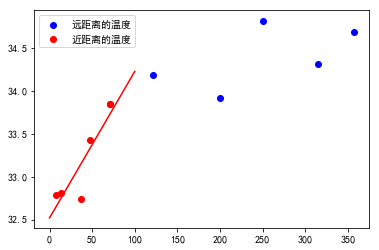

训练远距离和温度的模型

```python
linear.fit(dist_temp_gt50['dist'].values.reshape(-1, 1),
           dist_temp_gt50['temp'].values)
```


```
LinearRegression(copy_X=True, fit_intercept=True, n_jobs=1, normalize=False)
```


预测100个远距离的温度

```python
test_gt50_X = np.linspace(50, 400, num=100)
test_gt50_y = linear.predict(test_gt50_X.reshape(-1, 1))
```

```python
plt.scatter(dist_temp_gt50['dist'],
            dist_temp_gt50['temp'], c='blue', label='远距离的温度')
plt.scatter(dist_temp_lt100['dist'], 
            dist_temp_lt100['temp'], c='red', label='近距离的温度')

plt.plot(test_lt100_X, test_lt100_y, c='red')
plt.plot(test_gt50_X, test_gt50_y, c='blue')
plt.legend()
plt.show()
```

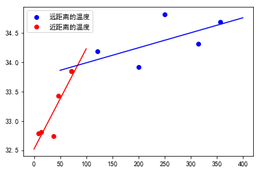

### 风向与风速的关系

- 查看Asti城市的风向wind_deg与风速wind_speed
- 按wind_deg风向排序
- 重新创建索引 reset_index()

```python
asti.dtypes
```


```
temp           float64
humidity         int64
pressure       float64
description     object
dt               int64
wind_speed     float64
wind_deg       float64
city            object
day             object
dist             int64
dtype: object
```


```python
asti_wind = asti[['wind_deg', 'wind_speed', 'temp', 'humidity']]
asti_wind.head()
```


<div>
<style scoped>
    .dataframe tbody tr th:only-of-type {
        vertical-align: middle;
    }
    .dataframe tbody tr th {
    vertical-align: top;
}
.dataframe thead th {
    text-align: right;
}
</style>
<table border="1" class="dataframe">
  <thead>
    <tr style="text-align: right;">
      <th></th>
      <th>wind_deg</th>
      <th>wind_speed</th>
      <th>temp</th>
      <th>humidity</th>
    </tr>
  </thead>
  <tbody>
    <tr>
      <th>180</th>
      <td>80.000</td>
      <td>2.10</td>
      <td>22.68</td>
      <td>60</td>
    </tr>
    <tr>
      <th>181</th>
      <td>50.000</td>
      <td>2.60</td>
      <td>24.05</td>
      <td>60</td>
    </tr>
    <tr>
      <th>182</th>
      <td>100.000</td>
      <td>2.10</td>
      <td>26.56</td>
      <td>57</td>
    </tr>
    <tr>
      <th>183</th>
      <td>70.000</td>
      <td>2.10</td>
      <td>27.20</td>
      <td>57</td>
    </tr>
    <tr>
      <th>184</th>
      <td>154.505</td>
      <td>2.06</td>
      <td>28.56</td>
      <td>29</td>
    </tr>
  </tbody>
</table>
</div>


```python
asti_wind  = asti_wind.sort_values('wind_deg').reset_index(drop=True)
asti_wind.head()
```


<div>
<style scoped>
    .dataframe tbody tr th:only-of-type {
        vertical-align: middle;
    }
    .dataframe tbody tr th {
    vertical-align: top;
}
.dataframe thead th {
    text-align: right;
}
</style>
<table border="1" class="dataframe">
  <thead>
    <tr style="text-align: right;">
      <th></th>
      <th>wind_deg</th>
      <th>wind_speed</th>
      <th>temp</th>
      <th>humidity</th>
    </tr>
  </thead>
  <tbody>
    <tr>
      <th>0</th>
      <td>0.0</td>
      <td>2.10</td>
      <td>24.77</td>
      <td>57</td>
    </tr>
    <tr>
      <th>1</th>
      <td>0.0</td>
      <td>0.50</td>
      <td>22.74</td>
      <td>78</td>
    </tr>
    <tr>
      <th>2</th>
      <td>0.0</td>
      <td>0.50</td>
      <td>27.00</td>
      <td>65</td>
    </tr>
    <tr>
      <th>3</th>
      <td>0.0</td>
      <td>1.00</td>
      <td>24.34</td>
      <td>64</td>
    </tr>
    <tr>
      <th>4</th>
      <td>0.0</td>
      <td>2.06</td>
      <td>25.58</td>
      <td>77</td>
    </tr>
  </tbody>
</table>
</div>


```python
asti_wind.tail()
```


<div>
<style scoped>
    .dataframe tbody tr th:only-of-type {
        vertical-align: middle;
    }
    .dataframe tbody tr th {
    vertical-align: top;
}
.dataframe thead th {
    text-align: right;
}
</style>
<table border="1" class="dataframe">
  <thead>
    <tr style="text-align: right;">
      <th></th>
      <th>wind_deg</th>
      <th>wind_speed</th>
      <th>temp</th>
      <th>humidity</th>
    </tr>
  </thead>
  <tbody>
    <tr>
      <th>63</th>
      <td>350.0</td>
      <td>3.1</td>
      <td>23.00</td>
      <td>78</td>
    </tr>
    <tr>
      <th>64</th>
      <td>350.0</td>
      <td>2.6</td>
      <td>24.45</td>
      <td>73</td>
    </tr>
    <tr>
      <th>65</th>
      <td>360.0</td>
      <td>2.1</td>
      <td>24.24</td>
      <td>73</td>
    </tr>
    <tr>
      <th>66</th>
      <td>360.0</td>
      <td>1.5</td>
      <td>19.81</td>
      <td>73</td>
    </tr>
    <tr>
      <th>67</th>
      <td>360.0</td>
      <td>2.1</td>
      <td>18.01</td>
      <td>77</td>
    </tr>
  </tbody>
</table>
</div>


画出风向与风速的线性图

- 按wind_deg分组，并计算wind_speed的平均风速，最后再plot()画出线形图

```python
asti_wind_mean = asti_wind.groupby('wind_deg')['wind_speed', 'humidity'].mean()
asti_wind_mean.plot()
```


```
<matplotlib.axes._subplots.AxesSubplot at 0x7fe30edf7518>
```


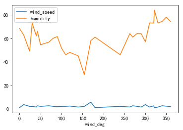


```python
asti_wind_mean.reset_index(inplace=True)
asti_wind_mean
```


<div>
<style scoped>
    .dataframe tbody tr th:only-of-type {
        vertical-align: middle;
    }
    .dataframe tbody tr th {
    vertical-align: top;
}
.dataframe thead th {
    text-align: right;
}
</style>
<table border="1" class="dataframe">
  <thead>
    <tr style="text-align: right;">
      <th></th>
      <th>wind_deg</th>
      <th>wind_speed</th>
      <th>humidity</th>
    </tr>
  </thead>
  <tbody>
    <tr>
      <th>0</th>
      <td>0.000</td>
      <td>1.018667</td>
      <td>68.266667</td>
    </tr>
    <tr>
      <th>1</th>
      <td>10.000</td>
      <td>3.600000</td>
      <td>62.666667</td>
    </tr>
    <tr>
      <th>2</th>
      <td>24.000</td>
      <td>2.060000</td>
      <td>49.000000</td>
    </tr>
    <tr>
      <th>3</th>
      <td>30.000</td>
      <td>2.050000</td>
      <td>73.000000</td>
    </tr>
    <tr>
      <th>4</th>
      <td>40.000</td>
      <td>1.500000</td>
      <td>62.000000</td>
    </tr>
    <tr>
      <th>5</th>
      <td>42.501</td>
      <td>2.570000</td>
      <td>66.000000</td>
    </tr>
    <tr>
      <th>6</th>
      <td>50.000</td>
      <td>2.075000</td>
      <td>54.500000</td>
    </tr>
    <tr>
      <th>7</th>
      <td>70.000</td>
      <td>2.600000</td>
      <td>56.750000</td>
    </tr>
    <tr>
      <th>8</th>
      <td>80.000</td>
      <td>2.100000</td>
      <td>60.000000</td>
    </tr>
    <tr>
      <th>9</th>
      <td>90.000</td>
      <td>1.800000</td>
      <td>61.500000</td>
    </tr>
    <tr>
      <th>10</th>
      <td>100.000</td>
      <td>2.083333</td>
      <td>51.666667</td>
    </tr>
    <tr>
      <th>11</th>
      <td>110.000</td>
      <td>2.100000</td>
      <td>46.000000</td>
    </tr>
    <tr>
      <th>12</th>
      <td>120.000</td>
      <td>2.350000</td>
      <td>48.000000</td>
    </tr>
    <tr>
      <th>13</th>
      <td>140.000</td>
      <td>1.500000</td>
      <td>45.000000</td>
    </tr>
    <tr>
      <th>14</th>
      <td>154.505</td>
      <td>2.060000</td>
      <td>29.000000</td>
    </tr>
    <tr>
      <th>15</th>
      <td>170.000</td>
      <td>5.700000</td>
      <td>58.000000</td>
    </tr>
    <tr>
      <th>16</th>
      <td>180.000</td>
      <td>1.000000</td>
      <td>61.000000</td>
    </tr>
    <tr>
      <th>17</th>
      <td>240.000</td>
      <td>2.100000</td>
      <td>46.000000</td>
    </tr>
    <tr>
      <th>18</th>
      <td>263.000</td>
      <td>1.540000</td>
      <td>64.000000</td>
    </tr>
    <tr>
      <th>19</th>
      <td>270.000</td>
      <td>2.600000</td>
      <td>61.000000</td>
    </tr>
    <tr>
      <th>20</th>
      <td>280.000</td>
      <td>2.100000</td>
      <td>64.000000</td>
    </tr>
    <tr>
      <th>21</th>
      <td>290.000</td>
      <td>1.500000</td>
      <td>64.000000</td>
    </tr>
    <tr>
      <th>22</th>
      <td>300.000</td>
      <td>3.600000</td>
      <td>57.000000</td>
    </tr>
    <tr>
      <th>23</th>
      <td>310.000</td>
      <td>1.500000</td>
      <td>73.000000</td>
    </tr>
    <tr>
      <th>24</th>
      <td>320.000</td>
      <td>2.600000</td>
      <td>73.000000</td>
    </tr>
    <tr>
      <th>25</th>
      <td>321.501</td>
      <td>0.880000</td>
      <td>84.000000</td>
    </tr>
    <tr>
      <th>26</th>
      <td>330.000</td>
      <td>1.500000</td>
      <td>73.000000</td>
    </tr>
    <tr>
      <th>27</th>
      <td>340.000</td>
      <td>2.600000</td>
      <td>74.333333</td>
    </tr>
    <tr>
      <th>28</th>
      <td>350.000</td>
      <td>2.233333</td>
      <td>78.000000</td>
    </tr>
    <tr>
      <th>29</th>
      <td>360.000</td>
      <td>1.900000</td>
      <td>74.333333</td>
    </tr>
  </tbody>
</table>
</div>


在子图中，同时比较风向与湿度和风力的关系

- 查看humidity列的数据类型
- 通过pd.to_numeric()将字符类型转成数值型

```python
asti_wind_mean.dtypes
```


```
wind_deg      float64
wind_speed    float64
humidity      float64
dtype: object
```


```python
fig = plt.figure(figsize=(12, 6))
ax1 = fig.add_subplot(121)
ax1.set_title('风向与风速的关系图')
ax1.plot(asti_wind_mean['wind_deg'], asti_wind_mean['wind_speed'])

ax2 = fig.add_subplot(122)
ax2.set_title('风向与湿度的关系图')
ax2.plot(asti_wind_mean['wind_deg'], asti_wind_mean['humidity'])
plt.show()
```

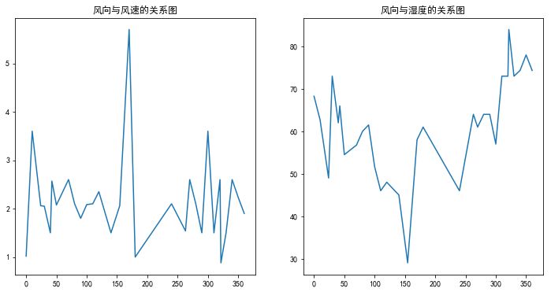


```python
asti_wind_mean.head(10)
```


<div>
<style scoped>
    .dataframe tbody tr th:only-of-type {
        vertical-align: middle;
    }
    .dataframe tbody tr th {
    vertical-align: top;
}
.dataframe thead th {
    text-align: right;
}
</style>
<table border="1" class="dataframe">
  <thead>
    <tr style="text-align: right;">
      <th></th>
      <th>wind_deg</th>
      <th>wind_speed</th>
      <th>humidity</th>
    </tr>
  </thead>
  <tbody>
    <tr>
      <th>0</th>
      <td>0.000</td>
      <td>1.018667</td>
      <td>68.266667</td>
    </tr>
    <tr>
      <th>1</th>
      <td>10.000</td>
      <td>3.600000</td>
      <td>62.666667</td>
    </tr>
    <tr>
      <th>2</th>
      <td>24.000</td>
      <td>2.060000</td>
      <td>49.000000</td>
    </tr>
    <tr>
      <th>3</th>
      <td>30.000</td>
      <td>2.050000</td>
      <td>73.000000</td>
    </tr>
    <tr>
      <th>4</th>
      <td>40.000</td>
      <td>1.500000</td>
      <td>62.000000</td>
    </tr>
    <tr>
      <th>5</th>
      <td>42.501</td>
      <td>2.570000</td>
      <td>66.000000</td>
    </tr>
    <tr>
      <th>6</th>
      <td>50.000</td>
      <td>2.075000</td>
      <td>54.500000</td>
    </tr>
    <tr>
      <th>7</th>
      <td>70.000</td>
      <td>2.600000</td>
      <td>56.750000</td>
    </tr>
    <tr>
      <th>8</th>
      <td>80.000</td>
      <td>2.100000</td>
      <td>60.000000</td>
    </tr>
    <tr>
      <th>9</th>
      <td>90.000</td>
      <td>1.800000</td>
      <td>61.500000</td>
    </tr>
  </tbody>
</table>
</div>


角度 转成 弧度 

- 角度/180 = 弧度/pi， 弧度 = 角度 * pi / 180

asti_wind[(asti_wind['wind_deg'] >= deg) & (asti_wind['wind_deg'] < 45+deg)]['wind_deg']

由于风向是360度，我们可以考虑使用玫瑰图（极坐标条形图）

```python
ax = plt.subplot(polar=True)
# 随机产生颜色值(r, g, b) 取值范围是 [0,1)
ax.bar(index, heights, 
       align='edge',
       color=np.random.random(size=(8, 3)),
       width=0.75)

ax.set_xticklabels(['东', '东北', '北', '西北', '西', '西南', '南', '东南'],
                  fontsize=16, color='red')

heights, labels = plt.yticks()
for lable in labels:
    lable.set_color('blue')
    
plt.show()
```

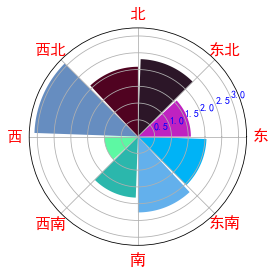


```python
ax = plt.subplot(polar=True)  # 极坐标条形图

# x 坐标方向(八个方向)
degs = np.arange(0, 360, step=45)  # ［0, 45, ....315]

# y轴的数值hegiht x 坐标的个数保持一致
# y轴的数值 每个方向对应的风速有多个，则计算出它的平均风速
heights = [asti_wind['wind_speed'][(asti_wind['wind_deg'] >= deg) 
                      & (asti_wind['wind_deg'] < 45+deg)].mean() for deg in degs]

index = degs*np.pi/180  # 将八个角度转成八弧度

ax.bar(index, heights,
       color=np.random.random(size=(8, 3)), # 颜色 [[0.1, 0.5, 0.3], ]
       align='edge', width=0.7) # 起始的对齐方式

ax.set_xticklabels(['东', '东北', '北', '西北', '西', '西南', '南', '东南'])
ax.set_title('方向与风力的关系', color='r',
            position=(0.5, 1.1), fontsize=15)
plt.show()
```

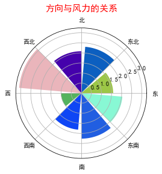

首先自定义一个画图函数

用numpy创建一个直方图，将360度划分为8个面元，将数据分类到这8个面元中

```python
def draw_polar(city, compare_colname, title=None):
    # 获取指定城市的 风向与某一列比较的信息
    city_wind = all_[all_['city'] == city][['wind_deg', compare_colname]]
    city_wind.sort_values('wind_deg', inplace=True) # 按方向排序
    city_wind.reset_index(drop=True, inplace=True)
   
    # 8个方向角度
    degs = np.arange(0, 360, step=45) 
    
    #获取每个方向上的数据的平均值
    heights = [city_wind[compare_colname][(city_wind['wind_deg'] >= deg) &
                         (city_wind['wind_deg'] < 45+deg)].mean() for deg in degs]
    
    # 将角度转为弧度:  角度/360 = 弧度/2*pi
    x = [ deg*np.pi/180  for deg in degs]

    plt.figure(figsize=(6, 6))
    plt.axes(polar = True, frameon=True)

    plt.bar(x, height=heights,
        align='edge',
        bottom=0.1, color=np.random.random(size=(8,3)))
    
    plt.xticks(x, ('东', '东北', '北', '西北', '西', '西南', '南', '东南'),
              fontsize=14)
    
    if title:
        plt.title(city+'城市的'+title,fontsize=20, color='r',
                  loc='center', position=(0.5,1.1))
    plt.show()
```

```python
draw_polar('Bologna', 'humidity', '风向与湿度的关系')
```

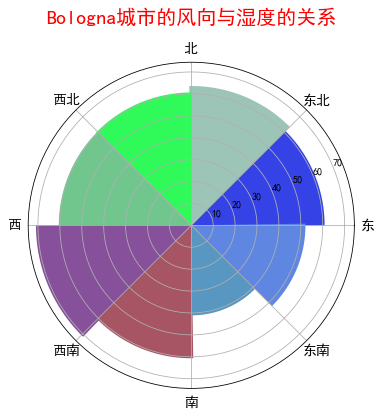

