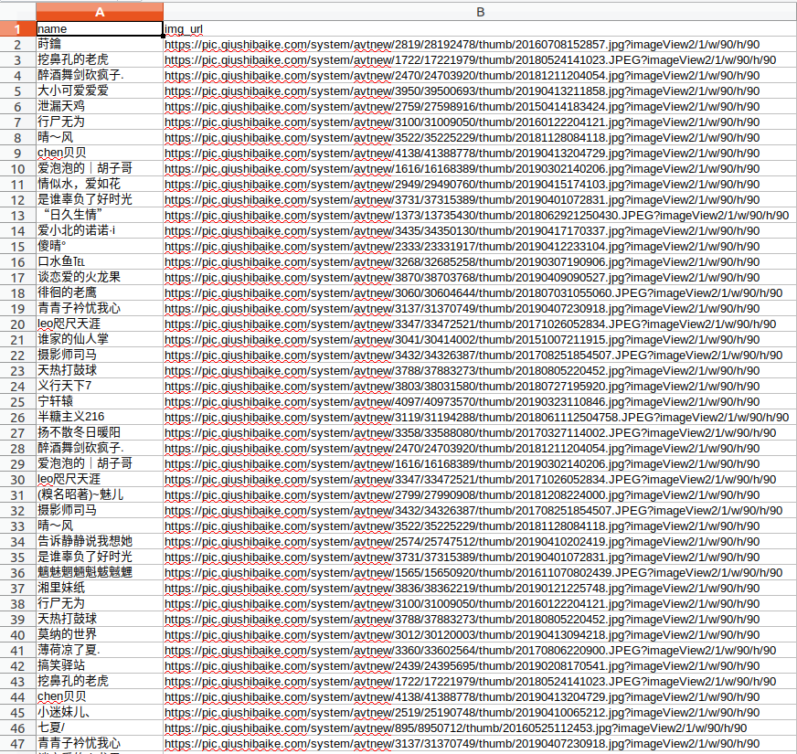

本文将使用三个例子，带大家了解urllib库的使用方法。

安装包：

```python
pip install urllib
```

#### 1.提取网页中的图片链接并下载

<!--more-->

使用urllib下载网页
1) urllib.request.urlopen() 打开网页
2) urllib.request.urlretrieve()  下载网页到文件中
3）response 响应对象

​	code/status 响应状态码

​	headers/info 请求头

​	read() 响应的字节数据

​	readline()/readlines() 响应的文本的数据

```python

#! /usr/bin/env python
# -*-coding:UTF-8-*-
#__author__ : pighui
#__time__ : 2019-4-17 上午11:01


from http.client import HTTPResponse
from threading import Thread
from urllib.request import urlopen, urlretrieve
# 解决ssl证书的问题
import ssl
ssl._create_default_https_context = ssl._create_unverified_context
from util.md5_format import md5_code

def download(url):
    # 下载（请求）url
    # 如果data参数不为空，则表示本次请求的方法是POST,反之为GET
    response: HTTPResponse = urlopen(url)
    if response.getcode() == 200:
        print(response.geturl(), '--请求成功---')
        # print(response.info())  # 响应头(原始的header信息)
        print(type(response.headers))
        print(type(response))
        print(response.status, response.code, response.getcode())
        print(type(response.headers),  # http.client.HTTPMessage
              type(response.info()),  # http.client.HTTPMessage
              type(response.getheaders()))  # list((key, value), ....)
        print(response.getheaders())
        print(response.getheader('Content-Type'))  # 读取响应头的key
        print(response.getheader('Content-Length'))  # 不存在的key,返回None

        # html = response.readlines()  # 读取所有的网页信息
        # 读取响应文本数据的字符集
        content_type = response.getheader('Content-Type')  # text/html; charset=utf-8
        charset = content_type.split(';')[-1].split('=')[-1]

        html = response.read().decode(encoding=charset)
        print(html)

        with open('gushiwen.html', mode='w', encoding=charset) as file:
            file.write(html)
    else:
        print(response.geturl(), '请求失败', response.code)


def save_url(url, filename):
    # 下载并保存网页
    urlretrieve(url, filename)


def save_img(url):
    if url.endswith('.jpg') or url.endswith('.png'):
        urlretrieve(url, url.split('/')[-1])
        return

    filename = md5_code(url)
    resp = urlopen(url)

    # 读取响应的图片类型 jpg, png, gif
    content_type = resp.getheader('Content-Type')
    img_type = content_type.split(';')[0]

    filename += '.'+img_type.split("/")[-1]

    with open(filename, mode='wb') as file:
        file.write(resp.read())

    print('保存图片%s 成功' % filename)


def async_download(url):
    Thread(target=save_img, args=(url, )).start()

if __name__ == '__main__':
    #download('https://www.gushiwen.org/')
    #save_url('https://www.gushiwen.org/', '1.html')
    #save_img('https://ss0.baidu.com/6ONWsjip0QIZ8tyhnq/it/u=678166707,880764255&fm=179&app=42&f=JPEG?w=121&h=140')
    url1 = 'https://ss0.baidu.com/6ONWsjip0QIZ8tyhnq/it/u=678166707,880764255&fm=179&app=42&f=JPEG?w=121&h=140'
    async_download(url1)
    print('--开始下载图片--', url1)

```

#### 2.带有请求头的request

urlopen() 只负责下载
urlretrieve() 下载并存储到文件中

1） 在请求时，如何添加一个请求头
2） 如何发起post请求

```python
#! /usr/bin/env python
# -*-coding:UTF-8-*-
# __author__ : pighui
# __time__ : 2019-4-17 下午2:47


import re
from urllib.request import urlopen, Request
from urllib.parse import quote,urlencode
import json


def get(url):
    # 声明请求头
    headers = {
        'User-Agent': 'Mozilla/5.0 (Macintosh; Intel Mac OS X 10.14; rv:66.0) Gecko/20100101 Firefox/66.0',
        'Cookie': '__cfduid=dce29ab8587a6cafa917962eac2dfe2d11555483488; '
                  'Hm_lvt_9b496e3d6adef11b924b6b261a56dff8=1555483491;'
                  ' Hm_lpvt_9b496e3d6adef11b924b6b261a56dff8=1555483514;'
                  ' BDTUJIAID=491cb6336da24c06bd13398fe2e150a6',
        'Referer': 'http://www.baidu.com/'
    }

    # 创建请求，可以添加请求头
    request = Request(url, headers=headers)

    response = urlopen(request)  # 发起请求

    # 判断请求是否成功
    assert response.code == 200  # 如果断言失败，则抛出AssertionError
    print(url, '请求成功!')
    # html = response.read()

    lines = ''
    charset = None
    for line in response:  # 可迭代的response
        if not charset:
            # 尝试从正文中获取字符集
            try:
                line_txt = line.decode()
                lines += line_txt
                if line_txt.startswith('<meta'):
                    s = re.findall(r'charset=(\w+?)"', line_txt)
                    if s:
                        charset = s[0]
            except:
                pass

            continue

        try:
            lines += line.decode(charset)
        except:
            pass

    print(charset)
    print(lines)
    # html = lines.decode(charset)
    # print(html)
    # print(response.getheader('Content-Type'))


def post(url,data,headers):
    #实现post请求
    #设置Request的data参数，就是post请求
    data = urlencode(data)
    request = Request(url,data.encode(),headers)
    #发起请求
    resp = urlopen(request)
    if resp.status == 200:
        #响应的数据是json类型
        resp_data = resp.read()
        #获取字符集
        content_type = resp.getheader('Content-Type')
        s= re.findall(r'charset=(\w+)', content_type)
        if s:
            charset = s[0]
            json_data=resp_data.decode(charset)
        else:
            json_data=resp_data.decode()
        #print(json_data)
        means = json.loads(json_data)
        print(means.get('dict_result').get('simple_means').get('word_means'))

if __name__ == '__main__':
    #url = 'http://www.haha56.net/'
    #get(url)
    url = 'https://fanyi.baidu.com/v2transapi'
    data = {
        'from' : 'en',
        'to' : 'zh',
        'query': 'orange',
        'simple_means_flag': 3,
        'sign': '633076.871365',
        'token': 'a349279846f4d114c1a93ce82694603e'
    }
    headers = {
        'User-Agent': 'Mozilla/5.0 (X11; Ubuntu; Linux x86_64; rv:66.0) Gecko/20100101 Firefox/66.0',
        'Cookie': 'BAIDUID=CE4824AB95BCEDB8A95F17AD49690358:FG=1; BIDUPSID=CE4824AB95BCEDB8A95F17AD49690358; PSTM=1554878786; locale=zh; Hm_lvt_64ecd82404c51e03dc91cb9e8c025574=1555488877; Hm_lpvt_64ecd82404c51e03dc91cb9e8c025574=1555490031; from_lang_often=%5B%7B%22value%22%3A%22zh%22%2C%22text%22%3A%22%u4E2D%u6587%22%7D%2C%7B%22value%22%3A%22en%22%2C%22text%22%3A%22%u82F1%u8BED%22%7D%5D; to_lang_often=%5B%7B%22value%22%3A%22en%22%2C%22text%22%3A%22%u82F1%u8BED%22%7D%2C%7B%22value%22%3A%22zh%22%2C%22text%22%3A%22%u4E2D%u6587%22%7D%5D; REALTIME_TRANS_SWITCH=1; FANYI_WORD_SWITCH=1; HISTORY_SWITCH=1; SOUND_SPD_SWITCH=1; SOUND_PREFER_SWITCH=1'
    }
    post(url,data,headers)
```

#### 3.练习：爬取 糗事百科作者信息

url= 'https://www.qiushibaike.com/text/'
1)下载网页
2）获取信息
3）保存信息

```python
#! /usr/bin/env python
# -*-coding:UTF-8-*-
#__author__ : pighui
#__time__ : 2019-4-17 下午4:58


'''
爬取 糗事百科中文字内容以及作者信息
url= 'https://www.qiushibaike.com/text/'
1)下载网页
2）获取信息
3）保存信息
'''
import csv
import re
from urllib.request import urlopen, Request, urlretrieve
import ssl
import os
from util.md5_format import md5_code


ssl._create_default_https_context = ssl._create_unverified_context

def get(url):
    headers = {
        'User-Agent': 'Mozilla/5.0 (Macintosh; Intel Mac OS X 10.14; '
                      'rv:66.0) Gecko/20100101 Firefox/66.0'
    }
    request = Request(url, headers = headers)
    response = urlopen(request)
    #print(response.code,response.getheader('Content-Type'))
    charset = re.findall(r'charset=(\w+)',
                         response.getheader('Content-Type'))[0]
    html = response.read()
    html = html.decode(charset)
    return html

def parse(html):
    base_url = '//pic.qiushibaike.com/system/avtnew/'
    s = re.findall(r'', html)
    list = []
    for img_url,name in s:
        save({'img_url':'https:' + base_url + img_url, 'name':name})
        list.append('https:' + base_url + img_url)
    return list

def save(item):
    exist_header = os.path.exists('qiushibaike_author.csv')
    with open ('qiushibaike_author.csv','a') as f:
        writer = csv.DictWriter(f, fieldnames=('name', 'img_url'))
        if not exist_header:
            #如果文件不存在，则表示第一次写入
            writer.writeheader()
        writer.writerow(item)


def download_img(list):
    #下载头像(带扩展名，文件名md5加密)
    #https://pic.qiushibaike.com/system/avtnew/3100/31009050/thumb/20160122204121.jpg?imageView2/1/w/90/h/90
    for url in list:
        filename = md5_code(url) + '.' + url.split('?')[0].split('.')[-1]
        urlretrieve(url, filename)
        print('保存图片%s 成功' % filename)
    print("下载完成")


    filename = md5_code(url)
    resp = urlopen(url)


if __name__ == '__main__':
    url = 'https://www.qiushibaike.com/text/'
    html = get(url)
    list = parse(html)
    download_img(list)
```

最后滴数据是这样子滴

