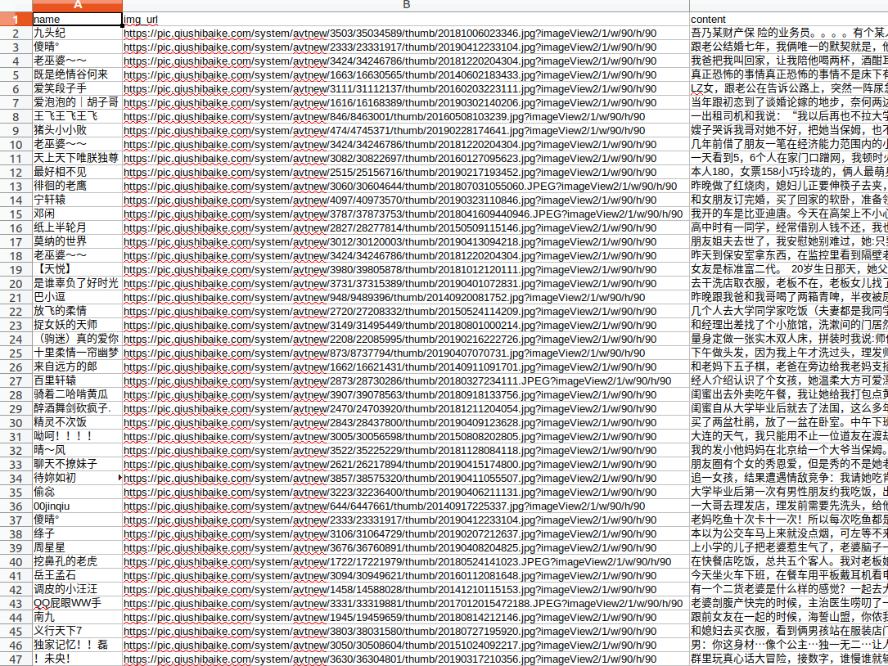

本文将介绍如何使用xpath进行网页内容的提取。

安装包：

```bash
pip install lxml
```

工具准备：

- Chrome浏览器
- xpath扩展程序（插件）

<!--more-->

#### 使用xpath爬取糗事百科中的段子

目标网址： https://www.qiushibaike.com/text/

提取用户信息、内容

提取用户的头像和用户名
//div[@class='author clearfix']//img/@src
//div[@class='author clearfix']//img/@alt

提取简述的内容
//div[@class="content"]/span[1]

提取下一页的链接
//ul[@class='pagination']/li[last()]/a/@href

```python
#! /usr/bin/env python
# -*-coding:UTF-8-*-
#__author__ : pighui
#__time__ : 2019-4-18 上午11:13


import re
import time
from urllib.request import Request, urlopen
import csv
import os
import ssl
ssl._create_default_https_context = ssl._create_unverified_context

from lxml import etree

#UA列表，避免请求过于频繁
headers_list = ['Mozilla/5.0 (Macintosh; U; Intel Mac OS X 10_6_8; en-us) AppleWebKit/534.50 (KHTML, like Gecko) Version/5.1 Safari/534.50',
                'Mozilla/5.0 (Windows; U; Windows NT 6.1; en-us) AppleWebKit/534.50 (KHTML, like Gecko) Version/5.1 Safari/534.50',
                'Mozilla/5.0 (compatible; MSIE 9.0; Windows NT 6.1; Trident/5.0;',
                'Mozilla/4.0 (compatible; MSIE 8.0; Windows NT 6.0; Trident/4.0)',
                'Mozilla/4.0 (compatible; MSIE 7.0; Windows NT 6.0)',
                'Mozilla/4.0 (compatible; MSIE 6.0; Windows NT 5.1)',
                'Mozilla/5.0 (Macintosh; Intel Mac OS X 10.6; rv:2.0.1) Gecko/20100101 Firefox/4.0.1',
                'Mozilla/5.0 (Windows NT 6.1; rv:2.0.1) Gecko/20100101 Firefox/4.0.1',
                'Opera/9.80 (Macintosh; Intel Mac OS X 10.6.8; U; en) Presto/2.8.131 Version/11.11',
                'Opera/9.80 (Windows NT 6.1; U; en) Presto/2.8.131 Version/11.11',
                'Mozilla/5.0 (Macintosh; Intel Mac OS X 10_7_0) AppleWebKit/535.11 (KHTML, like Gecko) Chrome/17.0.963.56 Safari/535.11',
                'Mozilla/4.0 (compatible; MSIE 7.0; Windows NT 5.1; Maxthon 2.0)',
                'Mozilla/4.0 (compatible; MSIE 7.0; Windows NT 5.1; TencentTraveler 4.0)',
                'Mozilla/4.0 (compatible; MSIE 7.0; Windows NT 5.1)',
                'Mozilla/4.0 (compatible; MSIE 7.0; Windows NT 5.1; The World)',
                'Mozilla/4.0 (compatible; MSIE 7.0; Windows NT 5.1; Trident/4.0; SE 2.X MetaSr 1.0; SE 2.X MetaSr 1.0; .NET CLR 2.0.50727; SE 2.X MetaSr 1.0)',
                'Mozilla/4.0 (compatible; MSIE 7.0; Windows NT 5.1; 360SE)',
                'Mozilla/4.0 (compatible; MSIE 7.0; Windows NT 5.1; Avant Browser)',
                'Mozilla/5.0 (Macintosh; Intel Mac OS X 10.14; rv:66.0) Gecko/20100101 Firefox/66.0',
]

def get(url,count):
    i = (int(count)-1)%len(headers_list)
    headers = {
        'User-Agent': headers_list[i]
    }
    request = Request(url, headers = headers)
    response = urlopen(request)
    if response.code == 200:
        print("请求第%s页成功"%count)
    charset = re.findall(r'charset=(\w+)', response.getheader('Content-Type'))[0]
    html = response.read()
    parse(html.decode(charset),count)


def parse(html,count):
    #将html文本传入到xpath解析器中
    root = etree.HTML(html)
    print("正在爬取第%s页" % count)
    #1.每个用户的区域提取
    articles = root.xpath("//div[starts-with(@class, 'article')]")
    for article in articles:
        #读取作者的头像和链接
        author = article.xpath("./div[starts-with(@class, 'author')]//img")
        if author:
            name = author[0].get('alt')
            img_url = "https:" + author[0].get('src')
            #读取作者发布的内容
            content= article.xpath(".//div[@class='content']/span[1]/text()")
            #对文本内容进行处理
            content = "".join(content)
            content = content.replace('\n', '')
            #保存到字典
            save(dict( name = name, img_url =   img_url, content=content))
    # 提取下一页的链接
    # //ul[@class='pagination']/li[last()]/a/@href
    next_url = root.xpath("//ul[@class='pagination']/li[last()]/a/@href")
    time.sleep(1)
    count = next_url[0].rstrip("/").split('/')[-1]
    try:
        #尝试请求下一页
        get('https://www.qiushibaike.com' + next_url[0], count)  # 请求下一页
    except:
        #如果没有请求到，则表示没有下一页，即所有页面爬取完成
        print("爬取完成")


def save(item):
    '''
    将数据存入csv文件中
    '''
    #print(item['name'] , item['img_url'] , item['content'], sep='\n')
    exist_header = os.path.exists('qiushibaike_new.csv')
    with open('qiushibaike_new.csv', 'a') as f:
        writer = csv.DictWriter(f, fieldnames=('name', 'img_url', 'content'))
        if not exist_header:
            # 如果文件不存在，则表示第一次写入，须写入文件头
            writer.writeheader()
        writer.writerow(item)


if __name__ == '__main__':
    #初始化计数器为第一页
    count = 1
    #初始链接
    url = 'https://www.qiushibaike.com/text/'
    get(url,count)

```

最后滴数据是这样子滴

