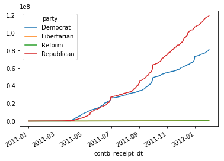

导入包

```python
import numpy as np
import pandas as pd
from pandas import Series, DataFrame, Index

import matplotlib.pyplot as plt
%matplotlib inline
```

<!--more-->

方便大家操作，将月份和参选人以及所在政党进行定义

```python
months = {'JAN' : 1, 'FEB' : 2, 'MAR' : 3, 'APR' : 4, 'MAY' : 5, 'JUN' : 6,
          'JUL' : 7, 'AUG' : 8, 'SEP' : 9, 'OCT': 10, 'NOV': 11, 'DEC' : 12}
# 候选人
of_interest = ['Obama, Barack', 'Romney, Mitt', 'Santorum, Rick', 
               'Paul, Ron', 'Gingrich, Newt']

# 候选人和所在政党的映射字典
parties = {
  'Bachmann, Michelle': 'Republican',
  'Romney, Mitt': 'Republican',
  'Obama, Barack': 'Democrat',
  "Roemer, Charles E. 'Buddy' III": 'Reform',
  'Pawlenty, Timothy': 'Republican',
  'Johnson, Gary Earl': 'Libertarian',
  'Paul, Ron': 'Republican',
  'Santorum, Rick': 'Republican',
  'Cain, Herman': 'Republican',
  'Gingrich, Newt': 'Republican',
  'McCotter, Thaddeus G': 'Republican',
  'Huntsman, Jon': 'Republican',
  'Perry, Rick': 'Republican'           
 }
```

读取文件

查看文件样式以及基本信息

```python
election = pd.read_csv('美国2012年大选政治献金数据分析/usa_election.txt', low_memory=False)
```

```python
election.head()
```


<div>
<style scoped>
    .dataframe tbody tr th:only-of-type {
        vertical-align: middle;
    }
    .dataframe tbody tr th {
    vertical-align: top;
}
.dataframe thead th {
    text-align: right;
}
</style>
<table border="1" class="dataframe">
  <thead>
    <tr style="text-align: right;">
      <th></th>
      <th>cmte_id</th>
      <th>cand_id</th>
      <th>cand_nm</th>
      <th>contbr_nm</th>
      <th>contbr_city</th>
      <th>contbr_st</th>
      <th>contbr_zip</th>
      <th>contbr_employer</th>
      <th>contbr_occupation</th>
      <th>contb_receipt_amt</th>
      <th>contb_receipt_dt</th>
      <th>receipt_desc</th>
      <th>memo_cd</th>
      <th>memo_text</th>
      <th>form_tp</th>
      <th>file_num</th>
    </tr>
  </thead>
  <tbody>
    <tr>
      <th>0</th>
      <td>C00410118</td>
      <td>P20002978</td>
      <td>Bachmann, Michelle</td>
      <td>HARVEY, WILLIAM</td>
      <td>MOBILE</td>
      <td>AL</td>
      <td>366010290</td>
      <td>RETIRED</td>
      <td>RETIRED</td>
      <td>250.0</td>
      <td>20-JUN-11</td>
      <td>NaN</td>
      <td>NaN</td>
      <td>NaN</td>
      <td>SA17A</td>
      <td>736166</td>
    </tr>
    <tr>
      <th>1</th>
      <td>C00410118</td>
      <td>P20002978</td>
      <td>Bachmann, Michelle</td>
      <td>HARVEY, WILLIAM</td>
      <td>MOBILE</td>
      <td>AL</td>
      <td>366010290</td>
      <td>RETIRED</td>
      <td>RETIRED</td>
      <td>50.0</td>
      <td>23-JUN-11</td>
      <td>NaN</td>
      <td>NaN</td>
      <td>NaN</td>
      <td>SA17A</td>
      <td>736166</td>
    </tr>
    <tr>
      <th>2</th>
      <td>C00410118</td>
      <td>P20002978</td>
      <td>Bachmann, Michelle</td>
      <td>SMITH, LANIER</td>
      <td>LANETT</td>
      <td>AL</td>
      <td>368633403</td>
      <td>INFORMATION REQUESTED</td>
      <td>INFORMATION REQUESTED</td>
      <td>250.0</td>
      <td>05-JUL-11</td>
      <td>NaN</td>
      <td>NaN</td>
      <td>NaN</td>
      <td>SA17A</td>
      <td>749073</td>
    </tr>
    <tr>
      <th>3</th>
      <td>C00410118</td>
      <td>P20002978</td>
      <td>Bachmann, Michelle</td>
      <td>BLEVINS, DARONDA</td>
      <td>PIGGOTT</td>
      <td>AR</td>
      <td>724548253</td>
      <td>NONE</td>
      <td>RETIRED</td>
      <td>250.0</td>
      <td>01-AUG-11</td>
      <td>NaN</td>
      <td>NaN</td>
      <td>NaN</td>
      <td>SA17A</td>
      <td>749073</td>
    </tr>
    <tr>
      <th>4</th>
      <td>C00410118</td>
      <td>P20002978</td>
      <td>Bachmann, Michelle</td>
      <td>WARDENBURG, HAROLD</td>
      <td>HOT SPRINGS NATION</td>
      <td>AR</td>
      <td>719016467</td>
      <td>NONE</td>
      <td>RETIRED</td>
      <td>300.0</td>
      <td>20-JUN-11</td>
      <td>NaN</td>
      <td>NaN</td>
      <td>NaN</td>
      <td>SA17A</td>
      <td>736166</td>
    </tr>
  </tbody>
</table>
</div>


【知识点】使用map函数+字典，新建一列各个候选人'cand_nm' 所在党派party

```python
election['cand_nm'].unique()
```


```
array(['Bachmann, Michelle', 'Romney, Mitt', 'Obama, Barack',
       "Roemer, Charles E. 'Buddy' III", 'Pawlenty, Timothy',
       'Johnson, Gary Earl', 'Paul, Ron', 'Santorum, Rick',
       'Cain, Herman', 'Gingrich, Newt', 'McCotter, Thaddeus G',
       'Huntsman, Jon', 'Perry, Rick'], dtype=object)
```


```python
election['party'] = election['cand_nm'].map(parties)
election.head()
```


<div>
<style scoped>
    .dataframe tbody tr th:only-of-type {
        vertical-align: middle;
    }
    .dataframe tbody tr th {
    vertical-align: top;
}
.dataframe thead th {
    text-align: right;
}
</style>
<table border="1" class="dataframe">
  <thead>
    <tr style="text-align: right;">
      <th></th>
      <th>cmte_id</th>
      <th>cand_id</th>
      <th>cand_nm</th>
      <th>contbr_nm</th>
      <th>contbr_city</th>
      <th>contbr_st</th>
      <th>contbr_zip</th>
      <th>contbr_employer</th>
      <th>contbr_occupation</th>
      <th>contb_receipt_amt</th>
      <th>contb_receipt_dt</th>
      <th>receipt_desc</th>
      <th>memo_cd</th>
      <th>memo_text</th>
      <th>form_tp</th>
      <th>file_num</th>
      <th>party</th>
    </tr>
  </thead>
  <tbody>
    <tr>
      <th>0</th>
      <td>C00410118</td>
      <td>P20002978</td>
      <td>Bachmann, Michelle</td>
      <td>HARVEY, WILLIAM</td>
      <td>MOBILE</td>
      <td>AL</td>
      <td>366010290</td>
      <td>RETIRED</td>
      <td>RETIRED</td>
      <td>250.0</td>
      <td>20-JUN-11</td>
      <td>NaN</td>
      <td>NaN</td>
      <td>NaN</td>
      <td>SA17A</td>
      <td>736166</td>
      <td>Republican</td>
    </tr>
    <tr>
      <th>1</th>
      <td>C00410118</td>
      <td>P20002978</td>
      <td>Bachmann, Michelle</td>
      <td>HARVEY, WILLIAM</td>
      <td>MOBILE</td>
      <td>AL</td>
      <td>366010290</td>
      <td>RETIRED</td>
      <td>RETIRED</td>
      <td>50.0</td>
      <td>23-JUN-11</td>
      <td>NaN</td>
      <td>NaN</td>
      <td>NaN</td>
      <td>SA17A</td>
      <td>736166</td>
      <td>Republican</td>
    </tr>
    <tr>
      <th>2</th>
      <td>C00410118</td>
      <td>P20002978</td>
      <td>Bachmann, Michelle</td>
      <td>SMITH, LANIER</td>
      <td>LANETT</td>
      <td>AL</td>
      <td>368633403</td>
      <td>INFORMATION REQUESTED</td>
      <td>INFORMATION REQUESTED</td>
      <td>250.0</td>
      <td>05-JUL-11</td>
      <td>NaN</td>
      <td>NaN</td>
      <td>NaN</td>
      <td>SA17A</td>
      <td>749073</td>
      <td>Republican</td>
    </tr>
    <tr>
      <th>3</th>
      <td>C00410118</td>
      <td>P20002978</td>
      <td>Bachmann, Michelle</td>
      <td>BLEVINS, DARONDA</td>
      <td>PIGGOTT</td>
      <td>AR</td>
      <td>724548253</td>
      <td>NONE</td>
      <td>RETIRED</td>
      <td>250.0</td>
      <td>01-AUG-11</td>
      <td>NaN</td>
      <td>NaN</td>
      <td>NaN</td>
      <td>SA17A</td>
      <td>749073</td>
      <td>Republican</td>
    </tr>
    <tr>
      <th>4</th>
      <td>C00410118</td>
      <td>P20002978</td>
      <td>Bachmann, Michelle</td>
      <td>WARDENBURG, HAROLD</td>
      <td>HOT SPRINGS NATION</td>
      <td>AR</td>
      <td>719016467</td>
      <td>NONE</td>
      <td>RETIRED</td>
      <td>300.0</td>
      <td>20-JUN-11</td>
      <td>NaN</td>
      <td>NaN</td>
      <td>NaN</td>
      <td>SA17A</td>
      <td>736166</td>
      <td>Republican</td>
    </tr>
  </tbody>
</table>
</div>


查看单独一行，是否加上了'party'一列

```python
election.head(1)
```


<div>
<style scoped>
    .dataframe tbody tr th:only-of-type {
        vertical-align: middle;
    }
    .dataframe tbody tr th {
    vertical-align: top;
}
.dataframe thead th {
    text-align: right;
}
</style>
<table border="1" class="dataframe">
  <thead>
    <tr style="text-align: right;">
      <th></th>
      <th>cmte_id</th>
      <th>cand_id</th>
      <th>cand_nm</th>
      <th>contbr_nm</th>
      <th>contbr_city</th>
      <th>contbr_st</th>
      <th>contbr_zip</th>
      <th>contbr_employer</th>
      <th>contbr_occupation</th>
      <th>contb_receipt_amt</th>
      <th>contb_receipt_dt</th>
      <th>receipt_desc</th>
      <th>memo_cd</th>
      <th>memo_text</th>
      <th>form_tp</th>
      <th>file_num</th>
      <th>party</th>
    </tr>
  </thead>
  <tbody>
    <tr>
      <th>0</th>
      <td>C00410118</td>
      <td>P20002978</td>
      <td>Bachmann, Michelle</td>
      <td>HARVEY, WILLIAM</td>
      <td>MOBILE</td>
      <td>AL</td>
      <td>366010290</td>
      <td>RETIRED</td>
      <td>RETIRED</td>
      <td>250.0</td>
      <td>20-JUN-11</td>
      <td>NaN</td>
      <td>NaN</td>
      <td>NaN</td>
      <td>SA17A</td>
      <td>736166</td>
      <td>Republican</td>
    </tr>
  </tbody>
</table>
</div>


使用np.unique()函数查看colums：party这一列中有哪些元素

```python
election['party'].unique()
```


```
array(['Republican', 'Democrat', 'Reform', 'Libertarian'], dtype=object)
```


使用Series.value_counts()函数，统计party列中各个元素出现次数

```python
election['party'].value_counts()
```


```
Democrat       292400
Republican     237575
Reform           5364
Libertarian       702
Name: party, dtype: int64
```


【知识点】使用groupby()函数，查看各个党派收到的政治献金总数contb_receipt_amt

尝试将金额的单位修改为 '百万'

```python
election.groupby('party')['contb_receipt_amt'].sum() / 1000000
```


```
party
Democrat        81.057579
Libertarian      0.413277
Reform           0.339034
Republican     119.225484
Name: contb_receipt_amt, dtype: float64
```


查看具体每天各个党派收到的政治献金总数contb_receipt_amt  
使用groupby([多个分组参数])

```python
election.groupby(['contb_receipt_dt', 'party'])['contb_receipt_amt'].sum()
```


```
contb_receipt_dt  party      
01-APR-11         Reform              50.00
                  Republican       12635.00
01-AUG-11         Democrat        175281.00
                  Libertarian       1000.00
                  Reform            1847.00
                  Republican      234598.46
01-DEC-11         Democrat        651532.82
                  Libertarian        725.00
                  Reform             875.00
                  Republican      486405.96
01-FEB-11         Republican         250.00
01-JAN-11         Republican        8600.00
01-JAN-12         Democrat         58098.80
                  Reform             515.00
                  Republican       75704.72
01-JUL-11         Democrat        165961.00
                  Libertarian       2000.00
                  Reform             100.00
                  Republican      115848.72
01-JUN-11         Democrat        145459.00
                  Libertarian        500.00
                  Reform              50.00
                  Republican      433109.20
01-MAR-11         Republican        1000.00
01-MAY-11         Democrat         82644.00
                  Reform             480.00
                  Republican       28663.87
01-NOV-11         Democrat        122529.87
                  Libertarian       3000.00
                  Reform            1792.00
                                    ...    
30-OCT-11         Reform            3910.00
                  Republican       43913.16
30-SEP-11         Democrat       3373517.24
                  Libertarian        550.00
                  Reform            2050.00
                  Republican     4886331.76
31-AUG-11         Democrat        374387.44
                  Libertarian      10750.00
                  Reform             450.00
                  Republican     1017735.02
31-DEC-11         Democrat       3553072.57
                  Reform             695.00
                  Republican     1094376.72
31-JAN-11         Republican        6000.00
31-JAN-12         Democrat       1418410.31
                  Reform             150.00
                  Republican      869890.41
31-JUL-11         Democrat         20305.00
                  Reform             966.00
                  Republican       12781.02
31-MAR-11         Reform             200.00
                  Republican       62475.00
31-MAY-11         Democrat        351705.66
                  Libertarian        250.00
                  Reform             100.00
                  Republican      301339.80
31-OCT-11         Democrat        204996.87
                  Libertarian       4250.00
                  Reform            3105.00
                  Republican      734601.83
Name: contb_receipt_amt, Length: 1183, dtype: float64
```


查看日期格式，并将其转换为Pandas的日期格式,通过函数加map方式进行转换

pd.to_datetime(series_obj)

```python
election.dtypes
```


```
cmte_id               object
cand_id               object
cand_nm               object
contbr_nm             object
contbr_city           object
contbr_st             object
contbr_zip            object
contbr_employer       object
contbr_occupation     object
contb_receipt_amt    float64
contb_receipt_dt      object
receipt_desc          object
memo_cd               object
memo_text             object
form_tp               object
file_num               int64
party                 object
dtype: object
```


```python
election['contb_receipt_dt'].unique()
```


```
array(['20-JUN-11', '23-JUN-11', '05-JUL-11', '01-AUG-11', '21-JUN-11',
       '22-JUN-11', '17-JUN-11', '11-JUL-11', '08-JUL-11', '27-JUN-11',
       '13-JUN-11', '16-JUN-11', '18-JUL-11', '05-AUG-11', '01-JUL-11',
       '06-JUL-11', '13-JUL-11', '28-JUN-11', '30-JUN-11', '08-AUG-11',
       '15-AUG-11', '16-AUG-11', '18-AUG-11', '24-JUN-11', '11-OCT-11',
       '14-JUL-11', '29-JUN-11', '18-OCT-11', '30-SEP-11', '11-AUG-11',
       '02-AUG-11', '14-JUN-11', '23-AUG-11', '07-JUL-11', '25-JUL-11',
       '21-JUL-11', '24-OCT-11', '12-JUL-11', '28-JUL-11', '09-SEP-11',
       '10-NOV-11', '12-SEP-11', '04-OCT-11', '05-DEC-11', '31-OCT-11',
       '12-DEC-11', '29-JUL-11', '22-JUL-11', '27-OCT-11', '28-NOV-11',
       '26-AUG-11', '26-SEP-11', '27-JUL-11', '28-APR-11', '31-DEC-11',
       '29-DEC-11', '22-NOV-11', '28-JAN-12', '29-NOV-11', '21-AUG-11',
       '16-MAY-11', '18-MAY-11', '12-MAY-11', '19-MAY-11', '19-SEP-11',
       '16-APR-11', '15-MAY-11', '15-JUN-11', '11-SEP-11', '06-SEP-11',
       '15-OCT-11', '20-NOV-11', '15-DEC-11', '27-DEC-11', '02-DEC-11',
       '06-DEC-11', '09-DEC-11', '29-SEP-11', '28-SEP-11', '01-SEP-11',
       '15-SEP-11', '09-AUG-11', '16-SEP-11', '14-SEP-11', '03-MAY-11',
       '02-SEP-11', '07-SEP-11', '15-JUL-11', '26-JUL-11', '25-AUG-11',
       '02-MAY-11', '23-JAN-12', '09-JAN-12', '11-JAN-12', '25-JAN-12',
       '05-JAN-12', '13-JAN-12', '20-JAN-12', '15-JAN-12', '30-JAN-12',
       '16-JAN-12', '04-JAN-12', '26-JAN-12', '27-JAN-12', '10-JAN-12',
       '12-JAN-12', '22-JAN-12', '01-JAN-12', '30-DEC-11', '17-DEC-11',
       '08-NOV-11', '25-OCT-11', '17-NOV-11', '07-NOV-11', '13-OCT-11',
       '18-NOV-11', '22-DEC-11', '17-JAN-12', '21-DEC-11', '07-DEC-11',
       '29-OCT-11', '10-OCT-11', '17-AUG-11', '24-MAY-11', '06-JUN-11',
       '31-MAY-11', '29-APR-11', '13-APR-11', '27-SEP-11', '17-SEP-11',
       '30-AUG-11', '20-SEP-11', '29-AUG-11', '11-JUN-11', '23-MAY-11',
       '08-SEP-11', '22-SEP-11', '22-AUG-11', '12-AUG-11', '27-MAY-11',
       '19-APR-11', '24-AUG-11', '19-AUG-11', '28-AUG-11', '21-SEP-11',
       '10-AUG-11', '20-JUL-11', '21-NOV-11', '02-OCT-11', '19-OCT-11',
       '18-JAN-12', '24-JAN-12', '09-NOV-11', '14-NOV-11', '16-DEC-11',
       '28-OCT-11', '02-NOV-11', '25-NOV-11', '23-DEC-11', '17-OCT-11',
       '10-DEC-11', '01-NOV-11', '01-DEC-11', '13-DEC-11', '30-NOV-11',
       '20-OCT-11', '16-NOV-11', '12-OCT-11', '15-NOV-11', '14-DEC-11',
       '28-DEC-11', '20-DEC-11', '03-NOV-11', '03-JAN-12', '07-JAN-12',
       '31-JAN-12', '19-JAN-12', '13-SEP-11', '01-JUN-11', '11-APR-11',
       '07-JUN-11', '02-JAN-12', '08-JAN-12', '29-JAN-12', '08-DEC-11',
       '19-DEC-11', '19-JUL-11', '06-JAN-12', '21-JAN-12', '06-OCT-11',
       '06-NOV-11', '19-NOV-11', '27-NOV-11', '16-OCT-11', '23-NOV-11',
       '21-OCT-11', '23-OCT-11', '25-DEC-11', '07-OCT-11', '04-NOV-11',
       '05-NOV-11', '30-OCT-11', '14-OCT-11', '04-DEC-11', '01-OCT-11',
       '05-OCT-11', '26-NOV-11', '03-OCT-11', '26-DEC-11', '04-AUG-11',
       '23-SEP-11', '31-AUG-11', '03-AUG-11', '16-JUL-11', '14-AUG-11',
       '05-SEP-11', '10-SEP-11', '04-JUL-11', '24-SEP-11', '25-SEP-11',
       '13-MAY-11', '26-APR-11', '06-MAY-11', '17-MAY-11', '10-JUN-11',
       '15-APR-11', '10-MAY-11', '03-JUN-11', '12-APR-11', '05-MAY-11',
       '09-MAY-11', '20-APR-11', '25-APR-11', '25-JUN-11', '25-MAY-11',
       '12-JUN-11', '07-MAY-11', '04-MAY-11', '14-APR-11', '14-MAY-11',
       '20-MAY-11', '11-MAY-11', '18-JUN-11', '24-JUL-11', '14-JAN-12',
       '11-DEC-11', '13-NOV-11', '18-DEC-11', '24-DEC-11', '11-NOV-11',
       '26-OCT-11', '03-DEC-11', '08-OCT-11', '24-NOV-11', '12-NOV-11',
       '23-JUL-11', '20-AUG-11', '18-SEP-11', '10-JUL-11', '07-AUG-11',
       '13-AUG-11', '22-APR-11', '19-JUN-11', '09-JUN-11', '08-JUN-11',
       '26-MAY-11', '27-APR-11', '18-APR-11', '17-APR-11', '24-APR-11',
       '21-APR-11', '04-JUN-11', '22-MAY-11', '26-JUN-11', '28-MAY-11',
       '01-MAY-11', '30-APR-11', '02-JUN-11', '30-MAY-11', '29-MAY-11',
       '05-JUN-11', '23-APR-11', '06-AUG-11', '27-AUG-11', '21-MAY-11',
       '03-JUL-11', '31-JUL-11', '09-OCT-11', '22-OCT-11', '17-JUL-11',
       '30-JUL-11', '02-JUL-11', '08-MAY-11', '04-SEP-11', '09-JUL-11',
       '03-SEP-11', '05-APR-11', '04-APR-11', '08-APR-11', '10-APR-11',
       '06-APR-11', '07-APR-11', '09-APR-11', '24-MAR-11', '07-MAR-11',
       '05-MAR-11', '16-MAR-11', '04-MAR-11', '15-MAR-11', '17-MAR-11',
       '03-MAR-11', '06-MAR-11', '10-MAR-11', '08-MAR-11', '25-MAR-11',
       '22-MAR-11', '12-MAR-11', '13-MAR-11', '09-MAR-11', '11-MAR-11',
       '29-MAR-11', '30-MAR-11', '18-MAR-11', '20-MAR-11', '02-MAR-11',
       '21-MAR-11', '31-MAR-11', '03-APR-11', '14-MAR-11', '19-MAR-11',
       '28-MAR-11', '23-MAR-11', '02-APR-11', '26-MAR-11', '01-APR-11',
       '09-FEB-11', '28-FEB-11', '07-FEB-11', '27-MAR-11', '22-FEB-11',
       '14-JAN-11', '17-JAN-11', '17-FEB-11', '31-JAN-11', '12-JAN-11',
       '27-JAN-11', '29-JAN-11', '15-JAN-11', '20-JAN-11', '21-JAN-11',
       '11-FEB-11', '16-FEB-11', '28-JAN-11', '18-FEB-11', '23-FEB-11',
       '01-FEB-11', '03-FEB-11', '04-FEB-11', '08-FEB-11', '13-JAN-11',
       '16-JAN-11', '12-FEB-11', '13-FEB-11', '04-JAN-11', '10-FEB-11',
       '24-FEB-11', '22-JAN-11', '24-JAN-11', '26-JAN-11', '01-JAN-11',
       '03-JAN-11', '01-MAR-11', '15-FEB-11', '14-FEB-11', '21-FEB-11',
       '18-JAN-11'], dtype=object)
```


```python
from datetime import datetime
def to_datetime(item):
    # item -> str:  20-JUN-11
    return datetime.strptime(item, '%d-%b-%y')
```

```python
election['contb_receipt_dt'] = election['contb_receipt_dt'].map(to_datetime)
election.dtypes
```


```
cmte_id                      object
cand_id                      object
cand_nm                      object
contbr_nm                    object
contbr_city                  object
contbr_st                    object
contbr_zip                   object
contbr_employer              object
contbr_occupation            object
contb_receipt_amt           float64
contb_receipt_dt     datetime64[ns]
receipt_desc                 object
memo_cd                      object
memo_text                    object
form_tp                      object
file_num                      int64
party                        object
dtype: object
```


查看是否转换成功

```python
election.head(1)
```


<div>
<style scoped>
    .dataframe tbody tr th:only-of-type {
        vertical-align: middle;
    }
    .dataframe tbody tr th {
    vertical-align: top;
}
.dataframe thead th {
    text-align: right;
}
</style>
<table border="1" class="dataframe">
  <thead>
    <tr style="text-align: right;">
      <th></th>
      <th>cmte_id</th>
      <th>cand_id</th>
      <th>cand_nm</th>
      <th>contbr_nm</th>
      <th>contbr_city</th>
      <th>contbr_st</th>
      <th>contbr_zip</th>
      <th>contbr_employer</th>
      <th>contbr_occupation</th>
      <th>contb_receipt_amt</th>
      <th>contb_receipt_dt</th>
      <th>receipt_desc</th>
      <th>memo_cd</th>
      <th>memo_text</th>
      <th>form_tp</th>
      <th>file_num</th>
      <th>party</th>
    </tr>
  </thead>
  <tbody>
    <tr>
      <th>0</th>
      <td>C00410118</td>
      <td>P20002978</td>
      <td>Bachmann, Michelle</td>
      <td>HARVEY, WILLIAM</td>
      <td>MOBILE</td>
      <td>AL</td>
      <td>366010290</td>
      <td>RETIRED</td>
      <td>RETIRED</td>
      <td>250.0</td>
      <td>2011-06-20</td>
      <td>NaN</td>
      <td>NaN</td>
      <td>NaN</td>
      <td>SA17A</td>
      <td>736166</td>
      <td>Republican</td>
    </tr>
  </tbody>
</table>
</div>


将时间转换为时间数据类型，根据时间进行排序

- sort_values()按数值排序

```python
es = election.sort_values('contb_receipt_dt')
es.head()
```


<div>
<style scoped>
    .dataframe tbody tr th:only-of-type {
        vertical-align: middle;
    }
    .dataframe tbody tr th {
    vertical-align: top;
}
.dataframe thead th {
    text-align: right;
}
</style>
<table border="1" class="dataframe">
  <thead>
    <tr style="text-align: right;">
      <th></th>
      <th>cmte_id</th>
      <th>cand_id</th>
      <th>cand_nm</th>
      <th>contbr_nm</th>
      <th>contbr_city</th>
      <th>contbr_st</th>
      <th>contbr_zip</th>
      <th>contbr_employer</th>
      <th>contbr_occupation</th>
      <th>contb_receipt_amt</th>
      <th>contb_receipt_dt</th>
      <th>receipt_desc</th>
      <th>memo_cd</th>
      <th>memo_text</th>
      <th>form_tp</th>
      <th>file_num</th>
      <th>party</th>
    </tr>
  </thead>
  <tbody>
    <tr>
      <th>478480</th>
      <td>C00496067</td>
      <td>P00003608</td>
      <td>Cain, Herman</td>
      <td>MAREK, JOHN</td>
      <td>WAUKESHA</td>
      <td>WI</td>
      <td>531899772</td>
      <td>INFORMATION REQUESTED</td>
      <td>INFORMATION REQUESTED</td>
      <td>2400.0</td>
      <td>2011-01-01</td>
      <td>NaN</td>
      <td>NaN</td>
      <td>NaN</td>
      <td>SA17A</td>
      <td>755790</td>
      <td>Republican</td>
    </tr>
    <tr>
      <th>475327</th>
      <td>C00496067</td>
      <td>P00003608</td>
      <td>Cain, Herman</td>
      <td>STOLTENBERG, WAYNE</td>
      <td>WESTLAKE</td>
      <td>TX</td>
      <td>762629076</td>
      <td>CINCO RESOURCES</td>
      <td>CFO</td>
      <td>5200.0</td>
      <td>2011-01-01</td>
      <td>NaN</td>
      <td>NaN</td>
      <td>NaN</td>
      <td>SA17A</td>
      <td>755790</td>
      <td>Republican</td>
    </tr>
    <tr>
      <th>475328</th>
      <td>C00496067</td>
      <td>P00003608</td>
      <td>Cain, Herman</td>
      <td>TRIBBLE, JAMES</td>
      <td>HOUSTON</td>
      <td>TX</td>
      <td>770795026</td>
      <td>NONE</td>
      <td>RETIRED</td>
      <td>1000.0</td>
      <td>2011-01-01</td>
      <td>NaN</td>
      <td>NaN</td>
      <td>NaN</td>
      <td>SA17A</td>
      <td>755790</td>
      <td>Republican</td>
    </tr>
    <tr>
      <th>478481</th>
      <td>C00496067</td>
      <td>P00003608</td>
      <td>Cain, Herman</td>
      <td>SIDNEY, SCOTT</td>
      <td>CEDARBURG</td>
      <td>WI</td>
      <td>530122317</td>
      <td>SELF EMPLOYED</td>
      <td>CONTRACTOR</td>
      <td>2400.0</td>
      <td>2011-01-03</td>
      <td>NaN</td>
      <td>NaN</td>
      <td>NaN</td>
      <td>SA17A</td>
      <td>755790</td>
      <td>Republican</td>
    </tr>
    <tr>
      <th>475329</th>
      <td>C00496067</td>
      <td>P00003608</td>
      <td>Cain, Herman</td>
      <td>DAVIS, JEREMY S MR.</td>
      <td>HOUSTON</td>
      <td>TX</td>
      <td>770252267</td>
      <td>INTL PETROLEUM ASSOC OF AMERICA</td>
      <td>INVESTOR</td>
      <td>2400.0</td>
      <td>2011-01-03</td>
      <td>NaN</td>
      <td>NaN</td>
      <td>NaN</td>
      <td>SA17A</td>
      <td>755790</td>
      <td>Republican</td>
    </tr>
  </tbody>
</table>
</div>


对转换后的数据，查看每天各政党所收政治献金数目。  

考察知识点：groupby（多个字段）

groupby(['contb_receipt_dt', 'party'])

```python
es_1 = es.groupby(['contb_receipt_dt', 'party'])['contb_receipt_amt'].sum()
es_1
```


```
contb_receipt_dt  party     
2011-01-01        Republican       8600.00
2011-01-03        Republican       4800.00
2011-01-04        Republican       5000.00
2011-01-12        Republican       4150.00
2011-01-13        Republican       4000.00
2011-01-14        Republican       6000.00
2011-01-15        Republican        500.00
2011-01-16        Republican        750.00
2011-01-17        Republican        500.00
2011-01-18        Republican       4800.00
2011-01-20        Republican       2650.00
2011-01-21        Republican        250.00
2011-01-22        Republican        250.00
2011-01-24        Republican       2400.00
2011-01-26        Republican       5400.00
2011-01-27        Republican       2650.00
2011-01-28        Republican        650.00
2011-01-29        Republican        750.00
2011-01-31        Republican       6000.00
2011-02-01        Republican        250.00
2011-02-03        Republican       3250.00
2011-02-04        Republican       1000.00
2011-02-07        Republican       9300.00
2011-02-08        Republican       3000.00
2011-02-09        Republican       6550.00
2011-02-10        Republican        250.00
2011-02-11        Republican        250.00
2011-02-12        Republican        250.00
2011-02-13        Republican        250.00
2011-02-14        Republican       2500.00
                                   ...    
2012-01-22        Democrat        67194.23
                  Reform            450.00
                  Republican     507168.71
2012-01-23        Democrat       337307.07
                  Reform            225.00
                  Republican     645477.15
2012-01-24        Democrat       458909.23
                  Reform            500.00
                  Republican     462233.66
2012-01-25        Democrat       438949.32
                  Reform            282.00
                  Republican     416931.39
2012-01-26        Democrat       450268.94
                  Reform             25.00
                  Republican     256406.86
2012-01-27        Democrat       305785.47
                  Reform           3176.37
                  Republican     368441.82
2012-01-28        Democrat       235492.85
                  Reform            175.00
                  Republican      82775.80
2012-01-29        Democrat        93177.00
                  Reform            200.00
                  Republican      75220.02
2012-01-30        Democrat       435921.72
                  Reform            130.00
                  Republican     255204.80
2012-01-31        Democrat      1418410.31
                  Reform            150.00
                  Republican     869890.41
Name: contb_receipt_amt, Length: 1183, dtype: float64
```


【知识点】使用unstack()将上面所得数据中的party从二级索引变成列索引,unstack(level=-1)

```python
es_1.unstack(fill_value=0)
```


<div>
<style scoped>
    .dataframe tbody tr th:only-of-type {
        vertical-align: middle;
    }
    .dataframe tbody tr th {
    vertical-align: top;
}
.dataframe thead th {
    text-align: right;
}
</style>
<table border="1" class="dataframe">
  <thead>
    <tr style="text-align: right;">
      <th>party</th>
      <th>Democrat</th>
      <th>Libertarian</th>
      <th>Reform</th>
      <th>Republican</th>
    </tr>
    <tr>
      <th>contb_receipt_dt</th>
      <th></th>
      <th></th>
      <th></th>
      <th></th>
    </tr>
  </thead>
  <tbody>
    <tr>
      <th>2011-01-01</th>
      <td>0.00</td>
      <td>0.0</td>
      <td>0.00</td>
      <td>8600.00</td>
    </tr>
    <tr>
      <th>2011-01-03</th>
      <td>0.00</td>
      <td>0.0</td>
      <td>0.00</td>
      <td>4800.00</td>
    </tr>
    <tr>
      <th>2011-01-04</th>
      <td>0.00</td>
      <td>0.0</td>
      <td>0.00</td>
      <td>5000.00</td>
    </tr>
    <tr>
      <th>2011-01-12</th>
      <td>0.00</td>
      <td>0.0</td>
      <td>0.00</td>
      <td>4150.00</td>
    </tr>
    <tr>
      <th>2011-01-13</th>
      <td>0.00</td>
      <td>0.0</td>
      <td>0.00</td>
      <td>4000.00</td>
    </tr>
    <tr>
      <th>2011-01-14</th>
      <td>0.00</td>
      <td>0.0</td>
      <td>0.00</td>
      <td>6000.00</td>
    </tr>
    <tr>
      <th>2011-01-15</th>
      <td>0.00</td>
      <td>0.0</td>
      <td>0.00</td>
      <td>500.00</td>
    </tr>
    <tr>
      <th>2011-01-16</th>
      <td>0.00</td>
      <td>0.0</td>
      <td>0.00</td>
      <td>750.00</td>
    </tr>
    <tr>
      <th>2011-01-17</th>
      <td>0.00</td>
      <td>0.0</td>
      <td>0.00</td>
      <td>500.00</td>
    </tr>
    <tr>
      <th>2011-01-18</th>
      <td>0.00</td>
      <td>0.0</td>
      <td>0.00</td>
      <td>4800.00</td>
    </tr>
    <tr>
      <th>2011-01-20</th>
      <td>0.00</td>
      <td>0.0</td>
      <td>0.00</td>
      <td>2650.00</td>
    </tr>
    <tr>
      <th>2011-01-21</th>
      <td>0.00</td>
      <td>0.0</td>
      <td>0.00</td>
      <td>250.00</td>
    </tr>
    <tr>
      <th>2011-01-22</th>
      <td>0.00</td>
      <td>0.0</td>
      <td>0.00</td>
      <td>250.00</td>
    </tr>
    <tr>
      <th>2011-01-24</th>
      <td>0.00</td>
      <td>0.0</td>
      <td>0.00</td>
      <td>2400.00</td>
    </tr>
    <tr>
      <th>2011-01-26</th>
      <td>0.00</td>
      <td>0.0</td>
      <td>0.00</td>
      <td>5400.00</td>
    </tr>
    <tr>
      <th>2011-01-27</th>
      <td>0.00</td>
      <td>0.0</td>
      <td>0.00</td>
      <td>2650.00</td>
    </tr>
    <tr>
      <th>2011-01-28</th>
      <td>0.00</td>
      <td>0.0</td>
      <td>0.00</td>
      <td>650.00</td>
    </tr>
    <tr>
      <th>2011-01-29</th>
      <td>0.00</td>
      <td>0.0</td>
      <td>0.00</td>
      <td>750.00</td>
    </tr>
    <tr>
      <th>2011-01-31</th>
      <td>0.00</td>
      <td>0.0</td>
      <td>0.00</td>
      <td>6000.00</td>
    </tr>
    <tr>
      <th>2011-02-01</th>
      <td>0.00</td>
      <td>0.0</td>
      <td>0.00</td>
      <td>250.00</td>
    </tr>
    <tr>
      <th>2011-02-03</th>
      <td>0.00</td>
      <td>0.0</td>
      <td>0.00</td>
      <td>3250.00</td>
    </tr>
    <tr>
      <th>2011-02-04</th>
      <td>0.00</td>
      <td>0.0</td>
      <td>0.00</td>
      <td>1000.00</td>
    </tr>
    <tr>
      <th>2011-02-07</th>
      <td>0.00</td>
      <td>0.0</td>
      <td>0.00</td>
      <td>9300.00</td>
    </tr>
    <tr>
      <th>2011-02-08</th>
      <td>0.00</td>
      <td>0.0</td>
      <td>0.00</td>
      <td>3000.00</td>
    </tr>
    <tr>
      <th>2011-02-09</th>
      <td>0.00</td>
      <td>0.0</td>
      <td>0.00</td>
      <td>6550.00</td>
    </tr>
    <tr>
      <th>2011-02-10</th>
      <td>0.00</td>
      <td>0.0</td>
      <td>0.00</td>
      <td>250.00</td>
    </tr>
    <tr>
      <th>2011-02-11</th>
      <td>0.00</td>
      <td>0.0</td>
      <td>0.00</td>
      <td>250.00</td>
    </tr>
    <tr>
      <th>2011-02-12</th>
      <td>0.00</td>
      <td>0.0</td>
      <td>0.00</td>
      <td>250.00</td>
    </tr>
    <tr>
      <th>2011-02-13</th>
      <td>0.00</td>
      <td>0.0</td>
      <td>0.00</td>
      <td>250.00</td>
    </tr>
    <tr>
      <th>2011-02-14</th>
      <td>0.00</td>
      <td>0.0</td>
      <td>0.00</td>
      <td>2500.00</td>
    </tr>
    <tr>
      <th>...</th>
      <td>...</td>
      <td>...</td>
      <td>...</td>
      <td>...</td>
    </tr>
    <tr>
      <th>2012-01-02</th>
      <td>89743.60</td>
      <td>0.0</td>
      <td>2437.13</td>
      <td>114037.13</td>
    </tr>
    <tr>
      <th>2012-01-03</th>
      <td>87406.97</td>
      <td>0.0</td>
      <td>4006.32</td>
      <td>155803.62</td>
    </tr>
    <tr>
      <th>2012-01-04</th>
      <td>166547.24</td>
      <td>0.0</td>
      <td>3445.80</td>
      <td>577733.61</td>
    </tr>
    <tr>
      <th>2012-01-05</th>
      <td>198224.86</td>
      <td>0.0</td>
      <td>3925.48</td>
      <td>451065.98</td>
    </tr>
    <tr>
      <th>2012-01-06</th>
      <td>138822.95</td>
      <td>0.0</td>
      <td>12676.24</td>
      <td>262798.46</td>
    </tr>
    <tr>
      <th>2012-01-07</th>
      <td>91161.12</td>
      <td>0.0</td>
      <td>4201.12</td>
      <td>148145.58</td>
    </tr>
    <tr>
      <th>2012-01-08</th>
      <td>81758.00</td>
      <td>0.0</td>
      <td>3457.52</td>
      <td>84342.84</td>
    </tr>
    <tr>
      <th>2012-01-09</th>
      <td>206996.99</td>
      <td>0.0</td>
      <td>1950.00</td>
      <td>501931.44</td>
    </tr>
    <tr>
      <th>2012-01-10</th>
      <td>191988.12</td>
      <td>0.0</td>
      <td>2195.00</td>
      <td>487901.67</td>
    </tr>
    <tr>
      <th>2012-01-11</th>
      <td>185823.52</td>
      <td>0.0</td>
      <td>945.00</td>
      <td>452916.99</td>
    </tr>
    <tr>
      <th>2012-01-12</th>
      <td>467212.53</td>
      <td>0.0</td>
      <td>625.00</td>
      <td>348327.39</td>
    </tr>
    <tr>
      <th>2012-01-13</th>
      <td>374570.48</td>
      <td>0.0</td>
      <td>351.00</td>
      <td>463368.26</td>
    </tr>
    <tr>
      <th>2012-01-14</th>
      <td>81687.80</td>
      <td>0.0</td>
      <td>200.00</td>
      <td>608470.68</td>
    </tr>
    <tr>
      <th>2012-01-15</th>
      <td>72983.50</td>
      <td>0.0</td>
      <td>400.00</td>
      <td>322194.08</td>
    </tr>
    <tr>
      <th>2012-01-16</th>
      <td>117163.21</td>
      <td>0.0</td>
      <td>400.00</td>
      <td>367791.70</td>
    </tr>
    <tr>
      <th>2012-01-17</th>
      <td>298246.61</td>
      <td>0.0</td>
      <td>40.00</td>
      <td>625365.77</td>
    </tr>
    <tr>
      <th>2012-01-18</th>
      <td>219002.47</td>
      <td>0.0</td>
      <td>0.00</td>
      <td>888681.17</td>
    </tr>
    <tr>
      <th>2012-01-19</th>
      <td>275532.88</td>
      <td>0.0</td>
      <td>65.00</td>
      <td>1066250.23</td>
    </tr>
    <tr>
      <th>2012-01-20</th>
      <td>245166.57</td>
      <td>0.0</td>
      <td>386.00</td>
      <td>401298.03</td>
    </tr>
    <tr>
      <th>2012-01-21</th>
      <td>18513.50</td>
      <td>0.0</td>
      <td>280.00</td>
      <td>374261.81</td>
    </tr>
    <tr>
      <th>2012-01-22</th>
      <td>67194.23</td>
      <td>0.0</td>
      <td>450.00</td>
      <td>507168.71</td>
    </tr>
    <tr>
      <th>2012-01-23</th>
      <td>337307.07</td>
      <td>0.0</td>
      <td>225.00</td>
      <td>645477.15</td>
    </tr>
    <tr>
      <th>2012-01-24</th>
      <td>458909.23</td>
      <td>0.0</td>
      <td>500.00</td>
      <td>462233.66</td>
    </tr>
    <tr>
      <th>2012-01-25</th>
      <td>438949.32</td>
      <td>0.0</td>
      <td>282.00</td>
      <td>416931.39</td>
    </tr>
    <tr>
      <th>2012-01-26</th>
      <td>450268.94</td>
      <td>0.0</td>
      <td>25.00</td>
      <td>256406.86</td>
    </tr>
    <tr>
      <th>2012-01-27</th>
      <td>305785.47</td>
      <td>0.0</td>
      <td>3176.37</td>
      <td>368441.82</td>
    </tr>
    <tr>
      <th>2012-01-28</th>
      <td>235492.85</td>
      <td>0.0</td>
      <td>175.00</td>
      <td>82775.80</td>
    </tr>
    <tr>
      <th>2012-01-29</th>
      <td>93177.00</td>
      <td>0.0</td>
      <td>200.00</td>
      <td>75220.02</td>
    </tr>
    <tr>
      <th>2012-01-30</th>
      <td>435921.72</td>
      <td>0.0</td>
      <td>130.00</td>
      <td>255204.80</td>
    </tr>
    <tr>
      <th>2012-01-31</th>
      <td>1418410.31</td>
      <td>0.0</td>
      <td>150.00</td>
      <td>869890.41</td>
    </tr>
  </tbody>
</table>
<p>376 rows × 4 columns</p>
</div>


使用上面获取的数据  
画出各党派累计政治献金,cumsum()累加函数

```python
# DataFrame的plot()画线型图，每一列是一条线
# 它的行索引标签是x坐标轴的刻度
es_1.unstack(fill_value=0).cumsum(axis=0).plot()
```


```
<matplotlib.axes._subplots.AxesSubplot at 0x11d7d4e10>
```





把时间作为列，党派作为行来观察,unstack() 'contb_receipt'

```python
es_1.unstack(level=0, fill_value=0) # 填充Nan值为0
```


<div>
<style scoped>
    .dataframe tbody tr th:only-of-type {
        vertical-align: middle;
    }
    .dataframe tbody tr th {
    vertical-align: top;
}
.dataframe thead th {
    text-align: right;
}
</style>
<table border="1" class="dataframe">
  <thead>
    <tr style="text-align: right;">
      <th>contb_receipt_dt</th>
      <th>2011-01-01 00:00:00</th>
      <th>2011-01-03 00:00:00</th>
      <th>2011-01-04 00:00:00</th>
      <th>2011-01-12 00:00:00</th>
      <th>2011-01-13 00:00:00</th>
      <th>2011-01-14 00:00:00</th>
      <th>2011-01-15 00:00:00</th>
      <th>2011-01-16 00:00:00</th>
      <th>2011-01-17 00:00:00</th>
      <th>2011-01-18 00:00:00</th>
      <th>...</th>
      <th>2012-01-22 00:00:00</th>
      <th>2012-01-23 00:00:00</th>
      <th>2012-01-24 00:00:00</th>
      <th>2012-01-25 00:00:00</th>
      <th>2012-01-26 00:00:00</th>
      <th>2012-01-27 00:00:00</th>
      <th>2012-01-28 00:00:00</th>
      <th>2012-01-29 00:00:00</th>
      <th>2012-01-30 00:00:00</th>
      <th>2012-01-31 00:00:00</th>
    </tr>
    <tr>
      <th>party</th>
      <th></th>
      <th></th>
      <th></th>
      <th></th>
      <th></th>
      <th></th>
      <th></th>
      <th></th>
      <th></th>
      <th></th>
      <th></th>
      <th></th>
      <th></th>
      <th></th>
      <th></th>
      <th></th>
      <th></th>
      <th></th>
      <th></th>
      <th></th>
      <th></th>
    </tr>
  </thead>
  <tbody>
    <tr>
      <th>Democrat</th>
      <td>0.0</td>
      <td>0.0</td>
      <td>0.0</td>
      <td>0.0</td>
      <td>0.0</td>
      <td>0.0</td>
      <td>0.0</td>
      <td>0.0</td>
      <td>0.0</td>
      <td>0.0</td>
      <td>...</td>
      <td>67194.23</td>
      <td>337307.07</td>
      <td>458909.23</td>
      <td>438949.32</td>
      <td>450268.94</td>
      <td>305785.47</td>
      <td>235492.85</td>
      <td>93177.00</td>
      <td>435921.72</td>
      <td>1418410.31</td>
    </tr>
    <tr>
      <th>Libertarian</th>
      <td>0.0</td>
      <td>0.0</td>
      <td>0.0</td>
      <td>0.0</td>
      <td>0.0</td>
      <td>0.0</td>
      <td>0.0</td>
      <td>0.0</td>
      <td>0.0</td>
      <td>0.0</td>
      <td>...</td>
      <td>0.00</td>
      <td>0.00</td>
      <td>0.00</td>
      <td>0.00</td>
      <td>0.00</td>
      <td>0.00</td>
      <td>0.00</td>
      <td>0.00</td>
      <td>0.00</td>
      <td>0.00</td>
    </tr>
    <tr>
      <th>Reform</th>
      <td>0.0</td>
      <td>0.0</td>
      <td>0.0</td>
      <td>0.0</td>
      <td>0.0</td>
      <td>0.0</td>
      <td>0.0</td>
      <td>0.0</td>
      <td>0.0</td>
      <td>0.0</td>
      <td>...</td>
      <td>450.00</td>
      <td>225.00</td>
      <td>500.00</td>
      <td>282.00</td>
      <td>25.00</td>
      <td>3176.37</td>
      <td>175.00</td>
      <td>200.00</td>
      <td>130.00</td>
      <td>150.00</td>
    </tr>
    <tr>
      <th>Republican</th>
      <td>8600.0</td>
      <td>4800.0</td>
      <td>5000.0</td>
      <td>4150.0</td>
      <td>4000.0</td>
      <td>6000.0</td>
      <td>500.0</td>
      <td>750.0</td>
      <td>500.0</td>
      <td>4800.0</td>
      <td>...</td>
      <td>507168.71</td>
      <td>645477.15</td>
      <td>462233.66</td>
      <td>416931.39</td>
      <td>256406.86</td>
      <td>368441.82</td>
      <td>82775.80</td>
      <td>75220.02</td>
      <td>255204.80</td>
      <td>869890.41</td>
    </tr>
  </tbody>
</table>
<p>4 rows × 376 columns</p>
</div>


使用stack()把party变成二级行索引,注意所有的值都不能为nan，需要填充为0

查看候选人姓名cand_nm和政治献金捐献者contbr_nm的职业contbr_occupation，以及捐献情况。能看出各个候选人主要的支持者分布情况 

```python
es2 = election[['cand_nm', 'contbr_nm',
                'contbr_occupation', 'contb_receipt_amt']]
es2.head()
```


<div>
<style scoped>
    .dataframe tbody tr th:only-of-type {
        vertical-align: middle;
    }
    .dataframe tbody tr th {
    vertical-align: top;
}
.dataframe thead th {
    text-align: right;
}
</style>
<table border="1" class="dataframe">
  <thead>
    <tr style="text-align: right;">
      <th></th>
      <th>cand_nm</th>
      <th>contbr_nm</th>
      <th>contbr_occupation</th>
      <th>contb_receipt_amt</th>
    </tr>
  </thead>
  <tbody>
    <tr>
      <th>0</th>
      <td>Bachmann, Michelle</td>
      <td>HARVEY, WILLIAM</td>
      <td>RETIRED</td>
      <td>250.0</td>
    </tr>
    <tr>
      <th>1</th>
      <td>Bachmann, Michelle</td>
      <td>HARVEY, WILLIAM</td>
      <td>RETIRED</td>
      <td>50.0</td>
    </tr>
    <tr>
      <th>2</th>
      <td>Bachmann, Michelle</td>
      <td>SMITH, LANIER</td>
      <td>INFORMATION REQUESTED</td>
      <td>250.0</td>
    </tr>
    <tr>
      <th>3</th>
      <td>Bachmann, Michelle</td>
      <td>BLEVINS, DARONDA</td>
      <td>RETIRED</td>
      <td>250.0</td>
    </tr>
    <tr>
      <th>4</th>
      <td>Bachmann, Michelle</td>
      <td>WARDENBURG, HAROLD</td>
      <td>RETIRED</td>
      <td>300.0</td>
    </tr>
  </tbody>
</table>
</div>


查看老兵"职业"主要支持谁：DISABLED VETERAN  
考察Series索引

```python
es2[es2['contbr_occupation'] == 'DISABLED VETERAN']['cand_nm'].unique()
```


```
array(['Obama, Barack', 'Paul, Ron', 'Santorum, Rick', 'Cain, Herman'],
      dtype=object)
```


把索引变成列,Series.reset_index()

找出各个候选人'cand_nm'的捐赠者'contbr_nm'中，捐赠金额最大的人的职业'contbr_occupation'以及捐献额 'contb_receipt_amt' 

通过query("查询条件来查找捐献人职业")

```python
es3 = es2.groupby('cand_nm')['contb_receipt_amt'].max()
es3
```


```
cand_nm
Bachmann, Michelle                   3022.00
Cain, Herman                        10000.00
Gingrich, Newt                       5100.00
Huntsman, Jon                        5000.00
Johnson, Gary Earl                   2500.00
McCotter, Thaddeus G                 4000.00
Obama, Barack                     1944042.43
Paul, Ron                            5000.00
Pawlenty, Timothy                   10000.00
Perry, Rick                         10000.00
Roemer, Charles E. 'Buddy' III        200.00
Romney, Mitt                        12700.00
Santorum, Rick                       5000.00
Name: contb_receipt_amt, dtype: float64
```


```python
es2.query('cand_nm == "Bachmann, Michelle" & contb_receipt_amt==3022.00')
```


<div>
<style scoped>
    .dataframe tbody tr th:only-of-type {
        vertical-align: middle;
    }
    .dataframe tbody tr th {
    vertical-align: top;
}
.dataframe thead th {
    text-align: right;
}
</style>
<table border="1" class="dataframe">
  <thead>
    <tr style="text-align: right;">
      <th></th>
      <th>cand_nm</th>
      <th>contbr_nm</th>
      <th>contbr_occupation</th>
      <th>contb_receipt_amt</th>
    </tr>
  </thead>
  <tbody>
    <tr>
      <th>514665</th>
      <td>Bachmann, Michelle</td>
      <td>LIBERAL, NICOL</td>
      <td>GOVERNMENT MEMBER</td>
      <td>3022.0</td>
    </tr>
  </tbody>
</table>
</div>


```python
for item in es3.index:
    print(item, es3[item])
```

```
Bachmann, Michelle 3022.0
Cain, Herman 10000.0
Gingrich, Newt 5100.0
Huntsman, Jon 5000.0
Johnson, Gary Earl 2500.0
McCotter, Thaddeus G 4000.0
Obama, Barack 1944042.43
Paul, Ron 5000.0
Pawlenty, Timothy 10000.0
Perry, Rick 10000.0
Roemer, Charles E. 'Buddy' III 200.0
Romney, Mitt 12700.0
Santorum, Rick 5000.0
```


```python
sql = 'cand_nm == "{}" & contb_receipt_amt== {}'
result = DataFrame(columns=es2.columns)  # 创建空的DataFrame

for index in es3.index:
    r = es2.query(sql.format(index, es3[index]))
    result = result.append(r)
    
result
```


<div>
<style scoped>
    .dataframe tbody tr th:only-of-type {
        vertical-align: middle;
    }
    .dataframe tbody tr th {
    vertical-align: top;
}
.dataframe thead th {
    text-align: right;
}
</style>
<table border="1" class="dataframe">
  <thead>
    <tr style="text-align: right;">
      <th></th>
      <th>cand_nm</th>
      <th>contbr_nm</th>
      <th>contbr_occupation</th>
      <th>contb_receipt_amt</th>
    </tr>
  </thead>
  <tbody>
    <tr>
      <th>514665</th>
      <td>Bachmann, Michelle</td>
      <td>LIBERAL, NICOL</td>
      <td>GOVERNMENT MEMBER</td>
      <td>3022.00</td>
    </tr>
    <tr>
      <th>478807</th>
      <td>Cain, Herman</td>
      <td>HILDE, AL</td>
      <td>INFORMATION REQUESTED</td>
      <td>10000.00</td>
    </tr>
    <tr>
      <th>488731</th>
      <td>Gingrich, Newt</td>
      <td>POPE, MARK C. MR. III</td>
      <td>RETIRED</td>
      <td>5100.00</td>
    </tr>
    <tr>
      <th>518904</th>
      <td>Huntsman, Jon</td>
      <td>KAYNE, RICHARD A. MR.</td>
      <td>INVESTMENT MANAGEMENT</td>
      <td>5000.00</td>
    </tr>
    <tr>
      <th>518946</th>
      <td>Huntsman, Jon</td>
      <td>TRAINA, TREVOR MR.</td>
      <td>SELF-EMPLOYED</td>
      <td>5000.00</td>
    </tr>
    <tr>
      <th>519065</th>
      <td>Huntsman, Jon</td>
      <td>SORENSEN, VERLA MRS.</td>
      <td>HOMEMAKER</td>
      <td>5000.00</td>
    </tr>
    <tr>
      <th>519829</th>
      <td>Huntsman, Jon</td>
      <td>TEXTOR, JOHN C. MR.</td>
      <td>CEO</td>
      <td>5000.00</td>
    </tr>
    <tr>
      <th>520028</th>
      <td>Huntsman, Jon</td>
      <td>RAUNER, BRUCE VINCENT MR.</td>
      <td>CHAIRMAN</td>
      <td>5000.00</td>
    </tr>
    <tr>
      <th>520031</th>
      <td>Huntsman, Jon</td>
      <td>RAUNER, DIANA MRS.</td>
      <td>PRESIDENT</td>
      <td>5000.00</td>
    </tr>
    <tr>
      <th>520559</th>
      <td>Huntsman, Jon</td>
      <td>JACOBS, BENJAMIN</td>
      <td>EXECUTIVE</td>
      <td>5000.00</td>
    </tr>
    <tr>
      <th>520756</th>
      <td>Huntsman, Jon</td>
      <td>JOSEPH, FAYE MS.</td>
      <td>WRITER</td>
      <td>5000.00</td>
    </tr>
    <tr>
      <th>521150</th>
      <td>Huntsman, Jon</td>
      <td>ASHNER, MICHAEL L. MR.</td>
      <td>C.E.O.</td>
      <td>5000.00</td>
    </tr>
    <tr>
      <th>521155</th>
      <td>Huntsman, Jon</td>
      <td>CHU, CHINN</td>
      <td>FINANCE</td>
      <td>5000.00</td>
    </tr>
    <tr>
      <th>521161</th>
      <td>Huntsman, Jon</td>
      <td>FORD, WILLIAM E. MR. III</td>
      <td>C.E.O. &amp; INVESTOR</td>
      <td>5000.00</td>
    </tr>
    <tr>
      <th>521201</th>
      <td>Huntsman, Jon</td>
      <td>LIEBERMAN, NANCY A. MRS.</td>
      <td>LAWYER</td>
      <td>5000.00</td>
    </tr>
    <tr>
      <th>521243</th>
      <td>Huntsman, Jon</td>
      <td>BISTRICER, JACK MR.</td>
      <td>INFORMATION REQUESTED PER BEST EFFORTS</td>
      <td>5000.00</td>
    </tr>
    <tr>
      <th>521271</th>
      <td>Huntsman, Jon</td>
      <td>NEUBAUER, LAWRENCE A. MR.</td>
      <td>PARTNER</td>
      <td>5000.00</td>
    </tr>
    <tr>
      <th>521282</th>
      <td>Huntsman, Jon</td>
      <td>VIRTUE, JAMES EDWARD MR.</td>
      <td>INVESTOR</td>
      <td>5000.00</td>
    </tr>
    <tr>
      <th>521487</th>
      <td>Huntsman, Jon</td>
      <td>PANOS, EDWARD F.</td>
      <td>VENTURE CAPITALIST</td>
      <td>5000.00</td>
    </tr>
    <tr>
      <th>521521</th>
      <td>Huntsman, Jon</td>
      <td>MCCLENDON, AUBREY K. MR.</td>
      <td>C.E.O.</td>
      <td>5000.00</td>
    </tr>
    <tr>
      <th>521582</th>
      <td>Huntsman, Jon</td>
      <td>FIELD, DAVID J. MR.</td>
      <td>INFORMATION REQUESTED PER BEST EFFORTS</td>
      <td>5000.00</td>
    </tr>
    <tr>
      <th>521652</th>
      <td>Huntsman, Jon</td>
      <td>GLEASON, ROBERT A.</td>
      <td>INSURANCE BROKER</td>
      <td>5000.00</td>
    </tr>
    <tr>
      <th>521871</th>
      <td>Huntsman, Jon</td>
      <td>CROW, DANIEL H. MR.</td>
      <td>INFORMATION REQUESTED PER BEST EFFORTS</td>
      <td>5000.00</td>
    </tr>
    <tr>
      <th>521874</th>
      <td>Huntsman, Jon</td>
      <td>CROW, SHIRLEY W. MRS.</td>
      <td>HOMEMAKER</td>
      <td>5000.00</td>
    </tr>
    <tr>
      <th>521877</th>
      <td>Huntsman, Jon</td>
      <td>CROW, STUART M. MR.</td>
      <td>REAL ESTATE</td>
      <td>5000.00</td>
    </tr>
    <tr>
      <th>521886</th>
      <td>Huntsman, Jon</td>
      <td>CROW, HARLAN MR.</td>
      <td>INVESTOR</td>
      <td>5000.00</td>
    </tr>
    <tr>
      <th>521889</th>
      <td>Huntsman, Jon</td>
      <td>CROW, KATHERINE RAYMOND MRS.</td>
      <td>HOMEMAKER</td>
      <td>5000.00</td>
    </tr>
    <tr>
      <th>521936</th>
      <td>Huntsman, Jon</td>
      <td>HOWARD, CHARLES E. MR. III</td>
      <td>INFORMATION REQUESTED PER BEST EFFORTS</td>
      <td>5000.00</td>
    </tr>
    <tr>
      <th>521947</th>
      <td>Huntsman, Jon</td>
      <td>ORGAIN BELL &amp; TUCKER L.L.P.</td>
      <td>NaN</td>
      <td>5000.00</td>
    </tr>
    <tr>
      <th>521955</th>
      <td>Huntsman, Jon</td>
      <td>REGER, GARY MR.</td>
      <td>INFORMATION REQUESTED PER BEST EFFORTS</td>
      <td>5000.00</td>
    </tr>
    <tr>
      <th>...</th>
      <td>...</td>
      <td>...</td>
      <td>...</td>
      <td>...</td>
    </tr>
    <tr>
      <th>176127</th>
      <td>Obama, Barack</td>
      <td>OBAMA VICTORY FUND 2012 - UNITEMIZED</td>
      <td>NaN</td>
      <td>1944042.43</td>
    </tr>
    <tr>
      <th>373256</th>
      <td>Paul, Ron</td>
      <td>MAC DONALD, RONALD P.</td>
      <td>LAW</td>
      <td>5000.00</td>
    </tr>
    <tr>
      <th>357214</th>
      <td>Pawlenty, Timothy</td>
      <td>RESSLER, ANTONY P. MR.</td>
      <td>INFORMATION REQUESTED PER BEST EFFORTS</td>
      <td>10000.00</td>
    </tr>
    <tr>
      <th>357467</th>
      <td>Pawlenty, Timothy</td>
      <td>JOHNSON, RONALD MR.</td>
      <td>C.E.O.</td>
      <td>10000.00</td>
    </tr>
    <tr>
      <th>358179</th>
      <td>Pawlenty, Timothy</td>
      <td>WEISS, M. ELIZABETH MRS.</td>
      <td>INVESTMENT MANAGER</td>
      <td>10000.00</td>
    </tr>
    <tr>
      <th>358207</th>
      <td>Pawlenty, Timothy</td>
      <td>ANDRESEN, MATTHEW F. MR.</td>
      <td>RETIRED</td>
      <td>10000.00</td>
    </tr>
    <tr>
      <th>358226</th>
      <td>Pawlenty, Timothy</td>
      <td>CANNING, JOHN A. MR. JR.</td>
      <td>CHAIRMAN</td>
      <td>10000.00</td>
    </tr>
    <tr>
      <th>358537</th>
      <td>Pawlenty, Timothy</td>
      <td>NICHOLSON, JAMES B. MR.</td>
      <td>PRESIDENT &amp; C.E.O.</td>
      <td>10000.00</td>
    </tr>
    <tr>
      <th>358867</th>
      <td>Pawlenty, Timothy</td>
      <td>BAKER, DOUGLAS M. MR. JR.</td>
      <td>CEO</td>
      <td>10000.00</td>
    </tr>
    <tr>
      <th>359005</th>
      <td>Pawlenty, Timothy</td>
      <td>DAVIS, MARTIN E. MR.</td>
      <td>GENERAL MANAGER</td>
      <td>10000.00</td>
    </tr>
    <tr>
      <th>359041</th>
      <td>Pawlenty, Timothy</td>
      <td>DEVRIES, TIMOTHY C. MR.</td>
      <td>PRIVATE EQUITY</td>
      <td>10000.00</td>
    </tr>
    <tr>
      <th>359299</th>
      <td>Pawlenty, Timothy</td>
      <td>RIXMANN, BRADLEY KENT MR.</td>
      <td>CEO</td>
      <td>10000.00</td>
    </tr>
    <tr>
      <th>359619</th>
      <td>Pawlenty, Timothy</td>
      <td>GRIFFITH, JOHN DAVID MR.</td>
      <td>REAL ESTATE</td>
      <td>10000.00</td>
    </tr>
    <tr>
      <th>359633</th>
      <td>Pawlenty, Timothy</td>
      <td>CUMMINS, ROBERT P. MR.</td>
      <td>MANAGER</td>
      <td>10000.00</td>
    </tr>
    <tr>
      <th>359998</th>
      <td>Pawlenty, Timothy</td>
      <td>HUBBARD, R. D. MR.</td>
      <td>RETIRED</td>
      <td>10000.00</td>
    </tr>
    <tr>
      <th>360689</th>
      <td>Pawlenty, Timothy</td>
      <td>QUESTROM, KELLI MRS.</td>
      <td>RETIRED</td>
      <td>10000.00</td>
    </tr>
    <tr>
      <th>527700</th>
      <td>Perry, Rick</td>
      <td>MORAN, JOHN D. MR. JR.</td>
      <td>PRESIDENT</td>
      <td>10000.00</td>
    </tr>
    <tr>
      <th>353119</th>
      <td>Roemer, Charles E. 'Buddy' III</td>
      <td>JONES, JERRY N.</td>
      <td>ATTORNEY</td>
      <td>200.00</td>
    </tr>
    <tr>
      <th>353205</th>
      <td>Roemer, Charles E. 'Buddy' III</td>
      <td>YANTIS, GLORIA J.</td>
      <td>RETIRED</td>
      <td>200.00</td>
    </tr>
    <tr>
      <th>353365</th>
      <td>Roemer, Charles E. 'Buddy' III</td>
      <td>BRASUELL, AL</td>
      <td>NaN</td>
      <td>200.00</td>
    </tr>
    <tr>
      <th>353444</th>
      <td>Roemer, Charles E. 'Buddy' III</td>
      <td>FULGHAM, EDWIN C.</td>
      <td>RETIRED</td>
      <td>200.00</td>
    </tr>
    <tr>
      <th>353469</th>
      <td>Roemer, Charles E. 'Buddy' III</td>
      <td>CRAWFORD, DANIEL A.</td>
      <td>PEDIATRIC DENTIST</td>
      <td>200.00</td>
    </tr>
    <tr>
      <th>353577</th>
      <td>Roemer, Charles E. 'Buddy' III</td>
      <td>ROBICHEAUX, ERIC</td>
      <td>INSURANCE AGENT</td>
      <td>200.00</td>
    </tr>
    <tr>
      <th>353581</th>
      <td>Roemer, Charles E. 'Buddy' III</td>
      <td>ASSEFF, CHARLES E.</td>
      <td>CPA</td>
      <td>200.00</td>
    </tr>
    <tr>
      <th>353691</th>
      <td>Roemer, Charles E. 'Buddy' III</td>
      <td>WOOD, FERNIE JR.</td>
      <td>NaN</td>
      <td>200.00</td>
    </tr>
    <tr>
      <th>353743</th>
      <td>Roemer, Charles E. 'Buddy' III</td>
      <td>GARRET, F. RANDALL</td>
      <td>ATTORNEY</td>
      <td>200.00</td>
    </tr>
    <tr>
      <th>353808</th>
      <td>Roemer, Charles E. 'Buddy' III</td>
      <td>STROUD, A M JR</td>
      <td>INFORMATION REQUESTED</td>
      <td>200.00</td>
    </tr>
    <tr>
      <th>354715</th>
      <td>Roemer, Charles E. 'Buddy' III</td>
      <td>THOMPSON, THERESE A</td>
      <td>INFORMATION REQUESTED</td>
      <td>200.00</td>
    </tr>
    <tr>
      <th>35412</th>
      <td>Romney, Mitt</td>
      <td>NORPAC</td>
      <td>NaN</td>
      <td>12700.00</td>
    </tr>
    <tr>
      <th>450926</th>
      <td>Santorum, Rick</td>
      <td>ACTRIGHT</td>
      <td>NaN</td>
      <td>5000.00</td>
    </tr>
  </tbody>
</table>
<p>140 rows × 4 columns</p>
</div>


```python
result.reset_index(drop=True)
```


<div>
<style scoped>
    .dataframe tbody tr th:only-of-type {
        vertical-align: middle;
    }
    .dataframe tbody tr th {
    vertical-align: top;
}
.dataframe thead th {
    text-align: right;
}
</style>
<table border="1" class="dataframe">
  <thead>
    <tr style="text-align: right;">
      <th></th>
      <th>cand_nm</th>
      <th>contbr_nm</th>
      <th>contbr_occupation</th>
      <th>contb_receipt_amt</th>
    </tr>
  </thead>
  <tbody>
    <tr>
      <th>0</th>
      <td>Bachmann, Michelle</td>
      <td>LIBERAL, NICOL</td>
      <td>GOVERNMENT MEMBER</td>
      <td>3022.00</td>
    </tr>
    <tr>
      <th>1</th>
      <td>Cain, Herman</td>
      <td>HILDE, AL</td>
      <td>INFORMATION REQUESTED</td>
      <td>10000.00</td>
    </tr>
    <tr>
      <th>2</th>
      <td>Gingrich, Newt</td>
      <td>POPE, MARK C. MR. III</td>
      <td>RETIRED</td>
      <td>5100.00</td>
    </tr>
    <tr>
      <th>3</th>
      <td>Huntsman, Jon</td>
      <td>KAYNE, RICHARD A. MR.</td>
      <td>INVESTMENT MANAGEMENT</td>
      <td>5000.00</td>
    </tr>
    <tr>
      <th>4</th>
      <td>Huntsman, Jon</td>
      <td>TRAINA, TREVOR MR.</td>
      <td>SELF-EMPLOYED</td>
      <td>5000.00</td>
    </tr>
    <tr>
      <th>5</th>
      <td>Huntsman, Jon</td>
      <td>SORENSEN, VERLA MRS.</td>
      <td>HOMEMAKER</td>
      <td>5000.00</td>
    </tr>
    <tr>
      <th>6</th>
      <td>Huntsman, Jon</td>
      <td>TEXTOR, JOHN C. MR.</td>
      <td>CEO</td>
      <td>5000.00</td>
    </tr>
    <tr>
      <th>7</th>
      <td>Huntsman, Jon</td>
      <td>RAUNER, BRUCE VINCENT MR.</td>
      <td>CHAIRMAN</td>
      <td>5000.00</td>
    </tr>
    <tr>
      <th>8</th>
      <td>Huntsman, Jon</td>
      <td>RAUNER, DIANA MRS.</td>
      <td>PRESIDENT</td>
      <td>5000.00</td>
    </tr>
    <tr>
      <th>9</th>
      <td>Huntsman, Jon</td>
      <td>JACOBS, BENJAMIN</td>
      <td>EXECUTIVE</td>
      <td>5000.00</td>
    </tr>
    <tr>
      <th>10</th>
      <td>Huntsman, Jon</td>
      <td>JOSEPH, FAYE MS.</td>
      <td>WRITER</td>
      <td>5000.00</td>
    </tr>
    <tr>
      <th>11</th>
      <td>Huntsman, Jon</td>
      <td>ASHNER, MICHAEL L. MR.</td>
      <td>C.E.O.</td>
      <td>5000.00</td>
    </tr>
    <tr>
      <th>12</th>
      <td>Huntsman, Jon</td>
      <td>CHU, CHINN</td>
      <td>FINANCE</td>
      <td>5000.00</td>
    </tr>
    <tr>
      <th>13</th>
      <td>Huntsman, Jon</td>
      <td>FORD, WILLIAM E. MR. III</td>
      <td>C.E.O. &amp; INVESTOR</td>
      <td>5000.00</td>
    </tr>
    <tr>
      <th>14</th>
      <td>Huntsman, Jon</td>
      <td>LIEBERMAN, NANCY A. MRS.</td>
      <td>LAWYER</td>
      <td>5000.00</td>
    </tr>
    <tr>
      <th>15</th>
      <td>Huntsman, Jon</td>
      <td>BISTRICER, JACK MR.</td>
      <td>INFORMATION REQUESTED PER BEST EFFORTS</td>
      <td>5000.00</td>
    </tr>
    <tr>
      <th>16</th>
      <td>Huntsman, Jon</td>
      <td>NEUBAUER, LAWRENCE A. MR.</td>
      <td>PARTNER</td>
      <td>5000.00</td>
    </tr>
    <tr>
      <th>17</th>
      <td>Huntsman, Jon</td>
      <td>VIRTUE, JAMES EDWARD MR.</td>
      <td>INVESTOR</td>
      <td>5000.00</td>
    </tr>
    <tr>
      <th>18</th>
      <td>Huntsman, Jon</td>
      <td>PANOS, EDWARD F.</td>
      <td>VENTURE CAPITALIST</td>
      <td>5000.00</td>
    </tr>
    <tr>
      <th>19</th>
      <td>Huntsman, Jon</td>
      <td>MCCLENDON, AUBREY K. MR.</td>
      <td>C.E.O.</td>
      <td>5000.00</td>
    </tr>
    <tr>
      <th>20</th>
      <td>Huntsman, Jon</td>
      <td>FIELD, DAVID J. MR.</td>
      <td>INFORMATION REQUESTED PER BEST EFFORTS</td>
      <td>5000.00</td>
    </tr>
    <tr>
      <th>21</th>
      <td>Huntsman, Jon</td>
      <td>GLEASON, ROBERT A.</td>
      <td>INSURANCE BROKER</td>
      <td>5000.00</td>
    </tr>
    <tr>
      <th>22</th>
      <td>Huntsman, Jon</td>
      <td>CROW, DANIEL H. MR.</td>
      <td>INFORMATION REQUESTED PER BEST EFFORTS</td>
      <td>5000.00</td>
    </tr>
    <tr>
      <th>23</th>
      <td>Huntsman, Jon</td>
      <td>CROW, SHIRLEY W. MRS.</td>
      <td>HOMEMAKER</td>
      <td>5000.00</td>
    </tr>
    <tr>
      <th>24</th>
      <td>Huntsman, Jon</td>
      <td>CROW, STUART M. MR.</td>
      <td>REAL ESTATE</td>
      <td>5000.00</td>
    </tr>
    <tr>
      <th>25</th>
      <td>Huntsman, Jon</td>
      <td>CROW, HARLAN MR.</td>
      <td>INVESTOR</td>
      <td>5000.00</td>
    </tr>
    <tr>
      <th>26</th>
      <td>Huntsman, Jon</td>
      <td>CROW, KATHERINE RAYMOND MRS.</td>
      <td>HOMEMAKER</td>
      <td>5000.00</td>
    </tr>
    <tr>
      <th>27</th>
      <td>Huntsman, Jon</td>
      <td>HOWARD, CHARLES E. MR. III</td>
      <td>INFORMATION REQUESTED PER BEST EFFORTS</td>
      <td>5000.00</td>
    </tr>
    <tr>
      <th>28</th>
      <td>Huntsman, Jon</td>
      <td>ORGAIN BELL &amp; TUCKER L.L.P.</td>
      <td>NaN</td>
      <td>5000.00</td>
    </tr>
    <tr>
      <th>29</th>
      <td>Huntsman, Jon</td>
      <td>REGER, GARY MR.</td>
      <td>INFORMATION REQUESTED PER BEST EFFORTS</td>
      <td>5000.00</td>
    </tr>
    <tr>
      <th>...</th>
      <td>...</td>
      <td>...</td>
      <td>...</td>
      <td>...</td>
    </tr>
    <tr>
      <th>110</th>
      <td>Obama, Barack</td>
      <td>OBAMA VICTORY FUND 2012 - UNITEMIZED</td>
      <td>NaN</td>
      <td>1944042.43</td>
    </tr>
    <tr>
      <th>111</th>
      <td>Paul, Ron</td>
      <td>MAC DONALD, RONALD P.</td>
      <td>LAW</td>
      <td>5000.00</td>
    </tr>
    <tr>
      <th>112</th>
      <td>Pawlenty, Timothy</td>
      <td>RESSLER, ANTONY P. MR.</td>
      <td>INFORMATION REQUESTED PER BEST EFFORTS</td>
      <td>10000.00</td>
    </tr>
    <tr>
      <th>113</th>
      <td>Pawlenty, Timothy</td>
      <td>JOHNSON, RONALD MR.</td>
      <td>C.E.O.</td>
      <td>10000.00</td>
    </tr>
    <tr>
      <th>114</th>
      <td>Pawlenty, Timothy</td>
      <td>WEISS, M. ELIZABETH MRS.</td>
      <td>INVESTMENT MANAGER</td>
      <td>10000.00</td>
    </tr>
    <tr>
      <th>115</th>
      <td>Pawlenty, Timothy</td>
      <td>ANDRESEN, MATTHEW F. MR.</td>
      <td>RETIRED</td>
      <td>10000.00</td>
    </tr>
    <tr>
      <th>116</th>
      <td>Pawlenty, Timothy</td>
      <td>CANNING, JOHN A. MR. JR.</td>
      <td>CHAIRMAN</td>
      <td>10000.00</td>
    </tr>
    <tr>
      <th>117</th>
      <td>Pawlenty, Timothy</td>
      <td>NICHOLSON, JAMES B. MR.</td>
      <td>PRESIDENT &amp; C.E.O.</td>
      <td>10000.00</td>
    </tr>
    <tr>
      <th>118</th>
      <td>Pawlenty, Timothy</td>
      <td>BAKER, DOUGLAS M. MR. JR.</td>
      <td>CEO</td>
      <td>10000.00</td>
    </tr>
    <tr>
      <th>119</th>
      <td>Pawlenty, Timothy</td>
      <td>DAVIS, MARTIN E. MR.</td>
      <td>GENERAL MANAGER</td>
      <td>10000.00</td>
    </tr>
    <tr>
      <th>120</th>
      <td>Pawlenty, Timothy</td>
      <td>DEVRIES, TIMOTHY C. MR.</td>
      <td>PRIVATE EQUITY</td>
      <td>10000.00</td>
    </tr>
    <tr>
      <th>121</th>
      <td>Pawlenty, Timothy</td>
      <td>RIXMANN, BRADLEY KENT MR.</td>
      <td>CEO</td>
      <td>10000.00</td>
    </tr>
    <tr>
      <th>122</th>
      <td>Pawlenty, Timothy</td>
      <td>GRIFFITH, JOHN DAVID MR.</td>
      <td>REAL ESTATE</td>
      <td>10000.00</td>
    </tr>
    <tr>
      <th>123</th>
      <td>Pawlenty, Timothy</td>
      <td>CUMMINS, ROBERT P. MR.</td>
      <td>MANAGER</td>
      <td>10000.00</td>
    </tr>
    <tr>
      <th>124</th>
      <td>Pawlenty, Timothy</td>
      <td>HUBBARD, R. D. MR.</td>
      <td>RETIRED</td>
      <td>10000.00</td>
    </tr>
    <tr>
      <th>125</th>
      <td>Pawlenty, Timothy</td>
      <td>QUESTROM, KELLI MRS.</td>
      <td>RETIRED</td>
      <td>10000.00</td>
    </tr>
    <tr>
      <th>126</th>
      <td>Perry, Rick</td>
      <td>MORAN, JOHN D. MR. JR.</td>
      <td>PRESIDENT</td>
      <td>10000.00</td>
    </tr>
    <tr>
      <th>127</th>
      <td>Roemer, Charles E. 'Buddy' III</td>
      <td>JONES, JERRY N.</td>
      <td>ATTORNEY</td>
      <td>200.00</td>
    </tr>
    <tr>
      <th>128</th>
      <td>Roemer, Charles E. 'Buddy' III</td>
      <td>YANTIS, GLORIA J.</td>
      <td>RETIRED</td>
      <td>200.00</td>
    </tr>
    <tr>
      <th>129</th>
      <td>Roemer, Charles E. 'Buddy' III</td>
      <td>BRASUELL, AL</td>
      <td>NaN</td>
      <td>200.00</td>
    </tr>
    <tr>
      <th>130</th>
      <td>Roemer, Charles E. 'Buddy' III</td>
      <td>FULGHAM, EDWIN C.</td>
      <td>RETIRED</td>
      <td>200.00</td>
    </tr>
    <tr>
      <th>131</th>
      <td>Roemer, Charles E. 'Buddy' III</td>
      <td>CRAWFORD, DANIEL A.</td>
      <td>PEDIATRIC DENTIST</td>
      <td>200.00</td>
    </tr>
    <tr>
      <th>132</th>
      <td>Roemer, Charles E. 'Buddy' III</td>
      <td>ROBICHEAUX, ERIC</td>
      <td>INSURANCE AGENT</td>
      <td>200.00</td>
    </tr>
    <tr>
      <th>133</th>
      <td>Roemer, Charles E. 'Buddy' III</td>
      <td>ASSEFF, CHARLES E.</td>
      <td>CPA</td>
      <td>200.00</td>
    </tr>
    <tr>
      <th>134</th>
      <td>Roemer, Charles E. 'Buddy' III</td>
      <td>WOOD, FERNIE JR.</td>
      <td>NaN</td>
      <td>200.00</td>
    </tr>
    <tr>
      <th>135</th>
      <td>Roemer, Charles E. 'Buddy' III</td>
      <td>GARRET, F. RANDALL</td>
      <td>ATTORNEY</td>
      <td>200.00</td>
    </tr>
    <tr>
      <th>136</th>
      <td>Roemer, Charles E. 'Buddy' III</td>
      <td>STROUD, A M JR</td>
      <td>INFORMATION REQUESTED</td>
      <td>200.00</td>
    </tr>
    <tr>
      <th>137</th>
      <td>Roemer, Charles E. 'Buddy' III</td>
      <td>THOMPSON, THERESE A</td>
      <td>INFORMATION REQUESTED</td>
      <td>200.00</td>
    </tr>
    <tr>
      <th>138</th>
      <td>Romney, Mitt</td>
      <td>NORPAC</td>
      <td>NaN</td>
      <td>12700.00</td>
    </tr>
    <tr>
      <th>139</th>
      <td>Santorum, Rick</td>
      <td>ACTRIGHT</td>
      <td>NaN</td>
      <td>5000.00</td>
    </tr>
  </tbody>
</table>
<p>140 rows × 4 columns</p>
</div>

