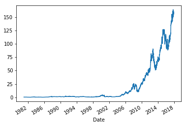

```python
import numpy as np
import pandas as pd
from pandas import Series, DataFrame
```

<!--more-->

读取数据

- AAPL.csv

```python
aapl = pd.read_csv('美国股票数据分析案例/AAPL.csv')
aapl.head()
```


<div>
<style scoped>
    .dataframe tbody tr th:only-of-type {
        vertical-align: middle;
    }
    .dataframe tbody tr th {
    vertical-align: top;
}
.dataframe thead th {
    text-align: right;
}
</style>
<table border="1" class="dataframe">
  <thead>
    <tr style="text-align: right;">
      <th></th>
      <th>Date</th>
      <th>Open</th>
      <th>High</th>
      <th>Low</th>
      <th>Close</th>
      <th>Adj Close</th>
      <th>Volume</th>
    </tr>
  </thead>
  <tbody>
    <tr>
      <th>0</th>
      <td>1980-12-12</td>
      <td>0.513393</td>
      <td>0.515625</td>
      <td>0.513393</td>
      <td>0.513393</td>
      <td>0.421597</td>
      <td>117258400</td>
    </tr>
    <tr>
      <th>1</th>
      <td>1980-12-15</td>
      <td>0.488839</td>
      <td>0.488839</td>
      <td>0.486607</td>
      <td>0.486607</td>
      <td>0.399601</td>
      <td>43971200</td>
    </tr>
    <tr>
      <th>2</th>
      <td>1980-12-16</td>
      <td>0.453125</td>
      <td>0.453125</td>
      <td>0.450893</td>
      <td>0.450893</td>
      <td>0.370272</td>
      <td>26432000</td>
    </tr>
    <tr>
      <th>3</th>
      <td>1980-12-17</td>
      <td>0.462054</td>
      <td>0.464286</td>
      <td>0.462054</td>
      <td>0.462054</td>
      <td>0.379437</td>
      <td>21610400</td>
    </tr>
    <tr>
      <th>4</th>
      <td>1980-12-18</td>
      <td>0.475446</td>
      <td>0.477679</td>
      <td>0.475446</td>
      <td>0.475446</td>
      <td>0.390436</td>
      <td>18362400</td>
    </tr>
  </tbody>
</table>
</div>


```python
aapl.dtypes
```


```
Date          object
Open         float64
High         float64
Low          float64
Close        float64
Adj Close    float64
Volume         int64
dtype: object
```


将'Date'这行数据转成时间数据类型

```python
from datetime import datetime
```

```python
aapl['Date'] = aapl['Date'].map(lambda item: datetime.strptime(item, '%Y-%m-%d'))
aapl.dtypes
```


```
Date         datetime64[ns]
Open                float64
High                float64
Low                 float64
Close               float64
Adj Close           float64
Volume                int64
dtype: object
```


```python
aapl.head()
```


<div>
<style scoped>
    .dataframe tbody tr th:only-of-type {
        vertical-align: middle;
    }
    .dataframe tbody tr th {
    vertical-align: top;
}
.dataframe thead th {
    text-align: right;
}
</style>
<table border="1" class="dataframe">
  <thead>
    <tr style="text-align: right;">
      <th></th>
      <th>Date</th>
      <th>Open</th>
      <th>High</th>
      <th>Low</th>
      <th>Close</th>
      <th>Adj Close</th>
      <th>Volume</th>
    </tr>
  </thead>
  <tbody>
    <tr>
      <th>0</th>
      <td>1980-12-12</td>
      <td>0.513393</td>
      <td>0.515625</td>
      <td>0.513393</td>
      <td>0.513393</td>
      <td>0.421597</td>
      <td>117258400</td>
    </tr>
    <tr>
      <th>1</th>
      <td>1980-12-15</td>
      <td>0.488839</td>
      <td>0.488839</td>
      <td>0.486607</td>
      <td>0.486607</td>
      <td>0.399601</td>
      <td>43971200</td>
    </tr>
    <tr>
      <th>2</th>
      <td>1980-12-16</td>
      <td>0.453125</td>
      <td>0.453125</td>
      <td>0.450893</td>
      <td>0.450893</td>
      <td>0.370272</td>
      <td>26432000</td>
    </tr>
    <tr>
      <th>3</th>
      <td>1980-12-17</td>
      <td>0.462054</td>
      <td>0.464286</td>
      <td>0.462054</td>
      <td>0.462054</td>
      <td>0.379437</td>
      <td>21610400</td>
    </tr>
    <tr>
      <th>4</th>
      <td>1980-12-18</td>
      <td>0.475446</td>
      <td>0.477679</td>
      <td>0.475446</td>
      <td>0.475446</td>
      <td>0.390436</td>
      <td>18362400</td>
    </tr>
  </tbody>
</table>
</div>


将'Date'设置为行索引

```python
aapl.set_index('Date', inplace=True)
aapl
```


<div>
<style scoped>
    .dataframe tbody tr th:only-of-type {
        vertical-align: middle;
    }
    .dataframe tbody tr th {
    vertical-align: top;
}
.dataframe thead th {
    text-align: right;
}
</style>
<table border="1" class="dataframe">
  <thead>
    <tr style="text-align: right;">
      <th></th>
      <th>Open</th>
      <th>High</th>
      <th>Low</th>
      <th>Close</th>
      <th>Adj Close</th>
      <th>Volume</th>
    </tr>
    <tr>
      <th>Date</th>
      <th></th>
      <th></th>
      <th></th>
      <th></th>
      <th></th>
      <th></th>
    </tr>
  </thead>
  <tbody>
    <tr>
      <th>1980-12-12</th>
      <td>0.513393</td>
      <td>0.515625</td>
      <td>0.513393</td>
      <td>0.513393</td>
      <td>0.421597</td>
      <td>117258400</td>
    </tr>
    <tr>
      <th>1980-12-15</th>
      <td>0.488839</td>
      <td>0.488839</td>
      <td>0.486607</td>
      <td>0.486607</td>
      <td>0.399601</td>
      <td>43971200</td>
    </tr>
    <tr>
      <th>1980-12-16</th>
      <td>0.453125</td>
      <td>0.453125</td>
      <td>0.450893</td>
      <td>0.450893</td>
      <td>0.370272</td>
      <td>26432000</td>
    </tr>
    <tr>
      <th>1980-12-17</th>
      <td>0.462054</td>
      <td>0.464286</td>
      <td>0.462054</td>
      <td>0.462054</td>
      <td>0.379437</td>
      <td>21610400</td>
    </tr>
    <tr>
      <th>1980-12-18</th>
      <td>0.475446</td>
      <td>0.477679</td>
      <td>0.475446</td>
      <td>0.475446</td>
      <td>0.390436</td>
      <td>18362400</td>
    </tr>
    <tr>
      <th>1980-12-19</th>
      <td>0.504464</td>
      <td>0.506696</td>
      <td>0.504464</td>
      <td>0.504464</td>
      <td>0.414265</td>
      <td>12157600</td>
    </tr>
    <tr>
      <th>1980-12-22</th>
      <td>0.529018</td>
      <td>0.531250</td>
      <td>0.529018</td>
      <td>0.529018</td>
      <td>0.434428</td>
      <td>9340800</td>
    </tr>
    <tr>
      <th>1980-12-23</th>
      <td>0.551339</td>
      <td>0.553571</td>
      <td>0.551339</td>
      <td>0.551339</td>
      <td>0.452758</td>
      <td>11737600</td>
    </tr>
    <tr>
      <th>1980-12-24</th>
      <td>0.580357</td>
      <td>0.582589</td>
      <td>0.580357</td>
      <td>0.580357</td>
      <td>0.476588</td>
      <td>12000800</td>
    </tr>
    <tr>
      <th>1980-12-26</th>
      <td>0.633929</td>
      <td>0.636161</td>
      <td>0.633929</td>
      <td>0.633929</td>
      <td>0.520581</td>
      <td>13893600</td>
    </tr>
    <tr>
      <th>1980-12-29</th>
      <td>0.642857</td>
      <td>0.645089</td>
      <td>0.642857</td>
      <td>0.642857</td>
      <td>0.527913</td>
      <td>23290400</td>
    </tr>
    <tr>
      <th>1980-12-30</th>
      <td>0.629464</td>
      <td>0.629464</td>
      <td>0.627232</td>
      <td>0.627232</td>
      <td>0.515082</td>
      <td>17220000</td>
    </tr>
    <tr>
      <th>1980-12-31</th>
      <td>0.611607</td>
      <td>0.611607</td>
      <td>0.609375</td>
      <td>0.609375</td>
      <td>0.500417</td>
      <td>8937600</td>
    </tr>
    <tr>
      <th>1981-01-02</th>
      <td>0.616071</td>
      <td>0.620536</td>
      <td>0.616071</td>
      <td>0.616071</td>
      <td>0.505916</td>
      <td>5415200</td>
    </tr>
    <tr>
      <th>1981-01-05</th>
      <td>0.604911</td>
      <td>0.604911</td>
      <td>0.602679</td>
      <td>0.602679</td>
      <td>0.494918</td>
      <td>8932000</td>
    </tr>
    <tr>
      <th>1981-01-06</th>
      <td>0.578125</td>
      <td>0.578125</td>
      <td>0.575893</td>
      <td>0.575893</td>
      <td>0.472922</td>
      <td>11289600</td>
    </tr>
    <tr>
      <th>1981-01-07</th>
      <td>0.553571</td>
      <td>0.553571</td>
      <td>0.551339</td>
      <td>0.551339</td>
      <td>0.452758</td>
      <td>13921600</td>
    </tr>
    <tr>
      <th>1981-01-08</th>
      <td>0.542411</td>
      <td>0.542411</td>
      <td>0.540179</td>
      <td>0.540179</td>
      <td>0.443594</td>
      <td>9956800</td>
    </tr>
    <tr>
      <th>1981-01-09</th>
      <td>0.569196</td>
      <td>0.571429</td>
      <td>0.569196</td>
      <td>0.569196</td>
      <td>0.467423</td>
      <td>5376000</td>
    </tr>
    <tr>
      <th>1981-01-12</th>
      <td>0.569196</td>
      <td>0.569196</td>
      <td>0.564732</td>
      <td>0.564732</td>
      <td>0.463757</td>
      <td>5924800</td>
    </tr>
    <tr>
      <th>1981-01-13</th>
      <td>0.546875</td>
      <td>0.546875</td>
      <td>0.544643</td>
      <td>0.544643</td>
      <td>0.447260</td>
      <td>5762400</td>
    </tr>
    <tr>
      <th>1981-01-14</th>
      <td>0.546875</td>
      <td>0.549107</td>
      <td>0.546875</td>
      <td>0.546875</td>
      <td>0.449092</td>
      <td>3572800</td>
    </tr>
    <tr>
      <th>1981-01-15</th>
      <td>0.558036</td>
      <td>0.562500</td>
      <td>0.558036</td>
      <td>0.558036</td>
      <td>0.458258</td>
      <td>3516800</td>
    </tr>
    <tr>
      <th>1981-01-16</th>
      <td>0.555804</td>
      <td>0.555804</td>
      <td>0.553571</td>
      <td>0.553571</td>
      <td>0.454591</td>
      <td>3348800</td>
    </tr>
    <tr>
      <th>1981-01-19</th>
      <td>0.587054</td>
      <td>0.589286</td>
      <td>0.587054</td>
      <td>0.587054</td>
      <td>0.482087</td>
      <td>10393600</td>
    </tr>
    <tr>
      <th>1981-01-20</th>
      <td>0.571429</td>
      <td>0.571429</td>
      <td>0.569196</td>
      <td>0.569196</td>
      <td>0.467423</td>
      <td>7520800</td>
    </tr>
    <tr>
      <th>1981-01-21</th>
      <td>0.580357</td>
      <td>0.584821</td>
      <td>0.580357</td>
      <td>0.580357</td>
      <td>0.476588</td>
      <td>3976000</td>
    </tr>
    <tr>
      <th>1981-01-22</th>
      <td>0.587054</td>
      <td>0.591518</td>
      <td>0.587054</td>
      <td>0.587054</td>
      <td>0.482087</td>
      <td>8887200</td>
    </tr>
    <tr>
      <th>1981-01-23</th>
      <td>0.587054</td>
      <td>0.589286</td>
      <td>0.584821</td>
      <td>0.584821</td>
      <td>0.480254</td>
      <td>2805600</td>
    </tr>
    <tr>
      <th>1981-01-26</th>
      <td>0.578125</td>
      <td>0.578125</td>
      <td>0.575893</td>
      <td>0.575893</td>
      <td>0.472922</td>
      <td>6160000</td>
    </tr>
    <tr>
      <th>...</th>
      <td>...</td>
      <td>...</td>
      <td>...</td>
      <td>...</td>
      <td>...</td>
      <td>...</td>
    </tr>
    <tr>
      <th>2017-09-12</th>
      <td>162.610001</td>
      <td>163.960007</td>
      <td>158.770004</td>
      <td>160.860001</td>
      <td>160.860001</td>
      <td>71714000</td>
    </tr>
    <tr>
      <th>2017-09-13</th>
      <td>159.869995</td>
      <td>159.960007</td>
      <td>157.910004</td>
      <td>159.649994</td>
      <td>159.649994</td>
      <td>44907400</td>
    </tr>
    <tr>
      <th>2017-09-14</th>
      <td>158.990005</td>
      <td>159.399994</td>
      <td>158.089996</td>
      <td>158.279999</td>
      <td>158.279999</td>
      <td>23760700</td>
    </tr>
    <tr>
      <th>2017-09-15</th>
      <td>158.470001</td>
      <td>160.970001</td>
      <td>158.000000</td>
      <td>159.880005</td>
      <td>159.880005</td>
      <td>49114600</td>
    </tr>
    <tr>
      <th>2017-09-18</th>
      <td>160.110001</td>
      <td>160.500000</td>
      <td>158.000000</td>
      <td>158.669998</td>
      <td>158.669998</td>
      <td>28269400</td>
    </tr>
    <tr>
      <th>2017-09-19</th>
      <td>159.509995</td>
      <td>159.770004</td>
      <td>158.440002</td>
      <td>158.729996</td>
      <td>158.729996</td>
      <td>20810600</td>
    </tr>
    <tr>
      <th>2017-09-20</th>
      <td>157.899994</td>
      <td>158.259995</td>
      <td>153.830002</td>
      <td>156.070007</td>
      <td>156.070007</td>
      <td>52951400</td>
    </tr>
    <tr>
      <th>2017-09-21</th>
      <td>155.800003</td>
      <td>155.800003</td>
      <td>152.750000</td>
      <td>153.389999</td>
      <td>153.389999</td>
      <td>37511700</td>
    </tr>
    <tr>
      <th>2017-09-22</th>
      <td>151.539993</td>
      <td>152.270004</td>
      <td>150.559998</td>
      <td>151.889999</td>
      <td>151.889999</td>
      <td>46645400</td>
    </tr>
    <tr>
      <th>2017-09-25</th>
      <td>149.990005</td>
      <td>151.830002</td>
      <td>149.160004</td>
      <td>150.550003</td>
      <td>150.550003</td>
      <td>44387300</td>
    </tr>
    <tr>
      <th>2017-09-26</th>
      <td>151.779999</td>
      <td>153.919998</td>
      <td>151.690002</td>
      <td>153.139999</td>
      <td>153.139999</td>
      <td>36660000</td>
    </tr>
    <tr>
      <th>2017-09-27</th>
      <td>153.800003</td>
      <td>154.720001</td>
      <td>153.539993</td>
      <td>154.229996</td>
      <td>154.229996</td>
      <td>25504200</td>
    </tr>
    <tr>
      <th>2017-09-28</th>
      <td>153.889999</td>
      <td>154.279999</td>
      <td>152.699997</td>
      <td>153.279999</td>
      <td>153.279999</td>
      <td>22005500</td>
    </tr>
    <tr>
      <th>2017-09-29</th>
      <td>153.210007</td>
      <td>154.130005</td>
      <td>152.000000</td>
      <td>154.119995</td>
      <td>154.119995</td>
      <td>26299800</td>
    </tr>
    <tr>
      <th>2017-10-02</th>
      <td>154.259995</td>
      <td>154.449997</td>
      <td>152.720001</td>
      <td>153.809998</td>
      <td>153.809998</td>
      <td>18698800</td>
    </tr>
    <tr>
      <th>2017-10-03</th>
      <td>154.009995</td>
      <td>155.089996</td>
      <td>153.910004</td>
      <td>154.479996</td>
      <td>154.479996</td>
      <td>16230300</td>
    </tr>
    <tr>
      <th>2017-10-04</th>
      <td>153.630005</td>
      <td>153.860001</td>
      <td>152.460007</td>
      <td>153.479996</td>
      <td>153.479996</td>
      <td>20163800</td>
    </tr>
    <tr>
      <th>2017-10-05</th>
      <td>154.179993</td>
      <td>155.440002</td>
      <td>154.050003</td>
      <td>155.389999</td>
      <td>155.389999</td>
      <td>21283800</td>
    </tr>
    <tr>
      <th>2017-10-06</th>
      <td>154.970001</td>
      <td>155.490005</td>
      <td>154.559998</td>
      <td>155.300003</td>
      <td>155.300003</td>
      <td>17407600</td>
    </tr>
    <tr>
      <th>2017-10-09</th>
      <td>155.809998</td>
      <td>156.729996</td>
      <td>155.490005</td>
      <td>155.839996</td>
      <td>155.839996</td>
      <td>16262900</td>
    </tr>
    <tr>
      <th>2017-10-10</th>
      <td>156.059998</td>
      <td>158.000000</td>
      <td>155.100006</td>
      <td>155.899994</td>
      <td>155.899994</td>
      <td>15617000</td>
    </tr>
    <tr>
      <th>2017-10-11</th>
      <td>155.970001</td>
      <td>156.979996</td>
      <td>155.750000</td>
      <td>156.550003</td>
      <td>156.550003</td>
      <td>16905600</td>
    </tr>
    <tr>
      <th>2017-10-12</th>
      <td>156.350006</td>
      <td>157.369995</td>
      <td>155.729996</td>
      <td>156.000000</td>
      <td>156.000000</td>
      <td>16125100</td>
    </tr>
    <tr>
      <th>2017-10-13</th>
      <td>156.729996</td>
      <td>157.279999</td>
      <td>156.410004</td>
      <td>156.990005</td>
      <td>156.990005</td>
      <td>16394200</td>
    </tr>
    <tr>
      <th>2017-10-16</th>
      <td>157.899994</td>
      <td>160.000000</td>
      <td>157.649994</td>
      <td>159.880005</td>
      <td>159.880005</td>
      <td>24121500</td>
    </tr>
    <tr>
      <th>2017-10-17</th>
      <td>159.779999</td>
      <td>160.869995</td>
      <td>159.229996</td>
      <td>160.470001</td>
      <td>160.470001</td>
      <td>18997300</td>
    </tr>
    <tr>
      <th>2017-10-18</th>
      <td>160.419998</td>
      <td>160.710007</td>
      <td>159.600006</td>
      <td>159.759995</td>
      <td>159.759995</td>
      <td>16374200</td>
    </tr>
    <tr>
      <th>2017-10-19</th>
      <td>156.750000</td>
      <td>157.080002</td>
      <td>155.020004</td>
      <td>155.979996</td>
      <td>155.979996</td>
      <td>42584200</td>
    </tr>
    <tr>
      <th>2017-10-20</th>
      <td>156.610001</td>
      <td>157.750000</td>
      <td>155.960007</td>
      <td>156.250000</td>
      <td>156.250000</td>
      <td>23974100</td>
    </tr>
    <tr>
      <th>2017-10-23</th>
      <td>156.889999</td>
      <td>157.690002</td>
      <td>155.500000</td>
      <td>156.169998</td>
      <td>156.169998</td>
      <td>21867200</td>
    </tr>
  </tbody>
</table>
<p>9296 rows × 6 columns</p>
</div>


```python
%matplotlib inline
```

```python
# 画出普通的线性图
# x坐标是行索引标签
# y坐标是每一行的数值
aapl['Adj Close'].plot()  # Series的线性图
```


```
<matplotlib.axes._subplots.AxesSubplot at 0x7f3af8ee4470>
```




