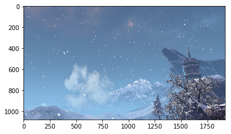
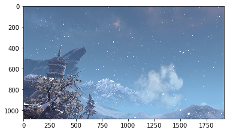
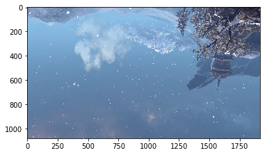
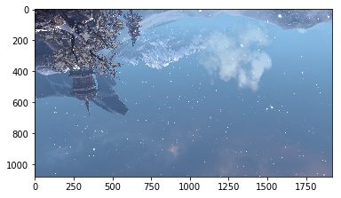

```python
import matplotlib.pylab as plt
%matplotlib inline
```

```python
import numpy as np
```

```python
ms5 = plt.imread('bg.jpg')  #读取图片
plt.imshow(ms5)
```

<!--more-->

```
<matplotlib.image.AxesImage at 0x7efbcb2fb710>
```





```python
ms5
```


```
array([[[114, 123, 154],
        [114, 123, 154],
        [114, 123, 154],
        ...,
        [ 85, 115, 151],
        [ 85, 115, 151],
        [ 86, 116, 152]],

       [[114, 123, 154],
        [114, 123, 154],
        [114, 123, 154],
        ...,
        [ 85, 115, 151],
        [ 85, 115, 151],
        [ 85, 115, 151]],

       [[115, 124, 155],
        [114, 123, 154],
        [114, 123, 154],
        ...,
        [ 85, 115, 151],
        [ 85, 115, 151],
        [ 85, 115, 151]],

       ...,

       [[103, 125, 162],
        [111, 134, 168],
        [113, 133, 166],
        ...,
        [ 53,  52,  70],
        [ 57,  56,  74],
        [ 60,  59,  75]],

       [[119, 142, 176],
        [121, 141, 176],
        [122, 141, 173],
        ...,
        [ 55,  54,  72],
        [ 52,  51,  67],
        [ 52,  51,  67]],

       [[124, 147, 181],
        [142, 162, 195],
        [181, 198, 228],
        ...,
        [ 61,  60,  76],
        [ 54,  53,  69],
        [ 50,  49,  65]]], dtype=uint8)
```


```python
ms5.shape
```


```
(1080, 1920, 3)
```


```python
plt.imshow(ms5[:,::-1]) #左右翻转
```


```
<matplotlib.image.AxesImage at 0x7efbcb0b1198>
```





```python
plt.imshow(ms5[::-1]) #上下翻转
```


```
<matplotlib.image.AxesImage at 0x7efbcb089b00>
```





```python
plt.imshow(ms5[::-1,::-1]) #全部翻转
```


```
<matplotlib.image.AxesImage at 0x7efbcafb4e80>
```





```python
ms5_1 = ms5[600:1000, 1400:1800]  #截取一部分
plt.imsave('ms5_1.jpg',ms5_1) # 保存图片
```


